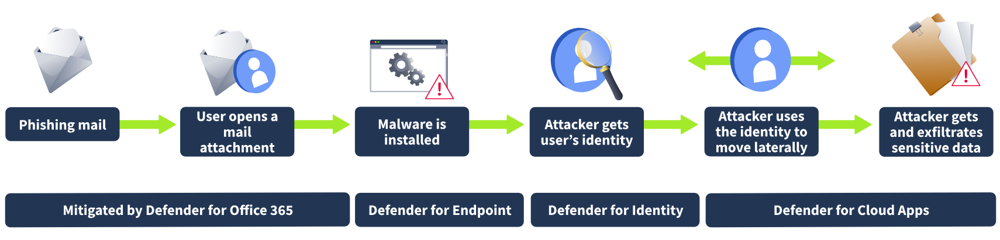
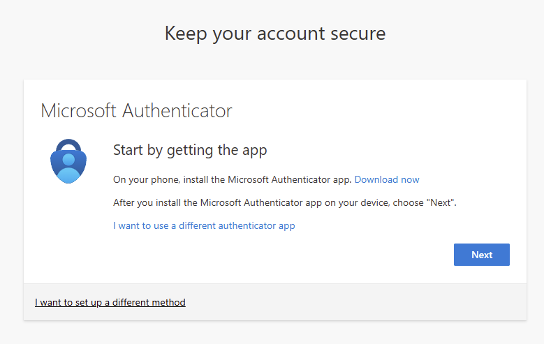
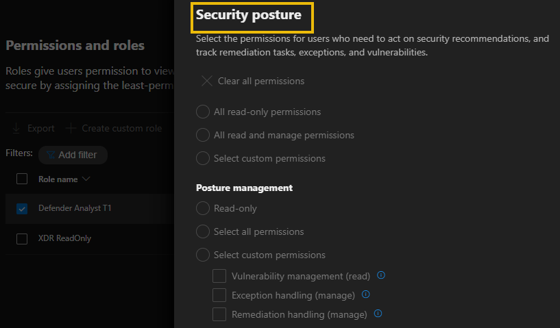
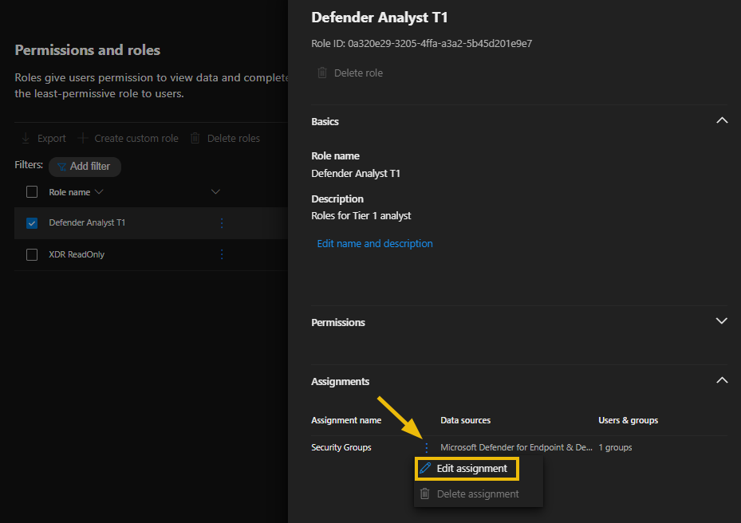

# XDR: Introduction

## Task 1 Introduction

Traditional security tools such as antivirus, firewalls, and even Endpoint Detection and Response (EDR) often operate in silos. While EDR focuses only on endpoint data and Network Detection and Response (NDR) focuses on network data, Extended Detection and Response (XDR) enhances this detection and response capabilities by integrating data from various sources and automating the data correlation and analysis process. This significantly improves threat detection accuracy and reduces the time it takes to respond to incidents.

This room will introduce you to Microsoft Defender XDR, Microsoft’s unified security platform designed to provide integrated protection across endpoints, identities, emails, apps, and cloud resources. You will learn to detect, investigate, and respond to threats using data integrated from other Microsoft 365 Defender products and services.

### Learning Objectives

After completing this room, you will be able to:

- Understand Extended Detection and Response (XDR) as a security tool
- Have an in-depth overview of Microsoft Defender XDR
- Understand the core components of Microsoft Defender XDR  
- Describe how Defender XDR correlates signals across Microsoft 365 services
- Role-based access control in Defender
- Understand how Defender XDR integrates with Microsoft Sentinel and other tools

:::info Answer the questions below

<details>

<summary> Let's go! </summary>

```plaintext
No answer needed
```

</details>

:::

## Task 2 What is Microsoft Defender XDR

Extended Detection and Response (XDR) is a sophisticated cyber security solution that aggregates, unifies, and analyzes data from an organization's digital landscape into one integrated platform. This may include data from endpoints, networks, email, identities, and cloud environments. In contrast to independent security tools, XDR offers integrated threat detection, investigation, and response, providing a consolidated view of security incidents. XDR implementation enhances threat visibility, reduces incident response times, and enables advanced forensic investigations and threat hunting from a central management console.

### How XDR Is Different From Traditional EDR (Endpoint Detection and Response)

| Feature     | EDR (Endpoint Detection and Response)                                       | XDR (Extended Detection and Response)                                                                          |
| :---------- | :-------------------------------------------------------------------------- | :------------------------------------------------------------------------------------------------------------- |
| Scope       | Focuses only on endpoint devices such as laptops, desktops, and servers.    | It extends beyond just endpoints; it includes email, identities, networks, cloud workloads, and more.          |
| Data source | Collects data only from endpoints.                                          | Aggregates and correlates data across various security layers and platforms.                                   |
| Visibility  | Limited to activities on each individual endpoint.                          | Provides end-to-end visibility across the entire IT infrastructure.                                            |
| Detection   | Limited threat detection based on endpoint behaviours and signatures.       | Detects threats using cross-domain analytics and behavioural patterns.                                         |
| Response    | Limited responses to endpoint threats (e.g., isolate device, kill process). | Automates and coordinates responses across multiple layers (e.g., block email, isolate device, revoke access). |
| Use cases   | Malware detection, ransomware response, insider threats on endpoints.       | Advanced threat detection, phishing response, cloud and identity attack correlation, supply chain risk.        |
| Management  | Mostly requires dedicated endpoint security tools and consoles.             | Unified console for threat detection, investigation, and response across domains.                              |

### What is Microsoft Defender XDR

Microsoft Defender XDR is a comprehensive enterprise defense solution designed for pre- and post-breach scenarios. It seamlessly integrates detection, prevention, investigation, and response across various areas, including endpoints, identities, email, and applications, to deliver cohesive protection against advanced threats.


Microsoft Defender XDR assists security teams in preventing and identifying risks by leveraging data from other Microsoft security tools, such as Defender for Endpoint, Identity, Cloud Apps, O365, and others. Then, using the Microsoft Defender portal, security teams can investigate and respond to attacks in a unified experience by using:

- Incidents & alerts to investigate malicious activities
- Hunting to find threats proactively
- Actions & submissions to remediate found incidents and alerts
- Threat Intelligence to stay informed with the latest threats and their impact

### Microsoft Defender XDR vs Generic XDR

Although generic XDR solutions provide wider integration with third-party tools, they often require extra configuration and tuning to ensure compatibility with their threat detection functionalities. In contrast, Microsoft Defender XDR is purpose-built for organizations using Microsoft products, providing seamless integration, automated capabilities, and a unified platform optimized for the Microsoft ecosystem.

:::info Answer the questions below

<details>

<summary> What is EDR (Endpoint Detection and Response) visibility limited to? </summary>

```plaintext
Endpoints
```

</details>

<details>

<summary> Is Microsoft Defender XDR purpose-built for organizations using Microsoft products? Yea/Nay </summary>

```plaintext
Yea
```

</details>

:::

## Task 3 Microsoft Defender XDR Architecture

Since Microsoft Defender XDR is a cloud-based, unified enterprise defense suite, it seamlessly combines data on cyberattacks across identities, endpoints, email, and cloud apps into a single platform. It leverages artificial intelligence (AI) and automation to prevent and respond to threats, automatically stopping certain attacks and restoring affected assets across multiple domains. Microsoft Defender XDR can assess the complete extent and effect of these threats, such as their entry point, what they have impacted, and their ongoing influence on the organization. It’s important to highlight that these signals extend beyond just the products mentioned below.

- Microsoft Defender for Endpoint
- Microsoft Defender for Office 365
- Microsoft Defender for Identity
- Microsoft Defender for Cloud Apps
- Microsoft Defender Vulnerability Management
- Microsoft Defender for Cloud
- Microsoft Entra ID Protection

The architecture and integration of Microsoft Defender XDR components.


As seen in the architectural image above, Microsoft Defender XDR integrates signals from all Defender components to deliver extended detection and response (XDR) across various domains. This includes a centralized incident and alert queue, automated responses to stop attacks, self-healing capabilities for compromised devices, user identities, and mailboxes, and cross-threat hunting and threat analysis.

- **Microsoft Defender for Office 365** protects your organization from harmful threats associated with email messages, links (URLs), and collaborative tools. It relays signals from these threats to Microsoft Defender XDR. Exchange Online Protection (EOP) is integrated to ensure comprehensive protection for incoming emails and attachments.
- **Microsoft Defender for Identity** collects signals from Active Directory Domain Services (AD DS) domain controllers, Active Directory Federation Services (AD FS), Active Directory Certificate Services (AD CS), and Entra Connect servers. It leverages these signals to secure your hybrid identity environment, including defending against attackers who exploit compromised accounts to navigate laterally across devices within the on-premises environment.
- **Microsoft Defender for Endpoint** offers endpoint detection and response (EDR), antivirus, and vulnerability management. It collects signals from organization devices and sends them to Microsoft Defender XDR, which in turn provides advanced monitoring and protection for those devices.
- **Microsoft Defender for Cloud Apps** gathers signals related to the organization’s usage of cloud applications. It ensures secured data communication between your IT infrastructure and these applications, covering sanctioned and unsanctioned cloud apps.
- **Microsoft Entra ID Protection** evaluates risky event data from billions of sign-in attempts to determine the risk level of each sign-in to your environment. Based on the conditions and restrictions of your Conditional Access policies, Microsoft Entra ID uses this evaluated risk data to either allow or prevent user access. It is worth noting that Microsoft Entra ID Protection operates independently from Microsoft Defender XDR as it is not part of the Microsoft Defender product suite but also shares signals with Microsoft Defender XDR.

### How Microsoft Defender XDR Works

Here’s a detailed breakdown of how Microsoft Defender XDR works and its core components

#### Data Collection and Integration

Defender XDR gathers and consolidates data from multiple sources, including endpoints (Defender for Endpoint), identities (Defender for Identity), email (Defender for Office 365), and cloud applications (Defender for Cloud Apps). The collected data is then enriched and correlated in real-time to offer actionable insights, enabling security teams to prioritize incidents effectively.

#### Threat Detection and Analysis

Defender XDR uses advanced analytics, machine learning models, and global threat intelligence to analyze collected data and detect known and emerging threats, indicators of compromise (IOCs), and anomalous user or system behaviors that may signal potential threats in their early stages. This allows Defender XDR to see the full scope of multi-stage attacks.

#### Automated Incident Response

Microsoft Defender XDR enables rapid threat containment and remediation through Automated Investigation and Remediation (AIR) for supported endpoints and mailboxes. It also offers Automatic Attack Disruption to stop lateral movement or ransomware in progress. It offers threat containment capabilities such as isolating machines, revoking tokens, disabling compromised accounts, and blocking malicious apps.

#### Proactive Threat Hunting

With Microsoft Defender XDR's advanced hunting feature, security teams can proactively hunt for threats using advanced Kusto Query Language (KQL) queries within a unified hunting interface, enabling deep, cross-domain investigation across all integrated Defender solutions.

#### Orchestration

Microsoft Defender XDR can integrate with security tools like Microsoft Sentinel to enhance orchestration and incident management. Its additional features, such as auto-tagging, alert prioritization, and role-based access control (RBAC), ensure efficient triage and response.

:::info Answer the questions below

<details>

<summary> Which of the Defender XDR signals focuses on email security? </summary>

```plaintext
Microsoft Defender for Office 365
```

</details>

<details>

<summary> Which querying language does Microsoft Defender XDR use for threat hunting? </summary>

```plaintext
Kusto Query Language
```

</details>

:::

## Task 4 Microsoft Defender XDR Settings

Before discussing the different Microsoft XDR settings, let's consider a typical cyber security attack and how Microsoft Defender XDR would help detect and remediate it.



The cyber-attack described above begins with a phishing email delivered to an employee's inbox in your organization. The employee opens the email attachment unknowingly, which then deploys malware on the user's device, potentially triggering a series of attack attempts that may culminate in the theft of sensitive information.

Let's consider the following with respect to the attack attempt scenario above from left to right:

1. Exchange Online Protection, a Microsoft Defender for Office 365 component, can identify phishing emails and apply mail flow rules (also known as transport rules) to prevent them from reaching a user's inbox.
2. Defender for Office 365 can also use its Safe Attachments and Safe Links feature to evaluate attachments and links in an email and ascertain whether they are harmful or not. This ensures that the emails that come through are either not actionable for the user or are blocked from being delivered by established policies.
3. To prevent the exploitation of malware-infected devices, Defender for Endpoint can identify and remediate vulnerabilities on devices and networks before the attacker exploits them on organization-managed devices.
4. Defender for Identity will monitor and flag sudden changes to on-premises user accounts, such as unauthorized privilege escalation or risky lateral movements, for security teams to investigate. It also highlights commonly exploited identity vulnerabilities, like unconstrained Kerberos delegation, so the security team can investigate and mitigate them.
5. Finally, Defender for Cloud Apps can prevent attackers from exfiltrating sensitive data. It can detect unusual behaviors such as impossible travel, credential theft, atypical activities, usual file downloads and sharing, or email forwarding and report these incidents to the security team for further investigation.

### Microsoft Defender XDR Settings

The Microsoft Defender portal has settings for each product. However, to manage Defender XDR settings, navigate to Settings and then select Microsoft Defender XDR.


On the Microsoft Defender XDR settings page, you can configure the following:

- **Email notifications**: Enables security teams to set up email notifications for incidents, response actions, and threat analytics reports.
- **Alert service settings**: This enables you to determine which identity protection alerts will appear on the alerts and incidents page.
- **Permissions and roles**: On this tab, you can configure a centralized permissions management solution to control user access and permissions across different Microsoft security solutions. We will discuss this further in the next task.
- **Streaming API**: Security teams can ingest event data directly to Azure Event hubs for consumption by visualization services, data processing engines, third-party SIEM solutions, or Azure storage for long-term data retent.
- **Asset rule management**: enables you to create rules for assets and decide which actions will apply to them.
- **Alert tuning**: Previously known as alert suppression, it allows security teams to tune and manage alerts in advance.
- **Critical asset management**: can be configured to manage the criticality level of the organization's assets to predefined classifications or by creating your own custom ones.
- **Identity automated response**: Used to exclude users from automated response actions.

:::info Answer the questions below

<details>

<summary> Monitoring risky Lateral movement is a feature of which Microsoft Defender product? </summary>

```plaintext
Defender for Identity
```

</details>

<details>

<summary> Where can security admins exclude users from automated response actions? </summary>

```plaintext
Identity automated response
```

</details>

:::

## Task 5 Microsoft Defender XDR Roles and Permissions

Controlling users' permissions and access to view and manage the security controls associated with Microsoft Defender is crucial for organizations to ensure the least privilege and minimize the risks associated with unauthorized access.

By default, access to services in the Microsoft Defender portal can be managed collectively using Microsoft Entra global roles. However, if more flexibility and control over access to specific product data are required, security teams can create custom roles for each Microsoft Defender service. If a centralized permissions management console is required, then it's recommended that Microsoft Defender XDR Unified role-based access control (RBAC) be configured.

As mentioned above, access and management of Microsoft Defender XDR can be managed in three different ways:

### Using Microsoft Entra Global Roles

Accounts with these Microsoft Entra roles can access Microsoft Defender XDR settings, features, and security control.

- Global Administrator
- Security Administrator
- Security Operator
- Global Reader
- Security Reader

### Configuring Custom Roles for Specific Microsoft Defender Product

For instance, the security admin can create custom roles for Microsoft Defender for Endpoint, allowing them to control what can be configured or modified on Defender for Endpoint devices. Alternatively, the security admin can create custom roles for Microsoft Defender for Office to manage access and control configurations for specific email and collaboration settings.

Each Microsoft Defender service has its own custom role management settings to locate custom role management settings in the Microsoft Defender portal:

- In the navigation pane, select Permissions.
- Select Roles under the service where you want to create a custom role.


It is always recommended that you configure roles with the least privilege. Here is an example role settings for Microsoft Defender for **Endpoints Endpoint roles & groups (2)**


The last method, the Microsoft Defender XDR unified RBAC method, is discussed in the next task.

:::info Answer the questions below

<details>

<summary> From which tab can security admins create custom roles for specific Microsoft Defender Products? </summary>

```plaintext
Permissions
```

</details>

:::

## Task 6 Lab Instructions

Kindly follow the instructions below to access your labs on the next tasks.

On your lab task (**Lab: Navigating Defender XDR Portal**: Task 8; **Lab: Reviewing Custom Unified RBAC Roles**: Task 9), click the **Cloud Details** button.

On the **Environment** tab, click the **Join Lab** button to deploy your lab environment.


Click the **Open Lab** button to launch a new tab. This will direct you to the Microsoft Azure portal.


Select the **Credentials** tab to view your login credentials required to access the Microsoft Azure portal.


Sign in using your **Username** and **Password** from the **Credential** tab. Then click **Next** to continue.


With the new Microsoft multifactor authentication enforcement, you will be required to set up MFA to sign in to the Microsoft Azure portal. Click **Next** to configure MFA using your preferred method.


By clicking on **I want to set up a different method** you can see all available MFA options.


The default authentication method is to use the free Microsoft Authenticator app. If it is installed on your mobile device, select Next and follow the prompts to add this account. If you don't have it installed, a link is provided to download it.



Complete the authentication process to sign in to the Microsoft Azure portal.

**Note**: Lab access will expire after 1 hour.

:::info Answer the questions below

<details>

<summary> I understand. </summary>

```plaintext
No answer needed
```

</details>

:::

## Task 7 Lab: Microsoft Defender XDR Unified Role Based Access Control (RBAC)

**Microsoft Defender XDR unified role-based access control** (RBAC) is a centralized permissions management system that streamlines access management across the Defender security ecosystem. It provides a single interface for administrators to manage who can access what across the Microsoft Defender XDR. It unifies access control across endpoints, identities, email, cloud apps, and data based on assigned roles and responsibilities.

To get started with Microsoft Defender XDR unified role-based access control (RBAC), it needs to be activated before you can start configuring and managing role permissions for other security team members. It is worth noting that the number of workloads available for activation is determined by the license available on your tenant.

You can activate your workloads in the following ways:

### From the Permissions and Roles Page

- On the [Microsoft Defender portal](https://security.microsoft.com/)
- Select permissions on the navigation pane
- Select Roles under Microsoft Defender XDR


On the **Permissions and roles** screen, select **Activate workloads** (1) to show a sidebar where you can select each toggle to activate a workload. In some cases, you may not see the **Activate workloads** option because another administrator may have canceled it. Also, remember that the **Workloads** options you see are determined by the license currently available for your tenant.


Select **Workload settings** (2) back on the **permissions and roles** screen as a second option. This takes you to the Microsoft Defender XDR Permission and Roles page where you can then select the toggle for each workload to activate it.

### From the Microsoft Defender XDR Settings

- On the [Microsoft Defender portal](https://security.microsoft.com/)
- Select **Settings** on the navigation pane
- Select **Microsoft Defender XDR**
- Select **Permissions and roles**
- On the Activate workloads page, select the toggle for the workload you want to activate

See the [Microsoft Defender XDR Unified RBAC](https://learn.microsoft.com/en-us/defender-xdr/custom-permissions-details) permission details for more information on the list of permissions available to configure for admins based on their roles and tasks.

During our lab task, we will navigate the Defender portal and review creating custom RBAC roles.

:::info Answer the questions below

<details>

<summary> How many ways can Microsoft Defender XDR unified role-based access control (RBAC) be activated? </summary>

```plaintext
2
```

</details>

<details>

<summary> Aside from the Activate workload option, which other option can be used to activate Microsoft Defender XDR unified role-based access control (RBAC) from the permissions and roles page? </summary>

```plaintext
Workload settings
```

</details>

:::

## Task 8 Lab: Navigating Defender XDR Portal

### Step 1: Navigating the Microsoft Defender Portal

- Sign in to the [Microsoft Defender portal](https://security.microsoft.com/) using your lab credentials
- Microsoft Defender XDR is mainly the first few tabs on the navigation pane.
- Then, navigating down to the bottom, you will find additional settings for reports and product-specific settings.


It's worth noting that the Defender portal consists of other specific Defender products, such as Exposure management, Endpoints, Identities, Email, and Collaboration, which are placed in separate sections.

### Step 2: Incident and Alert Investigations

Incidents are a collection of alerts related to a single threat or attack. They are confirmed security breaches or threats that have compromised an organization's assets, data, or systems.

- On the Microsoft Defender portal, select **Incidents** to see a list of all incidents across all domains.
- Click on the **Multi-stage incident involving Privilege escalation on one endpoint** (Incident ID 48) to investigate an incident.


- Select each tab to view incident details and related entities.
  - **Unassigned (1)** is showing the assignment status of your incident
  - Select each tab on the navigation bar/menu **(2)** to see related entities and alerts
  - Click **Play attack story (3)** to see how each event happened
  - Select **Manage incident (4)** to edit or modify the incident details
  - Select **Export incident as PDF (5)** to download a shareable PDF document
  - The incident graph **(6)** shows the relationship between the different entities
  - Scroll down on the **Incident details (7)** for more information on the incident


- Click on the other tabs under **Incidents & alerts** to review them.


Take the time to review the incidents, drill down into the incident details, and practice to understand how to access the information and determine the next steps in your analysis.

### Step 3: Hunting

Hunting is a feature in Microsoft Defender XDR that uses a query-based threat-hunting interface to allow security teams proactively hunt for and detect advanced threats within their organization's environment.

- Click on **Advance hunting** on the navigation pane
- Select **Queries** in the middle pane to see all templates (the **Queries** option may be hidden; drag the bar to the right to reveal it)
- Select **Shared queries** to see and run all shared queries
- Select **Community queries** to see all queries from the Microsoft Defender community


### Step 4: Run an Advance Hunting Query

Here, we will look at how to run an advanced hunting query

- Select + and **Query in editor** to open a new query tab.


- Copy and paste the following query. This query will pull security alert data from the AlertInfo table and sort it in ascending order based on the AlertId column.

```plaintext
AlertInfo
| sort by AlertId
```

- Extend the time range to 30 days
- Click Run query to run the query pasted
- The query result is then shown below


:::info Answer the questions below

<details>

<summary> Besides the **Incidents** and **Email & collaboration alerts** tabs, what other tab can be found under **Incidents & alerts**? </summary>

```plaintext
Alerts
```

</details>

<details>

<summary> Which option do you need to click to modify the incident details? </summary>

```plaintext
Manage incident
```

</details>

:::

## Task 9 Lab: Reviewing Custom Unified RBAC Roles

### Task 1: Review Custom Role Creation in Microsoft Defender

The steps below are meant to guide you through reviewing custom roles in Microsoft Defender XDR Unified RBAC. You will not be creating any roles.

- Sign in to the [Microsoft Defender portal](https://security.microsoft.com/).
- In the navigation pane, select **Permissions**.
- Select **Roles** under Microsoft Defender XDR to get to the Permissions and roles page.
- Select the **Defender Analyst T1** role to see the role details.


**Permission groups** are organized into three different categories; Each permission group can be reviewed by clicking on the **Edit** button next to it.

- **Security operations**: This permission is for security administrators who perform security operations and respond to incidents and advisories.


- **Security posture**: This permission is for security administrators who need to act on security recommendations and track remediation tasks, exceptions, and vulnerabilities.



- **Authorization and settings**: This permission is for security administrators who are in charge of configuring security controls and system settings and creating and assigning roles.


Feel free to hover over the info icon to review each role permission. Once done reviewing the permission click cancel to head back to the role screen;

- Scroll down to **Assignments** and select **Edit assignment**



- On the Edit assignment screen, you will see the following;
  - Assignment name
  - Employees, the users or groups to which this role is assigned
  - The data sources (the Defender products to which this role gives access).


**Note**: In Microsoft Defender XDR Unified RBAC, you can create multiple assignments under a single role while keeping the same permissions. For instance, you could create one assignment within a role that grants access to all data sources and a different assignment for a team that requires access solely to Endpoint alerts from the Defender for Endpoint data sources. This approach ensures maintaining a minimal number of roles per administrator.

:::info Answer the questions below

<details>

<summary> How many permission groups are available? </summary>

```plaintext
3
```

</details>

<details>

<summary> Which permission group is for security admins in charge of configuring security controls? </summary>

```plaintext
Authorization and settings
```

</details>

:::

## Task 10 Conclusion

In this room, we went through an introduction to Microsoft Defender XDR, explaining how it helps security teams proactively detect and respond to cyber threats across various data sources.

Specifically, we covered the following:

- Microsoft Defender XDR in detail
- Microsoft Defender XDR architecture
- The various Microsoft Defender XDR settings
- Implement Unified role-based access control
- Navigating the Microsoft Defender portal

Overall, Microsoft Defender XDR improves threat visibility, increases response time, and reduces security gaps by collecting signals across other Defender products. This, in turn, helps organizations streamline their security operations, ensuring security team members have the right permissions to manage and enhance overall security posture.

:::info Answer the questions below

<details>

<summary> I understand Microsoft Defender XDR and its components! </summary>

```plaintext
No answer needed
```

</details>

:::
