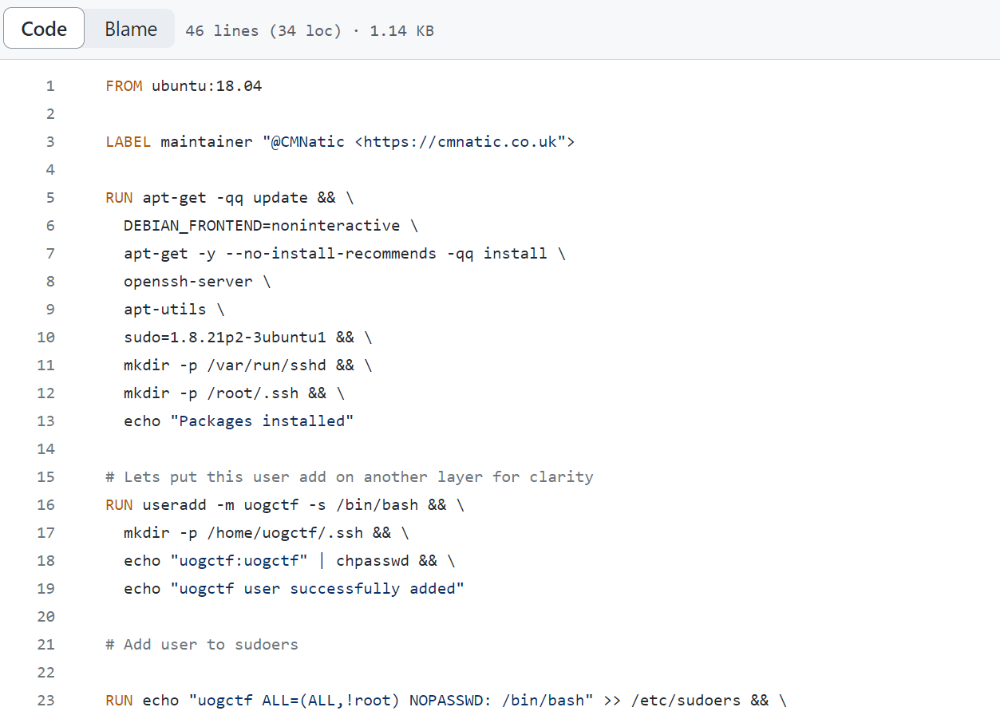

# 容器加固

## 任务 1 简介

到目前为止，本模块已向您介绍了 Docker 的基础知识以及容器相关的潜在漏洞。 本房间将教您保护容器的各种方法。 本房间将教您保护容器的各种方法。

### 学习目标

- 保护 Docker 守护进程，防止未经授权的交互。
- 正确为容器分配权限（能力）。
- 防止有缺陷或恶意的容器耗尽系统资源。
- 利用 Seccomp 和 AppArmor 等安全功能来定义容器与操作系统的交互方式。
- 通过审查 Docker 镜像中的漏洞来实践良好卫生习惯 - 实施审查代码漏洞的框架和工具。

### 先决条件

为了完成本房间，您必须熟悉 Docker 的各个组件。 为了完成本房间，您必须熟悉 Docker 的各个组件。 我强烈建议在继续之前完成 [Docker 简介](https://tryhackme.com/room/introtodockerk8pdqk) 房间。

:::info 回答以下问题

<details>

<summary> 在继续下一个任务之前阅读以上内容！ </summary>

```plaintext
No answer needed
```

</details>

:::

## 任务 2 保护 Docker 守护进程

您可能还记得 [容器漏洞](https://tryhackme.com/room/containervulnerabilitiesDG) 房间中提到的，Docker 守护进程负责处理请求，例如管理容器以及向 Docker 注册表拉取或上传镜像。 Docker 可以远程管理，通常在 CI（持续集成）和 CD（持续开发）流水线中完成。 例如，在另一台主机的容器中推送和运行新代码以检查错误。

如果攻击者可以与 Docker 守护进程交互，他们就可以与容器和镜像交互。 例如，他们可以启动自己的（恶意）容器或访问运行包含敏感信息（如数据库）的应用程序的容器。

Docker 守护进程默认不暴露到网络，必须手动配置。 然而，暴露 Docker 守护进程是一种常见做法（尤其是在云环境如 CI/CD 流水线中）。

实施安全通信和身份验证方法（如下所列）对于防止未经授权访问 Docker 守护进程极为重要。

### SSH

开发人员可以使用 SSH 身份验证与运行 Docker 的其他设备交互。 为此，Docker 使用上下文，可以将其视为配置文件。 这些配置文件允许开发人员保存和切换其他设备的配置。 例如，开发人员可能有一个用于开发 Docker 设备的上下文，另一个用于生产 Docker 设备的上下文。

**注意**：您必须具有对远程设备的 SSH 访问权限，并且您在远程设备上的用户帐户必须具有执行 Docker 命令的权限。

作为开发人员，您需要在您的设备上创建 Docker 上下文。 请参阅下面的代码片段以在 Docker 中创建上下文。

```shell title="Creating a new Docker context"
client@thm:~# docker context create
--docker host=ssh://myuser@remotehost
--description="Development Environment" 
development-environment-host 

Successfully created context "development-environment-host"
```

完成后，您可以切换到该上下文，所有与 Docker 相关的命令现在将在远程主机上执行。

```shell title="Using our newly created Docker context"
cmnatic@thm:~# docker context use development-environment-host

Current context is now "development-environment-host"
```

要退出此上下文并，例如，使用您自己的 Docker 引擎，您可以通过 `docker context use default` 恢复到 "default"。

**注意**：这并不完全安全。 例如，弱 SSH 密码可能导致攻击者能够进行身份验证。 强烈建议使用强密码卫生。 以下包含了一些强密码的技巧：

- 大量字符（即 12-22+）
- 特殊字符，如 !、@、#、$
- 大写字母和数字随机分布（例如 sUp3rseCreT!PaSSw0rd!）

Docker 上下文允许您通过 SSH 直接与 Docker 守护进程交互，这是一种安全且加密的通信方式。

### TLS 加密

Docker 守护进程也可以使用 HTTP/S 进行交互。 例如，如果 Web 服务或应用程序要与远程设备上的 Docker 交互，这很有用。

为了安全地执行此操作，我们可以利用加密协议 TLS 来加密设备之间发送的数据。 当配置为 TLS 模式时，Docker 将仅接受来自已针对您希望远程执行 Docker 命令的设备进行签名的设备的远程命令。

**注意**：创建和管理 TLS 证书超出了本房间的范围，因为您通常需要考虑诸如过期日期和加密强度等因素。 创建证书后，您可以告诉 Docker 使用生成的证书在 TLS 模式下运行。

在您发出命令的主机（服务器）上：

```shell title="Running Docker in TLS mode"
server@thm:~# dockerd --tlsverify --tlscacert=myca.pem --tlscert=myserver-cert.pem --tlskey=myserver-key.pem -H=0.0.0.0:2376
```

在您发出命令的主机（客户端）上：

```shell title="Telling Docker (local) to authenticate using TLS"
client@thm:~# docker --tlsverify --tlscacert=myca.pem --tlscert=client-cert.pem --tlskey=client-key.pem -H=SERVERIP:2376 info
```

**注意**：重要的是要记住，这并不能保证安全。 例如，任何拥有有效证书和私钥的设备都可以成为 "受信任" 设备。 我在下表中解释了生成 TLS 证书和密钥时使用的参数：

| 参数            | 描述                                      |
| :------------ | :-------------------------------------- |
| `--tlscacert` | 此参数指定证书颁发机构的证书。 证书颁发机构是颁发用于识别设备证书的可信实体。 |
| `--tlscert`   | 此参数指定用于识别设备的证书。                         |
| `--tlskey`    | 此参数指定用于解密发送到设备的通信的私钥。                   |

:::info 回答以下问题

<details>

<summary> 如果我们想创建一个 Docker 配置文件，命令会是什么？ </summary>

```plaintext
docker context create
```

</details>

<details>

<summary> 如果我们想切换到 Docker 配置文件，命令会是什么？ </summary>

```plaintext
docker context use
```

</details>

:::

## 任务 3 实施控制组

控制组（也称为 cgroups）是 Linux 内核的一个功能，有助于限制和优先化进程可以使用的系统资源数量。

例如，可以限制应用程序等进程仅使用一定量的 RAM 或处理能力，或给予其相对于其他进程的优先级。 这通常提高了系统稳定性，并允许管理员更好地跟踪系统资源使用情况。

在 Docker 的上下文中，实施 cgroups 有助于实现隔离和稳定性。 因为 cgroups 可用于确定容器使用的资源数量（或优先化），这有助于防止有缺陷或恶意的容器耗尽系统资源。 当然，最好的机制是防止这种情况发生，但防止容器拖垮整个系统是一个极好的第二道防线。

此行为在 Docker 上默认未启用，必须在启动容器时为每个容器启用。 用于指定容器可以使用的资源限制的开关已在下表中提供：

| 资源类型 | 参数                                | 示例                                          |
| :--- | :-------------------------------- | :------------------------------------------ |
| CPU  | `--cpus`（以核心数计）                   | `docker run -it --cpus="1" mycontainer`     |
| 内存   | `--memory`（以 k、m、g 表示千字节、兆字节或吉字节） | `docker run -it --memory="20m" mycontainer` |

您也可以在容器运行后更新此设置。 为此，请使用 `docker update` 命令、新的内存值和容器名称。 例如：`docker update --memory="40m" mycontainer`。

您可以使用 `docker inspect 容器名` 命令查看有关容器的信息（包括设置的资源限制）。 如果资源限制设置为 0，则表示未设置任何资源限制。

```shell title="Using Docker inspect to list the resource limits set for a container."
cmnatic@thm:~# docker inspect mycontainer
--cropped for brevity--
            "Memory": 0,
            "CpuQuota": 0,
            "CpuRealtimePeriod": 0,
            "CpuRealtimeRuntime": 0,
            "CpusetCpus": "",
            "CpusetMems": "",
            "CpuCount": 0,
            "CpuPercent": 0,
--cropped for brevity--
```

Docker 使用命名空间创建隔离环境。 例如，命名空间是一种在不影响其他进程的情况下执行不同操作的方式。 可以将这些视为办公室中的房间；每个房间都有其各自的用途。 这个办公室中某个房间内发生的事情不会影响另一个办公室内发生的事情。 这些命名空间通过隔离进程来提供安全性。

:::info 回答以下问题

<details>

<summary> 运行 Docker 容器时，我们应提供什么参数来强制限制容器可以使用的 CPU 核心数量？ </summary>

```plaintext
--cpus
```

</details>

<details>

<summary> 如果我们想要检查名为 "Apache" 的 docker 容器，命令是什么？ </summary>

```plaintext
docker inspect apache
```

</details>

:::

## 任务 4 防止“过度特权”容器

首先，我们需要了解在此上下文中特权容器是什么。 特权容器是对主机具有不受限制访问权限的容器。

容器化的全部意义在于将容器与主机“隔离”。 通过在“特权”模式下运行 Docker 容器，用于将容器与主机隔离的正常安全机制会被绕过。 虽然特权容器可能有合法用途，例如运行 Docker-In-Docker（容器中的容器）或用于调试目的，但它们极其危险。

在“特权”模式下运行 Docker 容器时，Docker 会将所有可能的能力分配给容器，这意味着容器可以执行和访问主机上的任何内容（例如文件系统）。


您可能会问，能力是什么？ 能力是 Linux 的一项安全功能，用于在细粒度级别上确定进程可以做什么和不可以做什么。 传统上，进程要么拥有完整的 root 权限，要么完全没有权限，这可能很危险，因为我们可能不希望允许进程拥有完整的 root 权限，因为这意味着它将拥有对系统的无限制访问权限。

能力允许我们微调进程拥有的权限。 我在下表中放置了一些标准能力、它们对应的权限以及它们可能使用的地方：

| 能力                                                                                  | 描述                                           | 用例                                          |
| :---------------------------------------------------------------------------------- | :------------------------------------------- | :------------------------------------------ |
| CAP_NET_BIND_SERVICE | 此能力允许服务绑定到端口，特别是 1024 以下的端口，这通常需要 root 权限。   | 允许 Web 服务器在没有 root 访问权限的情况下绑定到端口 80。        |
| CAP_SYS_ADMIN                             | 此能力提供各种管理权限，包括能够挂载/卸载文件系统、更改网络设置、执行系统重启、关机等。 | 您可能会在自动化管理任务的进程中找到此能力。 例如，修改用户或启动/停止服务。     |
| CAP_SYS_RESOURCE                          | 此能力允许进程修改可用资源的最大限制。 例如，进程可以使用更多内存或带宽。        | 此能力可以在细粒度级别上控制进程可以消耗的资源数量。 这可以是增加资源量或减少资源量。 |

总之，特权容器是被分配了完全权限（即完全 root 访问权限）的容器。 攻击者可以使用此方法逃逸容器。 如果您想进行课外学习，此过程已在 [容器漏洞](https://tryhackme.com/room/containervulnerabilitiesDG) 房间中演示。

建议单独为容器分配能力，而不是使用 `--privileged` 标志运行容器（这将分配所有能力）。 例如，您可以通过在运行容器时包含 `--cap-add=NET_BIND_SERVICE` 来为在端口 80 上运行 Web 服务器的容器分配 `NET_BIND_SERVICE` 能力。

```shell title="Assigning the NET_BIND_SERVICE capability to a container"
cmnatic@thm:~# docker run -it --rm --cap-drop=ALL --cap-add=NET_BIND_SERVICE mywebserver
```

最后，可以使用命令 `capsh --print` 来确定分配给进程的能力。

```shell title="Using capsh to list the capabilities currently assigned"
cmnatic@thm:~# capsh --print
Current: =
Bounding set = cap_chown,cap_dac_override,cap_dac_read_search,cap_fowner
-- cut for brevity ---
cap_sys_rawio,cap_sys_chroot,cap_sys_ptrace,cap_sys_pacct,cap_sys_admin,
cap_sys_boot,cap_sys_nice,cap_sys_resource,cap_sys_time,cap_sys_tty_config,cap_mknod
-- cut for brevity ---
Ambient set =
Current IAB:
Securebits: 00/0x0/1'b0
 secure-noroot: no (unlocked)
 secure-no-suid-fixup: no (unlocked)
 secure-keep-caps: no (unlocked)
 secure-no-ambient-raise: no (unlocked)
uid=1000(cmnatic) euid=1000(cmnatic)
gid=1000(cmnatic)
groups=4(adm),20(dialout),24(cdrom),25(floppy),27(sudo),1000(cmnatic)
```

经常审查分配给容器的能力非常重要。 当容器具有特权时，它与主机共享相同的命名空间，这意味着主机上的资源可以被容器访问——破坏了“隔离”环境。

:::info 回答以下问题

<details>

<summary> 允许服务绑定到端口（特别是 1024 以下的端口）的能力名称是什么？ </summary>

```plaintext
CAP_NET_BIND_SERVICE
```

</details>

<details>

<summary> 启动 Docker 容器时，我们应提供什么参数来添加能力？ </summary>

```plaintext
--cap-add
```

</details>

<details>

<summary> 最后，我们应使用什么命令（带参数）来打印分配给进程的能力？ </summary>

```plaintext
capsh --print
```

</details>

:::

## 任务 5 Seccomp 和 AppArmor 基础

Seccomp 是 Linux 的一项重要安全功能，用于限制程序可以执行和不可以执行的操作。 为了解释，想象一下办公室入口处的保安。 保安负责确保只有授权人员才能进入大楼，并且他们做他们应该做的事情。 在此场景中，Seccomp 就是保安。

Seccomp 允许您创建并强制执行一系列规则，规定应用程序可以执行哪些操作（系统调用）。 例如，允许应用程序进行读取文件的系统调用，但不允许它进行打开新网络连接（例如反向 shell）的系统调用。

这些配置文件很有用，因为它们减少了攻击者执行恶意命令的能力，同时保持了应用程序的功能。 例如，Web 服务器的 Seccomp 配置文件可能如下所示：

```json
{
  "defaultAction": "SCMP_ACT_ALLOW",
  "architectures": [
    "SCMP_ARCH_X86_64",
    "SCMP_ARCH_X86",
    "SCMP_ARCH_X32"
  ],
  "syscalls": [
    { "names": [ "read", "write", "exit", "exit_group", "open", "close", "stat", "fstat", "lstat", "poll", "getdents", "munmap", "mprotect", "brk", "arch_prctl", "set_tid_address", "set_robust_list" ], "action": "SCMP_ACT_ALLOW" },
    { "names": [ "execve", "execveat" ], "action": "SCMP_ACT_ERRNO" }
  ]
}
```

此 Seccomp 配置文件：

- 允许读取和写入文件
- 允许创建网络套接字
- 但不允许执行（例如，`execve`）

要创建 Seccomp 配置文件，您只需使用您喜欢的文本编辑器创建配置文件。 本房间将使用 `nano`。 下面提供了一个示例 Seccomp 配置文件 (profile.json)。 此配置文件将允许对文件的读取和写入访问，但不允许网络连接。

```json
{
  "defaultAction": "SCMP_ACT_ALLOW",
  "architectures": ["SCMP_ARCH_X86_64"],
  "syscalls": [
    {
      "name": "socket",
      "action": "SCMP_ACT_ERRNO",
      "args": []
    },
    {
      "name": "connect",
      "action": "SCMP_ACT_ERRNO",
      "args": []
    },
    {
      "name": "bind",
      "action": "SCMP_ACT_ERRNO",
      "args": []
    },
    {
      "name": "listen",
      "action": "SCMP_ACT_ERRNO",
      "args": []
    },
    {
      "name": "accept",
      "action": "SCMP_ACT_ERRNO",
      "args": []
    }
    {
      "name": "read",
      "action": "SCMP_ACT_ALLOW",
      "args": []
    },
    {
      "name": "write",
      "action": "SCMP_ACT_ALLOW",
      "args": []
    }
  ]
}
```

现在我们的 Seccomp 配置文件已创建，我们可以在运行时通过使用 `--security-opt seccomp` 标志和 Seccomp 配置文件的位置将其应用到我们的容器。 例如：

```shell title="Applying our Seccomp profile when running a container"
cmnatic@thm:~# docker run --rm -it --security-opt seccomp=/home/cmnatic/container1/seccomp/profile.json mycontainer
```

Docker 在运行时已经应用了默认的 Seccomp 配置文件。 但是，这可能不适合您的特定用例，特别是如果您希望在保持功能的同时进一步加固容器。 您可以在[此处](https://docs.docker.com/engine/security/seccomp/#:~:text=Secure%20computing%20mode%20\(%20seccomp%20\)%20是,state%20of%20the%20calling%20process.)了解更多关于在Docker中使用Seccomp的信息。

### AppArmor

AppArmor是Linux中类似的安全功能，因为它防止应用程序执行未经授权的操作。 然而，它与Seccomp的工作方式不同，因为它不包含在应用程序中，而是包含在操作系统中。

该机制是一种强制访问控制（MAC）系统，根据操作系统级别的一组规则确定进程可以执行的操作。 要使用AppArmor，我们首先需要确保它已安装在我们的系统上：

```shell title="Checking if AppArmor is installed or not"
cmnatic@thm:~# sudo aa-status
apparmor module is loaded.
34 profiles are loaded.
```

通过输出"apparmor module is loaded"，我们可以确认AppArmor已安装并启用。 要将AppArmor配置文件应用于我们的容器，我们需要执行以下操作：

- 创建AppArmor配置文件
- 将配置文件加载到AppArmor中
- 使用新配置文件运行我们的容器

首先，让我们创建我们的AppArmor配置文件。 您可以使用您喜欢的文本编辑器进行此操作。 请注意，有一些工具可以根据您的Dockerfile帮助生成AppArmor配置文件。 然而，这超出了本房间的范围，并且可能"不可靠"。

下面提供了一个"Apache"Web服务器的示例AppArmor配置文件（profile.json），该文件：

- 可以读取位于/var/www/、/etc/apache2/mime.types和/run/apache2中的文件。
- 读取和写入/var/log/apache2。
- 绑定到端口80的TCP套接字，但不绑定到其他端口或协议，如UDP。
- 无法从/bin、/lib、/usr等目录读取。

```plaintext
/usr/sbin/httpd {

  capability setgid,
  capability setuid,

  /var/www/** r,
  /var/log/apache2/** rw,
  /etc/apache2/mime.types r,

  /run/apache2/apache2.pid rw,
  /run/apache2/*.sock rw,

  # Network access
  network tcp,

  # System logging
  /dev/log w,

  # Allow CGI execution
  /usr/bin/perl ix,

  # Deny access to everything else
  /** ix,
  deny /bin/**,
  deny /lib/**,
  deny /usr/**,
  deny /sbin/**
}
```

现在我们已经创建了AppArmor配置文件，我们需要将其导入到AppArmor程序中以被识别。

```shell title="Importing our AppArmor profile into AppArmor"
cmnatic@thm:~# sudo apparmor_parser -r -W /home/cmnatic/container1/apparmor/profile.json
```

现在我们的AppArmor配置文件已导入，我们可以使用`--security-opt apparmor`标志和AppArmor配置文件的位置在运行时将其应用于我们的容器。 例如：

```shell title="Applying our AppArmor profile when running a container"
cmnatic@thm:~# docker run --rm -it --security-opt apparmor=/home/cmnatic/container1/apparmor/profile.json mycontainer
```

就像Seccomp一样，Docker在运行时已经应用了默认的AppArmor配置文件。 然而，这可能不适合您的特定用例，特别是如果您希望在保持功能的同时进一步加固容器。 您可以在[此处](https://docs.docker.com/engine/security/apparmor/)了解更多关于在Docker中使用AppArmor的信息。

### 有什么区别

嗯，简而言之：

- AppArmor确定应用程序可以访问哪些资源（即CPU、RAM、网络接口、文件系统等）以及它可以对这些资源执行哪些操作。
- Seccomp在程序本身内部，限制进程可以进行的系统调用（即CPU和操作系统功能的哪些部分）。

需要注意的是，这不是一个"非此即彼"的情况。 Seccomp和AppArmor可以结合使用，为容器创建多层安全防护。

:::info 回答以下问题

<details>

<summary> 如果我们想强制容器只能读取位于/home/tryhackme中的文件，我们会使用哪种类型的配置文件？ Seccomp还是AppArmor？ </summary>

```plaintext
AppArmor
```

</details>

<details>

<summary> 如果我们想禁止容器进行系统调用（如clock_adjtime），我们会使用哪种类型的配置文件？ Seccomp还是AppArmor？ </summary>

```plaintext
Seccomp
```

</details>

<details>

<summary> 最后，如果我们想列出AppArmor的状态，我们会使用什么命令？ </summary>

```plaintext
aa-status
```

</details>

:::

## 任务6 审查Docker镜像

审查Docker镜像是一个极其重要的习惯。 您会对在设备上运行未知代码保持警惕，那么为什么会在生产环境中考虑运行它呢？

不幸的是，有许多恶意Docker镜像造成破坏的例子。 例如，在2020年，Palo Alto发现了[加密货币挖矿Docker镜像](https://unit42.paloaltonetworks.com/cryptojacking-docker-images-for-mining-monero/)，这些镜像被拉取（并且可能运行）超过两百万次。

Docker Hub上的镜像通常附带存储库中的Dockerfiles。 例如，Docker Hub显示Dockerfile的层（因此是执行的命令）。


在上图中，我们可以看到DockerHub上镜像的各个层。 这些层是镜像构建过程中执行的步骤。

此外，Docker Hub上镜像的开源代码存储库通常会包含在内，允许您审查整个Dockerfile。



在上图中，我们可以看到Dockerfile的代码。 这使我们能够审计代码并准确理解容器中正在执行的操作。 通过分析代码，我们可以检查漏洞或恶意操作。

诸如[Dive](https://github.com/wagoodman/dive)之类的工具允许您通过检查镜像构建过程中每一层执行和更改的内容来逆向工程Docker镜像。

:::info 回答以下问题

<details>

<summary> 我了解如何审查Dockerfiles和Docker镜像！ 完成我以继续下一个任务。 </summary>

```plaintext
No answer needed
```

</details>

:::

## 任务7 合规性与基准测试

合规性和基准测试在保护资产安全方面起着至关重要的作用——更不用说容器了。 让我们从解释合规性开始。 合规性是遵循法规和标准的过程，例如NIST SP 800-190，这是国家标准与技术研究院制定的一套标准，为容器安全提供指导和最佳实践：

| 合规框架            | 描述                                    | URL                                                                                                                                                                      |
| :-------------- | :------------------------------------ | :----------------------------------------------------------------------------------------------------------------------------------------------------------------------- |
| NIST SP 800-190 | 该框架概述了与容器相关的潜在安全问题，并提供了解决这些问题的建议。     | [https://csrc.nist.gov/publications/detail/sp/800-190/final](https://csrc.nist.gov/publications/detail/sp/800-190/final) |
| ISO 27001       | 该框架是信息安全的国际标准。 该标准指导实施、维护和改进信息安全管理体系。 | [https://www.iso.org/standard/27001](https://www.iso.org/standard/27001)                                                 |

请注意，您可能需要遵守与您行业相关的其他框架。 例如，金融或医疗。 所有行业都存在法规。 例如，在医疗领域，HIPPA用于处理医疗数据。

另一方面，基准测试是一个用于查看组织遵循最佳实践情况的过程。 基准测试允许组织查看他们在哪些方面很好地遵循了最佳实践，以及哪些方面需要进一步改进：

| 基准测试工具        | 描述                                                                   | URL                                                                                                                                        |
| :------------ | :------------------------------------------------------------------- | :----------------------------------------------------------------------------------------------------------------------------------------- |
| CIS Docker 基准 | 该工具可以评估容器是否符合 CIS Docker 基准框架。                                       | [https://www.cisecurity.org/benchmark/docker](https://www.cisecurity.org/benchmark/docker) |
| OpenSCAP      | 该工具可以评估容器是否符合多个框架，包括 CIS Docker 基准、NIST SP-800-190 等。                | [https://www.open-scap.org/](https://www.open-scap.org/)                                   |
| Docker Scout  | 该工具是 Docker 本身提供的基于云的服务，可扫描 Docker 镜像和库中的漏洞。 该工具列出存在的漏洞并提供解决这些漏洞的步骤。 | [https://docs.docker.com/scout/](https://docs.docker.com/scout/)                           |
| Anchore       | 该工具可以评估容器是否符合多个框架，包括 CIS Docker 基准、NIST SP-800-190 等。                | [https://github.com/anchore/anchore-engine](https://github.com/anchore/anchore-engine)                     |
| Grype         | 该工具是一种现代且快速的 Docker 镜像漏洞扫描器                                          | [https://github.com/anchore/grype](https://github.com/anchore/grype)                                       |

下面终端中提供了一个使用 Docker Scout 工具分析 Docker 镜像的示例。 请注意，这需要事先[安装](https://github.com/docker/scout-cli)。 您可以阅读 [Docker Scout](https://docs.docker.com/scout/) 文档以了解更多信息。

```shell title="Using Docker Scout to scan our "nginx" image for vulnerabilities"
cmnatic@thm:~# docker scout cves local://nginx:latest
    ✓ SBOM of image already cached, 215 packages indexed
    ✗ Detected 22 vulnerable packages with a total of 45 vulnerabilities

## Overview
                    │       Analyzed Image         
────────────────────┼──────────────────────────────
  Target            │  local://nginx:latest        
    digest          │  4df6f9ac5341                
    platform        │ linux/amd64                  
    vulnerabilities │    0C     1H    18M    28L   
    size            │ 91 MB                        
    packages        │ 215                          

## Packages and Vulnerabilities
   0C     1H     1M     3L  glibc 2.35-0ubuntu3.1
pkg:deb/ubuntu/glibc@2.35-0ubuntu3.1?os_distro=jammy&os_name=ubuntu&os_version=22.04
    ✗ HIGH CVE-2023-4911
      https://scout.docker.com/v/CVE-2023-4911
      Affected range : <2.35-0ubuntu3.4                              
      Fixed version  : 2.35-0ubuntu3.4                               
      CVSS Score     : 7.8                                           
      CVSS Vector    : CVSS:3.1/AV:L/AC:L/PR:L/UI:N/S:U/C:H/I:H/A:H  
    
    ✗ MEDIUM CVE-2023-5156
      https://scout.docker.com/v/CVE-2023-5156
      Affected range : <2.35-0ubuntu3.5                              
      Fixed version  : 2.35-0ubuntu3.5                               
      CVSS Score     : 7.5                                           
      CVSS Vector    : CVSS:3.1/AV:N/AC:L/PR:N/UI:N/S:U/C:N/I:N/A:H  
    
    ✗ LOW CVE-2016-20013
      https://scout.docker.com/v/CVE-2016-20013
      Affected range : >=0                                           
      Fixed version  : not fixed                                     
      CVSS Score     : 7.5                                           
      CVSS Vector    : CVSS:3.1/AV:N/AC:L/PR:N/UI:N/S:U/C:N/I:N/A:H  
    
    ✗ LOW CVE-2023-4813
      https://scout.docker.com/v/CVE-2023-4813
      Affected range : <2.35-0ubuntu3.5                              
      Fixed version  : 2.35-0ubuntu3.5                               
      CVSS Score     : 5.9                                           
      CVSS Vector    : CVSS:3.1/AV:N/AC:H/PR:N/UI:N/S:U/C:N/I:N/A:H  
    
    ✗ LOW CVE-2023-4806
      https://scout.docker.com/v/CVE-2023-4806
      Affected range : <2.35-0ubuntu3.5                              
      Fixed version  : 2.35-0ubuntu3.5                               
      CVSS Score     : 5.9                                           
      CVSS Vector    : CVSS:3.1/AV:N/AC:H/PR:N/UI:N/S:U/C:N/I:N/A:H
```

:::info 回答以下问题

<details>

<summary> 美国国家标准与技术研究院发布的框架名称是什么？<br />对于此答案，请务必包含全名。 </summary>

```plaintext
NIST SP 800-190
```

</details>

<details>

<summary> Docker 提供的分析工具名称是什么？ </summary>

```plaintext
Docker Scout
```

</details>

:::

## 任务 8 实践

通过按下绿色的 **启动机器** 按钮来部署附加到此任务的机器。 机器将在分屏视图中启动。 如果未显示，您可以按下页面右上角的蓝色 **显示分屏视图** 按钮。 您的任务是使用机器上的 [Grype](https://github.com/anchore/grype) 漏洞扫描器分析一些 Docker 镜像。

Grype 可用于分析 Docker 镜像和容器文件系统。 您可以参考下表作为速查表来回答此任务中的问题。

| 示例           | 描述                                     | 命令                                   |
| :----------- | :------------------------------------- | :----------------------------------- |
| 扫描 Docker 镜像 | 扫描 Docker 镜像以查找漏洞。                     | `grype imagename --scope all-layers` |
| 扫描导出的容器文件系统  | 扫描导出的容器文件系统（例如来自 `docker image save`）。 | `grype /path/to/image.tar`           |

**请注意**，对于此房间，您可以安全地忽略 "无法检查漏洞数据库更新" 警告消息。

:::info 回答以下问题

<details>

<summary> 使用 Docker 列出系统上运行的容器。 当前运行的容器名称是什么？ </summary>

```plaintext
couchdb
```

</details>

<details>

<summary> 使用 Grype 分析 "struts2" 镜像。 标记为 "严重" 的库名称是什么？ </summary>

```plaintext
struts2-core
```

</details>

<details>

<summary> 使用 Grype 分析位于 **/root/container.tar** 的导出容器文件系统。 "CVE-2023-45853" 的严重性评级是什么？  </summary>

```plaintext
Critical
```

</details>

:::
