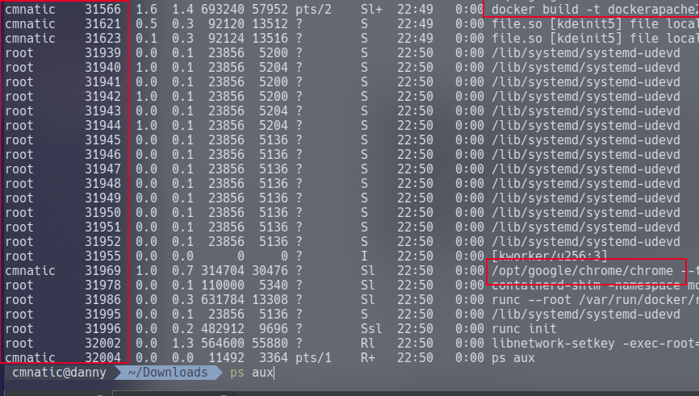
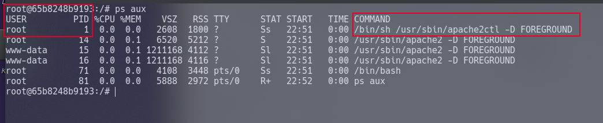

# 容器化入门

## 任务1 介绍

本房间是系列课程的第一部分，旨在解释流行的容器化技术。

### 学习成果

完成本房间后，您将了解：

- 什么是容器化以及容器是什么
- 容器化在何处以及为何被使用？
- 对流行的容器化技术Docker的基本理解
- Docker如此受欢迎的原因
- 容器化的工作原理

话虽如此，请完成下面的问题并继续下一个任务！

:::info 回答以下问题

<details>

<summary> 完成此问题并继续下一个任务。 </summary>

```plaintext
No answer needed
```

</details>

:::

## 任务2 什么是容器化

在计算术语中，容器化是将应用程序及其所需资源（如库和包）打包成一个名为容器的包的过程。 将应用程序打包在一起的过程使应用程序具有相当的可移植性且运行无忧。

现代应用程序通常很复杂，并且通常需要在设备上安装框架和库才能运行。 这些依赖项可能：

- 根据应用程序运行的环境难以安装（某些操作系统甚至可能不支持它们！）
- 给开发人员诊断和复现故障带来困难，因为这可能是应用程序环境的问题，而不是应用程序本身的问题！
- 经常相互冲突。 例如，为运行不同的应用程序而安装多个Python版本对用户来说很头疼，一个应用程序可能适用于某个Python版本而不适用于另一个版本。

容器化平台通过将依赖项打包在一起并“隔离”（**注意**：在此上下文中不要与“安全隔离”混淆）应用程序环境来消除这种困扰。

如果设备支持容器化引擎，用户将能够运行应用程序并获得相同的行为。


在上面的截图中，我们可以看到三个应用程序及其环境（如依赖项）如何打包在一起，并且不直接与物理计算机交互，而是与容器化引擎（在此情况下是Docker）交互。

我们将继续讨论容器如何相互隔离，但重要的是要理解这种隔离是容器的核心特性。

然而，值得注意的是，容器化平台利用了内核的“命名空间”功能，该功能允许进程访问操作系统资源而无法与其他进程交互。

命名空间提供的隔离增加了安全性优势，因为这意味着如果容器中的应用程序被攻破，通常（除非它们共享相同的命名空间）其他容器不会受到影响。

虚拟机等替代方案需要安装整个操作系统来运行应用程序（占用大量磁盘空间和其他计算资源，如CPU和RAM）。

:::info 回答以下问题

<details>

<summary> 允许进程使用操作系统资源而无法与其他进程交互的内核功能名称是什么？ </summary>

```plaintext
namespace
```

</details>

<details>

<summary> 在正常配置中，其他容器可以相互交互吗？ (是/否) </summary>

```plaintext
nay
```

</details>

:::

## 任务3 Docker介绍

我保证会尽量简短地介绍。 Docker是一个相对无忧、功能广泛且开源的容器化平台。 Docker生态系统允许轻松部署、管理和共享应用程序（镜像——我们将在后续房间中讨论）。

Docker可在Linux、Windows和MacOS上运行，是运行应用程序的明智选择。 应用程序可以作为“镜像”发布并与他人共享。 只需拉取（下载）镜像并使用Docker运行即可。

Docker采用容器化中使用的相同技术，将应用程序隔离到称为Docker引擎的容器中。 Docker引擎本质上是一个在主机操作系统上运行的API，它在操作系统和容器之间通信以访问系统的硬件（如CPU、RAM、网络和磁盘）。

因此，Docker引擎功能广泛，允许您执行以下操作：

1. 连接容器（例如，一个容器运行Web应用程序，另一个容器运行数据库）
2. 导出和导入应用程序（镜像）
3. 在操作系统和容器之间传输文件

Docker使用编程语法YAML，允许开发人员指示如何构建容器以及运行什么。 这是Docker如此便携且易于调试的重要原因；共享指令，它将在任何支持Docker引擎的设备上以相同方式构建和运行。

Docker引擎允许编排容器，这意味着多个容器可以作为组的一部分构建，允许容器相互通信（例如，一个容器运行Web服务器，另一个容器运行数据库可以通信）。 我们将在后续房间中讨论此功能。

:::info 回答以下问题

<details>

<summary> 使用Docker发布时，应用程序会变成什么？ 格式：一个xxxxx（填写x） </summary>

```plaintext
An Image
```

</details>

<details>

<summary> Docker使用的编程语法语言的缩写是什么？ </summary>

```plaintext
YAML
```

</details>

:::

## 任务4 Docker的历史

Docker最初由Solomon Hykes于2013年创建，是开源的，并已成为容器化领域内备受推崇的名称。

Docker最初是dotCloud（一个PaaS提供商）的内部项目，随后在2013年的PyCon上展示，并迅速开源。

虽然容器化的原始概念始于1979年的Unix V7，但Docker自2013年发布以来使容器化成为一种流行的技术。 Docker的流行归功于使容器化的好处变得易于获取和现代化。

截至2022年4月，可以说Docker非常受欢迎。 具体来说：

- 1300万开发人员正在使用Docker [1]
- 有700万个应用程序已制作并准备与Docker一起使用 [2]
- 每月下载130亿个应用程序！ [3]
- …而这仅来自官方仓库

[1, 2]. [Dockerhub.com](http://dockerhub.com/) 04/2022

[3]. [Docker.com](http://docker.com/) 04/2022

:::info 回答以下问题

<details>

<summary> Docker最初创建于哪一年？ </summary>

```plaintext
2013
```

</details>

<details>

<summary> Docker首次在哪里展示？ </summary>

```plaintext
PyCon
```

</details>

<details>

<summary> 哪个版本的Unix首次提出了容器化的概念？ </summary>

```plaintext
V7
```

</details>

:::

## 任务5 Docker的优势与特性

如果还没说够，这里再试一次。 Docker是一种敏捷、便捷且功能广泛的应用程序部署方式。 让我们在下面的标题中详细探讨这一点。

### Docker是免费的

Docker生态系统可以免费使用并且是开源的。 虽然存在商业计划，但您可以完全下载、使用、创建、运行和共享镜像。

### Docker是兼容的

Docker平台与Linux、macOS和Windows兼容。 由于容器化的工作方式，如果设备支持Docker引擎，您可以运行任何容器，无论应用程序或依赖项如何。

### Docker是高效且极简的

与虚拟机等替代方案相比，Docker是一种隔离应用程序的高效方式。 这是因为Docker引擎运行并与主机操作系统交互，而容器不为每个容器运行完整的操作系统。 例如，容器可以共享一个极简的操作系统镜像，这意味着您只需存储一次。

一个极简的Ubuntu镜像约为100MB，可以存储一次并多次使用。 与此相比，每个虚拟机全新安装后的Ubuntu服务器镜像约为1GB。

```shell title="Inspecting the size of the "ubuntu" docker image"
ubuntu@thm:~$ docker image ls
REPOSITORY   TAG       IMAGE ID       CREATED       SIZE
ubuntu       latest    27941809078c   4 weeks ago   77.8MB
ubuntu@thm:~$
```

### Docker易于入门

Docker开发者文档非常[完善](https://docs.docker.com/)，互联网上有大量文章、工作示例和已回答的问题。 很可能，如果您想在Docker中做某事，已经有人询问或做过。

Docker的入门语法很容易掌握。 您可以立即启动您的第一个容器（事实上，已经发布了各种应用程序的docker镜像，这很有帮助。）

### Docker易于与他人共享

Docker的一个重要优势是其可移植性。 Docker使用“镜像”来存储指令，以规定容器应如何构建（就像一个说明书！）。

这些“镜像”可以导出、共享并上传到公共和私有仓库，如DockerHub和GitHub。 只要语法有效，任何支持Docker引擎的东西都可以运行“镜像”。

### Docker是极简的

上面讨论的这些Docker镜像是极简的。 您经常会发现容器中缺少许多核心和豪华的工具和包。 虽然这看起来像是一个缺点，但实际上它允许：

- 容器可以完全按照开发者的意愿构建
- 更好的安全性，确切知道容器内运行的内容可以减少不必要的包变得易受攻击并构成安全风险的可能性。

### Docker运行成本更低

运行容器通常比运行虚拟机更便宜。 这在云环境中尤其明显，其中CPU、RAM和磁盘空间都很昂贵。

例如，您可以在一个5美元的云提供商VPS上愉快地运行几个容器，而您将无法运行虚拟机。 这是由于以下事实：

- 运行虚拟机需要支持虚拟化的硬件，这仅在云提供商的高成本层级中提供（如果有的话！）
- 虚拟机需要大量内存和磁盘空间，因为您在物理机之上运行一个单独的操作系统。

:::info 回答以下问题

<details>

<summary> 请阅读！ </summary>

```plaintext
No answer needed
```

</details>

:::

## 任务6 容器化如何工作？

命名空间本质上将系统资源（如进程、文件和内存）与其他命名空间隔离开来。

在Linux上运行的每个进程都将被分配两件事：

- 一个命名空间
- 一个进程标识符（PID）

命名空间是实现容器化的方式！ 进程只能“看到”同一命名空间中的其他进程——理论上没有冲突。 以Docker为例，每个新容器都将作为一个新的命名空间运行，尽管容器可能运行多个应用程序（进而有多个进程）。

让我们通过比较运行Web服务器的Docker容器中的进程数量与当时主机操作系统中的进程数量来证明容器化的概念：



简而言之，ID为0的进程是系统启动时启动的进程。 进程号递增且必须由另一个进程启动，因此自然下一个进程ID将是#1。 这个进程是系统的`init`，例如，最新版本的Ubuntu使用`systemd`。 任何其他运行的进程都将由`systemd`（进程#1）控制。

我们可以使用操作系统上进程#1的命名空间来提升我们的权限。 虽然容器设计为使用这些命名空间相互隔离，但它们可以与主机计算机的进程共存…… 这给了我们一个很好的逃脱机会！



:::info 回答以下问题

<details>

<summary> 我们可以使用什么命令查看运行进程的列表？ </summary>

```plaintext
ps aux
```

</details>

:::

## 任务7 实践

部署附加到此任务的静态站点。 容器化应用程序以揭示flag！

:::info 回答以下问题

<details>

<summary> 容器化静态站点中的应用程序。 flag是什么？ </summary>

```plaintext
THM{APPLICATION_SHIPPED}
```

</details>

:::
