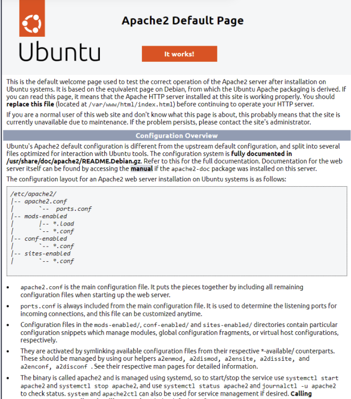
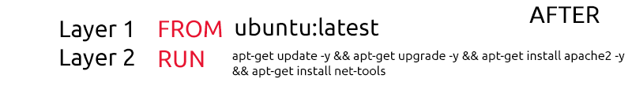
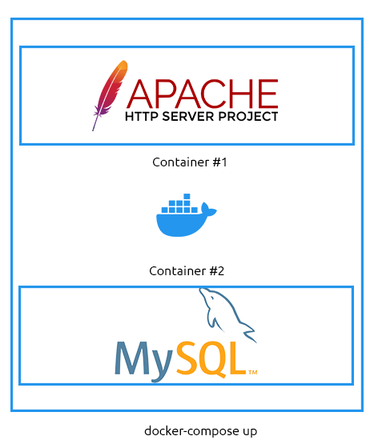

# Docker入门

## 任务1 介绍

在本房间中，您将获得首次动手部署和与Docker容器交互的实践经验。

具体来说，在本房间结束时，您将熟悉以下内容：

- 让您开始使用Docker的基本语法
- 运行和部署您的第一个容器
- 了解Docker容器如何使用镜像进行分发
- 使用Dockerfile创建您自己的镜像
- Dockerfile如何用于构建容器，使用Docker Compose编排多个容器
- 将房间中获得的知识应用到最后的实践环节中。

**请注意**：强烈建议您至少熟悉基本的Linux语法（例如运行命令、移动文件以及熟悉文件系统结构的外观）。 如果您已完成[Linux基础模块](https://tryhackme.com/module/linux-fundamentals)，您将为本房间做好充分准备！

此外，重要的是要记住您需要互联网连接来拉取Docker镜像。  如果您是免费用户并希望在本房间中练习命令，您需要在您自己的环境中进行。

:::info 回答以下问题

<details>

<summary> 在继续下一个任务之前完成此问题。 </summary>

```plaintext
No answer needed
```

</details>

:::

## 任务2 基本Docker语法

Docker起初可能看起来令人不知所措。 然而，这些命令非常直观，通过一些练习，您很快就能成为Docker专家。

Docker的语法可以分为四个主要类别：

- 运行容器
- 管理和检查容器
- 管理Docker镜像
- Docker守护进程统计信息和信息

我们将在本任务中分解这些类别中的每一个。

### 管理Docker镜像

#### Docker Pull

在我们运行Docker容器之前，我们首先需要一个镜像。 回顾"[容器化入门](https://tryhackme.com/room/introtocontainerisation)"房间，镜像是容器应执行什么的指令。 运行一个什么都不做的容器是没有用的！

在本房间中，我们将使用Nginx镜像在容器内运行一个Web服务器。 在下载镜像之前，让我们分解下载镜像所需的命令和语法。 可以使用`docker pull`命令并提供镜像名称来下载镜像。

例如，`docker pull nginx`。 Docker必须知道从哪里获取此镜像（例如从我们将在后续任务中介绍的存储库）。

继续我们上面的示例，让我们下载这个Nginx镜像！

**请注意**，此命令将无法在本房间连接的实践机器上运行，因为需要互联网访问。

```shell title="A terminal showing the downloading of the "Nginx" image"
cmnatic@thm:~$ docker pull nginx
Using default tag: latest
latest: Pulling from library/nginx
-- omitted for brevity --
Status: Downloaded newer image for nginx:latest
cmnatic@thm:~$
```

通过运行此命令，我们正在下载标题为"nginx"的镜像的最新版本。 镜像有这些称为标签的标记。 这些标签用于引用镜像的变体。 例如，镜像可以具有相同的名称但不同的标签以指示不同的版本。 我在下面的表格中提供了一个如何使用标签的示例：

| Docker镜像 |           标签          |                                          命令示例                                          |                                                               解释                                                              |
| :------: | :-------------------: | :------------------------------------------------------------------------------------: | :---------------------------------------------------------------------------------------------------------------------------: |
|  ubuntu  |         latest        | docker pull ubuntu <br /> **- 等同于 -** <br /> docker pull ubuntu:latest | 此命令将拉取"ubuntu"镜像的最新版本。 如果未指定标签，Docker将假定您需要"latest"版本。<br />值得记住的是，您并不总是需要"latest"。 这个镜像字面上是"最新的"，因为它将包含最近的更改。 这可能会修复或破坏您的容器。 |
|  ubuntu  | 22.04 |                docker pull ubuntu:22.04                |                             此命令将拉取"ubuntu"镜像的"22.04 (Jammy)"版本。                            |
|  ubuntu  | 20.04 |                docker pull ubuntu:20.04                |                             此命令将拉取"ubuntu"镜像的"20.04 (Focal)"版本。                            |
|  ubuntu  | 18.04 |                docker pull ubuntu:18.04                |                            此命令将拉取"ubuntu"镜像的"18.04 (Bionic)"版本。                            |

指定标签时，必须在镜像名称和标签之间包含冒号`:`，例如`ubuntu:22.04`（镜像:标签）。 不要忘记标签 - 我们将在未来的任务中再次讨论这些！

### Docker Image x/y/z

`docker image`命令与适当的选项允许我们管理本地系统上的镜像。 要列出可用选项，我们可以简单地执行`docker image`来查看我们可以做什么。 我已经在下面的终端中为您完成了此操作：

```shell title="A terminal showing the various arguments we can provide with [docker image]"
cmnatic@thm:~$ docker image

Usage:  docker image COMMAND

Manage images

Commands:
  build       Build an image from a Dockerfile
  history     Show the history of an image
  import      Import the contents from a tarball to create a filesystem image
  inspect     Display detailed information on one or more images
  load        Load an image from a tar archive or STDIN
  ls          List images
  prune       Remove unused images
  pull        Pull an image or a repository from a registry
  push        Push an image or a repository to a registry
  rm          Remove one or more images
  save        Save one or more images to a tar archive (streamed to STDOUT by default)
  tag         Create a tag TARGET_IMAGE that refers to SOURCE_IMAGE

Run 'docker image COMMAND --help' for more information on a command.
cmnatic@thm:~$
```

在本房间中，我们仅将涵盖docker镜像的以下选项：

- pull（我们上面已经完成了！）
- ls（列出镜像）
- rm（删除镜像）
- build（我们将在"构建您的第一个容器"任务中介绍）

### Docker Image ls

此命令允许我们列出存储在本地系统上的所有镜像。 我们可以使用此命令来验证镜像是否已正确下载，并查看有关它的更多信息（例如标签、镜像创建时间和镜像大小）。

```shell title="A terminal listing the Docker images that are stored on the host operating system"
cmnatic@thm:~$ docker image ls
REPOSITORY   TAG       IMAGE ID       CREATED       SIZE
ubuntu       22.04     2dc39ba059dc   10 days ago   77.8MB
nginx        latest    2b7d6430f78d   2 weeks ago   142MB
cmnatic@thm:~$
```

例如，在上面的终端中，我们可以看到系统上两个镜像的一些信息：

|   存储库  |           标签          |     镜像ID     |  创建时间 |           大小           |
| :----: | :-------------------: | :----------: | :---: | :--------------------: |
| ubuntu | 22.04 | 2dc39ba059dc | 10 天前 | 77.8MB |
|  nginx |         latest        | 2b7d6430f78d |  2 周前 |          142MB         |

### Docker 镜像 rm

如果我们想从系统中删除一个镜像，我们可以使用 `docker image rm` 以及名称（或镜像 ID）。 在以下示例中，我将删除标签为 "22.04" 的 "ubuntu" 镜像。 我的命令将是 `docker image rm ubuntu:22.04`：

记住要包含镜像名称的标签很重要。

```shell title="A terminal displaying the untagging of an image"
cmnatic@thm:~$ docker image rm ubuntu:22.04
Untagged: ubuntu:22.04
Untagged: ubuntu@sha256:20fa2d7bb4de7723f542be5923b06c4d704370f0390e4ae9e1c833c8785644c1
Deleted: sha256:2dc39ba059dcd42ade30aae30147b5692777ba9ff0779a62ad93a74de02e3e1f
Deleted: sha256:7f5cbd8cc787c8d628630756bcc7240e6c96b876c2882e6fc980a8b60cdfa274
cmnatic@thm:~$
```

如果我们运行 `docker image ls`，我们会看到该镜像不再列出：

```SHELL TITLE="A terminal confirming that our Docker image has been deleted"
cmnatic@thm:~$ docker image ls
REPOSITORY   TAG       IMAGE ID       CREATED       SIZE
nginx        latest    2b7d6430f78d   2 weeks ago   142MB
cmnatic@thm:~$
```

:::info 回答以下问题

<details>

<summary> 如果我们想 `pull` 一个 Docker 镜像，我们的命令会是什么样子？ </summary>

```plaintext
docker pull
```

</details>

<details>

<summary> 如果我们想列出运行 Docker 的设备上的所有镜像，我们的命令会是什么样子？ </summary>

```plaintext
docker image ls
```

</details>

<details>

<summary> 假设我们想拉取镜像 "tryhackme"（不带引号）；我们的命令会是什么样子？ </summary>

```plaintext
docker pull tryhackme
```

</details>

<details>

<summary> 假设我们想拉取标签为 "1337"（不带引号）的 "tryhackme" 镜像。 我们的命令会是什么样子？ </summary>

```plaintext
docker pull tryhackme:1337
```

</details>

:::

## 任务 3 运行你的第一个容器

Docker run 命令从镜像创建运行中的容器。 这是运行 Dockerfile 中的命令（以及我们在运行时的输入）的地方。 因此，这必须是你首先学习的一些语法。

该命令的工作方式如下：`docker run [OPTIONS] IMAGE_NAME [COMMAND] [ARGUMENTS...]` 括号中的选项对于容器运行不是必需的。

Docker 容器可以使用各种选项运行 - 取决于我们将如何使用容器。 本任务将解释你可能想使用的一些最常见选项。

### 首先，简单运行一个容器

让我们回顾运行 Docker 容器所需的语法：docker run [OPTIONS] IMAGE_NAME [COMMAND] [ARGUMENTS...] 。 在此示例中，我将配置容器运行：

- 一个名为 "helloworld" 的镜像
- 通过在 [OPTIONS] 命令中提供 `-it` 开关来"交互式"运行。 这将允许我们直接与容器交互。
- 我将在容器内生成一个 shell，通过提供 `/bin/bash` 作为 [COMMAND] 部分。 此参数是你放置要在容器内运行的命令（如文件、应用程序或 shell！）的地方。

因此，要实现上述目标，我的命令将如下所示：`docker run -it helloworld /bin/bash`

```shell title="A terminal showing a container being launched in 'interactive' mode"
cmnatic@thm-intro-to-docker:~$ docker run -it helloworld /bin/bash
root@30eff5ed7492:/#
```

我们可以验证我们已成功启动 shell，因为我们的提示符将更改为另一个用户帐户和主机名。 容器的主机名是容器 ID（可以通过使用 `docker ps` 找到）。 例如，在上面的终端中，我们的用户名和主机名是 `root@30eff5ed7492`

### 运行容器...继续

如前所述，Docker 容器可以使用各种选项运行。 容器的目的和 Dockerfile 中设置的指令（我们将在后面的任务中讨论）决定了我们需要使用哪些选项来运行容器。 首先，我将你可能需要运行 Docker 容器的一些最常见选项放入下表中。

| [选项] |                                                 解释                                                | 相关 Dockerfile 指令 |                                 示例                                 |
| :------------------------------------------------------: | :-----------------------------------------------------------------------------------------------: | :--------------: | :----------------------------------------------------------------: |
|                            -d                            |                                  此参数告诉容器以"分离"模式启动。 这意味着容器将在后台运行。                                  |        N/A       |                     `docker run -d helloworld`                     |
|                            -it                           |          此参数有两个部分。 "i" 表示以交互方式运行，"t" 告诉 Docker 在容器内运行 shell。 如果我们希望在容器运行后直接与其交互，我们将使用此选项。         |        N/A       |                     `docker run -it helloworld`                    |
|                            -v                            |            此参数是"Volume"的缩写，告诉 Docker 将主机操作系统的目录或文件挂载到容器内的位置。 这些文件存储的位置在 Dockerfile 中定义            |      VOLUME      | `docker run -v /host/os/directory:/container/directory helloworld` |
|                            -p                            | 此参数告诉 Docker 将主机操作系统上的端口绑定到容器中暴露的端口。 如果你在容器中运行应用程序或服务（如 Web 服务器）并希望通过导航到 IP 地址访问该应用程序/服务，你将使用此指令。 |      EXPOSE      |                   `docker run -p 80:80 webserver`                  |
|                           --rm                           |                               此参数告诉 Docker 在容器完成运行其被指示执行的任何操作后删除容器。                               |        N/A       |                    `docker run --rm helloworld`                    |
|                          --name                          |            此参数让我们为容器起一个友好、易记的名称。 当容器在没有此选项的情况下运行时，名称是两个随机单词。 我们可以使用此选项根据容器运行的应用程序来命名容器。           |        N/A       |                   `docker run --name helloworld`                   |

这些只是我们在运行容器时可以提供的一些参数。 同样，我们需要运行的大多数参数将由容器的构建方式决定。 然而，诸如 `--rm` 和 `--name` 等参数将指示 Docker 如何运行容器。 其他参数包括（但不限于！）：

- 告诉 Docker 容器应使用哪个网络适配器
- 容器应具有哪些功能的访问权限。 这在 TryHackMe 上的 "[Docker Rodeo](https://tryhackme.com/room/dockerrodeo)" 房间中有介绍。
- 将值存储到环境变量中

如果您希望探索更多这些参数，我强烈建议阅读 [Docker run 文档](https://docs.docker.com/engine/reference/run/)。

### 列出正在运行的容器

要列出正在运行的容器，我们可以使用 docker ps 命令。 此命令将列出当前正在运行的容器 - 如下所示：

```shell title="A terminal showing a list of running containers and their information"
cmnatic@thm:~/intro-to-docker$ docker ps
CONTAINER ID   IMAGE                           COMMAND        CREATED        STATUS      PORTS     NAMES
a913a8f6e30f   cmnatic/helloworld:latest   "sleep"   1 months ago   Up 3 days   0.0.0.0:8000->8000/tcp   helloworld
cmnatic@thm:~/intro-to-docker$
```

此命令还将显示有关容器的信息，包括：

- 容器的 ID
- 容器正在运行什么命令
- 容器何时创建
- 容器已运行多长时间
- 映射了哪些端口
- 容器的名称

**提示**：要列出所有容器（包括已停止的），您可以使用 `docker ps -a`：

```shell title="A terminal showing a list of ALL containers and their information"
cmnatic@thm:~/intro-to-docker$ docker ps -a
CONTAINER ID   IMAGE                             COMMAND                  CREATED             STATUS     PORTS    NAMES
00ba1eed0826   gobuster:cmnatic                  "./gobuster dir -url…"   an hour ago   Exited an hour ago practical_khayyam
```

:::info 回答以下问题

<details>

<summary> 如果我们想要以**交互式**方式运行容器，我们的命令会是什么样子？<br />**注意**：假设我们在此处未指定任何镜像。 </summary>

```plaintext
docker run -it
```

</details>

<details>

<summary> 如果我们想要以"**分离**"模式运行容器，我们的命令会是什么样子？<br />**注意**：假设我们在此处未指定任何镜像。 </summary>

```plaintext
docker run -d
```

</details>

<details>

<summary> 假设我们想要运行一个容器，该容器将运行**并**在端口 80 上绑定一个 Web 服务器。 我们的命令会是什么样子？<br />**注意**：假设我们在此处未指定任何镜像。 </summary>

```plaintext
docker run -p 80:80
```

</details>

<details>

<summary> 我们如何列出所有正在运行的容器？ </summary>

```plaintext
docker ps
```

</details>

<details>

<summary> 现在，我们如何列出所有容器（包括已停止的）？ </summary>

```plaintext
docker ps -a
```

</details>

:::

## 任务 4 Dockerfile 简介

Dockerfile 在 Docker 中扮演着至关重要的角色。 Dockerfile 是一个格式化的文本文件，本质上充当了容器应执行操作的指令手册，并最终组装成一个 Docker 镜像。

您使用 Dockerfile 来包含容器构建时应执行的命令。 要开始使用 Dockerfile，我们需要了解一些基本的语法和指令。 Dockerfile 的格式如下：

`INSTRUCTION argument`

首先，让我们介绍一些基本指令：

|    指令   |                         描述                         |                                     示例                                     |
| :-----: | :------------------------------------------------: | :------------------------------------------------------------------------: |
|   FROM  | 此指令为容器设置构建阶段，并设置基础镜像（操作系统）。 所有 Dockerfile 都必须以此开头。 |                                `FROM ubuntu`                               |
|   RUN   |                  此指令将在新层中执行容器内的命令。                 |                                `RUN whoami`                                |
|   COPY  |        此指令将文件从本地系统复制到容器中的工作目录（语法类似于 cp 命令）。        |                     `COPY /home/cmnatic/myfolder/app/`                     |
| WORKDIR |         此指令设置容器的工作目录。 （类似于在 Linux 上使用 cd）。         |                      `WORKDIR /` <br />（设置为容器文件系统的根目录）                     |
|   CMD   |        此指令确定容器启动时运行什么命令（您可以使用此指令来启动服务或应用程序）。       |                         `CMD /bin/sh -c script.sh`                         |
|  EXPOSE |             此指令用于告诉运行容器的人在运行容器时应发布哪个端口。            | `EXPOSE 80` <br />（告诉运行容器的人发布到端口 80，即 docker run -p 80:80） |

既然我们了解了构成 Dockerfile 的核心指令，让我们来看一个 Dockerfile 的实际示例。 但首先，我将解释我希望容器做什么：

1. 使用 "Ubuntu"（版本 22.04）操作系统作为基础。
2. 将工作目录设置为容器的根目录。
3. 创建文本文件 "helloworld.txt"。

```dockerfile
# THIS IS A COMMENT
# Use Ubuntu 22.04 as the base operating system of the container
FROM ubuntu:22.04

# Set the working directory to the root of the container
WORKDIR / 

# Create helloworld.txt
RUN touch helloworld.txt
```

请记住，您可以通过 `RUN` 指令运行的命令将取决于您在 `FROM` 指令中使用的操作系统。 （在此示例中，我选择了 Ubuntu。 重要的是要记住，容器中使用的操作系统通常非常精简。 也就是说，不要期望一开始就有某个命令（即使是像 curl、ping 等命令也可能需要安装。）

### 构建您的第一个容器

一旦我们有了 Dockerfile，我们就可以使用 `docker build` 命令创建一个镜像。 此命令需要一些信息：

1. 您是否想自己命名镜像（我们将使用 `-t`（标签）参数）。
2. 您将要给镜像起的名称。
3. 您希望构建的 Dockerfile 的位置。

我将提供场景，然后解释相关命令。 假设我们想要构建一个镜像 - 让我们填写上面列出的两个必需信息：

1. 我们将自己命名它，因此我们将使用 `-t` 参数。
2. 我们想要命名该镜像。
3. Dockerfile 位于我们当前的工作目录（`.`）中。

我们将要构建的 Dockerfile 如下：

```dockerfile
# Use Ubuntu 22.04 as the base operating system of the container
FROM ubuntu:22.04

# Set the working directory to the root of the container
WORKDIR / 

# Create helloworld.txt
RUN touch helloworld.txt
```

命令将如下所示：`docker build -t helloworld .`（我们使用点号告诉 Docker 在我们的工作目录中查找）。 如果我们正确填写了命令，我们将看到 Docker 开始构建镜像：

```shell title="A terminal showing the building process of the "helloworld" image"
cmnatic@thm:~$ docker build -t helloworld .
Sending build context to Docker daemon  4.778MB
Step 1/3 : FROM ubuntu:22.04
22.04: Pulling from library/ubuntu
2b55860d4c66: Pull complete
Digest: sha256:20fa2d7bb4de7723f542be5923b06c4d704370f0390e4ae9e1c833c8785644c1
Status: Downloaded newer image for ubuntu:22.04
 ---> 2dc39ba059dc
Step 2/3 : WORKDIR /
 ---> Running in 64d497097f8a
Removing intermediate container 64d497097f8a
 ---> d6bd1253fd4e
Step 3/3 : RUN touch helloworld.txt
 ---> Running in 54e94c9774be
Removing intermediate container 54e94c9774be
 ---> 4b11fc80fdd5
Successfully built 4b11fc80fdd5
Successfully tagged helloworld:latest
cmnatic@thm:~$
```

太好了！ 看起来成功了。 现在让我们使用 `docker image ls` 来查看这个镜像是否已构建：

```shell title="Using the "docker image ls" command to confirm whether or not our image has successfully built"
cmnatic@thm:~$ docker image ls
REPOSITORY   TAG       IMAGE ID       CREATED         SIZE
helloworld   latest    4b11fc80fdd5   2 minutes ago   77.8MB
ubuntu       22.04     2dc39ba059dc   10 days ago     77.8MB
cmnatic@thm:~$
```

注意：您在 Dockerfile 的 `FROM` 指令中列出的任何基础操作系统也将被下载。 这就是为什么我们可以看到两个镜像：

1. helloworld（我们的镜像）。
2. ubuntu（我们镜像中使用的基础操作系统）。

您现在将能够在容器中使用此镜像。 请参考“运行您的第一个容器”任务以提醒您如何启动容器。

### 升级我们的 Dockerfile

让我们升级我们的 Dockerfile。 到目前为止，我们的容器只会创建一个文件 - 这不太有用！ 在下面的 Dockerfile 中，我将：

1. 使用 Ubuntu 22.04 作为容器的基础操作系统。
2. 安装“apache2” Web 服务器。
3. 添加一些网络配置。 由于这是一个 Web 服务器，我们需要能够通过网络以某种方式连接到容器。 我将通过使用 `EXPOSE` 指令并告诉容器暴露端口 80 来实现这一点。
4. 告诉容器在启动时启动“apache2”服务。 容器没有像 `systemd` 这样的服务管理器（这是设计使然 - 在同一容器中运行多个应用程序是不良实践。 例如，这个容器用于 apache2 Web 服务器 - 并且仅用于 apache2 Web 服务器）。

```dockerfile
# THIS IS A COMMENT
FROM ubuntu:22.04

# Update the APT repository to ensure we get the latest version of apache2
RUN apt-get update -y 

# Install apache2
RUN apt-get install apache2 -y

# Tell the container to expose port 80 to allow us to connect to the web server
EXPOSE 80 

# Tell the container to run the apache2 service
CMD ["apache2ctl", "-D","FOREGROUND"]
```

作为参考，构建此镜像的命令将是 `docker build -t webserver .`（假设 Dockerfile 位于您运行命令的同一目录中）。 一旦使用适当的选项启动容器（`docker run -d --name webserver -p 80:80 webserver`），我们可以在浏览器中导航到我们本地机器的 IP 地址！



### 优化我们的 Dockerfile

Docker 确实是一门艺术 - 而且它不止于 Dockerfiles！ 首先，我们需要问自己为什么优化我们的 Dockerfile 至关重要？ 臃肿的 Dockerfiles 难以阅读和维护，并且通常使用大量不必要的存储！ 例如，您可以减小 docker 镜像的大小（并减少构建时间！） 使用几种方式：

1. 仅安装必要的软件包。 容器的一个优点是它们从一开始就几乎是空的 - 我们完全自由地决定我们想要什么。
2. 删除缓存文件（例如 APT 缓存或与工具一起安装的文档）。 容器内的代码只会执行一次（在构建时！），因此我们不需要存储任何东西供以后使用。
3. 在我们的 `FROM` 指令中使用最小的基础操作系统。 尽管像 Ubuntu 这样的容器操作系统已经相当精简，但考虑使用更精简的版本（即 `ubuntu:22.04-minimal`）。 或者，例如，使用 Alpine（可以小到 5.59MB！）。
4. 最小化层数 - 我将在下面进一步解释这一点。

每个指令（即 `FROM`、`RUN` 等） 都在其自己的层中运行。 层会增加构建时间！ 目标是尽可能减少层数。 例如，尝试将 `RUN` 的命令链接在一起，如下所示：

**之前：**

```dockerfile
FROM ubuntu:latest
RUN apt-get update -y
RUN apt-get upgrade -y
RUN apt-get install apache2 -y
RUN apt-get install net-tools -y
```

```shell title="A terminal showing five layers of a Dockerfile being built"
cmnatic@thm:~$ docker build -t before .
--omitted for brevity--
Step 2/5 : RUN apt-get update -y
 ---> Using cache
 ---> 446962612d20
Step 3/5 : RUN apt-get upgrade -y
 ---> Running in 8bed81c695f4
--omitted for brevity--
cmnatic@thm:~$
```

**之后：**

```dockerfile
FROM ubuntu:latest
RUN apt-get update -y && apt-get upgrade -y && apt-get install apache2 -y && apt-get install net-tools
```

```shell title="A terminal showing two layers of a Dockerfile being built"
cmnatic@thm:~$ docker build -t after .
Sending build context to Docker daemon   4.78MB
Step 1/2 : FROM ubuntu
 ---> 2dc39ba059dc
Step 2/2 : RUN apt-get update -y && apt-get upgrade -y && apt-get install apache2 -y && apt-get install net-tools
 ---> Running in a4d4943bcf04
--omitted for brevity--
cmnatic@thm:~$
```



请注意，现在只有两个构建步骤（这将是两个层，使构建更快）。 这只是 Dockerfile 的一个小例子，因此构建时间不会如此剧烈，但在更大的 Dockerfiles 中 - 减少层数将在构建期间带来显著的性能提升。

:::info 回答以下问题

<details>

<summary> 我们将使用什么指令来指定容器应使用的基础镜像？ </summary>

```plaintext
FROM
```

</details>

<details>

<summary> 我们将使用什么指令来告诉容器运行命令？ </summary>

```plaintext
RUN
```

</details>

<details>

<summary> 我们将使用什么 docker 命令来使用 Dockerfile 构建镜像？ </summary>

```plaintext
build
```

</details>

<details>

<summary> 假设我们想命名这个镜像；我们将使用什么参数？ </summary>

```plaintext
-t
```

</details>

:::

## 任务 5 Docker Compose 简介

让我们首先了解 Docker Compose 是什么以及为什么值得理解。 到目前为止，我们只单独与容器交互。 总之，Docker Compose 允许多个容器（或应用程序）在需要时相互交互，同时彼此隔离运行。

您可能已经注意到 Docker 到目前为止的一个问题。 通常，应用程序需要额外的服务才能运行，而我们无法在单个容器中做到这一点。 例如，现代 - 动态 - 网站使用诸如数据库和 Web 服务器之类的服务。 为了本任务的目的，我们将每个应用程序视为一个“微服务”。

虽然我们可以单独启动多个容器或“微服务”并连接它们，但逐个操作既繁琐又低效。 Docker Compose 允许我们将这些“微服务”创建为一个单一的“服务”。

此插图展示了不同之处在部署容器时 - 通过 Docker Compose 与 Docker：


在我们演示 Docker Compose 之前，让我们先介绍使用 Docker Compose 的基础知识。

1. 我们需要安装 Docker Compose（它默认不随 Docker 提供）。 安装它超出了本房间的范围，因为它根据您的操作系统和其他因素而变化。 您可以在此处查看安装文档。
2. 我们需要一个有效的 docker-compose.yml 文件 - 我们稍后会谈到这一点。
3. 对使用 Docker Compose 构建和管理容器的基础理解。

我已将一些基本的 Docker Compose 命令放入下表中：

|   命令  |                 解释                 |           示例           |
| :---: | :--------------------------------: | :--------------------: |
|   up  | 此命令将（重新）创建/构建并启动 compose 文件中指定的容器。 |   `docker-compose up`  |
| start |  此命令将启动（但要求容器已构建）compose 文件中指定的容器。 | `docker-compose start` |
|  down |   此命令将停止并 `删除` compose 文件中指定的容器。   |  `docker-compose down` |
|  stop |   此命令将停止（`不`删除）compose 文件中指定的容器。   |  `docker-compose stop` |
| build |   此命令将构建（但不会启动）compose 文件中指定的容器。   | `docker-compose build` |

**注意**：这些只是部分可能的命令。 查看 [compose 文档](https://docs.docker.com/compose/reference/) 了解所有可能的选项。

### Docker Compose 展示

既然如此，让我们看看如何自己使用 Docker Compose。 在此场景中，我假设以下要求：

1. 在 Apache 上运行的电子商务网站
2. 此电子商务网站将客户信息存储在 MySQL 数据库中

现在，我们可以通过以下方式手动运行这两个容器：

1. 创建两个容器之间的网络：`docker network create ecommerce`
2. 运行 Apache2 Web 服务器容器：`docker run -p 80:80 --name webserver --net ecommerce webserver`
3. 运行 MySQL 数据库服务器：`docker run --name database --net ecommerce webserver`


图示显示两个容器彼此独立运行，无法相互通信。

……但我们想每次都这样做吗？ 或者如果我们决定扩展并涉及多个 Web 服务器呢？ 我们想为每个容器每次都这样做吗？ 我当然不想。

相反，我们可以通过 `docker-compose up` 使用 Docker Compose 一起运行这些容器，这为我们提供了以下优势：

1. 一个简单的命令即可运行两者
2. 这两个容器已联网在一起，因此我们无需配置网络。
3. 极其便携。 我们可以将 docker-compose.yml 文件与他人共享，他们可以在不了解各个容器工作原理的情况下获得完全相同的设置。
4. 易于维护和更改。 我们不必担心特定容器使用（可能过时的）镜像。



显示两个容器作为组合服务部署的图示。 这两个容器可以相互通信。

### Docker-compose.yml 文件 101

一个文件统治所有。 docker-compose.yml 文件的格式与 Dockerfile 不同。 重要的是要注意 YAML 需要缩进（良好的做法是使用两个空格且必须保持一致！）。 首先，在我们创建 docker-compose.yml 文件之前，我将展示一些您需要学习的新指令，以便能够编写 docker-compose.yml 文件：

|               Instruction               |                                  Explanation                                  |                   Example                   |
| :-------------------------------------: | :---------------------------------------------------------------------------: | :-----------------------------------------: |
|                 version                 |      这位于文件顶部，用于标识 docker-compose.yml 是为哪个版本的 Compose 编写的。     |                   `'3.3'`                   |
|                 services                |                                此指令标记要管理的容器的开始。                                |                 `services:`                 |
| name (replace value) |     此指令是您定义容器及其配置的地方。 "name" 需要替换为您要定义的实际容器名称，例如 "webserver" 或 "database"。    |                 `webserver`                 |
|                  build                  |              此指令定义包含此容器/服务的 Dockerfile 的目录。 （您需要使用此指令或 image 指令）。             |                `./webserver`                |
|                  ports                  |                       此指令将端口发布到暴露的端口（这取决于镜像/Dockerfile）。                      |                  `'80:80'`                  |
|                 volumes                 |                            此指令列出应从主机操作系统挂载到容器中的目录。                            | `'./home/cmnatic/webserver/:/var/www/html'` |
|               environment               |                        此指令用于传递环境变量（不安全），例如密码、用户名、时区配置等。                       |       `MYSQL_ROOT_PASSWORD=helloworld`      |
|                  image                  |                     此指令定义容器应使用哪个镜像构建（您需要使用此指令或 build 指令）。                     |                `mysql:latest`               |
|                 networks                | 此指令定义容器将成为哪些网络的一部分。 容器可以是多个网络的一部分（例如，一个 Web 服务器只能联系一个数据库，但数据库可以联系多个 Web 服务器）。 |                 `ecommerce`                 |

**注意**：这些只是部分可能的指令。 查看 [compose 文件](https://docs.docker.com/compose/compose-file/) 文档了解所有可能的指令。

既然如此，让我们看看我们的第一个 docker-compose.yml 文件。 此 docker-compose.yml 文件假设以下内容：

1. 我们将从前面提到的场景中运行一个Web服务器（名为web）。
2. 我们将从前面提到的场景中运行一个数据库服务器（名为database）。
3. Web服务器将使用其Dockerfile构建，但我们将为数据库服务器（MySQL）使用一个已构建的镜像。
4. 容器将被联网以相互通信（网络名为ecommerce）。
5. 我们的目录列表如下所示：
6. docker-compose.yml
7. web/Dockerfile

这是我们的docker-compose.yml文件的样子（提醒一下，注意缩进至关重要）：

```yml
version: '3.3'
services:
  web:
    build: ./web
    networks:
      - ecommerce
    ports:
      - '80:80'


  database:
    image: mysql:latest
    networks:
      - ecommerce
    environment:
      - MYSQL_DATABASE=ecommerce
      - MYSQL_USERNAME=root
      - MYSQL_ROOT_PASSWORD=helloword
    
networks:
  ecommerce:
```

:::info 回答以下问题

<details>

<summary> 我想使用`docker-compose`来启动一系列容器。 什么参数允许我这样做？ </summary>

```plaintext
up
```

</details>

<details>

<summary> 我想使用`docker-compose`来删除这一系列容器。 什么参数允许我这样做？ </summary>

```plaintext
down
```

</details>

<details>

<summary> `docker-compose`使用的.yml文件的名称是什么？ <br />**注意**：对于这个问题，你需要在答案中包含.yml文件扩展名</summary>

```plaintext
docker-compose.yml
```

</details>

:::

## 任务6 Docker套接字简介

本任务将解释Docker如何在操作系统和容器之间进行交互。 当你安装Docker时，会安装两个程序：

1. Docker客户端
2. Docker服务器

Docker采用客户端/服务器模型工作。 具体来说，这两个程序相互通信，构成了我们所熟知和喜爱的Docker。 Docker使用一种称为套接字的东西来实现这种通信。 套接字是操作系统的一个基本特性，允许数据通信。

例如，在使用聊天程序时，可能有两个套接字：

1. 一个用于存储你正在发送的消息的套接字
2. 一个用于存储某人正在发送给你的消息的套接字。

程序将与这两个套接字交互，以存储或检索其中的数据！ 套接字可以是网络连接，也可以是表示为文件的形式。 关于套接字，重要的是要知道它们允许进程间通信（IPC）。 这仅仅意味着操作系统上的进程可以相互通信！

在Docker的上下文中，Docker服务器实际上只是一个API。 Docker服务器使用此API来**监听**请求，而Docker客户端使用该API来**发送**请求。

例如，我们来看这个命令：**docker run helloworld**。 Docker客户端将请求Docker服务器使用镜像"helloworld"运行一个容器。 现在，虽然这个解释相当基础，但它是Docker工作原理的基本前提。

让我们看下面的图表来展示这个过程：


有趣的是，正因为如此，我们可以使用像curl或Postman这样的API开发工具与Docker服务器交互。 但是，使用这些超出了本房间的范围。

最后，重要的是要注意，正因为如此，运行Docker的主机可以被配置为处理从另一台设备发送的命令。 如果配置不当，这是一个极其危险的漏洞，因为这意味着有人可以远程停止、启动和访问Docker容器。 尽管如此，在某些用例中，Docker的这个特性非常有用！ 我们将在后续房间中更详细地介绍这一点！

:::info 回答以下问题

<details>

<summary> 术语"IPC"代表什么？ </summary>

```plaintext
Interprocess Communication
```

</details>

<details>

<summary> Docker服务器可以等同于什么技术？ </summary>

```plaintext
API
```

</details>

:::

## 任务7 实践

通过按下绿色的"`Start Machine`"按钮来部署附加到此任务的虚拟机。 完全加载后，虚拟机将以分屏视图出现在你的网页浏览器中。 如果你没有看到虚拟机，请点击此页面顶部附近右上角的蓝色"`Show Split View`"按钮。

:::info 回答以下问题

<details>

<summary> 连接到机器。 当前正在运行的容器的名称是什么？ </summary>

```plaintext
cloudisland
```

</details>

<details>

<summary> 使用Docker启动一个带有"webserver"镜像的Web服务器（不带引号）。 你需要`使用端口80运行容器`。<br />启动容器后，尝试在你的浏览器中连接到[https://LAB_WEB_URL.p.thmlabs.com/](https://LAB_WEB_URL.p.thmlabs.com/)。 标志是什么？ </summary>

```plaintext
THM{WEBSERVER_CONTAINER}
```

</details>

:::
