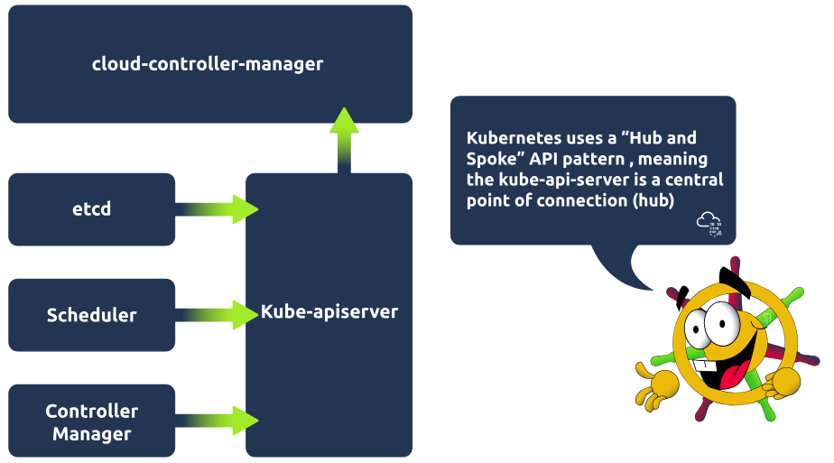
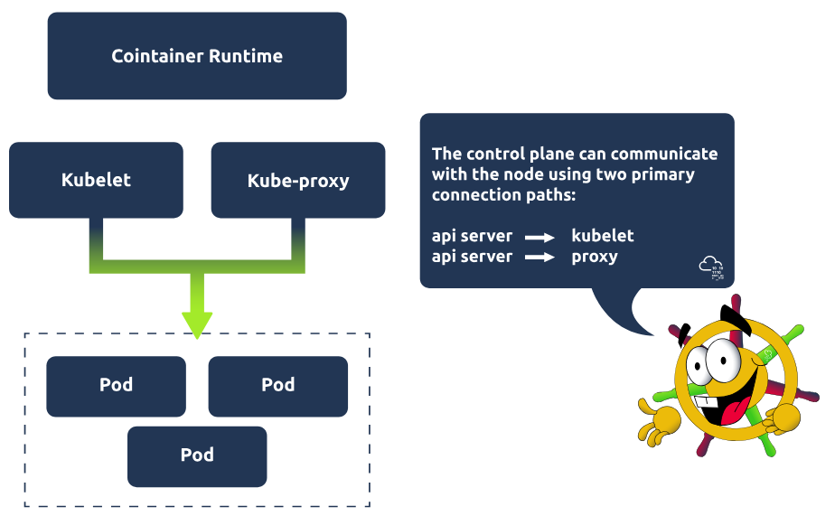
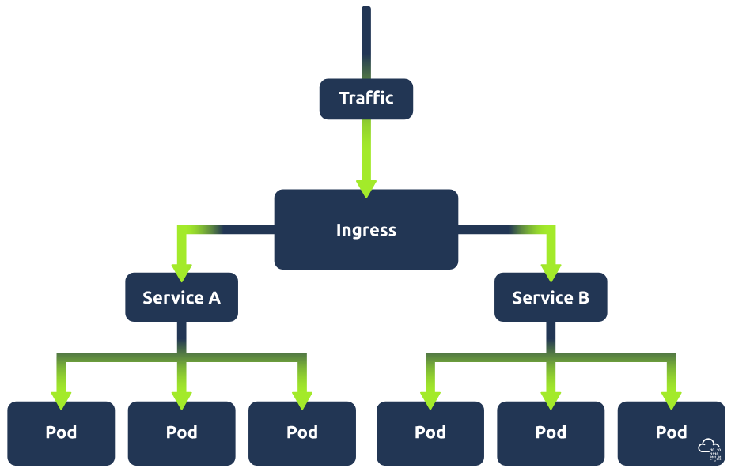

# Kubernetes 简介

## 任务 1 简介

Kubernetes，Kubernetes，Kubernetes。 这个词在 DevSecOps 领域非常流行。 当然，还有它所代表的技术。 本房间将告诉你为什么会这样。 我们将通过带你了解 Kubernetes 基础知识，加上一点安全的 K8s 实践，以及一点动手经验来收尾，把这个似乎人人都非常喜爱的神秘词汇变成一个熟悉的术语。 为了开始揭开这个谜团，让你不再思考“'Keights'到底是什么？”。 Kubernetes 有时被称为 K8s（一个数字缩写）——在这个行业里，任何能节省时间的东西都好！

### 学习先决条件

本房间将继续 DevSecOps 路径，因此所有之前的 DevSecOps 模块都应完成，特别是本模块之前的两个房间（容器化简介和 Docker 简介）应已完成。

### 学习目标

- 理解为什么需要像 Kubernetes 这样的系统
- 理解基本的 Kubernetes 架构
- 理解 Kubernetes 环境的关键组件
- 理解如何使用 kubectl 遍历 Kubernetes 集群
- 理解 DevSecOps 工程师如何使用 Kubernetes 以及最佳的 K8s 安全实践

:::info 回答以下问题

<details>

<summary> 我们开始吧！ </summary>

```plaintext
No answer needed
```

</details>

:::

## 任务 2 Kubernetes 101

### 新的黎明

为了更好地理解 Kubernetes，让我们首先考虑它出现的背景。 换句话说，为什么一开始需要它？ 在过去，公司更常见的是采用单体架构。 也就是说，应用程序是作为一个单一单元构建的，一个单一的代码库，通常是一个单一的可执行文件，作为单一组件部署。 这对许多公司来说有效，并且现在仍然有效；然而，一些公司开始转向微服务架构，因此不是拥有一个单体应用程序，而是将其分解为不同的组件，每个组件通常具有不同的业务功能，这意味着高需求的业务功能可以在不扩展整个应用程序的情况下进行扩展。 一个著名的例子发生在 2009 年（甚至在微服务有名字之前），当时 Netflix 的单一架构无法满足其增长的需求，因此开始采用微服务架构。

微服务架构现在是一种越来越流行的方法，而这对今天的课程如此重要的原因是，容器技术为这些微服务提供了完美的宿主。 由于微服务架构通常包含数百甚至数千个这样的容器，因此需要一种技术来帮助管理和组织它们——猜猜哪种技术来救援，没有奖励。

### 进入 Kubernetes

让我们从大问题开始，好吗？ 什么是 Kubernetes？ 在本模块之前的房间中，我们讨论了容器和 Docker，所以让我们以此作为起点。 想象你有一个 Docker 容器，它运行一个可以从外部访问的应用程序。 突然，这个应用程序开始接收大量流量，因此需要启动一个新的包含此应用程序的容器，以便流量可以在两者之间分配。 这就是 Kubernetes 作为容器编排系统介入的地方。 “编排”这个词让人联想到一个真正的管弦乐队的形象。 这个比喻确实有一定的道理，容器就像乐器，而 Kubernetes 就像控制流程的指挥。 只是这将是一个非常奇怪的管弦乐队，指挥告诉演奏者在不再需要他们演奏歌曲时离开，并在需要时带来新的演奏者。

### Kubernetes 的诸多好处

既然我们已经确定了 Kubernetes 是什么以及为什么需要它，让我们看看这项技术如何使 DevSecOps 领域受益。

- Kubernetes 使应用程序具有高可用性和可扩展性。 它通过例如复制一个应用程序（及其数据库组件）并将外部请求负载均衡到该应用程序的可用资源来实现这一点，从而从架构中移除单点故障并移除可能减慢应用程序响应时间的瓶颈。 如前所述，可扩展性是许多公司的一大关注点；Kubernetes 允许工作负载根据需求进行扩展或缩减。
- Kubernetes 还具有高度可移植性，因为它可以在几乎任何类型的基础设施上运行，并且可以用于单云或多云设置，使其成为一个非常灵活的工具。
- Kubernetes 的另一个好处是它的流行性；因此，许多技术与其兼容，可以用来使每个工具更强大。

这些只是 Kubernetes 使 DevSecOps 领域受益的几种方式，这也解释了为什么这个词被如此频繁地提及！

:::info 回答以下问题

<details>

<summary> Kubernetes 的哪个好处意味着它可以在任何类型的基础设施上运行？ </summary>

```plaintext
highly portable
```

</details>

<details>

<summary> 填空 "Kubernetes 是一个 _________ _____________ 系统"。 </summary>

```plaintext
container orchestration
```

</details>

:::

## 任务 3 Kubernetes 架构

### 集群架构

好的，我们已经了解了 Kubernetes 是什么，为什么需要它，以及它如何在 DevSecOps 中使我们受益。 现在，是时候通过深入了解并分析它如何实现其功能来加深我们的理解了。 没错！ 是架构时间了！ 我们将逐一介绍构成 Kubernetes 架构的每个关键组件，然后在最后将它们全部整合在一起，展示所有这些组件如何连接。 让我们开始吧！

#### Kubernetes Pod

Pod 是 Kubernetes 中你可以创建和管理的最小可部署计算单元。 当你在 DevSecOps 中使用 Kubernetes 工作时，你会经常听到这个词。 你可以将 Pod 视为一个或多个容器的组。 这些容器共享存储和网络资源。 因此，同一 Pod 上的容器可以像在同一台机器上一样轻松通信，同时保持一定程度的隔离。 Pod 在 Kubernetes 中被视为复制单元；如果工作负载需要扩展，你将增加运行的 Pod 数量。


#### Kubernetes 节点

Kubernetes 工作负载（应用程序）在容器内运行，这些容器被放置在 Pod 中。 这些 Pod 在节点上运行。 在讨论节点架构时，需要考虑两种类型。 `控制平面`（也称为“主节点”）和`工作节点`。 这两者都有自己的架构/组件，所以让我们来看看它们。 节点可以是虚拟机或物理机。 这样想：如果应用程序在容器中运行，容器被放置在 Pod 中，那么节点包含运行 Pod 所需的所有服务。

#### Kubernetes 集群

在最高层级，我们有我们的 Kubernetes 集群；简单来说，集群就是一组节点。

### Kubernetes 控制平面

控制平面管理集群中的工作节点和 Pod。 它通过使用各种组件来实现这一点。 看看每个组件以及它们负责什么。 然后在控制平面架构图中看到它们全部整合在一起。

#### Kube-apiserver

API 服务器是控制平面的前端，负责暴露 Kubernetes API。 kube-apiserver 组件是可扩展的，这意味着可以创建多个实例以便对流量进行负载均衡。

#### Etcd

Etcd 是一个键/值存储，包含集群数据/集群的当前状态。 它是高可用且一致的。 如果集群中发生更改，例如启动另一个 pod，这将在键/值存储 etcd 中反映出来。 其他控制平面组件依赖 etcd 作为信息存储，并查询其信息，例如可用资源。

#### Kube-scheduler

kube-scheduler 组件主动监控集群。 它的工作是捕获任何尚未分配到节点的新创建 pod，并确保其被分配到一个节点。 它基于特定标准做出此决定，例如运行应用程序使用的资源或所有工作节点上的可用资源。

#### Kube-controller-manager

此组件负责运行控制器进程。 控制器进程有许多不同类型，但控制器进程的一个示例是节点控制器进程，它负责在节点宕机时发出通知。 然后控制器管理器将与调度器组件通信以调度一个新节点启动。

#### Cloud-controller-manager

此组件支持 Kubernetes 集群与云提供商 API 之间的通信。 此组件的目的是允许分离在集群内部通信的组件与通过交互云提供商在外部通信的组件。 这也允许云提供商按照自己的节奏发布功能。



### Kubernetes 工作节点

工作节点负责维护运行中的 pod。 让我们看一下每个工作节点上存在的组件及其职责：

#### Kubelet

Kubelet 是在集群中每个节点上运行的代理，负责确保容器在 pod 中运行。 Kubelet 被提供 pod 规格，并确保此 pod 规格中详述的容器正在运行且健康！ 它执行控制器管理器给它的操作，例如，启动包含容器的 pod。

#### Kube-proxy

Kube-proxy 负责集群内的网络通信。 它制定网络规则，以便流量可以流动并被定向到 pod（从集群内部或外部）。 流量不会直接命中 pod，而是命中称为 Service 的东西（它将与一组 pod 关联），然后被定向到关联的 pod 之一。 更多关于服务的内容将在下一个任务中介绍！

#### 容器运行时

Pod 内部运行着容器。 必须在每个节点上安装容器运行时才能实现这一点。 到目前为止，我们在此模块中已经涵盖了一个示例，这可能是最受欢迎的选择，Docker。 然而，可以使用一些替代方案，例如 rkt 或 runC。



### 组件之间的通信

好的，我们刚才涵盖了很多内容。 让我们退一步，看看我们刚刚涵盖的所有这些独立组件如何协同工作以构成 Kubernetes 架构。 Kubernetes 集群包含节点，Kubernetes 通过将容器放入在这些节点上运行的 pod 中来运行工作负载。 请看下面的图表，了解所有这些组件如何组合在一起。


:::info 回答以下问题

<details>

<summary> 在 Kubernetes 中，您可以创建的最小可部署计算单元是什么？ </summary>

```plaintext
pod
```

</details>

<details>

<summary> 哪个控制平面组件是包含与集群及其当前状态相关的数据的键/值存储？ </summary>

```plaintext
etcd
```

</details>

<details>

<summary> 哪个工作节点组件负责集群内的网络通信？ </summary>

```plaintext
kube-proxy
```

</details>

:::

## 任务 4 Kubernetes 概览

### 概览

我们刚刚了解了 Kubernetes 架构以及幕后如何工作和设置！ 现在是时候向您展示概览了。 换句话说，作为 DevSecOps 工程师，您每天会与什么交互？ 我们将介绍 Kubernetes 中的一些最常见概念并分解它们是什么。

#### 命名空间

在 Kubernetes 中，命名空间用于在单个集群中隔离资源组。 例如，假设您想要将与特定组件相关的资源分组，或者如果您使用集群托管多个租户，则按租户对资源进行分组。 资源在命名空间内必须具有唯一名称，但相同的资源名称可以在不同的命名空间中使用。

#### ReplicaSet

顾名思义，Kubernetes 中的 ReplicaSet 维护一组副本 pod，并可以保证 x 个相同 pod 的可用性（当工作负载需要在多个 pod 之间分配时，相同的 pod 很有用）。 ReplicaSet 通常不直接定义（pod 也不是），而是由部署管理，这引出了我们的下一个概念。

#### 部署

Kubernetes 中的部署用于定义期望状态。 一旦定义了此期望状态，部署控制器（控制器进程之一）将实际状态更改为期望状态。 部署为 pod 和副本集提供声明式更新。 换句话说，作为用户，您可以定义一个部署，例如 "test-nginx-deployment"。 在定义中，您可以注明希望此部署具有一个包含三个 nginx pod 的 ReplicaSet。 一旦定义了此部署，ReplicaSet 将在后台创建 pod。

#### StatefulSets

要理解 Kubernetes Statefulsets 是什么，您必须首先理解有状态和无状态应用程序之间的区别。 有状态应用程序存储和记录用户数据，允许它们返回到特定状态。 例如，假设您有一个使用电子邮件应用程序的开放会话并阅读了 3 封电子邮件，但您的会话被中断。 在这种情况下，您可以重新加载此应用程序，状态将被保存，确保这 3 封电子邮件仍被标记为已读。 然而，无状态应用程序不了解任何先前的用户交互，因为它不存储用户会话数据。 例如，考虑使用搜索引擎提问。 如果该会话被中断，您将重新开始该过程，通过搜索问题，而不依赖任何先前的会话数据。

对于这些无状态应用程序（搜索引擎示例），可以使用部署来定义和管理 pod 副本。 由于应用程序的无状态性质，可以使用随机的 pod 名称创建副本，并且在移除时，可以随机删除 pod。

然而，对于有状态应用程序（电子邮件示例）情况并非如此，因为有状态应用程序需要访问和更新用户会话的当前状态。 想象此当前状态存储在跨 3 个 pod 运行的数据库中（意味着数据库被复制了 3 次）。 现在，当其中一个数据库被更新时会发生什么？ 这将导致 2 个数据库不同步。 这就是 StatefulSets 的用武之地，也是为什么您会使用它而不是部署来管理 Kubernetes 中的有状态应用程序。

Statefulsets 使有状态应用程序能够在 Kubernetes 上运行，但与部署中的 Pod 不同，它们不能以任意顺序创建，并且每个 Pod 都会有一个唯一的 ID（该 ID 是持久的，意味着如果 Pod 失败，它将被重新启动并保留此 ID）。 换句话说，这些 Pod 是从相同的规范创建的，但不可互换。 StatefulSets 将有一个可以读写数据库的 Pod（因为如果其他 Pod 也可以读写，将会造成绝对的混乱和各种数据不一致），称为主 Pod。 其他 Pod 称为从 Pod，只能读取并拥有自己的存储副本，该副本会持续同步以确保主节点所做的任何更改都得到反映。


#### 服务

要最好地理解 Kubernetes 中的服务，理解它们解决的问题非常重要。 Kubernetes Pod 是短暂的，意味着它们的生命周期很短，并且会定期启动和销毁。 现在想象需要连接到这些 Pod。 这可能来自集群内部；也许一个后端应用程序正在这些 Pod 中运行，而一个前端应用程序需要访问它们，或者请求来自浏览器，而这些 Pod 正在运行一个 Web 应用程序。 为了实现此连接，需要 IP 地址。 如果 IP 地址绑定到 Pod，那么这些 IP 地址会频繁更改，导致各种问题；使用服务是为了可以将单个静态 IP 地址与 Pod 及其副本关联。 换句话说，一个服务被放置在这些 Pod 前面并暴露它们，充当访问点。 拥有这个单一的访问点允许在 Pod 副本之间进行负载均衡请求。 您可以定义不同类型的服务：ClusterIP、LoadBalancer、NodePort 和 ExternalName。 要了解更多关于这些类型和服务的详细信息，请查看[这里](https://kubernetes.io/docs/concepts/services-networking/service/#publishing-services-service-types)。


#### Ingress

在上一节关于 Kubernetes 服务的部分中，我们提到了一个应用程序示例，可以通过使用服务来暴露运行此应用程序的 Pod（我们称之为服务 A）来使其可访问。 现在想象这个 Web 应用程序有一个新功能。 这个新功能需要自己的应用程序，因此有自己的一组 Pod，这些 Pod 由一个单独的服务暴露（我们称之为服务 B）。 现在，假设用户请求访问 Web 应用程序的这个新功能；需要某种流量路由来确保此请求被定向到服务 B。这就是 ingress 的作用。 Ingress 充当集群的单一访问点，意味着所有路由规则都在一个资源中。



### K8s 中的 DevOps 与 DevSecOps

本任务向您展示了 Kubernetes 中协同工作以构成集群的一些资源。 接下来，我们将讨论如何与此集群交互以创建这些组件，但在我们这样做之前，这是讨论 K8s 世界中分工的好时机。 理解 DevOps 和 DevSecOps 职责之间的区别非常重要，尤其是在为特定职业道路学习时。 在非常高的层面上，您可以将 DevOps 任务视为与构建集群相关的任务，而 DevSecOps 任务视为与保护集群相关的任务。 当然，根据公司架构或企业设置会有一些重叠，但通常这些任务可以定义为其中之一。 由于本房间作为介绍，它首先向您展示 Kubernetes 集群的构建块以及如何与这些资源交互（DevOps 任务）。 由于这些知识是基础性的，理解这些概念将帮助您在后续任务中讨论保护集群（DevSecOps 任务）。 话虽如此，如前所述，这种区别很重要，特别是对于那些追求特定职业道路的人，所以请记住这一点继续前进！

:::info 回答以下问题

<details>

<summary> 哪个 Kubernetes 组件暴露 Pod 并充当访问点？ </summary>

```plaintext
Service
```

</details>

<details>

<summary> 哪个 Kubernetes 组件可以保证 X 个 Pod 的可用性？ </summary>

```plaintext
ReplicaSet
```

</details>

<details>

<summary> 哪个 Kubernetes 组件用于定义期望状态？ </summary>

```plaintext
Deployments
```

</details>

:::

## 任务 5 Kubernetes 配置

### 配置时间

既然我们已经介绍了 Kubernetes 中使用的一些关键组件，让我们结合其中一些，并引导您了解这将如何配置！ 我们将使用的示例是一个控制 ReplicaSet 的部署，该 ReplicaSet 管理由服务暴露的 Pod。


要配置此设置，我们需要两个配置文件，一个用于部署，一个用于服务。 在向您展示每个文件如何工作的示例之前，让我们回顾一下 Kubernetes 配置的一些基础知识，这些知识在这两个文件（以及所有配置文件）中都是一致的。

首先，让我们讨论文件格式。 Kubernetes 配置文件通常用 YAML 编写。 它们也可以使用 JSON 格式互换编写，但根据 Kubernetes 文档，通常认为最佳实践是使用 YAML，因为它易于人类阅读（只需注意缩进！）。

#### 必需字段

接下来，让我们讨论每个 YAML 文件中必须存在的四个字段，分解每个字段需要包含的内容：

**apiVersion**：您将用于创建此对象的 Kubernetes API 版本。 您使用的 API 版本将取决于定义的对象。 可以在此处找到用于哪个对象的 API 版本的速查表。

**kind**：您将创建什么类型的对象（例如 Deployment、Service、StatefulSet）。

**metadata**：这将包含可用于唯一标识对象的数据（包括名称和可选的命名空间）。

**spec**：对象的期望状态（对于部署，这可能是 3 个 nginx Pod）。

#### 配置资源

这些是 Kubernetes YAML 配置文件的基础知识。 让我们考虑这些，现在看看上面提到的两个文件。 我们将首先查看服务配置文件，因为在定义部署和服务时，通常最佳实践是先定义服务，然后再定义它指向的后端部署/副本集（这是因为当 Kubernetes 启动容器时，它会为容器启动时运行的每个服务创建一个环境变量）。 这是我们的 example-service.yaml 文件的样子：

```yaml
apiVersion: v1
kind: Service
metadata:
  name: example-nginx-service
spec:
  selector:
    app: nginx
  ports:
    - protocol: TCP
      port: 8080
      targetPort: 80
  type: ClusterIP
```

让我们分解一下：**apiVersion** 设置为 v1（适用于此简单服务示例的 Kubernetes API 版本），**kind** 设置为 service。 对于 **metadata**，我们只是将此服务命名为 "example-nginx-service"。 **spec** 是更有趣的地方，在 'selector' 下，我们有 'app: nginx'。 这在定义我们的部署配置时将会很重要，**ports** 信息也是如此，因为我们在这里基本上是说："此服务将查找带有 nginx 标签的应用程序，并将目标端口设为 80。 这里需要做一个重要的区分是 'port' 和 'targetPort' 字段。 'targetPort' 是服务将发送请求到的端口，即 Pod 将监听的端口。 'port' 是服务暴露的端口。 最后，'type' 定义为 ClusterIP（之前我们讨论了有多种服务类型，这是其中之一），这是默认的服务类型。 现在让我们看一下部署 YAML 并定义此服务将指向的后端：

```yaml
apiVersion: apps/v1
kind: Deployment
metadata:
  name: example-nginx-deployment
spec:
  replicas: 3
  selector:
    matchLabels:
      app: nginx
  template:
    metadata:
      labels:
        app: nginx
    spec:
      containers:
      - name: nginx
        image: nginx:latest
        ports:
        - containerPort: 80
```

您可能注意到的第一件事是在 'spec' 字段内部，有一个名为 'template' 的嵌套字段，它本身包含一个 'metadata' 和 'spec' 字段。 要理解这一点，请记住本任务开头的图像。 我们正在定义一个控制 ReplicaSet 的部署；在这里，在外部的 'spec' 字段中，我们告诉 Kubernetes 我们在此 ReplicaSet 中需要 3 个副本（相同的 Pod）。 这个模板字段是 Kubernetes 将用于创建这些 Pod 的模板，因此需要自己的 metadata 字段（以便 Pod 可以被识别）和 spec 字段（以便 Kubernetes 知道运行什么镜像以及监听哪个端口）。 请注意，这里定义的端口与服务 YAML 中的端口相同。 这是因为服务的目标端口是 80，需要匹配。 此外，在外部的 'spec' 字段中，您可以看到我们还设置了 'selector' 字段具有 'matchLabels'，这与我们在服务 YAML 的 'selector' 字段中定义的内容相匹配。 这样服务就能映射到正确的 Pod。 通过这两个配置 YAML 文件，我们定义了一个部署，该部署控制一个管理 3 个 Pod 的 ReplicaSet，所有这些 Pod 都暴露给一个服务。 一切都在整合中！

这些配置文件用于定义 Kubernetes 组件的期望状态；Kubernetes 将不断将此期望状态与集群的当前状态进行比较。 使用 etcd（先前任务中提到的控制平面进程之一），Kubernetes 用当前状态填充这些配置文件并进行此比较。 例如，如果我们告诉 Kubernetes 我们希望运行 3 个 nginx Pod，并且它在状态中检测到只有 2 个 Pod 在运行，它将开始采取行动来纠正此问题。

:::info 回答以下问题

<details>

<summary> 在配置文件中，您刚刚声明需要 4 个 nginx Pod。 这是在哪个“必需字段”中声明的？ </summary>

```plaintext
spec
```

</details>

<details>

<summary> 配置文件用于部署。 这是在哪个“必需字段”中声明的？ </summary>

```plaintext
kind
```

</details>

<details>

<summary> 此部署中的 Pod 将通过服务暴露。 在服务配置文件中，目标端口设置为 80。 您应将“containerPort”设置为什么？ </summary>

```plaintext
80
```

</details>

:::

## 任务 6 Kubectl

### Kubectl 来救援

我们刚刚介绍了如何使用 YAML 配置文件定义集群的期望状态，但目前这些仅作为文件存在。 要将这些配置转换为运行进程，我们需要与集群交互。 我们可以通过使用不同方法与控制平面的 apiserver 组件交互来实现：如果使用 Kubernetes 仪表板则使用 UI，如果使用某种脚本或命令行则使用 API，或者使用名为 kubectl 的工具。 本任务重点介绍最后一种方法。 简单来说，kubectl 是 Kubernetes 提供的命令行工具，允许我们与 Kubernetes 集群的控制平面通信，是您 DevSecOps 工具库的重要补充。 本任务将向您展示如何应用先前任务中概述的配置文件，并为您提供此工具的一些基础培训，教您一些基本命令，以便您能像在自家后花园一样轻松浏览 Kubernetes 集群！

#### Kubectl apply

一旦您在 YAML 文件中定义了部署和服务配置，下一步就是应用它们，以便 Kubernetes 可以获取期望配置并将其转换为运行进程。 这是使用 aptly 命名的 apply 命令完成的。 例如，如果应用先前任务中提到的服务 YAML，将如下所示：

`kubectl apply -f example-deployment.yaml`

#### Kubectl get

一旦两个配置都已应用，您将需要检查两者的状态以确保一切按预期运行。 这将使用 Kubectl get 命令完成。 这是一个非常通用的命令，您在使用 Kubernetes 时会经常使用它。 get 命令可用于检查资源的状态。 资源类型将跟在 'get' 之后，然后是 `-n` 或 `--namespace`，后跟命名空间（除非您正在检查集群级资源，如节点）。 例如，要检查部署的状态，您将使用：

`kubectl get pods -n example-namespace`

此命令的输出将如下所示：

```shell title="Terminal"
user@tryhackme$ kubectl get pods -n example-namespace
NAME          READY   STATUS              RESTARTS   AGE
example-pod   1/1     Running             0          2m18s
```

如前所述，此命令可用于检查各种资源，如部署、服务、Pod 和 ReplicaSet。

#### Kubectl describe

此命令可用于显示资源（或一组资源）的详细信息。 这些详细信息有助于故障排除或分析情况。 例如，假设集群中的一个 Pod 开始出错，您希望获取有关该 Pod 的更多信息以尝试确定其崩溃的原因。 您将运行以下命令：

`kubectl describe pod example-pod -n example-namespace`

这将返回有关出错 Pod 的一些详细信息。 例如：

```shell title="Terminal"
user@tryhackme$ kubectl describe pod example-pod -n example-namespace

Name:             example-pod
Namespace:        example-namespace
Priority:         0
Service Account:  default
Node:             minikube/192.168.49.2
Start Time:       Mon, 22 Jan 2024 14:01:14 +0000
Labels:           <none>
Annotations:      <none>
Status:           Running
IP:               10.244.0.21
...
...
```

您可以在此处看到 describe 命令详细信息包含一些“事件”。 这些事件有助于揭示问题所在。 有关此事件的更多详细信息，Kubernetes 从运行 Pod 中的每个容器捕获日志。 这些日志可以使用我们的下一个命令查看。

#### Kubectl logs

假设您想要查看出错 Pod 的应用程序日志。 也许您想要查看围绕事件错误的日志。 为此，我们将使用 kubectl logs 命令。 以下是此命令的使用示例：

`kubectl logs example-pod -n example-namespace`

这些日志不仅可以为故障排除提供有价值的见解，还可以用于安全分析。

#### Kubectl exec

现在，假设日志信息有帮助，但仍有未解答的问题，您希望深入挖掘并访问容器的 shell。 kubectl exec 命令将允许您进入容器并执行此操作！ 如果 Pod 有多个容器，您可以使用 `-c` 或 `--container` 标志指定容器。 此命令为（`-it` 标志以交互模式运行命令，`--` 之后的所有内容将在容器内运行）：

`kubectl exec -it example-pod -n example-namespace -- sh`

从这里，您可以从容器本身运行任何命令。 也许您想为安全分析四处窥探，或运行命令测试容器的连接性。

#### Kubectl port-forward

另一个方便的命令是 kubectl port-forward。 此命令允许您在本地机器和集群中运行的 Pod 之间创建安全隧道。 这在测试应用程序时可能很有用。 假设我们有一个 nginx Web 应用程序在 3 个 Pod 上运行，这些 Pod 通过 Web 应用程序服务暴露。 如果您记得，服务使 Pod 可外部访问。 我们获取用于暴露这些 Pod 的端口，并将其映射到我们的一个本地端口。 例如，将目标端口（服务暴露的端口，在我们的配置示例中为 8080）映射到本地端口 8090，将使此 Web 应用程序可在我们的本地机器上通过 `http://localhost:8090` 访问。 指定的资源是 `resource-type/resource-name`。 这将使用 kubectl port-forward 命令和以下语法完成：

`kubectl port-forward service/example-service 8090:8080`

当然，还有许多其他 kubectl 命令可用于浏览和与 Kubernetes 集群交互，但涵盖的这些命令为您提供了坚实的基础，您可以使用仅这些命令执行一些日常 DevSecOps 任务。 您将有机会在任务 8 的本房间实践练习中演示这些命令。

现在完成这些问题：如果您想...，什么命令将跟在 'kubectl' 之后？

:::info 回答以下问题

<details>

<summary> ...通过收集有关 Pod 的一些详细信息来对其进行故障排除？ </summary>

```plaintext
describe
```

</details>

<details>

<summary> ...访问容器的 shell？ </summary>

```plaintext
exec
```

</details>

<details>

<summary> ...检查运行中的 pod 状态？ </summary>

```plaintext
get
```

</details>

<details>

<summary> ...将定义的配置（YAML 文件）转换为运行中的进程？ </summary>

```plaintext
apply
```

</details>

:::

## 任务 7 Kubernetes 和 DevSecOps

好的，到目前为止，你已经相当熟悉 Kubernetes 了；它正在从熟人变成朋友。 你已经学习了这个工具的方方面面，很快就有机会进行动手演示，但在那之前，让我们看看作为 DevSecOps 工程师，你将如何具体使用这个工具。 毕竟，这很可能就是你在这里的原因！

### Kubernetes 和安全

在我们深入探讨 DevSecOps 工程师在 Kubernetes 集群中的职责之前，让我们从安全角度考虑 Kubernetes，以提供一些背景信息。 相对而言，Kubernetes 是新生事物。 也就是说，它是一项新兴技术。 它虽然新兴但非常流行，许多公司都在采用 Kubernetes，尤其是年轻的科技公司和初创公司。

将任何工具引入系统都被视为增加了安全风险，因为新工具意味着进入该系统的新潜在途径。 在处理像 Kubernetes 这样的工具时，这些风险会被放大，因为你有一个可以相互通信的 pod 网络。 默认设置允许任何 pod 与另一个 pod 通信。 这意味着需要考虑各种安全因素。 作为 DevSecOps 工程师，确保这些通道安全是你的责任。

### Kubernetes 加固

容器加固是 DevSecOps 工程师保护这些通道的一种方式，我们将在本模块稍后的[容器加固](https://tryhackme.com/room/containerhardening)房间中深入探讨。 这是使用容器扫描工具检测集群中存在的 CVE 并修复它们以确保最低安全漏洞风险的过程。

Kubernetes 加固正是如此，通过遵循作为 DevSecOps 工程师应执行的最佳容器安全实践来强化你的集群，从而确保这些通道的安全。 各种公司和政府机构已经定义了这些最佳实践；让我们逐一探讨可以加强容器安全的领域以及如何实现。

#### 保护你的 Pod

让我们从几种保护 pod 本身的方法开始。 一些 pod 安全最佳实践包括：

- 运行应用程序的容器不应具有 root 权限
- 容器应具有不可变文件系统，这意味着它们不能被更改或添加（根据容器的用途，这可能无法实现）
- 应经常扫描容器镜像以查找漏洞或错误配置
- 应阻止特权容器
- [Pod 安全标准](https://kubernetes.io/docs/concepts/security/pod-security-standards/) 和 [Pod 安全准入](https://kubernetes.io/docs/concepts/security/pod-security-admission/)

#### 网络加固和分离

在本任务的介绍中，有一件事尤其被标记为重大安全风险：通信。 这种通信通过网络进行，作为 DevSecOps 工程师，你的工作是确保这种通信的安全。 这可以通过以下最佳实践来实现：

- 在隔离网络中使用防火墙和基于角色的访问控制来限制对控制平面节点的访问
- 控制平面组件应使用传输层安全（TLS）证书进行通信
- 应创建显式拒绝策略
- 凭据和敏感信息不应以纯文本形式存储在配置文件中。 相反，它们应该被加密并存储在 Kubernetes 密钥中

#### 优化使用身份验证和授权

如果我们不讨论身份验证和授权，那就不算是一堂安全课！ Kubernetes 也不例外。 以下是一些最佳实践，可以帮助确保你有效利用 Kubernetes 身份验证和授权功能：

- 应禁用匿名访问
- 应使用强用户身份验证
- 应为使用集群的各种团队和所使用的服务账户创建 RBAC 策略

#### 保持警惕

如果你不知道 Kubernetes 集群中发生了什么，你就无法安心地认为你的 Kubernetes 集群是安全的。 以下是一些日志记录最佳实践，以确保你确切知道集群中发生了什么，并能在威胁出现时检测到它们：

- 应启用审计日志记录
- 应实施日志监控和警报系统

#### 安全永不停歇

这绝不是对不眠生活方式的认可；事实上，DevSecOps 工程师确实需要睡觉！ 实现安全是一回事，保持安全是另一回事。 以下是一些最佳实践，以确保你的集群保持安全港湾：

- 应快速应用安全补丁和更新
- 应定期进行漏洞扫描和渗透测试
- 应移除集群中任何过时的组件

### Kubernetes 安全最佳实践实践

以上信息告诉我们，有**很多**方法可以加固 Kubernetes 基础设施。 事实上，有这么多方法，以至于分解每个实践会使这个房间变成一本自出版的电子书。 距离动手操作 Kubernetes 仅一步之遥，让我们通过分解其中三个来结束这个任务。

#### RBAC

Kubernetes 中的 RBAC（基于角色的访问控制）根据定义的角色和权限来规范对 Kubernetes 集群及其资源的访问。 这些权限（创建/删除 x 资源的权限等） 被分配给用户、组或服务账户。 RBAC 是确保集群中的资源只能由**需要**访问它的人访问的好方法。 RBAC 可以使用 YAML 文件（与定义资源相同）进行配置，其中可以通过声明资源类型和动词来定义特定规则。 动词是被限制的操作，例如“创建”和“获取”。

#### 密钥管理

Kubernetes 密钥是一种用于存储敏感信息（如凭据、OAuth 令牌或 SSH 密钥）的对象。 密钥是确保敏感数据不被泄露并允许更好地控制这些信息使用方式的好方法。 密钥默认以 base64 编码字符串形式存储，未加密。 为了安全起见，最好配置静态加密。 在 Kubernetes 集群中促进安全密钥管理的另一种方法是使用 RBAC 配置对密钥的最小权限访问。

#### PSA（Pod 安全准入）和 PSS（Pod 安全标准）

Pod 安全标准用于在命名空间或集群级别定义 3 个级别（特权、基线和受限）的安全策略。 这些级别的含义：

- 特权：这是一个几乎不受限制的策略（允许已知的特权升级）
- 基线：这是一个限制最小的策略，将阻止已知的特权升级（允许部署具有默认配置的 pod）
- 受限：此严格受限策略遵循当前的Pod加固最佳实践

Pod安全准入（使用Pod安全准入控制器）通过拦截API服务器请求并应用这些策略来强制执行这些Pod安全标准。

**注意**：以前，PSA和PSS的角色是使用PSP（Pod安全策略）实现的；然而，从Kubernetes v1.25开始，这些已被移除。 只是为了避免您在课外进行Kubernetes安全学习时遇到PSP而产生任何困惑！

如您所见，加固Kubernetes集群涉及很多内容，足以让DevSecOps工程师忙碌不已。 这些是Kubernetes加固中涉及的一些最佳实践。 DevSecOps工程师在遵循这些实践并利用自动化安全检查等技术的同时，可以确保其Kubernetes环境免受网络威胁。

:::info 回答以下问题

<details>

<summary> 哪种最佳容器安全实践用于规范对Kubernetes集群及其资源的访问？ </summary>

```plaintext
RBAC
```

</details>

<details>

<summary> 什么用于在3个级别定义安全策略？ </summary>

```plaintext
Pod Security Standards
```

</details>

<details>

<summary> 什么强制执行这些策略？ </summary>

```plaintext
Pod Security Admission
```

</details>

<details>

<summary> 哪种Kubernetes对象可用于存储敏感信息，因此应安全管理？ </summary>

```plaintext
Secret
```

</details>

:::

## 任务8 动手实践Kubernetes

### 入门

按下此任务右上角的绿色“启动机器”按钮。 机器将在分屏视图中启动。 如果未显示，您可以按下页面右上角的蓝色“显示分屏视图”按钮。

### 第一阶段：探索

好的，我们开始吧？ 我们首先要做的是启动我们的Minikube集群。 您可以通过在终端中运行以下命令来实现（集群需要几分钟才能启动）：

`minikube start`

一旦集群启动，您就可以开始了！ 本引导式演练将带您了解此集群，巩固房间中教授的知识。 话虽如此，您有一个Kubernetes集群可供使用，所以请随意探索集群并尝试您到目前为止学到的不同命令！

我们看看已经在运行什么，好吗？ 我们可以使用以下命令来实现（`-A`表示所有命名空间）

`kubectl get pods -A`

运行此命令后，您应该看到一些正在运行的Pod。 这些是首次启动Kubernetes集群时存在的默认Pod（您可能认识其中一些名称，因为它们代表了一些控制平面和工作节点进程）。 激动人心！ 但我们通过添加一个部署和服务来让它更激动人心怎么样？ 在虚拟机上，您将能够在此处找到一些配置YAML文件：

`~/Desktop/configuration`

这里有两个我们感兴趣的配置YAML：`nginx-deployment.yaml`和`nginx-service.yaml`。 使用cat命令查看这些配置文件：

`cat filename`

让我们分解一下我们在每个文件中看到的内容：

#### nginx-deployment.yaml

这是一个相对简单的部署；我们可以看到期望状态被定义为一个单副本Pod，其中将有一个运行nginx镜像的容器。 从其他行中，我们可以确定此Pod将用于运行某种Web应用程序。

#### nginx-service.yaml

这同样是一个简单的nginx NodePort服务定义。 眼尖的您可能已经注意到'selector: -> app: '字段与部署中定义的app标签匹配，并且'targetPort'与部署中概述的'containerPort'匹配。 此服务暴露了在Pod中运行的Web应用程序，该Pod由部署控制。 要应用这些YAML文件中概述的配置，我们使用kubectl apply命令。 记住先应用服务文件！ 像这样：

`kubectl apply -f nginx-service.yaml`

`kubectl apply -f nginx-deployment.yaml`

使用以下命令验证副本Pod正在运行（不提供任何命名空间标志将获取默认命名空间中的所有Pod，我们的Pod应该在那里）：

`kubectl get pods -A`

您现在应该看到一个名称中包含'nginx-deployment'的Pod！ 我们的部署已启动！ 我们的部署已启动！

### 第二阶段：交互

好的，现在我们有一个Web应用程序在Pod中运行，该Pod正由一个服务暴露。 如果您还记得nginx-service.yaml，该服务使用目标端口80（容器暴露的端口）连接到Web应用程序。 然而，服务本身的端口设置为8080。 我们想要访问此服务。 我们将使用kubectl port-forward命令来实现，该命令允许我们将本地主机上的端口转发到Kubernetes服务端口（8080）。 以下是完整的命令：

`kubectl port-forward service/nginx-service 8090:8080`

运行此命令后，打开Web浏览器（Firefox）并在以下地址访问Web应用程序：

`http://localhost:8090/`

看起来像一个简单的登录终端，但它需要凭据。 我们为什么不看看集群上是否有任何Kubernetes密钥可以帮助我们登录终端？ 打开另一个终端窗口（以便前一个窗口继续端口转发）并运行以下命令以查看是否有任何密钥（在默认命名空间中）：

`kubectl get secrets`

啊，有一个！ "terminal-creds"听起来我们找到了赢家！ 使用kubectl describe命令，我们可以获取此密钥的更多详细信息以查看此处存储的内容：

`kubectl describe secret terminal-creds`

在描述中，我们可以看到存储了两条"数据"：用户名和密码。 虽然Kubernetes密钥默认以明文存储且未加密，但它们是base64编码的，因此我们通过管道传递此命令并对输出进行base64解码以获取明文。 要访问此数据，我们可以使用以下命令：

要获取用户名，运行：

`kubectl get secret terminal-creds -o jsonpath='{.data.username}'| base64 --decode`

要获取密码，运行：

`kubectl get secret terminal-creds -o jsonpath='{.data.password}'| base64 --decode`

使用这些凭据访问登录终端。 答对了！ 我们进来了，您已获取了标志！

**额外任务**：对于足够好奇的人，您可以使用另一种方法获取此标志。 这将需要您进行一些Kubernetes调查，但第一个线索在于nginx-deployment.yaml！

### 第三阶段：安全

我们能够使用存储在Kubernetes secret中的凭据访问终端，这很好，但作为DevSecOps工程师，这正是我们应该警铃大作的地方。 是时候开始进行一些Kubernetes secret管理了。 由于这些凭据是敏感信息，我们希望限制对存储它们的Kubernetes secret的访问。 我们可以通过配置RBAC（基于角色的访问控制）来实现这一点。

首先，让我们决定我们希望谁能够访问这个secret。 您的DevSecOps经理建议您将访问权限限制给一个服务账户，这本质上是一个pod可以承担的身份，用于与Kubernetes API/集群交互。 通过这样做，我们甚至可以设置成将来我们的日常终端任务可以由pod中的应用程序运行。 让我们使用kubectl create serviceaccount（可以缩写为'sa'）命令创建两个服务账户：'terminal-user'用于非管理员终端活动（不应有secret访问权限）和'terminal-admin'用于管理员终端活动（应有secret访问权限）。 运行以下两个命令来创建这些服务账户：

`kubectl create sa terminal-user`

`kubectl create sa terminal-admin`

创建了这些服务账户后，是时候限制对'terminal-creds' secret的访问，以便只有'terminal-admin'服务账户可以访问它。 我们将通过定义和应用两个配置来实现这一点。 首先，一个定义角色及其能做什么（获取'terminal-creds' secret）的Role YAML。 然后，一个将我们定义的角色绑定到'terminal-admin'服务账户的Role Binding YAML。 导航到以下目录并cat这两个YAML文件以检查它们是如何定义的：

`~/Desktop/configuration/rbac`

#### role.yaml

在这里，您可以看到我们定义了一个名为"secret-admin"的角色。 在rules部分，我们定义了这个角色能做什么。 我们定义了资源（secrets）、受限制的操作动词（我们限制了'get'动词，但您可以限制其他动词），最后是我们secret的名称（terminal-creds）。

#### role-binding.yaml

在这个YAML中，我们将'terminal-admin'服务账户（在'subjects'部分）与上面定义的'secret-admin'角色（在roleRef部分）绑定。

现在让我们以与应用deployment和service相同的方式应用这些配置（使用kubectl apply）：

`kubectl apply -f role.yaml`

`kubectl apply -f role-binding.yaml`

您现在已为此Kubernetes secret配置了RBAC！ 剩下的唯一事情是测试我们的RBAC是否正常工作。 我们可以使用kubectl auth命令来做到这一点，它会告诉我们一个服务账户是否有足够的权限执行特定操作。 让我们首先验证普通的'terminal-user'服务账户无法访问secret：

`kubectl auth can-i get secret/terminal-creds --as=system:serviceaccount:default:terminal-user`

看起来如我们所料。 这个"no"响应确认了此服务账户不再能访问terminal-creds secret。 现在，最后，让我们验证我们的'terminal-admin'服务账户可以访问它：

`kubectl auth can-i get secret/terminal-creds --as=system:serviceaccount:default:terminal-admin`

通过这个"yes"输出，您已确认RBAC已就位，并履行了作为DevSecOps工程师的职责，加固了集群，并在强化此集群方面迈出了良好的第一步。 希望您喜欢这次Kubernetes集群的小小巡游并了解了基础知识。 下次再见！

:::info 回答以下问题

<details>

<summary> 您能掌握Kubernetes基础知识并获取标志吗？ </summary>

```plaintext
THM{k8s_k3nno1ssarus}
```

</details>

<details>

<summary> RoleBinding使用了什么apiVersion？ </summary>

```plaintext
rbac.authorization.k8s.io/v1
```

</details>

:::
