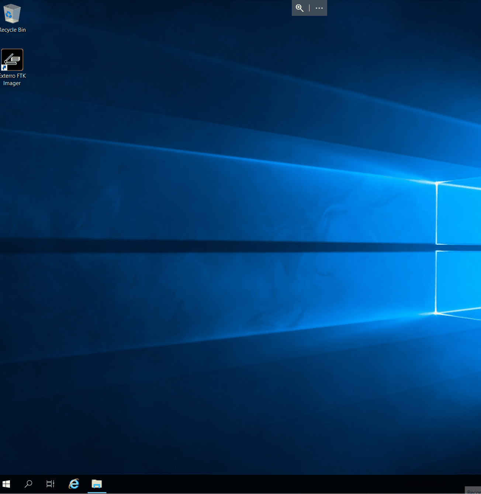

# 内存获取

## 任务 1 介绍

在分析内存之前，您必须先获取它。 这涉及将易失性内存的内容复制到非易失性存储中（《内存取证的艺术》）。 内存分析的有效性取决于内存获取过程的质量——准确捕获内存与解释它同样重要。 在本房间中，我们将讨论在内存获取之前、期间和之后需要考虑的所有变量。 这些变量包括工具、时机、格式、环境等。 然后，您将继续在Windows、Linux和Hypervisor上有效创建符合取证要求的内存映像。

### 学习目标

- Create a forensically sound memory image on Windows
- Create a forensically sound memory image on Linux
- Create a forensically sound memory image on a hypervisor
- Create a forensically sound memory image in a cloud environment
- Understand and apply best practices during the process of acquisition

### 房间先决条件

- [Memory Analysis Introduction](https://tryhackme.com/room/memoryanalysisintroduction)
- [Windows Fundamentals](https://tryhackme.com/module/windows-fundamentals)
- [Linux基础](https://tryhackme.com/module/linux-fundamentals)

:::info 回答以下问题

<details>

<summary> Are you ready to capture memory? </summary>

```plaintext
No answer needed
```

</details>

:::

## Task 2 Techniques, Tools and, Best Practices

The memory acquisition process does not start when you capture an image of the RAM and transfer it to a non-volatile storage. It starts well before that as a sequence of well-defined choices you have outlined in your incident response plan. This outline should detail decisions on:

- Which acquisition techniques to use
- Which tools to use
- Timing
- What part of the memory to focus on
- Ensuring integrity

This task will cover each of these essential considerations.

### Selecting the Right Memory Part

Before you acquire memory on a system, you must decide what part of the memory is of forensic value. This is decided on a case-to-case basis and will be affected by the IOAs and IOCs you observed. Consider the following examples:

- **Unusual resource usage**: You notice that a common process has been using an unusual amount of CPU and memory. You decide to take an image of the processes (also known as a process dump). In this case, a full memory dump would take too long and include too much forensic noise, impeding analysis.

- **Malware infection**: You discovered a malware-infected host and found evidence in the firewall logs that the host has an active C2 connection. You decide to take a full memory capture to aid your investigation.

- **System shut down**: You detected signs of fraud on an employee’s system. To avoid tipping off the employee, you decide to take a memory capture during the lunch pause. The system in question is powered off. Luckily, due to configured policies, the system went into hibernation instead, and you can acquire the `hiberfil.sys` file for analysis.

In the table below, you can find an overview of the type of memory dumps you can take, their content, and use cases. Note that the `pagefile`, `Hibernation File`, and `VM Memory file` are not direct memory dumps. They are files that exist on a disk after performing a certain type of action. The pagefile is filled up with the memory of processes that are suspended or were recently terminated; the hibernation file is created as a result of the host system being put in hibernation mode, and the VM memory file is created when the VM its state is saved or snapshotted.

| 类型                                                          | Captures                                                                                                           | 用例                                                                                                                                                                    |
| :---------------------------------------------------------- | :----------------------------------------------------------------------------------------------------------------- | :-------------------------------------------------------------------------------------------------------------------------------------------------------------------- |
| **Full Memory Dump**                                        | Entire physical memory (RAM)                                                                    | Full forensic analysis, malware behavior, valuable for CTI as well                                                                                                    |
| **Process Dump / Core Dump**                                | Memory of a single process (heap, stack, code, modules)                                         | Detect malware injection, behavior analysis                                                                                                                           |
| **Memory Region Dump**                                      | Specific region of a process (e.g., stack, heap, injected code) | Focused on extracting malware or shellcode                                                                                                                            |
| **Pagefile/swapfile**                                       | Swapped-out virtual memory ( `pagefile.sys` - `\swapfile`)                                     | Collect memory from recent terminated/suspended processes                                                                                                             |
| **Hibernation File Dump (Only Windows)** | RAM snapshot saved during sleep (`hiberfil.sys`)                                                | Full memory capture from hibernated systems (e.g., laptops). Use when live memory is not available |
| **VM Memory Dump**                                          | Volatile memory of a virtual machine                                                                               | Safe malware testing, replayable incident analysis                                                                                                                    |

In the next tasks, you will perform multiple of these types of captures on Windows and Linux.

### Choosing the Appropriate File Format

There is no standard format when it comes to memory images. So, you must choose a format compatible with the tool you will use for analysis. The memory dump format will largely depend on the platform you target and the tool you use. Below, we list the most common formats.

- `.raw` and `.mem`: This format is a raw physical memory dump supported on most Operating Systems like macOS, Windows, and Linux. It is also the preferred format for ensuring compatibility with most analysis tools
- `.dmp`: This is the Windows built-in format for a memory dump. Windows includes multiple types of `.dmp` files, which in most cases, need to be configured first. You will explore this in the task ‘Memory acquisition for Windows’
- VM formats (`.vmem`, `.vmsn`, `.vmss`, `.bin`, `.sav`): These files represent the memory state of a Virtual Machine after taking a snapshot or suspending it in a hypervisor like VMware, Hyper-V, or VirtualBox. Note that you need to convert the `.sav`  file to be usable in analysis
- `.core`: This is a process-level memory dump formatted in ELF in Linux using the `gcore` tool. This type of file is also created when a process crashes
- Expert Witness Format: This format is generated using the Encase tool, which is an industry-standard for advanced forensic analysis
- `.lime`: This memory capture file is a structured full memory dump created with the LiME (Linux Memory Extractor) tool

### Choosing the Acquisition Technique

There are multiple ways you can acquire memory on a system. Depending on your use case, you will choose one over the other. Let’s have a look at which methods you can use.

- **Local**: You take an external storage device, plug it into the target machine, and then run the tools to acquire the memory. This method requires physical access to the target system
- **Remote**: You run the tools to acquire the memory and then transfer the memory capture over the network. This method is ideal for when you have to target machines that are not easily accessed in person, such as physical servers without any keyboard or monitor attached or systems in another location than your primary work location
- **Hardware**: You have installed a dedicated PCIe card that allows you to acquire memory without accessing the OS
- **RAM freezing**: RAM is volatile, and the content disappears in mere seconds after cutting the power. A technique involves freezing the RAM, which allows the RAM content to be retained for a longer time. Depending on the freezing method, this would allow you enough time to move the RAM modules to another system with a dedicated OS that enables a memory dump of the RAM modules

#### Important considerations

- You need administrator privileges to be able to acquire a complete memory dump
- When transferring the acquired memory remotely, there is always a risk that the receiving system gets compromised as well. This can be due to the nature of the malware or the attacker taking the opportunity to move laterally
- When using local storage, there is also a possibility that the storage gets compromised. Use a disposable system to do the initial analysis
- A hardware card is a costly option for memory acquisition. Ensure the cost matches the importance of the system

### Tools

Selecting the right tool for the right job is a key factor in determining the quality of the memory capture. No tool fits all use cases, so it is important to consider the available options carefully. You should consider the following factors:

- Integrity
- Compatibility
- Speed and scalability
- Compliance
- Cost
- Forensic noise introduced

Below are some of the most commonly used tools.

| Commercial tools                                                         | Free tools         |
| :----------------------------------------------------------------------- | :----------------- |
| EnCase Forensic                                                          | FTK Imager         |
| CaptureGUARD (PCIe & ExpressCard) | Magnet RAM Capture |
| F-Response                                                               | DumpIt             |
| Cellebrite UFED                                                          | WinPmem/LinuxPmem  |
| PCILeech                                                                 | LiMe               |

### Timing Your Memory Capture

Timing is of utmost importance when taking a memory capture. The content of the RAM is continuously changing, meaning a memory capture only contains the content of that moment in time. Proper timing allows you to maximize the success of capturing valuable forensic evidence. The following scenarios demonstrate the importance of timing:

- **Lateral movement**:  You identified a host likely used as an entry point for lateral movement. You decide to monitor it, and when you notice suspicious activity, you immediately take a memory capture, resulting in actionable forensic evidence like remote sessions running, compromised user credentials, and much more.
- **Fileless malware**: You detected a common process on a system that shows irregular behavior. You decide to take a memory capture to analyze it. Because of your quick decision, you found a malicious PowerShell script, active C2 IP addresses, and the attacker’s next-stage payloads.
- **Evidence destruction**: You notice the strange behavior of a user on his system. The user has copied sensitive documents to his local system. You send a message to the user to ask about this behavior. The user suddenly appears offline, so you check his system in person. When you arrive at the user’s desk, you notice that the user’s system is just booting up again. The user said something weird was happening with his system, so he rebooted it. Unfortunately, you lost the opportunity to gather potential evidence of exfiltration.

#### Other considerations

- Attackers are often active during certain hours and will try to remove evidence when discovered and run their malware completely in memory
- Try to avoid taking a capture during periods when the memory is changing fast, such as during bootup, virus scans, backups, and more

Conclusion

YYou have discovered the essential considerations you need to consider when acquiring memory. These consideration actually form the memory acquisition process. In the following tasks, when acquiring memory, you will repeatedly need to make decisions based on them.
You will need to provide an answer to:

- **What part** of the memory do I need to acquire?
- **Which tool** and/or technique will I use to acquire the memory?
- **When** will I capture the memory?
- How will I ensure **integrity**?


:::info 回答以下问题

<details>

<summary> What is the file name that contains the memory of a hibernated Windows system? The answer is in the format: filename.extension </summary>

```plaintext
hiberfil.sys
```

</details>

<details>

<summary> Which tool can you use to obtain a process memory dump on a linux host? </summary>

```plaintext
gcore
```

</details>

:::

## Task 3 Memory Acquisition on Windows

### 简介

Acquiring memory on a Windows host is straightforward. You can apply the steps listed in the previous task: what, when, tools, and integrity. During this task, you will focus on acquiring the following memory dumps during regular business hours:

- Full memory capture with the `FTK imager` tool
- Process memory dump with the `procdump.exe` tool that is part of the `SysinternalsSuite`
- Configure Windows to generate a small memory dump when the system crashes

The formatting of the memory dumps should be compatible with the memory analysis tool you will use later on. For this task and the next ones, you need to ensure compatibility with  `volatility`. The choice for `volatility` is simple. It is a free tool with many great features, and it can process multiple formats of memory dumps, including:

- Raw/Padded Physical Memory
- Firewire (IEEE 1394)
- Expert Witness (EWF)
- 32- and 64-bit Windows Crash Dump
- 32- and 64-bit Windows Hibernation
- 32- and 64-bit MachO files
- Virtualbox Core Dumps
- VMware Saved State (.vmss) and Snapshot (.vmsn)
- HPAK Format (FastDump)
- LiME (Linux Memory Extractor)
- QEMU VM memory dumps

After each memory capture, you need to generate an MD5 hash of the memory capture to **ensure integrity**. Integrity is critical throughout the memory forensics process. Multiple parties will likely analyze the memory capture, which can introduce unwanted changes contaminating its forensic value. Therefore, you should always create a copy of the memory capture and use that for analysis. You can use a hash to ensure the copy is identical to the original.

### Full Memory Capture

Go to the VM, navigate to the desktop, and double-click the FTK imager icon to start the FTK imager tool.

Now follow these steps to take a memory capture:

- Click File => Capture Memory
- Enter the destination path to save the memory capture. Ideally, this should be an external storage device with enough disk space to accommodate the memory capture. For this exercise, give in the path `C:\Users\administrator\Documents\Full Memory Capture`
- Give the capture file a fitting name. Ideally, you use the name pattern defined in the memory process outline in your IR playbook. For this exercise, you can use the `Hostname_Date.mem` format as the filename:  `FS-ANALYSIS_07April2025.mem`
- Choose whether to include the page file or not. **Note: The page file can be large, depending on your system configuration**
- Click on `Capture Memory`


Once the process is complete, you need to ensure the integrity of the captured file:

- Open a PowerShell window as Administrator
- Give in the command `Get-FileHash` with the required parameters as shown in the terminal below. Depending on which algorithm you select, it can take a few minutes before the hash is generated. Your memory process outline should also define which hashing algorithm to use
- Note down the hash value. Where to note it should be described in your memory process outline. `Note: The calculated hash values of this example and yours will be different, which is expected as the memory content continuously changes`

```shell title="Full Memory Capture - Hash"
PS C:\Users\Administrator\Documents> Get-FileHash -Path 'C:\Users\Administrator\Documents\Full Memory Capture\FS-ANALYSIS-07April2025.mem' -Algorithm MD5 

Algorithm Hash Path

MD5 42CD44244B8ED77CCF89ECAA6C3F957A C:\Users\Administrator\Documents\Full Memory Capture\FS-ANALYSIS-07April2025.mem
```

### Process Memory Dump

Continuing with the VM, open a new PowerShell terminal with administrator privileges and navigate to the path `C:\TMP\SysinternalsSuite\`.

The SysInternals suite contains a tool called `procdump64.exe`, which you can use to dump the memory contents of a selected process. You can do this either manually or based on a **trigger** like high CPU usage.

You will focus on manually dumping the `lsass.exe` process. This process manages authentication, tokens, credentials, and more. Threat actors often target the `lsass.exe` process using **Mimikatz**. Enter the following command to dump the content of the `lsass.exe` process:

```shell title="Process Dump"
PS C:\TMP\SysinternalsSuite> .\procdump64.exe -ma lsass.exe C:\TMP -accepteula

ProcDump v11.0 - Sysinternals process dump utility

Copyright (C) 2009-2022 Mark Russinovich and Andrew Richards

Sysinternals - www.sysinternals.com

[13:45:44] Dump 1 initiated: C:\TMP\lsass.exe_250408_134544.dmp

[13:45:44] Dump 1 writing: Estimated dump file size is 47 MB.

[13:45:44] Dump 1 complete: 47 MB written in 0.5 seconds

[13:45:45] Dump count reached.
```

Have a closer look at the options included in the command:

- `-ma` : This flag sets the type of dump to contain the process’s full memory content. The default option is a minidump (`-mm`), which only contains basic information about the process. The minidump is useful for crashes but not for malware analysis or extracting credentials. There are other flags available as well. Use the `.\procdump.exe -h` command to display them
- `lsass.exe` : This is the process you will dump the memory of
- `C:\TMP` : The memory dump is saved in this directory

The default name for the file dump is `PROCESSNAME_YYMMDD_HHMMSS.dmp`. You can leave this as is for this exercise. Usually, you would adjust the name to match what is in your memory outline in the IR playbook.

Now that you have created a memory dump of the `lsass.exe` process, you need to ensure its integrity. Enter the following command to calculate an MD5 hash of the memory capture. Adjust the filename to reflect your memory capture.

```shell title="Calculate Hash"
PS C:\TMP\SysinternalsSuite>  Get-FileHash -Path 'C:\TMP\lsass.exe_250408_082640.dmp' -Algorithm MD5
Algorithm Hash Path       
MD5 9DF3963A62B01D3151CB6B824C8DE6D1 C:\TMP\lsass.exe_250408_082640.dmp
```

### Crash Dump

Windows includes configuration options for what should happen when it crashes. These options determine whether to take a memory dump, which type to take, where to save it, and whether to overwrite the existing memory dump.

From a forensic perspective, a memory dump from a system crash is also usable information. For example, a malicious process could cause your system to crash. Follow the steps below to configure a memory dump after system failure.

- Right-click the Windows logo in the taskbar and click `run`
- Enter `sysdm.cpl` to open the `System Properties` control panel item
- Navigate to the `Advanced` tab and click `Settings...` under the `Startup and Recovery` section
- Configure the memory dump in the `System failure` - `Write debugging information` section. Which dump to choose will depend on your use case.



:::info 回答以下问题

<details>

<summary> Start notepad.exe on the VM and use the procdump64.exe tool to write a 'triage' dump file of the process. Ensure that the dump file's name is formatted like PROCESSNAME_PID_YYMMDD_HHMMSS.dmp. Enter the complete command below. Note: Use PowerShell so to syntax is correct. No need to include the `-accepteula` flag </summary>

```plaintext
.\procdump64.exe -mt notepad.exe PROCESSNAME_PID_YYMMDD_HHMMSS.dmp
```

</details>

<details>

<summary> Which two tools can you use to extract or dump memory artifacts of the lsass.exe process? Enter the answers in alphabetic order and separated by a comma. For example: volatility,procmon.exe </summary>

```plaintext
mimikatz,procdump64.exe
```

</details>

<details>

<summary> Before moving on to the next task, power off the VM. </summary>

```plaintext
No answer needed
```

</details>

:::

## Task 4 Memory Acquisition on Linux

### 简介

Acquiring memory on a Linux host is a straightforward process. You need to decide on the same steps as on a Windows host.

During this task, you will focus on the following memory captures during business hours:

- Full memory capture with the `LiME` tool
- Process memory dump with the `gcore` tool that is part of the `GNU Debugger`
- Configure Ubuntu to generate a memory dump when the system crashes

Like the previous task, you need to ensure compatibility with `volatility`. After each memory capture, you need to generate an MD5 hash of the memory capture to ensure integrity.

### Full Memory Capture

In this task, you will use the `LiME` tool to take a full memory capture. This tool isn't included by default on most Linux systems. Since the VM has no internet access, **we've pre-installed the tool for you**. If you're trying this on your machine, here's how you would install it manually:

```shell title="Install LiME"
ubuntu@tryhackme:~$
# first install necessary dependencies
sudo apt update
sudo apt install -y git build-essential linux-headers-$(uname -r)
# Clone the LiME repository
git clone https://github.com/504ensicsLabs/LiME.git
cd LiME/src
# compile LiME for use in kernel
make
```

Continuing with the VM, open a terminal window and enter the following command to take a full memory capture:

```shell title="Take Memory Dump"
ubuntu@tryhackme:~$ cd LiME/src
ubuntu@tryhackme:~/LiME/src$ sudo insmod lime-6.8.0-1027-aws.ko "path=/tmp/ubuntu-150000-22042025.lime format=lime"
```

Let's take a closer look at the options included in the command:

- `sudo insmod lime-6.8.0-1027-aws.ko`: The `insmod` command loads the LiME tool (`lime.ko`) in the kernel. This is necessary so LiME can do a full memory capture
- `path=/tmp/ubuntu-150000-22042025.lime`: This is the directory where the memory dump is saved and the memory dump its name. The naming template used is `HOSTNAME-HHMMSS-DDMMYYYY.lime` . You can alter the name to fit your requirements
- `format=lime`: This command sets the memory dump's format to `.lime`. Ensure this is compatible with your memory analysis tools

If you want to change any of the above parameters or include additional parameters you can reference the help page on [the official GitHub](https://github.com/504ensicsLabs/LiME) of the LiME tool.

Once the process is complete, you need to ensure the integrity of the captured file and **unload the LiME tool**:

- Enter the command `md5sum` with the required parameters as shown in the terminal below. Depending on which algorithm you select, it can take a few minutes before the hash is generated. Your memory process outline should also define which hashing algorithm to use
- Note down the hash value. Where to note it should be described in your memory process outline. **Note: The calculated hash values of this example and yours will differ, which is expected as the memory content continuously changes**
- Finish by entering the `sudo rmmod lime` command to unload LiME from the kernel. **Note: Each time you want to capture the memory, you must first run this command to unload any previous LiME modules**

```shell title="MD5 Hash"
ubuntu@tryhackme:~/LiME/src$ md5sum tmp/ubuntu-150000-22042025.lime
0ef7140f0c0cabd6c4ef76c708f2324f  /tmp/ubuntu-150000-22042025.lime

ubuntu@tryhackme:~/LiME/src$ sudo rmmod lime
```

### Process Memory dump

Continuing with the VM, open a new terminal and enter the following commands to dump the memory of the `bash` process:

```shell title="Process Dump with gcore"
ubuntu@tryhackme:~$ ps aux |grep bash # Search the PID number of the bash process
ubuntu      6506  0.0  0.2   5892  4096 pts/0    Ss   Apr11   0:00 bash
ubuntu     34136  0.0  0.1   3528  1792 pts/0    S+   13:57   0:00 grep --color=auto bash

ubuntu@tryhackme:~$ sudo gcore -o /tmp/BASH-130000-10042025 6506 # Dump the memory of the bash process using gcore
```

Now that you have created a memory dump of the `bash` process, you need to ensure its integrity. Enter the following command to calculate an MD5 hash of the memory capture. Adjust the filename to reflect your memory capture.

```shell title="Process Dump with gcore"
ubuntu@tryhackme:~$ md5sum /tmp/BASH-130000-10042025.6506 
b1baa84b8f1e725f1a45795465ba710c  /tmp/BASH-130000-10042025.6506
```

### Crash dump

Similar to Windows you can configure Linux to do a memory dump when a process or the kernel crashes. The configuration is however not as straightforward as Windows. It will depend on the host its type of distribution and kernel.

#### Kernel crash dump

As stated in the **Official documentation** of Ubuntu, the kernel crash dump is enabled by default starting from Ubuntu version 24.10. The VM in this task has Ubuntu version 24.04, so you must enable the kernel crash dump yourself. Due to the limited connectivity of the VM, **we have done the configuration ourselves**. We entered the following commands and added explanatory comments (with # delimiter) to the terminal window below:

```shell title="Enable kdump"
ubuntu@tryhackme:~$ 
# check status kernel crash dump utility
ubuntu@tryhackme:~$ cat /proc/cmdline # This command verifies if the kernel crash dump is enabled or not. If a line similar to 'crashkernel=384M-2G:64M,2G-:128M' is present, it is enabled. You don't need to execute the following commands in this case.

# Install kdump (This is the kernel crash dump utitlity)
ubuntu@tryhackme:~$ sudo apt install kdump-tools -y

# Reboot to enable the kdump tool
ubuntu@tryhackme:~$ sudo -reboot

# Verify if the kdump tool is running
ubuntu@tryhackme:~$ sudo kdump-config show # You can enter this command yourself on the VM
DUMP_MODE: kdump
USE_KDUMP: 1 # 1 means that kdump is in use
KDUMP_COREDIR: /var/crash
crashkernel addr: 0x69000000
/var/lib/kdump/vmlinuz: symbolic link to /boot/vmlinuz-6.8.0-1027-aws
kdump initrd:
/var/lib/kdump/initrd.img: symbolic link to /var/lib/kdump/initrd.img-6.8.0-1027-aws
current state: ready to kdump # kdump is able to dump
crashkernel suggested size: 371M
kexec command:
/sbin/kexec -p --command-line="BOOT_IMAGE=/boot/vmlinuz-6.8.0-1027-aws root=PARTUUID=da63a61e-01 ro console=tty1 console=ttyS0 nvme_core.io_timeout=4294967295 panic=-1 reset_devices systemd.unit=kdump-tools-dump.service nr_cpus=1 irqpoll usbcore.nousb" --initrd=/var/lib/kdump/initrd.img /var/lib/kdump/vmlinuz
```

#### Process crash dump

On most Linux distributions, process crash dumps are disabled by default. There are different ways to enable automated or partial crash dumps depending on the Linux flavor.

In this task, you will focus on Ubuntu Desktop, that the VM is running. To cover all processes on Ubuntu Desktop, you need to configure 2 options:

- Crash dump for systemd-managed processes
- Crash dump for interactive sessions and user processes

Start by entering the following commands to configure the crash dump for systemd-managed processes:

```shell title="Process crash dump"
ubuntu@tryhackme:~$ sudo mkdir -p /etc/systemd/system.conf.d
ubuntu@tryhackme:~$ sudo nano /etc/systemd/system.conf.d/core-dumps.conf
# Add the following lines to the core-dumps.conf file and enter CTRL+o to save the file, then exit the editor by entering CTRL+x
[Manager]
DefaultLimitCORE=infinity

# Now reload the systemd service
ubuntu@tryhackme:~$ sudo systemctl daemon-reexec
```

Now, continue configuring the crash dump for the user processes and interactive sessions. The commands below will ensure the configuration persists. Enter the following commands:

```shell title="Process crash dump"
# Enable process dumps
ubuntu@tryhackme:~$ ulimit -c unlimited

# Open the config file
ubuntu@tryhackme:~$ sudo nano /etc/sysctl.d/60-core-pattern.conf

#Add the following lines to set naming template
kernel.core_pattern = /var/crash/core.%e.%p.%t
fs.suid_dumpable = 1

# Create the /var/crash folder and assign permissions if it does not exist yet
ubuntu@tryhackme:~$ sudo mkdir -p /var/crash
ubuntu@tryhackme:~$ sudo chmod 1777 /var/crash
```

The above approach works for both Ubuntu Desktop and Server editions.

Ubuntu Desktop also comes enabled with a crash dump utility named `apport`. This service catches core dumps from crashing processes, decides whether to act on it, and then creates a `.crash file` which includes:

- Stack trace
- Process info
- Loaded libraries
- Partial memory content, not the full core dump

The crash files are saved in the `/var/crash` directory.

:::info 回答以下问题

<details>

<summary> Modify the following command to ensure the memory dump is in the .raw format and is accessible over TCP port 5555: `sudo insmod lime-6.8.0-1027-aws.ko "path=/tmp/memdump.lime format=lime"` </summary>

```plaintext
sudo insmod lime-6.8.0-1027-aws.ko "path=tcp:5555 format=raw"
```

</details>

<details>

<summary> LiME includes a parameter to create a hash immediately after capturing the memory. Modify the following command and ensure a MD5 hash is calculated: `sudo insmod lime-6.8.0-1027-aws.ko "path=/tmp/memdump.lime format=lime"` </summary>

```plaintext
sudo insmod lime-6.8.0-1027-aws.ko "path=/tmp/memdump.lime format=lime digest=md5"
```

</details>

:::

## Task 5 Memory Acquisition on Virtual Machines and Cloud Environments

Similar to the two previous tasks, you must make some decisions regarding the memory acquisition process. For this task, you will focus on getting a memory dump from hypervisors and cloud platforms during regular business hours.
You will then choose the right tool or method for the right job. There are two ways to acquire memory from hypervisors and cloud platforms:

- Login into the VM and use the techniques seen in the previous tasks
- Use the built-in tools of the hypervisor or cloud platform to extract memory without interacting directly with the VM. This can be done via the GUI or the command line

In this task, you will focus on number two where possible. You will learn the methods to acquire a memory dump on the most common hypervisors and cloud platforms, including:

- Microsoft Hyper-V
- VMware vSphere
- VirtualBox
- KVM
- Cloud platforms

You will focus on providing a memory dump that is compatible with `volatility`.

### Acquiring a Memory Dump on hypervisors

The method for acquiring a memory dump from a hosted VM is similar for each flavor of hypervisor.

**First**, you need to take a snapshot or pause the VM. **Then**, you can take a copy of the memory state file that each hypervisor creates when snapshotting or pausing a VM. Depending on the flavor of hypervisor you will need to convert the memory state file to be compatible with `volatility`.

**Note: There are alternative methods to acquire memory. This task will focus on using the built-in tools and/or utilities when available.**

#### Microsoft Hyper-V

Acquiring memory on a Hyper-V hosted VM can be done with the native functions of Hyper-V. You can choose to use either the GUI or the PowerShell command line. The terminal below shows the process using PowerShell. The steps for GUI and PowerShell are virtually the same:

- Save the VM or take a checkpoint via the GUI or PowerShell cmdlet ( `Checkpoint-VM` or `Save-VM` )
- Navigate to where the snapshots are stored and copy the `.vmrs` file, which contains the RAM content
- Calculate the hash to ensure integrity when analyzing the memory dump later on
- Use the `volatility windows.hyperv` plugin to process the file

```shell title="Memory dump Hyper-v"
PS C:\Users\administrator> get-vm | FT VMId, VMName

VMId VMName
c5f1b464-ffea-4904-bc7b-974c74b10159 Ubuntu 22.04 LTS<
PS C:\Users\administrator> get-vm -Id c5f1b464-ffea-4904-bc7b-974c74b10159 | Checkpoint-VM
PS C:\Users\administrator> Get-VMSnapshot -VMName 'Ubuntu 22.04 LTS' |FT Id,Name,Path
PS C:\Users\administrator> cp C:\ProgramData\Microsoft\Windows\Hyper-V\Snapshots\97DBBAE5-3F91-4E5E-B177-FBB970E8703E.VMRS C:\temp\hostname-17-04-2025.VMRS
PS C:\Users\administrator> Get-FileHash -Algorithm MD5 -Path C:\temp\hostname-17-04-2025.VMRS
Algorithm Hash Path
MD5           E1BA77075C7C832CC96E43DB8E8F98E8   C:\temp\hostname-17-04-2025.VMRS
```

#### vSphere

In `vSphere`,you can use the built-in tools (vCenter server + vSphere client) to take a snapshot of the VM. You can use either the GUI or the ESXCLI tool. The steps to acquire the memory are similar:

- Take a snapshot of the VM
- Navigate to the datastore where the VM is located and copy the `.vmsn file`
- Calculate a hash to ensure integrity
- `volatility` supports the processing of `.vmsn files`, so you don't need to convert them


#### KVM

The easiest way to acquire a memory dump of a VM hosted on KVM is to use the command line utility. The steps are similar to other hypervisors:

- First, find the name of the VM. Use the `virsh list` command to list all VMs
- Then, dump the memory of the VM by entering `virsh dump vmname /path/to/dupm.raw --memory-only`
- Lastly, create a hash of the memory dump file `md5sum memdump.raw`

#### VirtualBox

The recommended way to acquire the memory of a VM hosted on VirtualBox is by using the `VBoxManage` tool. On a Windows installation, you can find this command line utility in the installation path of Virtualbox E.g. `C:\Program Files\Oracle\VirtualBox` . Follow the next steps to take a memory dump of the VM:

- List the VMs running and find the name of the VM
- Take a dump with the `debugvm` command
- Calculate a hash to ensure the integrity of the file later down the analysis process
- `Volatility` supports the processing of `.elf files` , so you don't need to convert them

```shell title="Memory Dump"
PS C:\Program Files\Oracle\VirtualBox> .\VBoxManage.exe list runningvms
"Kali_purple" {9a969c90-7ab0-4b9b-893d-48c70fa42ee5}
PS C:\Program Files\Oracle\VirtualBox> .\VBoxManage.exe debugvm "Kali_purple" dumpvmcore --filename C:\temp\kali_memdump.elf
PS C:\Program Files\Oracle\VirtualBox> Get-FileHash -Algorithm MD5 -Path C:\temp\kali_memdump.elf
Algorithm Hash Path
MD5             1833B5B07C8E43A6E011919934AFB049           C:\temp\kali_memdump.elf
```

### Acquiring a Memory Dump on Cloud Platforms

Unlike hypervisors, the process of acquiring a memory dump from a VM hosted on a cloud platform like Azure or AWS is not straightforward. Neither platform comes with a built-in tool to accommodate taking a memory dump. In this case, you won't be able to avoid interacting with the VM directly. One of the main reasons why Cloud providers don't offer this tooling is due to the shared nature of the hardware resources.

The recommended way to acquire memory dumps from a VM hosted on a cloud platform is to follow the steps specific to each OS that we discussed in tasks three and four.

There is, however, an alternate method that is used in some scenarios. This method involves the following steps:

- Configure a full memory crash dump on the host
- Trigger a manual crash via the cloud platform
- Detach the disk where the crash dump was saved
- Connect the disk as a read-only data disk to an analysis VM hosted within the same, or different tenant.
- Extra step: Export the disk so it can be used in a different tenant

#### Special Mention for Azure

Microsoft released a tool named Acquire Volatile Memory for Linux (AVML) to make the process of acquiring volatile memory on VMs hosted on Azure. One of the main advantages of this tool is that it does not require any installation or kernel loading. It can just be run as a stand-alone binary. **Note: The tool is only intended to acquire memory on Linux distributions.**

### Conclusion

In this task you learned how to capture memory on a Windows host, a Linux host, a VM hosted on a hypervisor,and a VM hosted on a hypervisor or cloud platform. You noted multiple ways to get a memory dump, either via the GUI or a command-line utility. Last, you observed was that cloud platforms don't offer any built-in tools to take a memory dump without interacting with the VM.

Taking a memory dump isn't exactly rocket science, but there are some things mentioned in the previous tasks to take into account:

- Timing
- Make sure you have administrator rights on the target host
- Use a tool that fits your needs
- Define a proper naming convention for the memory dumps
- Ensure integrity by hashing
- Take note of the filename and its hash so you can refer to it later
- Ensure all the above are part of your process outline in the IR playbook

:::info 回答以下问题

<details>

<summary> What is the name of the command line utility you use to take a memory dump on the VirtualBox hypervisor? Use the format filename.extension for answering. </summary>

```plaintext
vboxmanage.exe
```

</details>

<details>

<summary> Which command do you use to create a snapshot in Hyper-V? </summary>

```plaintext
CheckPoint-VM
```

</details>

:::

## Task 6 Challenges with Memory Acquisition

Memory acquisition does come with some challenges. Take the following difficulties into account before starting the process of memory acquisition:

- **Anti-forensic techniques**: An attacker can employ anti-forensic techniques to impede proper memory acquisition. E.g., encrypting memory content, interfering with acquisition tools, and more
- **Timing**: It is essential to get the timing right when acquiring memory. As mentioned in task two, memory is volatile, and its content is continuously changing. Keep an eye on the Indicators of Attack and Compromise to choose the right timing
- **(Physical) Accessibility**: To do a memory capture, you need to have access to the system, locally or remotely. Sometimes, servers are in data centers that are not accessible without proper verification. Ensure that the correct people have the correct access rights
- **No admin rights**: To do a full memory capture, you must have administrator rights. This can be on the host level, domain level, or resource group in the cloud platform
- **Lack of an Information Security Management System (ISMS)**: Before even thinking of forensics, you must have a proper ISMS in place. An important part of an ISMS that lists essential information required for memory acquisition is **Asset Management**. It helps you know each asset's:
  - Details (Hostname, IP, OS, users, physical location)
  - Criticality
  - Operating hours
  - Baseline configuration
  - Baseline behavior
  - And more
- **No transparent incident response process**: Failing to take all of the topics in task two into account will impede you in doing proper memory acquisition. Ensure to include the memory acquisition process in your incident response plan

:::info 回答以下问题

<details>

<summary> What process describes keeping track of all hosts and their information? </summary>

```plaintext
Asset Management
```

</details>

<details>

<summary> A threat actor shuts down the target system after successfully exfiltrating data. What term can we use to categorize this action? </summary>

```plaintext
anti-forensic techniques
```

</details>

:::

## 任务 7 结论

As you have discovered, completing all the tasks in this room, there is more than meets the eye to acquiring a forensically sound memory dump. You learned that there are multiple things you need to take into account before taking a memory dump:

- What part of the memory to capture
- When to capture the memory
- How to capture the memory

You learned how to take various memory dumps from Ubuntu, Windows, hypervisors, and cloud platforms. You ended the room with an overview of the various challenges of memory acquisition.

Now that you know how to acquire memory, the next step is analyzing it. Continue with the next room in this module to find out how to analyze a memory dump using tools like `volatility`.

:::info 回答以下问题

<details>

<summary> Ready to apply your new skills? </summary>

```plaintext
No answer needed
```

</details>

:::
