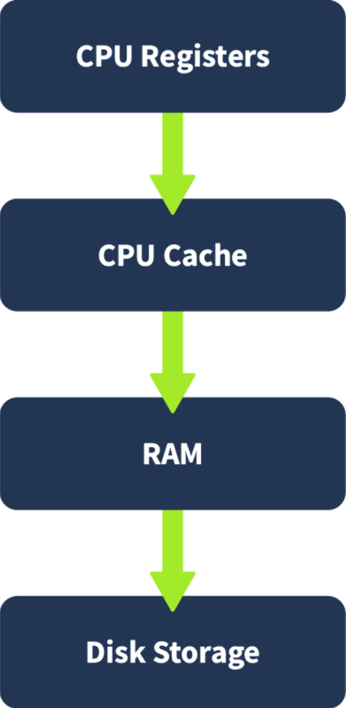

# Memory Analysis Introduction

## Task 1 Introduction

In this room, we will explore how memory analysis supports cyber security investigations, especially from a blue team perspective. We'll learn how data in RAM can reveal active threats, user activity, and artifacts that are lost after shutdown.

We'll start with the basics of volatile memory and how it compares to disk forensics. Then, we'll look at how memory dumps are created and used, what signs of attacks can appear in memory, and when this type of analysis is most useful.

Later in the room, an interactive section will help us visualize memory structure and forensic evidence. By the end, we’ll understand how and when to apply memory analysis during real-world investigations.

### Learning Objectives

- Understand the role and importance of memory analysis in cyber security investigations.
- Identify the structure and behavior of volatile memory, including memory hierarchy and RAM layout.
- Explain what memory dumps are, how they are created, and the challenges in acquiring them.
- Recognize common attack fingerprints in memory based on real-world techniques.

### Prerequisites

- [DFIR Introduction](https://tryhackme.com/room/introductoryroomdfirmodule)
- [Windows Internals](https://tryhackme.com/room/windowsinternals)
- [Linux Fundamentals](https://tryhackme.com/module/linux-fundamentals)

:::info Answer the questions below

<details>

<summary> Click to continue. </summary>

```plaintext
No answer needed
```

</details>

:::

## Task 2 Volatile Memory

### Volatile Memory

In this room, we begin by understanding volatile memory and why it plays a key role during investigations or, in general, in Digital Forensics. Volatile memory refers to stored data that holds system and user-level data while the computer runs. When the system is powered off or restarted, this data is lost. A common spot for this type of memory is the RAM (Random Access Memory)
RAM temporarily stores everything from open files and running processes to encrypted data. Since this data only exists while the system is active, investigators often prioritize capturing RAM as early as possible during an investigation.

### Memory Hierarchy

Computers store and access information using a hierarchy of memory, each level offering a trade-off between speed and capacity. Starting from the fastest to the slowest, the order is:



CPU registers and cache are extremely fast but limited in size. RAM is the main working memory for the operating system and active programs. Disk storage, while much slower, is used for long-term data retention.

The concept of Virtual Memory, on the other hand, is a virtual memory space. When a program runs, the operating system assigns it virtual memory addresses that are mapped to physical RAM or, if needed, to disk-based swap space. **Swap** is a reserved area on the disk that the operating system uses to store data from RAM when physical memory is full temporarily. This allows the system to handle more active processes than RAM alone can support. This allows processes to run as if they have dedicated memory while the system manages where the actual data resides. The OS continuously shifts data between RAM and disk depending on system load and priority.

The above impacts memory analysis because some forensic artifacts may reside in RAM while others may be temporarily stored in swap files.

### RAM Structure

RAM is usually the memory on which investigations will focus. It is divided into two broad areas: **kernel space** and **user space** .

- **Kernel space** is reserved for the operating system and low-level services. It manages resources like device drivers and memory access.
- **User space** contains processes launched by the user or applications. Each process gets its own separate space, protected from others.

Within a user process, memory is typically structured into several regions:

- **Stack** : Stores temporary data like function arguments and return addresses. It grows and shrinks as functions are called and returned.
- **Heap** : Used for dynamic memory allocation during runtime, such as objects and buffers created by programs.
- **Executable** (.text): Stores the actual code or instructions the CPU runs.
- **Data sections**: Space to store global variables and other data the executable needs.

Understanding this structure is important in identifying where forensic artifacts might be located. For instance, encryption keys are often found on the heap, while shell commands may be on the stack.


### RAM for Forensic Analysts

The analysis of RAM offers a snapshot of what a system is doing at a particular moment. This includes:

- Running processes and loaded executables
- Open network connections and ports
- Logged-in users and recent commands
- Decrypted content, including encryption keys
- Injected code or fileless malware

Since all this information disappears once the system is turned off, memory analysis provides a unique chance to observe the system in action. It often reveals evidence not available in disk forensics, especially for attacks that do not write files to disk.

This makes memory a priority target during incident response, particularly when dealing with live systems, malware investigations, or suspected intrusions.

Memory forensics is often used early in an investigation to capture data that disappears on shutdown. It helps responders collect active processes, network connections, and other live artifacts before losing them.

It is very useful when dealing with in-memory threats, fileless malware, or credential theft. Memory analysis provides a snapshot of system activity that can help during an investigation.

:::info Answer the questions below

<details>

<summary> What type of memory is prioritized because its data disappears after shutdown? </summary>

```plaintext
RAM
```

</details>

<details>

<summary> What is the slowest component in the memory hierarchy? </summary>

```plaintext
disk
```

</details>

<details>

<summary> Which memory region typically contains dynamically allocated data like encryption keys? </summary>

```plaintext
heap
```

</details>

<details>

<summary> What disk-based area temporarily stores RAM data when memory is full? </summary>

```plaintext
swap
```

</details>

:::

## Task 3 Memory Dumps

In this task, we explore what a memory dump is and how it fits into forensic workflows. A memory dump is a snapshot of a system’s RAM at a specific point in time. It captures everything stored in volatile memory, including running processes, active sessions, network activity, and sometimes even sensitive data like credentials.

Memory dumps are widely used for forensic analysis, malware investigations, and threat hunting. Security teams analyze these snapshots to understand what was running on a system and to uncover suspicious or unauthorized activity. Tools like Mimikatz are often used by red teamers and attackers to extract credentials directly from memory, making memory dumps an important defensive focus.

### How Memory Dumps are Created

Creating a memory dump depends on the operating system in use. The goal is to capture RAM content without significantly altering it during acquisition.

On Windows, tools like built-in crash dumps, Sysinternals’ RAMMap, or third-party utilities such as WinPmem and FTK Imager can be used to generate full or selective memory captures. Some methods include kernel mode dumps located at `%SystemRoot%\MEMORY.DMP` and hibernation files stored as `%SystemDrive%\hiberfil.sys`. We can find more about it in the [Analysing Volatile Memory](https://tryhackme.com/room/analysingvolatilememory) room.

On Linux and macOS, analysts can use tools like LiME (Linux Memory Extractor) or dd with access to `/dev/mem` or `/proc/kcore`, depending on kernel protections. These methods will be covered in more detail later in the room.

### Types of Memory Dumps

Memory dumps vary in scope and purpose:

- Full Memory Dump: Captures all RAM, including user and kernel space. Useful for complete forensic investigations and malware analysis.
- Process Dump: Captures the memory of a single running process. Helpful for reverse engineering or isolating malicious behavior within a specific application.
- Pagefile and Swap Analysis: Systems offload some memory content to disk when RAM is full. On Windows, this is stored in pagefile.sys, and on Linux, in the swap partition or swapfile. These can contain fragments of data that were once in RAM, offering additional context.

In some cases, the system’s hibernation file (hiberfil.sys) can also be parsed to extract RAM contents saved when the machine enters hibernation mode. More information can be found in [this article](https://diverto.github.io/2019/11/05/Extracting-Passwords-from-hiberfil-and-memdumps).

### Challenges in Memory Acquisition

Acquiring a clean and reliable memory dump comes with several challenges. Attackers may deploy anti-forensics techniques to tamper with memory capture tools or hide their presence in RAM. Common examples include:

|                           Example                           |                                                                                                           Explain                                                                                                          |
| :---------------------------------------------------------: | :------------------------------------------------------------------------------------------------------------------------------------------------------------------------------------------------------------------------: |
|                  Unlinked or hidden modules                 |                                                  Malware may unlink itself from process lists, making it invisible to tools relying on typical OS queries.                                                 |
| DKOM (Direct Kernel Object Manipulation) |                                                         Alters kernel structures to hide processes, threads, or drivers from standard system tools.                                                        |
|                        Code injection                       | Malicious code is injected into legitimate processes (e.g., explorer.exe, svchost.exe) to blend in and evade detection. |
|                       Memory patching                       |                                                 Malware modifies memory content or system APIs at runtime to disrupt forensic tools or produce false data.                                                 |
|                 Hooking APIs or system calls                |          Intercepts and alters the output of critical functions (e.g., ReadProcessMemory, ZwQuerySystemInformation) to hide malicious behavior.         |
|                 Encrypted or packed payloads                |                                          Payloads are kept encrypted or compressed in memory, only decrypting at execution time, making static analysis difficult.                                         |
|                    Trigger-based payloads                   |                             Some memory-resident malware only unpacks or runs when specific conditions are met, limiting what analysts can capture during routine acquisition.                             |

These methods require analysts to go beyond default tools and use memory carving, kernel-level inspection, and behavior-based techniques to uncover hidden activity.

Encryption and obfuscation techniques are also used to make memory content harder to interpret. Encrypted payloads or compressed code blocks may be stored in memory and only decrypted at runtime, which adds complexity to the analysis.

:::info Answer the questions below

<details>

<summary> What tool is commonly used by attackers to extract credentials from memory? </summary>

```plaintext
Mimikatz
```

</details>

<details>

<summary> What type of memory dump captures all RAM, including user and kernel space? </summary>

```plaintext
full
```

</details>

<details>

<summary> What Linux tool can be used to extract memory for forensic purposes? </summary>

```plaintext
lime
```

</details>

<details>

<summary> Which file on Windows systems stores memory during hibernation? </summary>

```plaintext
hiberfil.sys
```

</details>

<details>

<summary> What anti-forensics technique hides processes by altering kernel structures? </summary>

```plaintext
DKOM
```

</details>

:::

## Task 4 Memory Analysis Attack Fingerprints

### Memory-Based Threat Indicators

Memory analysis is especially powerful for detecting threats that may not leave traces on disk. While logs and file systems offer long-term evidence, memory reveals what is happening right now, making it essential for identifying active or recently executed attacks.

The most common artifacts that analysts look for in memory include:

- Suspicious or malicious processes that are running without a corresponding file on disk.
- DLL injection where malicious code is injected into the memory space of a legitimate process.
- Process hollowing, a technique where the memory of a trusted process is replaced with malicious code.
- API hooking, used to intercept or alter normal function calls to hide activity or manipulate system behavior.
- Rootkits, especially those operating in kernel space, which manipulate memory structures to hide files, processes, or network connections.

These techniques often leave specific memory signatures—such as unusual memory regions, non-matching PE headers, or code execution in writable memory areas—which can be detected with forensic tools.

Next, we will learn about the most common attacks that can be detected while performing a memory analysis.

### Credential Access (MITRE ATT&CK: T1003)

#### T1071 – Application Layer Protocol: Command and Control

Modern malware often communicates with external servers without dropping files. This fileless malware uses memory-resident payloads to fetch commands or exfiltrate data through standard protocols like HTTP, HTTPS, or DNS. In memory, analysts can find decrypted C2 configurations, IP addresses, or beacons that are not logged anywhere else to try to find artifacts.

### In-Memory Script Execution (T1086)

#### T1086 – PowerShell

Scripts executed directly from memory are harder to trace because they don't touch the disk. Attackers use PowerShell or other interpreters (e.g., Python, WMI) to execute code in RAM. Memory analysis may reveal full script contents, encoded commands, or runtime artifacts in the PowerShell process memory.

### Persistence Techniques in Memory

These persistence mechanisms can be identified by spotting related artifacts during a live memory analysis:

#### T1053.005 – Scheduled Task/Job: Scheduled Task

Task Scheduler creates jobs that execute at intervals or startup. During a memory analysis, we can look for processes like schtasks.exe and memory strings that contain task names or malicious payload paths.

#### T1543.003 – Create or Modify System Process: Windows Service

Malicious services may run in the background under services.exe. We may find unusual service names, binaries, or configurations in memory that can relate to this technique.

#### T1547.001 – Registry Run Keys / Startup Folder

Malware adds entries to HKCU\Software\Microsoft\Windows\CurrentVersion\Run to execute on boot. These values can often be recovered from memory or found within registry hives cached in RAM.

### Lateral Movement via Memory Artifacts

Memory forensics can also expose attempts at lateral movement across systems. Common techniques include:

#### T1021.002 – Remote Services: SMB/Windows Admin Shares (PsExec)

PsExec enables command execution on remote systems. Analysts might find PsExec-related services or command-line arguments in memory indicating lateral movement.

#### T1021.006 – Remote Services: Windows Remote Management (WinRM)

WinRM provides PowerShell remoting. Look for wsmprovhost.exe and memory references to remote session initialization.

#### T1059.001 – Command and Scripting Interpreter: PowerShell (Remote)

PowerShell is commonly used for remote command execution. Analysts can detect base64-encoded or obfuscated commands within memory of the PowerShell process.

#### T1047 – Windows Management Instrumentation (WMI)

WMI commands like wmic process call create may be used to spawn remote processes. Associated command strings or class references may be cached in memory.

:::info Answer the questions below

<details>

<summary> What technique involves replacing a trusted process’s memory with malicious code? </summary>

```plaintext
Process hollowing
```

</details>

<details>

<summary> Which Windows service provides PowerShell remoting? </summary>

```plaintext
WinRM
```

</details>

<details>

<summary> What MITRE technique ID is associated with in-memory PowerShell execution? </summary>

```plaintext
T1086
```

</details>

<details>

<summary> What command-line tool enables remote execution and is linked to lateral movement (T1021.002)? </summary>

```plaintext
PsExec
```

</details>

<details>

<summary> Which MITRE technique involves setting tasks that persist through reboots (e.g., schtasks.exe)? </summary>

```plaintext
T1053.005
```

</details>

:::

## Task 5 Practical

Visit the site below, place the term in the proper definition, and get the flag.

ACCESS  [Interactive Exercise](https://static-labs.tryhackme.cloud/apps/memory-analysis-intro/)

:::info Answer the questions below

<details>

<summary> What is the value of the flag? </summary>

```plaintext
THM{m3mory_analyst_g00d_job}
```

</details>

:::

## Task 6 Conclusion

In this room, we learned the importance of memory analysis in digital forensics and how it supports early-stage investigations. We explored what volatile memory is, how RAM stores active data, and why it's prioritized during incident response. We also looked at the structure of memory, and how forensic artifacts like commands, encryption keys, and processes are distributed across different memory regions.

We also covered memory dumps and how they are created, the types available, and the challenges involved in capturing them. Finally, we examined common attack techniques that can be identified through memory analysis, such as credential dumping, DLL injection, script execution, and signs of persistence or lateral movement.

Together, these topics build a strong understanding of how RAM plays a critical role in identifying threats.
