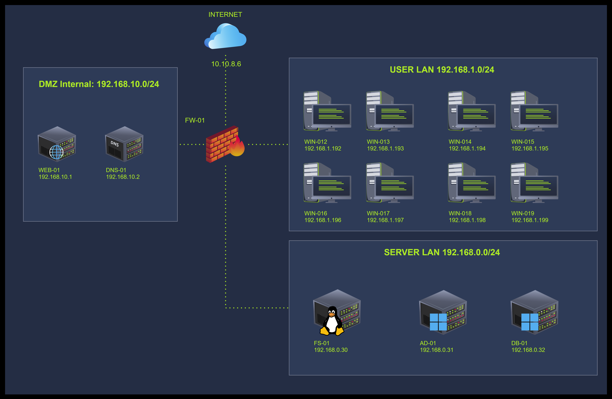

# Windows内存与网络

## 任务 1 介绍

本房间延续了先前分析中的内存调查。 这是3个房间中的最后一个，我们将重点关注网络活动与利用后行为在RAM中的捕获方式。 我们将检查一次涉及高级载荷（如Meterpreter）、可疑子进程以及异常出站连接的实时攻击的痕迹。 所有分析都将使用Volatility 3以及直接应用于内存转储的实践技术来完成。

我们将逐步分析与实际远程Shell、通过滥用启动文件夹实现的持久化以及尝试进行出站通信的恶意软件相关的真实指标。 用户将使用内存结构、插件输出和进程检查来逐步追踪网络行为。

### 学习目标

- 在内存转储中识别网络连接。
- 识别可疑端口和远程端点。
- 将连接关联到进程。
- 在内存转储中检测反向Shell和内存注入。
- 在内存中追踪PowerShell和C2活动。

### 先决条件

- [Volatility](https://tryhackme.com/room/volatility)
- [Yara](https://tryhackme.com/room/yara)
- [Windows内存与进程](https://tryhackme.com/room/windowsmemoryandprocs)
- [Windows内存与用户活动](https://tryhackme.com/room/windowsmemoryanduseractivity)

:::info 回答以下问题

<details>

<summary> 点击继续进入房间。 </summary>

```plaintext
No answer needed
```

</details>

:::

## 任务2场景信息

### 场景

您是处理TryHatMe公司事件的事件响应团队的一员，该公司专门在线销售帽子。 您的任务是分析一个可能被入侵的Windows主机的完整内存转储。 在您之前，另一位分析师已经获取了完整的内存转储，并从TryHatMe的IT支持团队收集了所有必要信息。 由于这是您的第一个案例，您有点紧张，但别担心；一位资深分析师将指导您。

### 事件信息THM-0001

- 2025年5月5日07:30 CET，TryHatMe启动了其事件响应计划，并将事件上报给我们。 经过初步分类，我们的团队发现了一台可能被入侵的Windows主机。 主机的详细信息如下：
  - 主机名：WIN-001
  - 操作系统：Windows 1022H 10.0.19045
- 07:45 CET，我们的分析师Steve Stevenson获取了Windows主机的完整内存转储，并生成了哈希值以确保其完整性。 内存转储的详细信息如下：
  - 名称：`THM-WIN-001_071528_07052025.dmp`
  - MD5哈希：`78535fc49ab54fed57919255709ae650`

### 公司信息TryHatMe

#### 网络拓扑图



:::info 回答以下问题

<details>

<summary>我已阅读案例详情，准备好了解更多信息。 </summary>

```plaintext
No answer needed
```

</details>

:::

## 任务3 环境与设置

在继续之前，请点击右侧的**启动机器**按钮来启动虚拟机。

大约需要2分钟才能正常加载。 虚拟机将在分屏的右侧可访问。 如果看不到虚拟机，请使用页面顶部的蓝色**显示分屏视图**按钮。

任务的详细信息如下：

- 文件名：**THM-WIN-001_071528_07052025.mem**
- 文件MD5哈希值：**78535fc49ab54fed57919255709ae650**
- 文件位置：`/home/ubuntu`

要运行volatility，您可以在虚拟机中使用`vol`命令。 例如：`vol -h`将显示volatility的帮助菜单。

:::info 回答以下问题

<details>

<summary> 如果您能够启动您的环境，请点击此处。 </summary>

```plaintext
No answer needed
```

</details>

:::

## 任务4 分析活动连接

在之前的房间中，我们专注于识别内存中的用户活动。 现在，我们将注意力转向可疑恶意行为者建立的网络连接。 我们将首先在内存中搜索能揭示入侵期间建立了哪些连接以及发生了何种网络活动的痕迹。

### 扫描内存以寻找网络证据

让我们首先使用**Windows.netscan**插件扫描内存转储。 该插件检查内核内存池以寻找**TCP**和**UDP**套接字对象的证据，无论连接是否仍处于活动状态。 在我们调查的进程可能已终止或清理了连接的情况下，这很有用。

为了检查网络连接，volatility定位[EPROCESS](https://learn.microsoft.com/en-us/windows-hardware/drivers/kernel/eprocess#eprocess)结构以提取PID，并将这些PID映射到内存中找到的活动**TCP端点**或**UDP端点**对象（未公开文档）。 即使连接已经关闭，这种方法也有效，使其比在实时系统上使用**netstat**更有用。

在分析连接以寻找可疑流量时，我们应注意以下几点：

- 不寻常的端口活动或对不熟悉地址的出站连接
- 在非标准端口上与外部IP通信
- 持有多个套接字的本地进程
- 与先前识别的可疑二进制文件相关联的PID

让我们寻找上述模式。 我们将首先运行以下命令`vol -f THM-WIN-001_071528_07052025.mem windows.netscan > netscan.txt`，该命令将把输出保存在`netscan.txt`文件中，如下所示。 然后我们可以使用`cat`命令或任何文本查看器来检查它。

**注意**：此命令可能需要一些时间才能完成，具体取决于CPU使用率和内存转储的大小。 如果您不想等待，可以在已存在的文件**netscan-saved.txt**中访问相同的输出。 如果需要，还有一些其他命令已预先保存以节省时间。

```shell title="Example Terminal"
user@tryhackme~$ vol -f THM-WIN-001_071528_07052025.mem windows.netscan >  netscan.txt
user@tryhackme$cat netscan.txt

Offset    Proto    LocalAddr    LocalPort    ForeignAddr    ForeignPort    State    PID    Owner    Created
[REDACTED]
0x990b28ae34c0    UDPv4    169.254.106.169    138    *    0        4    System    2025-05-07 07:08:58.000000 UTC
0x990b28bf3230    TCPv4    169.254.106.169    139    0.0.0.0    0    LISTENING    4    System    2025-05-07 07:08:58.000000 UTC
0x990b28bf3650    TCPv4    0.0.0.0    4443    0.0.0.0    0    LISTENING    10084    windows-update    2025-05-07 07:13:05.000000 UTC
[REDACTED]
0x990b299a81f0    UDPv4    127.0.0.1    1900    *    0        9496    svchost.exe    2025-05-07 07:09:11.000000 UTC
0x990b29ab8010    TCPv4    192.168.1.192    [REDACTED]    192.168.0.30    22    ESTABLISHED    6984    powershell.exe    2025-05-07 07:15:15.000000 UTC
0x990b29ade8a0    TCPv4    192.168.1.192    4443    10.0.0.129    47982    ESTABLISHED    10084    windows-update    2025-05-07 07:13:35.000000 UTC
0x990b2a32ca20    TCPv4    192.168.1.192    [REDACTED]    10.0.0.129    8081    ESTABLISHED    10032    updater.exe    [REDACTED] UTC
0x990b2a630a20    TCPv6    ::1    55986    ::1    445    CLOSED    4    System    2025-05-07 07:14:06.000000 UTC
0x990b2a824770    UDPv6    fe80::185b:1837:f9f7:bffd    49595    *    0        9496    svchost.exe    2025-05-07 07:09:11.000000 UTC
0x990b2a824900    UDPv6    fe80::185b:1837:f9f7:bffd    1900    *    0        9496    svchost.exe    2025-05-07 07:09:11.000000 UTC
0x990b2a824db0    UDPv6    ::1    1900    *    0        9496    svchost.exe    2025-05-07 07:09:11.000000 UTC
[REDACTED]
```

我们可以在上面的输出中观察到，一些连接被标记为**已建立**。 我们可以注意到PID **10032** (**updater.exe**)连接到IP **10.0.0.129的8081端口**。 那是一个外部网络，表明它可能是攻击者的基础设施。 另一个值得关注的连接来自PID **6984** (**powershell.exe**)，连接到**192.168.0.30:22**，表明存在横向移动。 此外，根据之前的分析我们知道，二进制文件windows-update.exe也是我们正在调查的执行链的一部分，并且为了持久化目的被放置在`C:\Users\operator\AppData\Roaming\Microsoft\Windows\StartMenu\Programs\Startup\`目录中。 它正在监听端口**4443**，这样设置是有道理的，因为它似乎是负责监听指令的那个。 现在让我们继续确认这一点，并找出哪些活动监听端口。

```shell title="Example Terminal"
user@tryhackme~$ cat netscan.txt |grep LISTENING
0x990b236b3310    TCPv4    0.0.0.0    445    0.0.0.0    0    LISTENING    4    System    2025-05-07 07:08:50.000000 UTC
[REDACTED]
0x990b27ffee90    TCPv4    0.0.0.0    3389    0.0.0.0    0    LISTENING    364    svchost.exe    2025-05-07 07:08:49.000000 UTC
0x990b27ffee90    TCPv6    ::    3389    ::    0    LISTENING    364    svchost.exe    2025-05-07 07:08:49.000000 UTC
0x990b28bf3230    TCPv4    169.254.106.169    139    0.0.0.0    0    LISTENING    4    System    2025-05-07 07:08:58.000000 UTC
0x990b28bf3650    TCPv4    0.0.0.0    4443    0.0.0.0    0    LISTENING    10084    windows-update    2025-05-07 07:13:05.000000 UTC
0x990b28de7e10    TCPv4    0.0.0.0    49671    0.0.0.0    0    LISTENING    3020    svchost.exe    2025-05-07 07:08:51.000000 UTC
0x990b28de80d0    TCPv4    0.0.0.0    49671    0.0.0.0    0    LISTENING    3020    svchost.exe    2025-05-07 07:08:51.000000 UTC
0x990b28de80d0    TCPv6    ::    49671    ::    0    LISTENING    3020    svchost.exe    2025-05-07 07:08:51.000000 UTC
0x990b28de8390    TCPv4    0.0.0.0    5040    0.0.0.0    0    LISTENING    6124    svchost.exe    2025-05-07 07:08:59.000000 UTC
0x990b28de8910    TCPv4    192.168.1.192    139    0.0.0.0    0    LISTENING    4    System    2025-05-07 07:08:51.000000 UTC
```

我们可以观察到几个系统进程，如**svchost.exe**和**lsass.exe**，正在监听[常见的Windows端口](http://learn.microsoft.com/en-us/troubleshoot/windows-server/networking/service-overview-and-network-port-requirements)。 然而，我们也可以确认，唯一监听的非标准进程是**windows-update.exe** (**PID 10084**)，它正在监听端口**4443**。

这似乎极不正常。 我们已经知道该进程已与潜在攻击者建立了连接，并且正在接受入站连接。 这可能是为了**文件暂存**、**二级载荷**，或者正如我们已经确认的，为了**持久化**。

**注意**：作为完整性检查，也可以尝试运行**windows.netstat**。 该插件依赖于实时系统结构而不是扫描内存，因此可能返回较少的结果，但它对于比较哪些连接仍然**活动**以及按时间戳检查连接顺序很有用。

很好，至此，我们已经确认：

- **updater.exe** (PID **10032**) 使用端口**8081**与一个已知攻击者IP处于活动会话中。
- **windows-update.exe** (PID **10084**) 有其自己建立的会话，并且正在监听端口**4443**。
- **powershell.exe** (PID **6984**) 连接到**192.168.0.30:22**，很可能是下一个内部目标。

这些发现有助于确认通过**C2**进行远程控制以及横向移动活动的怀疑。 在下一节中，我们将进一步探索这一点以确认我们的发现。

:::info 回答以下问题

<details>

<summary> 在192.168.1.192与10.0.0.129:8081之间的连接中，使用的远程源端口号是多少？ </summary>

```plaintext
```

</details>

<details>

<summary> 哪个内部IP地址在端口22上收到了来自受感染主机的连接？ </summary>

```plaintext
```

</details>

<details>

<summary> 问题1中提到的IP地址之间的连接是在哪个确切的时间戳建立的？ </summary>

```plaintext
```

</details>

<details>

<summary> 系统用于发起到192.168.0.30的SSH连接的本地端口是什么？ </summary>

```plaintext
```

</details>

<details>

<summary> 从192.168.1.192:55985到10.0.0.129:8081的连接中使用的协议是什么？ </summary>

```plaintext
```

</details>

<details>

<summary> 潜在恶意进程建立出站连接的顺序是什么？ </summary>

```plaintext
```

</details>

:::

## 任务5 调查远程访问与C2通信

## 任务6 利用后通信

## 任务7 综合所有信息

## 任务8结论
