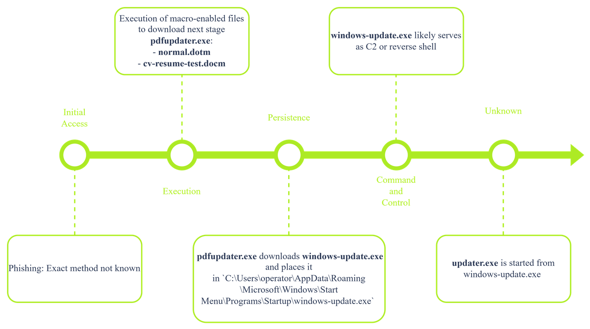

# Windows内存与进程

## 任务 1 介绍

Knowing how to analyze memory is an essential skill for a forensic analyst. Attackers often run their malware completely in memory without leaving any traces on the storage. Analyzing memory is slightly more complex than storage and requires a structured approach. Luckily, tools like Volatility and Redline can help extract information from memory. These tools don't automate the whole process of memory analysis. It is still up to the forensic analyst to extract the correct information and link it together.

This room is the first in a set of three. It will guide you through analyzing a full memory dump of a Windows host and extracting information from its processes. If the host is indeed compromised, you will need to piece together the scope of the attack and the attack chain.

### 学习目标

- Extract processes and process information from a memory dump using Volatility
- Analyze the extracted information
- Report findings

### 房间先决条件

- [Volatility](https://tryhackme.com/room/volatility)
- [Windows Fundamentals](https://tryhackme.com/module/windows-fundamentals) module

:::info 回答以下问题

<details>

<summary> Ready to start analyzing your first memory dump? </summary>

```plaintext
No answer needed
```

</details>

:::

## Task 2 Scenario Information

### Scenario

You are part of the incident response team handling an incident at TryHatMe - a company that exclusively sells hats online. You are tasked with analyzing a full memory dump of a potentially compromised Windows host. Before you, another analyst had already taken a full memory dump and gathered all the necessary information from the TryHatMe IT support team. You are a bit nervous since this is your first case, but don't worry; a senior analyst will guide you.

### Information Incident THM-0001

- On May 5th, 2025, at 07:30 CET, TryHatMe initiated its incident response plan and escalated the incident to us. After an initial triage, our team found a Windows host that was potentially compromised. The details of the host are as follows:
  - Hostname: WIN-001
  - OS: Windows 1022H 10.0.19045
- At 07:45 CET, our analyst Steve Stevenson took a full memory dump of the Windows host and made a hash to ensure its integrity. The memory dump details are:
  - Name: `THM-WIN-001_071528_07052025.dmp`
  - MD5-hash: `78535fc49ab54fed57919255709ae650`

### Company Information TryHatMe

#### Network Map


:::info 回答以下问题

<details>

<summary> I went through the case details and am ready to find out more. </summary>

```plaintext
No answer needed
```

</details>

:::

## Task 3 Windows Process Architecture

You might wonder where to start analyzing the memory dump. Let's start with a high-level overview of the key structures of processes on a Windows host. These structures are essential to understand where tools like `volatility` extract their information.

### Windows Processes and Threads

There are four structures that Windows uses to create and manage processes:

- **EPROCESS** is the representation of a process in the **kernel**
- **ETHREAD** is the representation of a thread in the **kernel**
- **Process Environment Block (PEB)** holds the process-wide configuration and runtime data and is located in the **user space**
- **Thread Environment Block (TEB)** holds the thread-specific configuration and other information, including Thread Local Storage (TLS), exception handling data, and information about the stack, and is located in the **user space**


#### How Do These Structures Relate?

When Windows creates a process, it executes the function `CreateProcess()`. This function initiates the process start-up and consists of the following steps:


1. The kernel creates an EPROCESS and ETHREAD object and links them together. EPROCESS has a field called `ThreadListHead` that keeps track of all its threads
2. The virtual memory is initialized:
   - The process is assigned a virtual address space (in user mode)
     The image (EXE) is mapped into memory
     Space is allocated for the PEB and TEB
     Process parameters are created
3. The PEB and TEB are initialized.
   - EPROCESS includes a pointer to the PEB
   - ETHREAD includes a pointer to the TEB
   - TEB includes a redundant pointer to the PEB
4. The thread context is set but remains suspended. This thread context includes:
   - Start address of the program
   - Stack pointer
   - Instruction pointer
5. The process is created but is still suspended
6. The primary thread of the process is resumed. This is the actual start of the process

### What Information Can You Extract From These Structures?

Tools like `volatility` understand a process's architecture and can extract and relate data from these structures. Specific `volatility` modules will target certain fields of these structures. Below, you can find an overview of interesting fields for each structure. **Note: Only the relevant fields are listed for each structure. The other fields have been omitted.**

#### EPROCESS

The following `volatility` plugins extract information from EPROCESS: `pslist`, `pstree`, `psscan`, `malfind`, `getsids`, `handles`, `dlllist`, `cmdline`, `envars` and `ldrmodules`. In the terminal below, you can find the fields these modules target:

```c title="EPROCESS STRUCTURE"
struct _EPROCESS { 
    HANDLE UniqueProcessId; // PID (Process ID) 
    LIST_ENTRY ActiveProcessLinks; // Link in active process list (Used to keep track of all active processes) 
    UCHAR ImageFileName[15]; // Short process name LARGE_INTEGER CreateTime; // Process creation time 
    LARGE_INTEGER ExitTime; // Exit time if terminated 
    PPEB Peb; // Pointer to user-mode PEB 
    HANDLE InheritedFromUniqueProcessId; // Parent PID 
    LIST_ENTRY ThreadListHead; // List of ETHREADs 
    PHANDLE_TABLE ObjectTable; // Handle table (points to opened files) 
    PVOID SectionObject; // Executable image mapping 
    PVOID VadRoot; // VAD tree for memory mapping PACCESS_TOKEN Token; // Security information 
}
```

#### ETHREAD

The following `volatility` plugins extract information from ETHREAD: `threads`, `ldrmodules`, `apihooks` and `malfind`. In the terminal below, you can find the fields these modules target:

```c title="THREAD STRUCTURE"
struct _ETHREAD { 
    CLIENT_ID Cid; // Thread and Process IDs 
    LARGE_INTEGER CreateTime; // Thread creation time 
    LARGE_INTEGER ExitTime; // Thread exit time 
    PVOID StartAddress; // Kernel-level entry point 
    PVOID Win32StartAddress; // User-mode entry point 
    LIST_ENTRY ThreadListEntry; // Link in EPROCESS's thread list 
    PTEB Teb; // Pointer to TEB 
    ULONG ThreadState; // Thread execution state 
    ULONG WaitReason; // Reason for being blocked 
}
```

#### PEB

The following `volatility` plugins extract information from the Process Environment Block: `cmdline`, `envars`, `ldrmodules` and `malfind`. In the terminal below, you can find the fields these modules target:

```c title="PEB STRUCTURE"
struct _PEB { 
    BOOLEAN BeingDebugged; // Debug flag
    PVOID ImageBaseAddress; // Base address of executable 
    PPEB_LDR_DATA Ldr; // Loader data (DLLs) 
    PRTL_USER_PROCESS_PARAMETERS ProcessParameters;// Command-line, environment variables
    ULONG NtGlobalFlag; // Debugging heap flags 
    PVOID ProcessHeap; // Default process heap 
}
```

#### TEB

The following `volatility` plugins extract information from the Thread Environment Block: `threads` and `malfind`. In the terminal below, you can find the fields these modules target:

```c title="TEB STRUCTURE"
struct _TEB { 
    PVOID EnvironmentPointer; // Pointer to env block 
    CLIENT_ID ClientId; // Thread + Process IDs 
    PVOID ThreadLocalStoragePointer; // TLS base 
    PPEB ProcessEnvironmentBlock; // Pointer to PEB 
    ULONG LastErrorValue; // Last error value 
    PVOID StackBase; // Upper bound of thread stack 
    PVOID StackLimit; // Lower bound of thread stack 
    PVOID Win32ThreadInfo; // GUI subsystem data 
}
```

:::info 回答以下问题

<details>

<summary> What field is used to keep track of all the active processes? Only enter the fields' name. </summary>

```plaintext
ActiveProcessLinks
```

</details>

<details>

<summary> What field is used to store the PID of a process? Only enter the fields' name. </summary>

```plaintext
UniqueProcessId
```

</details>

:::

## Task 4 Initial Triage of a New Memory Dump

You refreshed your knowledge of Windows memory and processes in the previous task. You are ready to tackle the fun challenge of analyzing the provided memory dump. During this task, you will start up the analysis VM and verify the hash of the memory dump. Then, you will continue extracting the processes in the memory dump using `volatility`. After that, you will analyze the results and look for suspicious processes. Last, you will note down your findings.

### Environment and Setup

During your investigation, you will use an Ubuntu Desktop host with the memory analysis tool `volatility` version 3. We have assigned the alias `vol3` to the full command (python3 vol.py) to start `volatility`. Start the VM now by clicking the `Start Machine` button at the top of this task. The VM will start in split view. In case it’s not showing up, you can press the `Show Split View` button at the top of the page.

The default installation of Ubuntu Desktop comes with command-line utilities that supplement `volatility` and allow you to parse the analysis results in additional detail. These tools include `strings`, `diff`, `grep`, `comm`, `awk`, and more.

### Verifying the Memory Dump

Open a shell on the analysis VM and navigate to `/home/ubuntu`. Then use the `md5sum` command to calculate the MD5 hash of the memory dump. **Note: You don't need to enter the command. We have already pre-calculated the hash for you. Due to restrained resources it could take up to five minutes to calculate an MD5 hash.**

```shell title="Calculate MD5 Hash"
ubuntu@tryhackme:~$ md5sum THM-WIN-001_071528_07052025.mem > newhash.txt
```

Then, compare the newly calculated hash with the hash that you received from your colleague who did the memory acquisition:

```shell title="Compare Hashes"
ubuntu@tryhackme:~$ diff acquisitionhash.txt newhash.txt
```

If the above command shows no output, the hashes are the same. Now that you have verified the integrity of the memory dump, you can proceed with extracting its content.

### Extract Processes

`volatility` comes with multiple modules that can help you extract processes and their information:

- `windows.pslist`: extract a list of the **active processes at the time of the memory dump**
- `windows.psscan`: extract **all process objects**, including terminated and unlinked processes
- `windows.pstree`: extracts a list of the **active processes at the time of the memory dump** and visualizes the parent-child relationships between them
- `windows.psxview`: uses multiple process detection techniques to gather information about processes, threads, process structures, and handles, then cross-reference and compare this information.

Navigate to the VM and open a terminal. Now, enter the commands below to extract the active processes from the memory dump and save them in a text file. **Note: Due to size of the memory dump and limited resources, it can take up to a minute until the command finishes running.**

```shell title="Extract Processes"
ubuntu@tryhackme:~$ vol3 -f THM-WIN-001_071528_07052025.mem windows.pslist > pslist.txt
```

Now, use `cat` to display the content of `pslist.txt` and analyze the output. Here is a tip: pipe the output to the command `less` to get a scrollable output. You can then **press space to scroll through the output**. You can press `q` to exit.

```shell title="Display Extracted Processes"
ubuntu@tryhackme:~$ cat pslist.txt | less
Volatility 3 Framework 2.26.2
PID PPID ImageFileName Offset(V) Threads Handles SessionId Wow64 CreateTime ExitTime File output
        
4   0   System         0x990b2366a040 138 - N/A False 2025-05-07 07:08:48.000000 UTC N/A Disabled
92  4   Registry       0x990b236dc080 4 - N/A False 2025-05-07 07:08:44.000000 UTC N/A Disabled
324 4   smss.exe       0x990b2680e040 2 - N/A False 2025-05-07 07:08:48.000000 UTC N/A Disabled
440 420 csrss.exe      0x990b26cf0140 12 - 0 False 2025-05-07 07:08:48.000000 UTC N/A Disabled
516 508 csrss.exe      0x990b274bd080 13 - 1 False 2025-05-07 07:08:48.000000 UTC N/A Disabled
524 420 wininit.exe    0x990b2758a140 1 - 0 False 2025-05-07 07:08:48.000000 UTC N/A Disabled
592 508 winlogon.exe   0x990b275c00c0 6 - 1 False 2025-05-07 07:08:48.000000 UTC N/A Disabled
        
[REDACTED FOR READABILITY]
```

### Finding a Needle in a Haystack

You are looking for suspicious processes that match one of the indicators below:

#### Suspicious Name

Attackers like to use typosquatting to masquerade as a legitimate process. 例如：

- `scvhost.exe` instead of `svchost.exe`
- `explorere.exe` instead of `explorer.exe`
- `lsasss.exe` instead of `lsass.exe`

#### Suspicious Path

Attackers will use process names identical to legitimate processes, but the processes are located in an unusual path. 例如：

- `svchost.exe` starting from `C:\Users\analyst\` instead of `C:\Windows\System32\`
- `cmd.exe` starting from `C:\TMP\` instead of `C:\Windows\System32\`

#### Masquerading

Attackers will use process names that mimic processes and system services. 例如：

- `dockerupdater.exe`
- `defenderAV.exe`
- `pdfupdateservice.exe`

### Comparing With a Baseline

It is sometimes difficult to distinguish between legitimate and malicious processes. The process list in the previous paragraph is luckily not so extensive, but if it were, you could use the following method to narrow down the number of processes to go through:

- Ensure you have a baseline of the processes that run on a host in normal circumstances. For example, during regular business hours
- Compare the `windows.pslist` output with the baseline to get a shortlist of processes that were not included in the baseline
- Filter the processes by comparing them to a shortlist of common processes that run when updating software. You can check the task scheduler to find these processes
- Investigate the leftover processes

Continue with the VM and enter the following commands to compare the `pslist.txt` file to the `baseline.txt` file located in `~\baseline\` (Note: the baseline file was extracted from the Task Manager, so you need to prepare it first):

```shell title="Comparing with Baseline"
ubuntu@tryhackme:~$ awk 'NR >3{print $2}' baseline/baseline.txt | sort | uniq > baseline_procs.txt
ubuntu@tryhackme:~$ awk 'NR >3{print $3}' pslist.txt | sort | uniq > current_procs.txt
ubuntu@tryhackme:~$ comm -13 baseline_procs.txt current_procs.txt
[REDACTED FOR READABILITY]
WINWORD.EXE
ai.exe
audiodg.exe
cmd.exe
fontdrvhost.ex
msdtc.exe
pdfupdater.exe
smartscreen.ex
sppsvc.exe
updater.exe
userinit.exe
vm3dservice.ex
vmtoolsd.exe
windows-update
```

The first two lines including `awk` in the terminal above prepare the files to be compared:

- `awk 'NR >3{print $2}'` divides the files content in columns excluding the first 3 lines and then prints the n-th column as output
- `sort` sorts the values that were passed along from the `awk` command
- `uniq > *.txt` filters out duplicates and then saves the data to a text file

The `comm` command compares the content of each prepared file and outputs the difference. The flags `-13` are set so only the processes unique to `current_procs.txt` are displayed.

The results listed in the terminal above need to be interpreted first. Some of the processes included are false positives. These are, for example:

- Legitimate processes that were not running at the time of capturing the baseline
- Processes where the `ImageFileName` field was too long and was truncated. This field can only accommodate 16 bytes.

Knowing which processes are false positives requires some additional research. The processes below have made it onto your shortlist:

- `pdfupdater.exe`
- `windows-update.exe`
- `updater.exe`

### Analysis Notes and Next Steps

You have found three suspicious processes that require further analysis. The table below gives an overview of these suspicious processes.

| ImageFileName                      | PID   | Timestamp                                                                  |
| :--------------------------------- | :---- | :------------------------------------------------------------------------- |
| pdfupdater.exe     | 3392  | 2025-05-07 07:13:05.000000 |
| windows-update.exe | 10084 | 2025-05-07 07:13:05.000000 |
| updater.exe        | 10032 | 2025-05-07 07:13:56.000000 |

Continue to the next task and see if these processes are linked to each other or other processes. This might help you uncover other processes that were not initially suspicious but are now suspicious within a new context.

:::info 回答以下问题

<details>

<summary> What is the PID of the csrss.exe process that has 12 threads? You can use the `pslist.txt` file to find the answer. </summary>

```plaintext
440
```

</details>

<details>

<summary> What is the (memory) Offset(V) of the process with PID 5672? You can use the `pslist.txt` file to find the answer. </summary>

```plaintext
0x990b29293080
```

</details>

:::

## Task 5 Linking Processes

In the previous task, you found multiple separate suspicious processes. Before digging deeper into the memory of these processes, you should first uncover if there is any link between these processes and others. This will help you find other potentially suspicious processes. The terminal below shows what a malicious process tree could look like:

```shell
explorer.exe (PID: 1500)
└── cmd.exe (PID: 2200)                  ← Triggered by malicious LNK file
    └── powershell.exe (PID: 2210)       ← Downloads and executes the payload
        └── svchost.exe (PID: 2220)      ← Masquerades as a system process
            └── asyncrat.exe (PID: 2230) ← Remote Access Trojan (C2 beaconing)
```

The example above is an attack chain in which asyncrat, a common Remote Access Trojan, was deployed after a user clicked on a malicious LNK file. The LNK file spawns a command line, `cmd.exe`, which then launches PowerShell to download and execute a payload. PowerShell, in turn, uses svchost.exe to masquerade as a system process and spawns `asyncrat.exe`.

Continuing with the VM, enter the following command to generate a tree structure that shows the memory dump's process parent-child relationships. **Note: Due to size of the memory dump and limited resources, it can take up to a minute until the command finishes running.**

```shell title="Show Process Tree"
ubuntu@tryhackme:~$ vol3 -f THM-WIN-001_071528_07052025.mem windows.pstree > processtree.txt
```

The output shown with the `cat` command is quite overwhelming. You can use the `cut` command to process the `processtree.txt` file and only display the PID, PIDD, and image name values. Enter the following command to accomplish this:

```shell title="Parse Process Tree"
ubuntu@tryhackme:~$ cut -d$'\t' -f1,2,3 processtree.txt
PID             PPID    ImageFileName
[REDACTED]
592             508     winlogon.exe
* 5232          592     userinit.exe
** 5672         5232    explorer.exe
*** 5952        5672    cmd.exe
**** 3144       5952    conhost.exe
*** 5252        5672    WINWORD.EXE
**** 3392       5252    pdfupdater.exe
***** 2576      3392    conhost.exe
***** 10084     3392    windows-update
****** 10032    10084   updater.exe
******* 432     10032   cmd.exe
******** 4592   432     conhost.exe
******** 6984   432     powershell.exe
**** 3932       5252    ai.exe
*** 8936        5672    SecurityHealth
*** 9096        5672    msedge.exe
**** 8100       9096    msedge.exe
**** 9164       9096    msedge.exe
**** 3500       9096    msedge.exe
**** 7408       9096    msedge.exe
**** 9264       9096    msedge.exe
**** 4152       9096    msedge.exe
**** 7420       9096    msedge.exe
[REDACTED]
```

The results above have been redacted for readability. The results shown include the processes of interest you discovered in the previous task.

### Observations

Now locate the processes you noted during task 3 and check if they relate to other processes. Starting from the WINWORD.exe process, you can see a clear tree structure. We converted the tree to an ASCII tree structure to show it more clearly.

```shell
PID         PPID    IMAGENAME
5252        5672    WINWORD.EXE
└── 3392       5252    pdfupdater.exe    
    ├── 2576      3392    conhost.exe    
    └── 10084     3392    windows-update        
        └── 10032    10084   updater.exe            
            └── 432     10032   cmd.exe                
                ├── 4592   432     conhost.exe                
                └── 6984   432     powershell.exe
```

Now note down the observations starting from the bottom:

- The process `powershell.exe` with the PID ... has the PPID ...
- The process `conhost.exe` with the PID ... has the PPID ...
- The process linked to PPID ... is `cmd.exe` and has the PID ...
- And so on

### Analysis Notes and Next Steps

| ImageFileName                      | PID   | PPID  | Timestamp                                                                  |
| :--------------------------------- | :---- | :---- | :------------------------------------------------------------------------- |
| WINWORD.EXE        | 5252  | 5672  | 2025-05-07 07:13:04.000000 |
| pdfupdater.exe     | 3392  | 5252  | 2025-05-07 07:13:05.000000 |
| conhost.exe        | 2576  | 3392  | 2025-05-07 07:13:05.000000 |
| windows-update.exe | 10084 | 3392  | 2025-05-07 07:13:05.000000 |
| updater.exe        | 10032 | 10084 | 2025-05-07 07:13:56.000000 |
| cmd.exe            | 432   | 10032 | 2025-05-07 07:14:36.000000 |
| conhost.exe        | 4592  | 432   | 2025-05-07 07:14:36.000000 |
| powershell.exe     | 6984  | 432   | 2025-05-07 07:14:39.000000 |

From the observations (see table above), we can conclude that the `updater.exe` process is a child process of `windows-update.exe`, a child process of `pdfupdater.exe`. The `pdfupdater.exe` process is a child of `WINWORD.exe`. This chain of processes seems quite suspicious:

- Multiple of these processes have the name `update` in them
- The `WINDWORD.exe` process launches the `pdfupdater.exe` process. This would mean that Microsoft Word is updating a tool related to PDF
- The `pdfupdater.exe` process then launches the `windows-update.exe`. It is highly unlikely that a tool that would update one software would also launch the `windows-update.exe` process to update the Windows OS
- To top it off, the `windows-update.exe` process launches the `updater.exe` process, which seems to hint at yet another update
- The presence of the `conhost.exe` process also indicates that these processes seem to initiate a network connection

Looking closely at these observations and remarks and comparing them with factual information like how the Windows, PDF tool, and Microsoft Word update process works and their legitimate process names, you can conclude that this chain of processes is highly likely malicious.

Now that you have found a potential malicious chain, you must dig deeper. Proceed to the next task to uncover terminated and hidden processes and analyze the suspicious processes found in this task.

:::info 回答以下问题

<details>

<summary> What is the parentID (PPID) of the services.exe (PID 664) process? Use the processtree.txt file to answer the question. </summary>

```plaintext
524
```

</details>

<details>

<summary> What is the ImageFileName of the process that has the PID 7788? Use the processtree.txt file to answer the question. </summary>

```plaintext
FTK Imager.exe
```

</details>

:::

## Task 6 Digging Deeper

Until now, you have focused on uncovering and linking processes that were part of the active memory. `volatility` can also scan for processes that were recently terminated, unlinked, or hidden by an attacker. Attackers often employ different techniques to hide processes, threads, drivers, and registry keys. You can use the `volatitlity` modules `windows.psscan` and `windows.psxview` to get an overview of all process structures, including those not in the active process links structure.

### PSSCAN

Continuing with the VM, enter the command shown below to scan for processes that were not part of the active processes list. **Note: Due to size of the memory dump and limited resources, it can take up to three minutes until the command finishes running.**

```shell title="PSSCAN"
ubuntu@tryhackme:~$ vol3 -f THM-WIN-001_071528_07052025.mem windows.psscan > psscan.txt
```

You can compare the results of `psscan` with the results of `pslist` to uncover hidden processes. You first need to prepare the output files before comparing them. Enter the following commands to extract the PID and process name from the `psscan.txt` and `pslist.txt` files and save the output to a new file.

```shell title="Prepare Files"
ubuntu@tryhackme:~$ awk '{print $1,$3}' pslist.txt | sort > pslist_processed.txt
ubuntu@tryhackme:~$ awk '{print $1,$3}' psscan.txt | sort > psscan_processed.txt
```

Then, you can compare both files to uncover hidden processes:

```shell title="Prepare Files"
ubuntu@tryhackme:~$ comm -23 psscan_processed.txt pslist_processed.txt
5548 sihost.exe
5592 svchost.exe
5736 svchost.exe
5748 svchost.exe
5752 taskhostw.exe
5828 svchost.exe
5908 svchost.exe
5972 ctfmon.exe
8708 svchost.exe
9040 vmtoolsd.exe
```

The results of this comparison are benign. All the listed processes are common processes that run on a Windows host. For example, `svchost.exe` is a common process that hosts and runs Windows services. There are a few checks you can do to verify that `svchost.exe` is indeed benign:

- Check the image path: If it is not located in `C:\Windows\System32\`, it is suspicious
- Check the DLLs loaded for this process: Attackers can use techniques like process hollowing or DLL injection to compromise a legitimate process
- Check if the process still has active threads: If it does have active threads but it doesn't appear in the `pslist` results, it is suspicious. It could be that an attacker is hiding the process
- If an active process does not have any threads, it is considered suspicious. Every active process should have at least 1 thread. Attackers can use techniques to alter the threads
- Check the `Exit Time`: If the process really is terminated, it should display an `Exit Time`. If there are still active or orphaned threads linked to that process, it is suspicious.
- Dump the process memory and analyze it further

You will explore some of these checks later on.
PSXVIEW

Now, run the windows.psxview module. windows.psxview is a great way to do multiple tests in one and cross-reference the results. You should look for the processes that are not listed in the results of pslist but are listed in the other tests. Enter the following command to run the windows.psxview module. Note: Due to size of the memory dump and limited resources, it can take up to three minutes until the command finishes running.

### PSXVIEW

Now, run the `windows.psxview` module. `windows.psxview` is a great way to do multiple tests in one and cross-reference the results. You should look for the processes that are not listed in the results of `pslist` but are listed in the other tests. Enter the following command to run the `windows.psxview` module. **Note: Due to size of the memory dump and limited resources, it can take up to three minutes until the command finishes running.**

```shell title="PSXVIEW"
ubuntu@tryhackme:~$ vol3 -f THM-WIN-001_071528_07052025.mem windows.psxview > psxview.txt
```

You can then use `awk` to filter the results and display all the lines where the `pslist` test equals false, as shown below:

```shell title="Filter Results"
ubuntu@tryhackme:~$ awk 'NR==3 || $4 == "False"' psxview.txt
Offset(Virtual) Name            PID     pslist  psscan  thrdscan  csrss   Exit Time
0xac80001ca080  svchost.exe     5828    False   True    False     False
0xac8000083080  svchost.exe     5592    False   True    False     False
0xac80000b90c0  vmtoolsd.exe    9040    False   True    False     False
0xac8000084080  svchost.exe     5748    False   True    False     False
0xac80001c6080  svchost.exe     5908    False   True    False     False
0xac80001d2080  ctfmon.exe      5972    False   True    False     False
0xac8000030080  svchost.exe     5736    False   True    False     False
0xac80000a1080  sihost.exe      5548    False   True    False     False
0x990b29bef080  svchost.exe     8708    False   True    False     False   2025-05-07 07:13:16+00:00
0xac8000031080  taskhostw.exe   5752    False   True    False     False
```

The output in the terminal above doesn't show anything obvious that could hint at an attacker hiding a malicious process. However, you can never be 100% sure. If you are still suspicious of the listed processes, apply the same checks listed in the **psscan section**.

### Analysis Notes and Next Steps

You did not uncover new processes using the volatility modules `psscan` and `psxview`.

In the next task, you will focus on analyzing the processes uncovered in the previous tasks.

:::info 回答以下问题

<details>

<summary> What is the number of processes that have 0 Threads? Use the `psscan.txt` file to answer the question. </summary>

```plaintext
3
```

</details>

<details>

<summary> What is the number of processes that have the Exit Time filled in? Use the `psxview.txt` file to answer the question. </summary>

```plaintext
3
```

</details>

:::

## Task 7 Dumping the Process Memory

During the previous tasks, you uncovered a potentially malicious chain of processes. From the information gathered, you could only conclude that these processes are linked and that the chain starts from the `WINWORD.exe` process. You should focus now on extracting information from processes by dumping their memory.

`volatility` includes several modules to assist you with this. The modules `windows.dlllist` and `windows.dumpfiles` should help you uncover several indicators of compromise.

### Finding the Path

Using the `windows.dlllist` module, you can uncover the path of the main executable and its linked DLLs. Continuing with the VM, run the module `windows.dlllist` on the processes you noted in task 5 ( `WINWORD.exe`, `pdfupdater.exe`, `updater.exe`, `windows-update`, `cmd.exe`, `conhost.exe`, `powershell.exe`). Enter the following commands to dump the `WINWORD.exe` process. **Note: Due to size of the memory dump and limited resources, it can take up to two minutes until the command finishes running.**

```shell title="Check Results"
ubuntu@tryhackme:~$ vol3 -f THM-WIN-001_071528_07052025.mem windows.dlllist --pid 5252 > 5252_dlllist.txt
```

**Now, do the same for all other processes.** Then, check every file with `cat`, look for the path of the main executable, and note it down.

```shell title="Check Results"
ubuntu@tryhackme:~$ cat 5252_dlllist.txt
Volatility 3 Framework 2.26.2
Progress:  100.00               PDB scanning finished
PID   Process Base  Size      Name                  Path                                                               LoadTime                File output
5252  WINWORD.EXE   0x670000  0x1ac000 WINWORD.EXE  C:\Program Files (x86)\Microsoft Office\Root\Office16\WINWORD.EXE  2025-05-07 07:13:04.00
        
[REDACTED FOR READABILITY]
```

Now, update the information you already have with the new findings.

The `pdfupdater.exe`, `windows-update.exe`, and `updater.exe` processes seem to start at unusual locations. This information will be helpful when you focus on investigating user activity.

### Dump Process Memory

You have uncovered multiple suspicious processes until now. This suspicion is based on process names, a process tree with multiple update processes, and processes that start from a user path.

You must dump and analyze the processes' memory to confirm that these processes are malicious. You can then extract the executable and run the strings command to see if any malicious indicators are present quickly. In most cases, you will pass the executable to a malware analyst for further investigation. Below, are the commands to dump the process with PID 5252. Follow the same steps to dump the memory of the other processes; you can exclude the cmd.exe, PowerShell.exe, and conhost.exe processes. Other `volatility` modules can analyze these processes better. **Note: Due to size of the memory dump and limited resources, it can take up to one minute until the command finishes running.**

```shell title="Dump Process Memory"
ubuntu@tryhackme:~$ mkdir 5252
ubuntu@tryhackme:~$ cd 5252
ubuntu@tryhackme:~/5252$ vol3 -f ../THM-WIN-001_071528_07052025.mem windows.dumpfiles --pid 5252
```

The dumped files all follow the same naming convention: `file.StartAddress.EndAddress.ImageSectionObject.filename.img` or `file.StartAddress.EndAddress.DataSectionObject.filename.dat`.

Note the differences between ImageSectionObject and DataSectionObject.

| 特性              | ImageSectionObject                | DataSectionObject                |
| :-------------- | :-------------------------------- | :------------------------------- |
| Purpose         | Mapped executable image           | Mapped data                      |
| Typical content | `.exe`, `.dll`, injected PE files | Configs, logs, unpacked payloads |
| Executable?     | Yes                               | Usually no                       |

### What to Look For

Depending on the process, the number of files dumped from a process can be large. You should filter for specific extensions depending on the context of the process. 例如：

- If you dump the Microsoft Word process, searching for macro-enabled files with the extension `.docm`, `.dotm`, or `.dotx` is interesting. Attackers often use these kinds of files to execute Visual Basic code and download the next stage of the attack. MITRE classifies this as [T1059.005 – Command and Scripting Interpreter: Visual Basic](https://attack.mitre.org/techniques/T1059/005/)
- If you have a suspiciously named process, look for a `.exe` and a `.dat` file. Use the strings command to quickly check for any malicious indicators like suspicious function names, URLs, IPs, system commands, and more
- If you dump a PDF reader process, look for .pdf files. Use the strings command to check for any malicious indicators like included JavaScript quickly. MITRE classifies this as [T1059.007 – Command and Scripting Interpreter: JavaScript](https://attack.mitre.org/techniques/T1059/007/)

The process 5252 is the Windows Word process. Look for `.docm` or `.dotm` files and note your findings. Note: All the dumped files have the extension `.img` appended. You can verify the type of the file by using the file command.

```shell title="Find Macro Files"
ubuntu@tryhackme:~$ ls 5252 | grep -E ".docm|.dotm" -i
file.0x990b2ae077d0.0x990b2a3f5d70.SharedCacheMap.Normal.dotm.vacb
file.0x990b2ae077d0.0x990b2b916cd0.DataSectionObject.Normal.dotm.dat
file.0x990b2ae0ab60.0x990b28043a00.SharedCacheMap.cv-resume-test.docm.vacb
file.0x990b2ae0ab60.0x990b2a8b4b30.DataSectionObject.cv-resume-test.docm.dat
                
ubuntu@tryhackme:~$ file 5252/file.0x990b2ae077d0.0x990b2b916cd0.DataSectionObject.Normal.dotm.dat      
5252/file.0x990b2ae077d0.0x990b2b916cd0.DataSectionObject.Normal.dotm.dat: Microsoft Word 2007+
```

Continue with the other processes and focus on finding `.exe` and `.dat` files. You can skip the processes `cmd.exe`, `conhost.exe`, and `PowerShell.exe`. These processes will be analyzed in the next rooms. You can use the following `grep` command to filter for `.exe` and `.dat` files.

```shell title="Find Executables"
ubuntu@tryhackme:~$ ls 3392 10084 10032 | grep -E ".exe|.dat" -i
file.0x990b2ae26720.0x990b286fa140.ImageSectionObject.updater.exe.img
file.0x990b2846e310.0x990b282f5b70.DataSectionObject.cversions.2.db.dat
file.0x990b2ae16230.0x990b29ad0270.ImageSectionObject.windows-update.exe.img
file.0x990b2ae16230.0x990b2b92ce90.DataSectionObject.windows-update.exe.dat
file.0x990b2ae0ee90.0x990b2a466010.ImageSectionObject.pdfupdater.exe.img
file.0x990b2ae0ee90.0x990b2b91f290.DataSectionObject.pdfupdater.exe.dat
```

Take note of all the files you find and update your findings.

### Analysis Notes and Next Steps

You have analyzed the suspicious processes in more detail and uncovered multiple things:

- The paths of the `updater.exe`, `pdfupdater.exe`, and `windows-update.exe` are suspicious. All of them start in user folders
- The `WINWORD.EXE` process dump included two macro-enabled word files named `cv-resume-test.docm` and `normal.dotm`. These could be malicious files and need to be analyzed further

You also extracted the executables of the `updater.exe`, `pdfupdater.exe`, and `windows-update.exe` processes. The malware analyst needs to analyze these executables further.
The table below lists the findings.

| PID   | PIDD  | Timestamp                                                                  | Path                                                                                                                              | Files - Executables                                                                                                                                                                                                                                                                                                                                           |
| :---- | :---- | :------------------------------------------------------------------------- | :-------------------------------------------------------------------------------------------------------------------------------- | :------------------------------------------------------------------------------------------------------------------------------------------------------------------------------------------------------------------------------------------------------------------------------------------------------------------------------------------------------------ |
| 5252  | 5672  | 2025-05-07 07:13:04.000000 | C:\Program Files (x86)\Microsoft Office\Root\Office16\WINWORD.EXE              | file.0x990b2ae0ab60.0x990b2a8b4b30.DataSectionObject.cv-resume-test.docm.dat<br />file.0x990b2ae077d0.0x990b2b916cd0.DataSectionObject.Normal.dotm.dat        |
| 3392  | 5252  | 2025-05-07 07:13:05.000000 | C:\Users\operator\pdfupdater.exe                                                                  | file.0x990b2ae0ee90.0x990b2a466010.ImageSectionObject.pdfupdater.exe.img<br />file.0x990b2ae0ee90.0x990b2b91f290.DataSectionObject.pdfupdater.exe.dat         |
| 2576  | 3392  | 2025-05-07 07:13:05.000000 | ??\C:\Windows\system32\conhost.exe                                                                | /                                                                                                                                                                                                                                                                                                                                                             |
| 10084 | 3392  | 2025-05-07 07:13:05.000000 | C:\Users\operator\AppData\Roaming\Microsoft\Windows\StartMenu\Programs\Startup\windows-update.exe | file.0x990b2ae16230.0x990b29ad0270.ImageSectionObject.windows-update.exe.img<br />file.0x990b2ae16230.0x990b2b92ce90.DataSectionObject.windows-update.exe.dat |
| 10032 | 10084 | 2025-05-07 07:13:56.000000 | "C:\Users\operator\Downloads\updater.exe"                                                         | file.0x990b2ae26720.0x990b286fa140.ImageSectionObject.updater.exe.img                                                                                                                                                                                         |
| 432   | 10032 | 2025-05-07 07:14:36.000000 | C:\Windows\system32\cmd.exe                                                                       | /                                                                                                                                                                                                                                                                                                                                                             |
| 4592  | 432   | 2025-05-07 07:14:36.000000 | ??\C:\Windows\system32\conhost.exe                                                                | /                                                                                                                                                                                                                                                                                                                                                             |
| 6984  | 432   | 2025-05-07 07:14:39.000000 | powershell                                                                                                                        | /                                                                                                                                                                                                                                                                                                                                                             |

Now that you have uncovered multiple indicators that point toward an attack, you need to hand the extracted artifacts to the malware analyst and/or threat hunter for further inspection.

:::info 回答以下问题

<details>

<summary> What is the path of the process with PID 7788? </summary>

```plaintext
C:\Program Files\AccessData\FTK Imager\FTK Imager.exe
```

</details>

<details>

<summary> Dump the process with PID 7788. What is the name of the dumped file that represents the executable? </summary>

```plaintext
file.0x990b2ae1ed40.0x990b29954a20.ImageSectionObject.FTK Imager.exe.img
```

</details>

:::

## Task 8 Putting It All Together

While analyzing the memory dump, you have uncovered possible indicators of compromise. Although, some of these indicators need to be analyzed further to be certain. With the artifacts gathered and observations made, it is possible to recreate a part of the kill chain. The table below shows all the gathered information.

| PID   | PIDD  | Timestamp                                                                  | Path                                                                                                                               | Files - Executables                                                                                                                                                                                                                                                                                                                                           |
| :---- | :---- | :------------------------------------------------------------------------- | :--------------------------------------------------------------------------------------------------------------------------------- | :------------------------------------------------------------------------------------------------------------------------------------------------------------------------------------------------------------------------------------------------------------------------------------------------------------------------------------------------------------ |
| 5252  | 5672  | 2025-05-07 07:13:04.000000 | C:\Program Files (x86)\Microsoft Office\Root\Office16\WINWORD.EXE               | file.0x990b2ae0ab60.0x990b2a8b4b30.DataSectionObject.cv-resume-test.docm.dat<br />file.0x990b2ae077d0.0x990b2b916cd0.DataSectionObject.Normal.dotm.dat        |
| 3392  | 5252  | 2025-05-07 07:13:05.000000 | C:\Users\operator\pdfupdater.exe                                                                   | file.0x990b2ae0ee90.0x990b2a466010.ImageSectionObject.pdfupdater.exe.img<br />file.0x990b2ae0ee90.0x990b2b91f290.DataSectionObject.pdfupdater.exe.dat         |
| 2576  | 3392  | 2025-05-07 07:13:05.000000 | ??\C:\Windows\system32\conhost.exe                                                                 | /                                                                                                                                                                                                                                                                                                                                                             |
| 10084 | 3392  | 2025-05-07 07:13:05.000000 | C:\Users\operator\AppData\Roaming\Microsoft\Windows\Start Menu\Programs\Startup\windows-update.exe | file.0x990b2ae16230.0x990b29ad0270.ImageSectionObject.windows-update.exe.img<br />file.0x990b2ae16230.0x990b2b92ce90.DataSectionObject.windows-update.exe.dat |
| 10032 | 10084 | 2025-05-07 07:13:56.000000 | C:\Users\operator\Downloads\updater.exe                                                            | file.0x990b2ae26720.0x990b286fa140.ImageSectionObject.updater.exe.img                                                                                                                                                                                         |
| 432   | 10032 | 2025-05-07 07:14:36.000000 | C:\Windows\system32\cmd.exe                                                                        | /                                                                                                                                                                                                                                                                                                                                                             |
| 4592  | 432   | 2025-05-07 07:14:36.000000 | ??\C:\Windows\system32\conhost.exe                                                                 | /                                                                                                                                                                                                                                                                                                                                                             |
| 6984  | 432   | 2025-05-07 07:14:39.000000 | powershell                                                                                                                         | /                                                                                                                                                                                                                                                                                                                                                             |



### Initial Access

Now, you can only speculate about the attacker's technique to get into the system. Based on the artifacts you have gathered, it is likely that the attacker employed the technique [T1566 Phishing](https://attack.mitre.org/techniques/T1566/) to get a malicious macro-enabled Word document onto the system. This needs to be confirmed by analyzing the user's activity on the system.

### Execution

The first indicator of compromise starts with the `WINWORD.exe` process opening a macro-enabled Word file named `cv-resume-test.docm` or `normal.dotm`. MITRE categorizes this technique as [T1059.005 Command and Scripting Interpreter: Visual Basic](https://attack.mitre.org/techniques/T1059/005/)

The `cv-resume-text.docm` or `normal.dotm` file likely downloads and launches a second-stage malware named `pdfupdater.exe`. Further analysis of the macro files should confirm this.

### Persistence

The malware pdfupdater.exe then likely downloads another stage, `windows-update.exe`, which starts from the `C:\Users\operator\AppData\Roaming\Microsoft\Windows\Start Menu\Programs\Startup\windows-update.exe` path. This path typically houses processes or links to processes that start when the OS is loaded. This could be an indicator of persistence. MITRE categorizes this as [Boot or Logon Initialization Scripts: Startup Items](https://attack.mitre.org/techniques/T1037/005).

### Command and Control

The observation that the `windows-update.exe` executable is likely persistent could indicate that it serves as a C2 client or reverse shell. Further analysis of this executable should shed some light on its functions.

### Attack Phases Not Accounted For

You already have uncovered multiple phases in the kill chain, but there is still one executable that you couldn't place in any of the above phases. For now, you can only speculate about what the updater.exe process does. An educated guess would be that because it originates from the likely C2 process `windows-update.exe`, it likely will include MITRE tactics like [Exfiltration](https://attack.mitre.org/tactics/TA0010), [Impact](https://attack.mitre.org/tactics/TA0040), [Discovery](https://attack.mitre.org/tactics/TA0007), or [Lateral Movement](https://attack.mitre.org/tactics/TA0008). Analysis of the executable should bring more clarity on its functions.

### What's Next

You have uncovered multiple artifacts that need further analysis. You should collect these artifacts, hash them, and then pass them to the threat hunter or malware analyst.

:::info 回答以下问题

<details>

<summary> What is the name of the likely compromised user? </summary>

```plaintext
operator
```

</details>

<details>

<summary> What is the ID assigned to the MITRE Tactic Command and Control? </summary>

```plaintext
TA0011
```

</details>

:::

## 任务9 结论

This room was the first in a series of three that dives into analyzing a memory dump. You went through a real-life scenario and analyzed a memory dump with a focus on extracting processes and their information. You uncovered a potential attack chain and multiple suspicious artifacts.

Analyzing processes is only the beginning. The next steps are analyzing user and network activity.

:::info 回答以下问题

<details>

<summary> I am ready to apply my newly obtained skills! </summary>

```plaintext
No answer needed
```

</details>

:::
