# XDR：简介

## 任务1 简介

传统安全工具如防病毒软件、防火墙，甚至端点检测与响应（EDR）通常各自为政。 EDR仅关注端点数据，网络检测与响应（NDR）专注于网络数据，而扩展检测与响应（XDR）通过整合来自各种来源的数据并自动化数据关联和分析过程，增强了这种检测和响应能力。 这显著提高了威胁检测的准确性，并减少了响应事件所需的时间。

本房间将向您介绍 Microsoft Defender XDR，这是 Microsoft 的统一安全平台，旨在为端点、身份、电子邮件、应用程序和云资源提供集成保护。 您将学习使用从其他 Microsoft 365 Defender 产品和服务集成的数据来检测、调查和响应威胁。

### 学习目标

完成本房间后，您将能够：

- 理解扩展检测与响应（XDR）作为一种安全工具
- 深入了解 Microsoft Defender XDR
- 理解 Microsoft Defender XDR 的核心组件
- 描述 Defender XDR 如何关联 Microsoft 365 服务中的信号
- Defender 中的基于角色的访问控制
- 理解 Defender XDR 如何与 Microsoft Sentinel 及其他工具集成

:::info 回答以下问题

<details>

<summary> 开始吧！ </summary>

```plaintext
No answer needed
```

</details>

:::

## 任务2 什么是 Microsoft Defender XDR

扩展检测与响应（XDR）是一种先进的网络安全解决方案，它将组织数字环境中的数据聚合、统一并分析到一个集成平台中。 这可能包括来自端点、网络、电子邮件、身份和云环境的数据。 与独立的安全工具相比，XDR 提供集成的威胁检测、调查和响应，提供安全事件的统一视图。 XDR 实施增强了威胁可见性，减少了事件响应时间，并支持从中央管理控制台进行高级取证调查和威胁狩猎。

### XDR 与传统 EDR（端点检测与响应）有何不同

| 特性  | EDR（端点检测与响应）              | XDR（扩展检测与响应）                         |
| :-- | :------------------------ | :----------------------------------- |
| 范围  | 仅关注端点设备，如笔记本电脑、台式机和服务器。   | 它超越了端点；包括电子邮件、身份、网络、云工作负载等。          |
| 数据源 | 仅从端点收集数据。                 | 聚合并关联跨各种安全层和平台的数据。                   |
| 可见性 | 仅限于每个单独端点上的活动。            | 提供跨整个 IT 基础设施的端到端可见性。                |
| 检测  | 基于端点行为和签名的有限威胁检测。         | 使用跨领域分析和行为模式检测威胁。                    |
| 响应  | 对端点威胁的有限响应（例如，隔离设备，终止进程）。 | 跨多个层自动化和协调响应（例如，阻止电子邮件，隔离设备，撤销访问权限）。 |
| 用例  | 恶意软件检测、勒索软件响应、端点上的内部威胁。   | 高级威胁检测、网络钓鱼响应、云和身份攻击关联、供应链风险。        |
| 管理  | 大多需要专用的端点安全工具和控制台。        | 跨领域的威胁检测、调查和响应的统一控制台。                |

### 什么是 Microsoft Defender XDR

Microsoft Defender XDR 是一种全面的企业防御解决方案，专为入侵前和入侵后场景设计。 它在端点、身份、电子邮件和应用程序等多个领域无缝集成检测、预防、调查和响应，以提供针对高级威胁的连贯保护。


Microsoft Defender XDR 通过利用来自其他 Microsoft 安全工具（如 Defender for Endpoint、Identity、Cloud Apps、O365 等）的数据，帮助安全团队预防和识别风险。 然后，使用 Microsoft Defender 门户，安全团队可以通过以下方式在统一体验中调查和响应攻击：

- 事件和警报以调查恶意活动
- 狩猎以主动发现威胁
- 操作和提交以修复发现的事件和警报
- 威胁情报以了解最新威胁及其影响

### Microsoft Defender XDR 与通用 XDR 对比

尽管通用 XDR 解决方案提供与第三方工具的更广泛集成，但它们通常需要额外配置和调整以确保与其威胁检测功能的兼容性。 相比之下，Microsoft Defender XDR 专为使用 Microsoft 产品的组织构建，提供无缝集成、自动化功能以及为 Microsoft 生态系统优化的统一平台。

:::info 回答以下问题

<details>

<summary> EDR（端点检测与响应）的可见性仅限于什么？ </summary>

```plaintext
Endpoints
```

</details>

<details>

<summary> Microsoft Defender XDR 是否专为使用 Microsoft 产品的组织构建？ 是/否 </summary>

```plaintext
Yea
```

</details>

:::

## 任务3 Microsoft Defender XDR 架构

由于 Microsoft Defender XDR 是一个基于云的统一企业防御套件，它将跨身份、端点、电子邮件和云应用程序的网络攻击数据无缝整合到一个平台中。 它利用人工智能（AI）和自动化来预防和响应威胁，自动阻止某些攻击并跨多个域恢复受影响的资产。 Microsoft Defender XDR 可以评估这些威胁的完整范围和影响，例如它们的入口点、它们影响了什么以及它们对组织的持续影响。 需要强调的是，这些信号不仅限于下面提到的产品。

- Microsoft Defender for Endpoint
- Microsoft Defender for Office 365
- Microsoft Defender for Identity
- Microsoft Defender for Cloud Apps
- Microsoft Defender Vulnerability Management
- Microsoft Defender for Cloud
- Microsoft Entra ID Protection

Microsoft Defender XDR 组件的架构和集成。

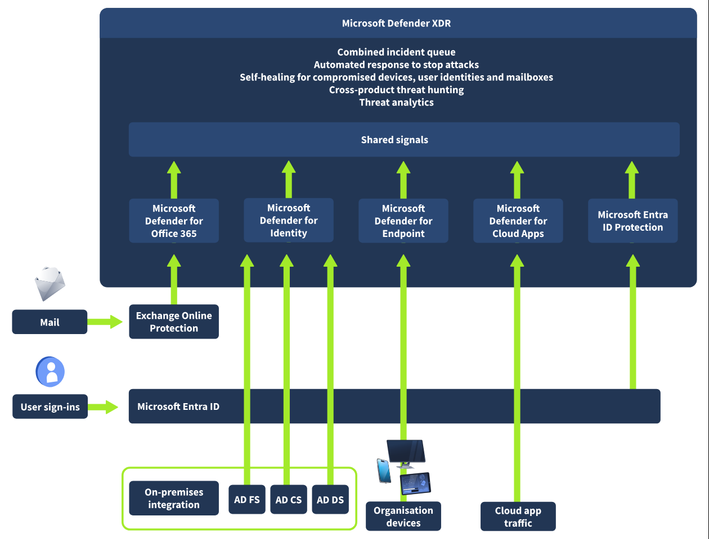

如上图架构所示，Microsoft Defender XDR 整合来自所有 Defender 组件的信号，以跨各种域提供扩展检测与响应（XDR）。 这包括集中式事件和警报队列、用于阻止攻击的自动响应、受损设备和用户身份及邮箱的自愈功能，以及跨威胁搜寻和威胁分析。

- **Microsoft Defender for Office 365** 保护您的组织免受与电子邮件、链接（URL）和协作工具相关的有害威胁。 它将来自这些威胁的信号中继到 Microsoft Defender XDR。 集成了 Exchange Online Protection (EOP)，为传入的电子邮件和附件提供全面保护。
- **Microsoft Defender for Identity** 从 Active Directory 域服务 (AD DS) 域控制器、Active Directory 联合身份验证服务 (AD FS)、Active Directory 证书服务 (AD CS) 和 Entra Connect 服务器收集信号。 它利用这些信号保护您的混合身份环境，包括防御攻击者利用受损账户在本地环境中的设备之间横向移动。
- **Microsoft Defender for Endpoint** 提供端点检测和响应 (EDR)、防病毒和漏洞管理。 它从组织设备收集信号并将其发送到 Microsoft Defender XDR，后者进而为这些设备提供高级监控和保护。
- **Microsoft Defender for Cloud Apps** 收集与组织使用云应用程序相关的信号。 它确保您的 IT 基础设施与这些应用程序之间的数据通信安全，涵盖已批准和未批准的云应用程序。
- **Microsoft Entra ID Protection** 评估来自数十亿次登录尝试的风险事件数据，以确定每次登录到您环境的风险级别。 根据您的条件访问策略的条件和限制，Microsoft Entra ID 使用此评估的风险数据来允许或阻止用户访问。 值得注意的是，Microsoft Entra ID Protection 独立于 Microsoft Defender XDR 运行，因为它不属于 Microsoft Defender 产品套件，但也与 Microsoft Defender XDR 共享信号。

### Microsoft Defender XDR 的工作原理

以下是 Microsoft Defender XDR 工作原理及其核心组件的详细分解

#### 数据收集与集成

Defender XDR 从多个来源收集和整合数据，包括端点（Defender for Endpoint）、身份（Defender for Identity）、电子邮件（Defender for Office 365）和云应用程序（Defender for Cloud Apps）。 然后，收集的数据会实时丰富和关联，以提供可操作的见解，使安全团队能够有效地确定事件的优先级。

#### 威胁检测与分析

Defender XDR 使用高级分析、机器学习模型和全球威胁情报来分析收集的数据，并检测已知和新出现的威胁、入侵指标 (IOC) 以及可能预示早期潜在威胁的异常用户或系统行为。 这使得 Defender XDR 能够看到多阶段攻击的全貌。

#### 自动化事件响应

Microsoft Defender XDR 通过针对支持的端点和邮箱的自动化调查和修复 (AIR) 实现快速威胁遏制和修复。 它还提供自动攻击中断功能，以阻止横向移动或正在进行的勒索软件。 它提供威胁遏制功能，例如隔离计算机、撤销令牌、禁用受损账户和阻止恶意应用程序。

#### 主动威胁搜寻

借助 Microsoft Defender XDR 的高级搜寻功能，安全团队可以在统一的搜寻界面中使用高级 Kusto 查询语言 (KQL) 查询主动搜寻威胁，从而在所有集成的 Defender 解决方案中进行深入的跨域调查。

#### 编排

Microsoft Defender XDR 可以与 Microsoft Sentinel 等安全工具集成，以增强编排和事件管理。 其附加功能，如自动标记、警报优先级排序和基于角色的访问控制 (RBAC)，可确保高效的分诊和响应。

:::info 回答以下问题

<details>

<summary> 哪些 Defender XDR 信号专注于电子邮件安全？ </summary>

```plaintext
Microsoft Defender for Office 365
```

</details>

<details>

<summary> Microsoft Defender XDR 使用哪种查询语言进行威胁搜寻？ </summary>

```plaintext
Kusto Query Language
```

</details>

:::

## 任务 4 Microsoft Defender XDR 设置

在讨论不同的 Microsoft XDR 设置之前，让我们考虑一个典型的网络安全攻击以及 Microsoft Defender XDR 将如何帮助检测和修复它。


上述网络攻击始于发送到您组织中员工收件箱的网络钓鱼电子邮件。 员工无意中打开了电子邮件附件，然后在用户设备上部署了恶意软件，可能触发一系列攻击尝试，最终可能导致敏感信息被盗。

让我们从左到右考虑上述攻击尝试场景的以下内容：

1. Exchange Online Protection（Microsoft Defender for Office 365 的一个组件）可以识别网络钓鱼电子邮件并应用邮件流规则（也称为传输规则）以防止它们到达用户的收件箱。
2. Defender for Office 365 还可以使用其安全附件和安全链接功能来评估电子邮件中的附件和链接，并确定它们是否有害。 这确保通过的电子邮件要么对用户不可操作，要么根据既定策略被阻止投递。
3. 为防止利用受恶意软件感染的设备，Defender for Endpoint 可以在攻击者在组织管理的设备上利用漏洞之前识别并修复设备和网络上的漏洞。
4. Defender for Identity 将监控并标记本地用户账户的突然变化，例如未经授权的权限提升或危险的横向移动，供安全团队调查。 它还突出显示常被利用的身份漏洞，如无约束 Kerberos 委派，以便安全团队可以调查并缓解它们。
5. 最后，Defender for Cloud Apps 可以防止攻击者外泄敏感数据。 它可以检测异常行为，如不可能旅行、凭据盗窃、非典型活动、异常文件下载和共享，或电子邮件转发，并将这些事件报告给安全团队进行进一步调查。

### Microsoft Defender XDR 设置

Microsoft Defender 门户为每个产品提供了设置。 但是，要管理 Defender XDR 设置，请导航到“设置”，然后选择“Microsoft Defender XDR”。

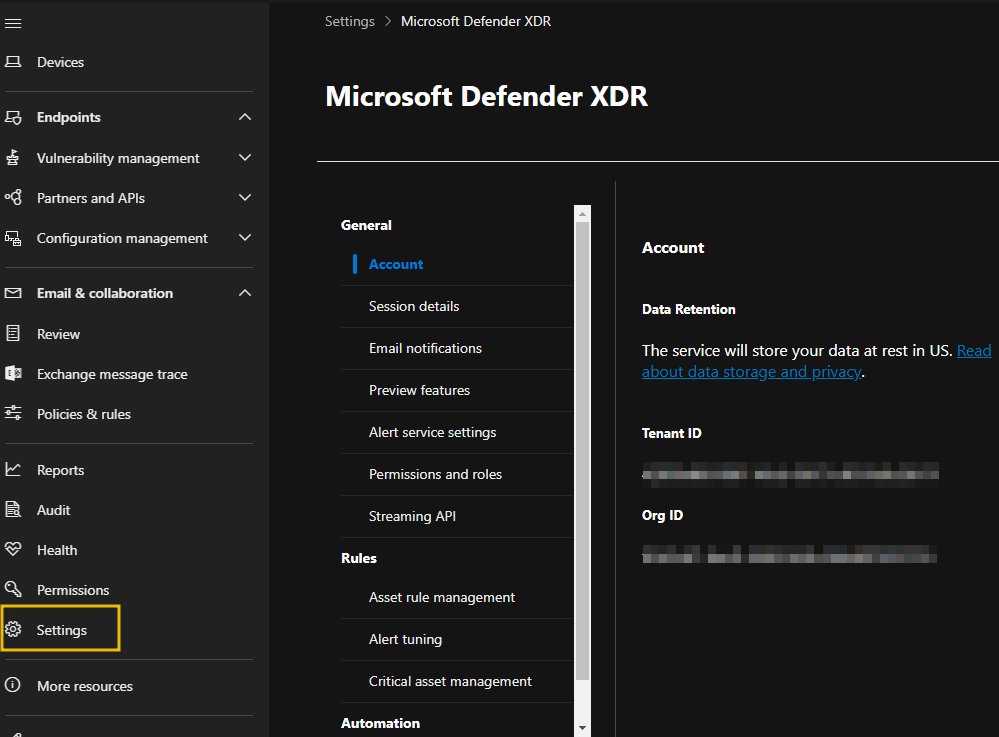

在 Microsoft Defender XDR 设置页面上，您可以配置以下内容：

- **电子邮件通知**：使安全团队能够为事件、响应操作和威胁分析报告设置电子邮件通知。
- **警报服务设置**：这使您能够确定哪些身份保护警报将出现在警报和事件页面上。
- **权限和角色**：在此选项卡上，您可以配置集中式权限管理解决方案，以控制跨不同 Microsoft 安全解决方案的用户访问和权限。 我们将在下一个任务中进一步讨论这一点。
- **流式 API**：安全团队可以将事件数据直接引入到 Azure 事件中心，供可视化服务、数据处理引擎、第三方 SIEM 解决方案使用，或存储到 Azure 存储以进行长期数据保留。
- **资产规则管理**：使您能够为资产创建规则并决定哪些操作将应用于它们。
- **警报调整**：以前称为警报抑制，它允许安全团队提前调整和管理警报。
- **关键资产管理**：可以配置为管理组织资产的关键级别到预定义的分类，或通过创建您自己的自定义分类。
- **身份自动响应**：用于将用户从自动响应操作中排除。

:::info 回答以下问题

<details>

<summary> 监控危险的横向移动是哪个 Microsoft Defender 产品的功能？ </summary>

```plaintext
Defender for Identity
```

</details>

<details>

<summary> 安全管理员可以在哪里将用户从自动响应操作中排除？ </summary>

```plaintext
Identity automated response
```

</details>

:::

## 任务 5 Microsoft Defender XDR 角色和权限

控制用户的权限和访问以查看和管理与 Microsoft Defender 相关的安全控制对于组织确保最小权限并最小化与未经授权访问相关的风险至关重要。

默认情况下，可以使用 Microsoft Entra 全局角色集中管理对 Microsoft Defender 门户中服务的访问。 但是，如果需要更灵活地控制对特定产品数据的访问，安全团队可以为每个 Microsoft Defender 服务创建自定义角色。 如果需要集中式权限管理控制台，则建议配置 Microsoft Defender XDR 统一基于角色的访问控制 (RBAC)。

如上所述，Microsoft Defender XDR 的访问和管理可以通过三种不同的方式进行管理：

### 使用 Microsoft Entra 全局角色

拥有这些 Microsoft Entra 角色的帐户可以访问 Microsoft Defender XDR 设置、功能和安全控制。

- 全局管理员
- 安全管理员
- 安全操作员
- 全局读取者
- 安全读取者

### 为特定 Microsoft Defender 产品配置自定义角色

例如，安全管理员可以为 Microsoft Defender for Endpoint 创建自定义角色，从而控制可以在 Defender for Endpoint 设备上配置或修改的内容。 或者，安全管理员可以为 Microsoft Defender for Office 创建自定义角色，以管理特定电子邮件和协作设置的访问和控制配置。

每个 Microsoft Defender 服务都有其自己的自定义角色管理设置。要在 Microsoft Defender 门户中找到自定义角色管理设置：

- 在导航窗格中，选择“权限”。
- 在要创建自定义角色的服务下选择“角色”。


始终建议您配置具有最低权限的角色。 以下是 Microsoft Defender for **Endpoints 端点角色和组 (2)** 的角色设置示例

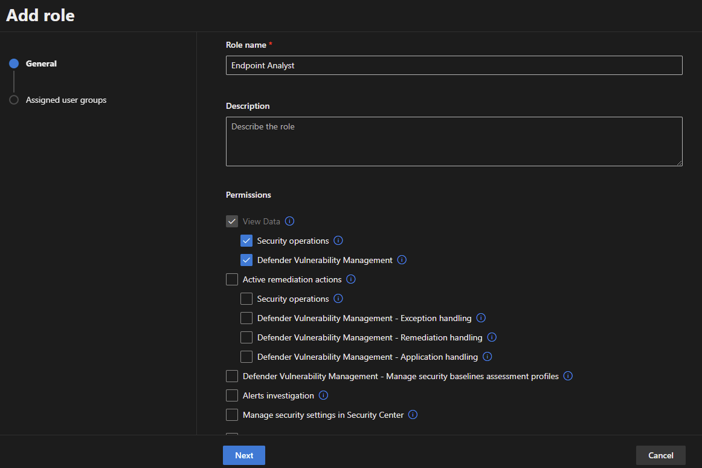

最后一种方法，即 Microsoft Defender XDR 统一 RBAC 方法，将在下一个任务中讨论。

:::info 回答以下问题

<details>

<summary> 安全管理员可以从哪个选项卡为特定 Microsoft Defender 产品创建自定义角色？ </summary>

```plaintext
Permissions
```

</details>

:::

## 任务 6 实验室说明

请按照以下说明在后续任务中访问您的实验室。

在您的实验室任务（**实验室：导航 Defender XDR 门户**：任务 8；**实验室：查看自定义统一 RBAC 角色**：任务 9）上，单击 **Cloud Details** 按钮。

在 **Environment** 选项卡上，单击 **Join Lab** 按钮以部署您的实验室环境。

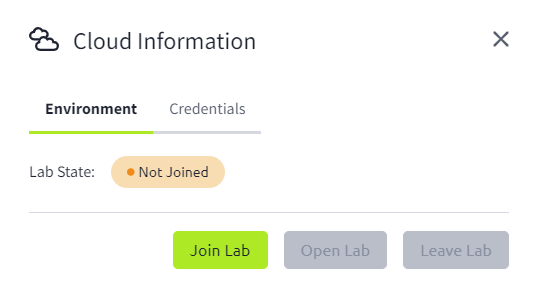

单击 **Open Lab** 按钮以启动一个新标签页。 这将引导您进入 Microsoft Azure 门户。

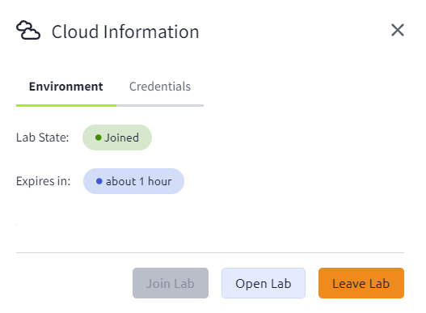

选择 **Credentials** 选项卡以查看访问 Microsoft Azure 门户所需的登录凭据。

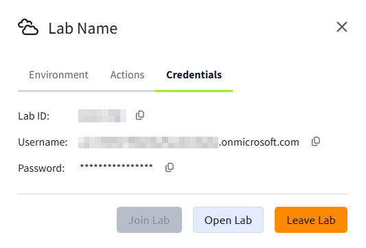

使用 **Credentials** 选项卡中的 **Username** 和 **Password** 登录。 然后单击 **Next** 继续。


随着新的 Microsoft 多重身份验证强制实施，您需要设置 MFA 才能登录到 Microsoft Azure 门户。 单击 **Next** 以使用您首选的方法配置 MFA。

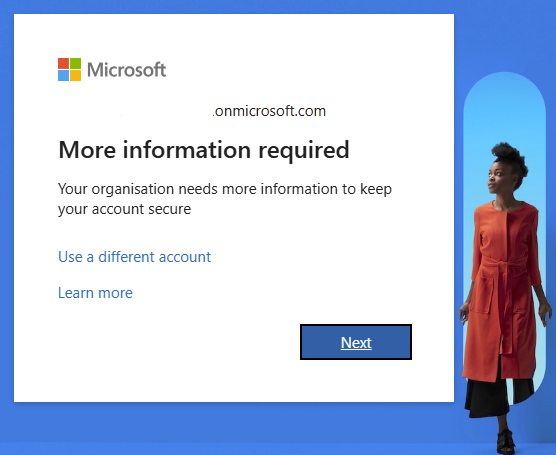

通过单击 **I want to set up a different method**，您可以查看所有可用的 MFA 选项。


默认的身份验证方法是使用免费的 Microsoft Authenticator 应用程序。 如果它已安装在您的移动设备上，请选择 Next 并按照提示添加此账户。 如果您没有安装它，会提供一个链接以下载它。


完成身份验证过程以登录到 Microsoft Azure 门户。

**注意**：实验室访问将在 1 小时后过期。

:::info 回答以下问题

<details>

<summary> 我明白了。 </summary>

```plaintext
No answer needed
```

</details>

:::

## 任务 7 实验室：Microsoft Defender XDR 统一基于角色的访问控制 (RBAC)

**Microsoft Defender XDR 统一基于角色的访问控制** (RBAC) 是一个集中式权限管理系统，可简化整个 Defender 安全生态系统中的访问管理。 它提供了一个单一界面，供管理员管理谁可以访问 Microsoft Defender XDR 中的哪些内容。 它根据分配的角色和职责，统一了跨端点、身份、电子邮件、云应用程序和数据的访问控制。

要开始使用 Microsoft Defender XDR 统一基于角色的访问控制 (RBAC)，需要先激活它，然后才能开始为其他安全团队成员配置和管理角色权限。 值得注意的是，可用于激活的工作负载数量取决于您的租户上可用的许可证。

您可以通过以下方式激活您的工作负载：

### 从权限和角色页面

- 在 [Microsoft Defender 门户](https://security.microsoft.com/) 上
- 在导航窗格中选择权限
- 在 Microsoft Defender XDR 下选择角色


在 **Permissions and roles** 屏幕上，选择 **Activate workloads** (1) 以显示一个侧边栏，您可以在其中选择每个切换开关来激活一个工作负载。 在某些情况下，您可能看不到 **Activate workloads** 选项，因为其他管理员可能已取消它。 另外，请记住，您看到的 **Workloads** 选项由您租户当前可用的许可证决定。

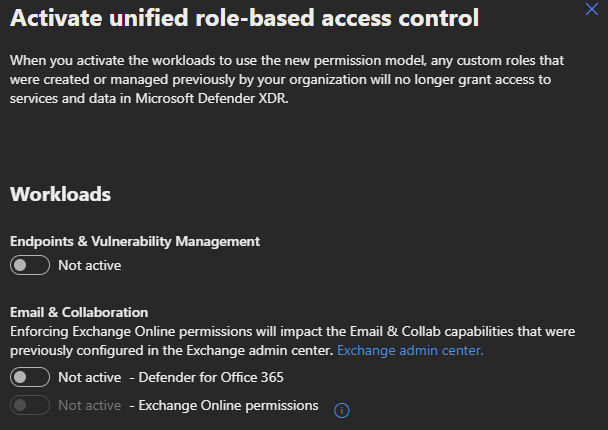

作为第二个选项，在 **permissions and roles** 屏幕上选择 **Workload settings** (2)。 这将带您进入 Microsoft Defender XDR 权限和角色页面，您可以在其中选择每个工作负载的切换开关来激活它。

### 从 Microsoft Defender XDR 设置中

- 在 [Microsoft Defender 门户](https://security.microsoft.com/) 上
- 在导航窗格中选择 **Settings**
- 选择 **Microsoft Defender XDR**
- 选择 **Permissions and roles**
- 在 Activate workloads 页面上，选择要激活的工作负载的切换开关

有关可根据管理员的角色和任务配置的权限列表的更多信息，请参阅 [Microsoft Defender XDR Unified RBAC](https://learn.microsoft.com/en-us/defender-xdr/custom-permissions-details) 权限详细信息。

在我们的实验室任务中，我们将导航 Defender 门户并查看创建自定义 RBAC 角色。

:::info 回答以下问题

<details>

<summary> Microsoft Defender XDR 统一基于角色的访问控制 (RBAC) 可以通过多少种方式激活？ </summary>

```plaintext
2
```

</details>

<details>

<summary> 除了“激活工作负载”选项外，还可以使用哪个选项从权限和角色页面激活 Microsoft Defender XDR 统一基于角色的访问控制 (RBAC)？ </summary>

```plaintext
Workload settings
```

</details>

:::

## 任务 8 实验：导航 Defender XDR 门户

### 步骤 1：导航 Microsoft Defender 门户

- 使用您的实验凭据登录 [Microsoft Defender 门户](https://security.microsoft.com/)
- Microsoft Defender XDR 主要是导航窗格上的前几个选项卡。
- 然后，向下导航到底部，您将找到报告的其他设置和特定于产品的设置。

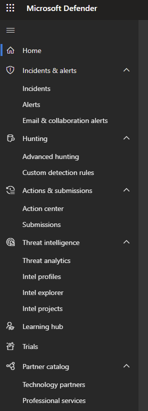

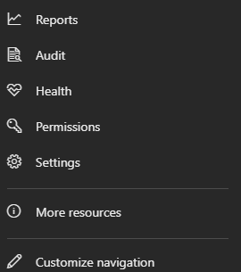

值得注意的是，Defender 门户包含其他特定的 Defender 产品，例如暴露管理、终结点、标识、电子邮件和协作，它们被放置在不同的部分中。

### 步骤 2：事件和警报调查

事件是与单个威胁或攻击相关的警报集合。 它们是已确认的安全漏洞或威胁，已危及组织的资产、数据或系统。 它们是已确认的安全漏洞或威胁，已危及组织的资产、数据或系统。

- 在 Microsoft Defender 门户上，选择“事件”以查看所有域中的所有事件列表。
- 单击“在一个终结点上涉及权限提升的多阶段事件”（事件 ID 48）以调查事件。

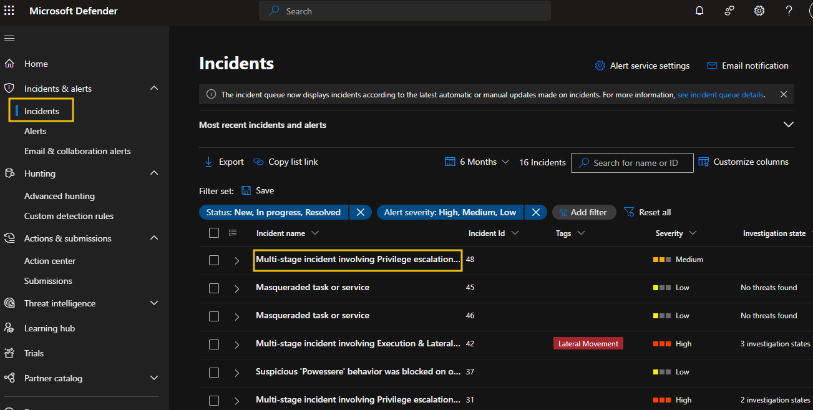

- 选择每个选项卡以查看事件详细信息和相关实体。
  - “未分配 (1)”显示您的事件分配状态
  - 选择导航栏/菜单上的每个选项卡 (2) 以查看相关实体和警报
  - 单击“播放攻击故事 (3)”以查看每个事件的发生方式
  - 选择“管理事件 (4)”以编辑或修改事件详细信息
  - 选择“将事件导出为 PDF (5)”以下载可共享的 PDF 文档
  - 事件图 (6) 显示不同实体之间的关系
  - 在“事件详细信息 (7)”上向下滚动以获取有关事件的更多信息


- 单击“事件和警报”下的其他选项卡以查看它们。

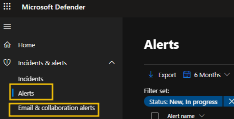

花时间查看事件，深入事件详细信息，并练习以了解如何访问信息并确定分析中的后续步骤。

### 步骤 3：搜寻

搜寻是 Microsoft Defender XDR 中的一项功能，它使用基于查询的威胁搜寻界面，允许安全团队主动搜寻和检测其组织环境中的高级威胁。

- 在导航窗格上单击“高级搜寻”
- 在中间窗格中选择“查询”以查看所有模板（“查询”选项可能被隐藏；向右拖动栏以显示它）
- 选择“共享查询”以查看和运行所有共享查询
- 选择“社区查询”以查看来自 Microsoft Defender 社区的所有查询


### 步骤 4：运行高级搜寻查询

在这里，我们将了解如何运行高级搜寻查询

- 选择 + 和“编辑器中的查询”以打开新的查询选项卡。


- 复制并粘贴以下查询。 此查询将从 AlertInfo 表中提取安全警报数据，并根据 AlertId 列按升序排序。

```plaintext
AlertInfo
| sort by AlertId
```

- 将时间范围扩展到 30 天
- 单击“运行查询”以运行粘贴的查询
- 查询结果随后显示在下方


:::info 回答以下问题

<details>

<summary> 除了“事件”和“电子邮件和协作警报”选项卡外，“事件和警报”下还可以找到哪个其他选项卡？ </summary>

```plaintext
Alerts
```

</details>

<details>

<summary> 您需要单击哪个选项来修改事件详细信息？ </summary>

```plaintext
Manage incident
```

</details>

:::

## 任务 9 实验：查看自定义统一 RBAC 角色

### 任务 1：在 Microsoft Defender 中查看自定义角色创建

以下步骤旨在指导您查看 Microsoft Defender XDR 统一 RBAC 中的自定义角色。 您不会创建任何角色。

- 登录 [Microsoft Defender 门户](https://security.microsoft.com/)。
- 在导航窗格中，选择“权限”。
- 在 Microsoft Defender XDR 下选择“角色”以进入权限和角色页面。
- 选择“Defender Analyst T1”角色以查看角色详细信息。

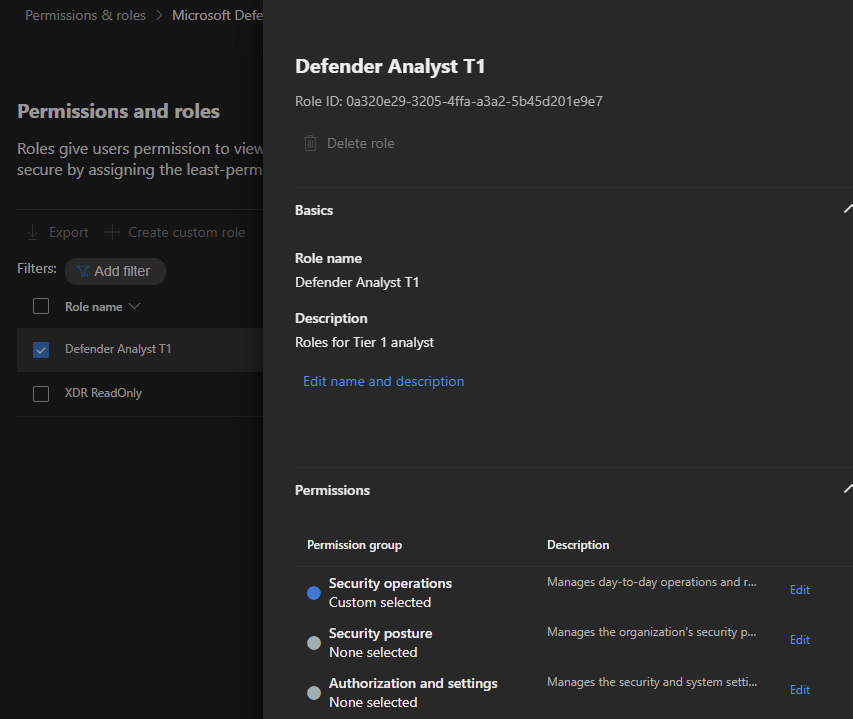

“权限组”分为三个不同的类别；每个权限组可以通过单击其旁边的“编辑”按钮来查看。

- “安全操作”：此权限适用于执行安全操作并响应事件和建议的安全管理员。


- “安全态势”：此权限适用于需要处理安全建议并跟踪修正任务、例外和漏洞的安全管理员。


- “授权和设置”：此权限适用于负责配置安全控制和系统设置以及创建和分配角色的安全管理员。


请随意悬停在信息图标上以查看每个角色权限。 查看权限后，单击取消返回角色屏幕；

- 向下滚动到“分配”并选择“编辑分配”


- 在编辑分配屏幕上，您将看到以下内容；
  - 分配名称
  - 员工，分配此角色的用户或组
  - 数据源（此角色授予访问权限的 Defender 产品）。

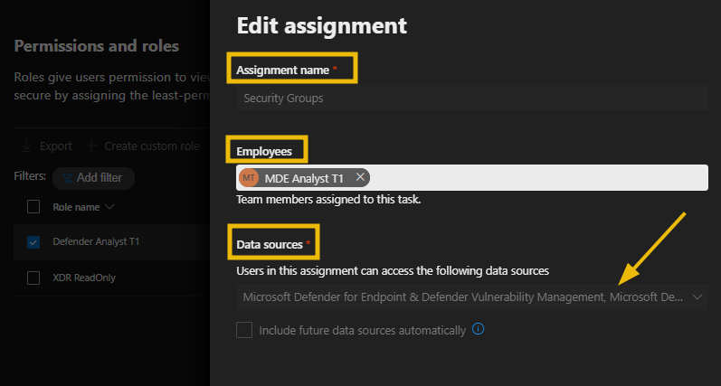


**注意**：在 Microsoft Defender XDR 统一 RBAC 中，您可以在单个角色下创建多个分配，同时保持相同的权限。 例如，您可以在一个角色中创建一个分配，授予对所有数据源的访问权限，并为需要仅访问 Defender for Endpoint 数据源中的终结点警报的团队创建另一个分配。 这种方法确保为每个管理员维护最少数量的角色。

:::info 回答以下问题

<details>

<summary> 有多少个权限组可用？ </summary>

```plaintext
3
```

</details>

<details>

<summary> 哪个权限组适用于负责配置安全控制的安全管理员？ </summary>

```plaintext
Authorization and settings
```

</details>

:::

## 任务 10 总结

在本房间中，我们介绍了 Microsoft Defender XDR，解释了它如何帮助安全团队主动检测和响应跨各种数据源的网络威胁。

具体来说，我们涵盖了以下内容：

- Microsoft Defender XDR 详解
- Microsoft Defender XDR 架构
- 各种 Microsoft Defender XDR 设置
- 实施统一基于角色的访问控制
- 导航 Microsoft Defender 门户

总体而言，Microsoft Defender XDR 通过收集其他 Defender 产品的信号，提高了威胁可见性，缩短了响应时间，并减少了安全漏洞。 这反过来帮助组织简化其安全操作，确保安全团队成员拥有正确的权限来管理和增强整体安全状况。

:::info 回答以下问题

<details>

<summary> 我了解 Microsoft Defender XDR 及其组件！ </summary>

```plaintext
No answer needed
```

</details>

:::
